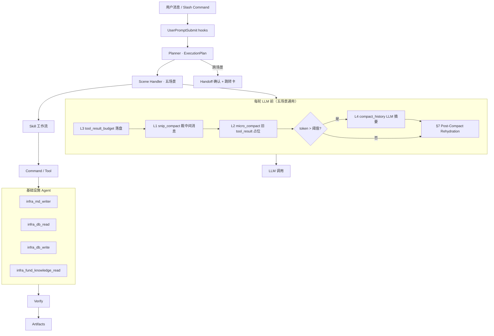

# Agent Harness 设计标准（对标 Anthropic + learn-claude-code）

> **用途**：本文件是 PRD §0.11–§0.12 的展开版。**每次改 PRD、每次进入编码**，须用本文清单审视方案。  
> **权威来源**（Anthropic 官方）：
>
> - [Building agents with the Claude Agent SDK](https://www.anthropic.com/engineering/building-agents-with-the-claude-agent-sdk) — **Gather context → Take action → Verify → Repeat**
> - [Effective harnesses for long-running agents](https://www.anthropic.com/engineering/effective-harnesses-for-long-running-agents)
> - [Harness design for long-running application development](https://www.anthropic.com/engineering/harness-design-long-running-apps)
> - [Writing tools for agents](https://www.anthropic.com/engineering/writing-tools-for-agents)

**本项目必读延伸阅读**（`D:\claudecode-project\learn-claude-code\`，编码须对齐）：

| ShareAI 章节 | 本地目录 `learn-claude-code/` | 核心教训 |
|--------------|-------------------------------|----------|
| 总纲 | `README.md` | Harness = Tools + Knowledge + Observation + Permissions；**管理上下文**是 Harness 工程师核心职责 |
| s01 | `s01_agent_loop/` | 一个 while 循环；以 `tool_use` block 为准继续 |
| s02 | `s02_tool_use/` | 工具原子、可组合；加能力 = 加 Tool |
| s03 Todo | `s05_todo_write/` | 计划外化，防偏航 |
| s04 Subagent | `s06_subagent/` | 子任务干净上下文，只回传结果 |
| s05 Skill | `s07_skill_loading/` | Skill 按需加载，不塞满 system |
| **s06 上下文压缩** | **`s08_context_compact/`** | **四层压缩 + 应急；便宜的先跑贵的后跑；L3 必须在 L2 前** |
| s07 权限 | `s03_permission/` | 执行前权限判断，不侵入循环 |
| s08 Hooks | `s04_hooks/` | UserPromptSubmit / PreToolUse / PostToolUse / Stop |
| s09 Memory | `s09_memory/` | 压缩有损；索引常驻、详情按需 |
| s10 System prompt | `s10_system_prompt/` | system 运行时组装 |
| s11 | `s11_error_recovery/` | 429/529 重试、prompt too long → reactive compact |
| s12 | `s12_task_system/` | 大目标拆任务图（**本期做** · HAR-03） |
| s13 | `s13_background_tasks/` | 慢操作后台 + 通知注入 |
| s14 | `s14_cron_scheduler/` | 定时注入 prompt · `scheduled_jobs` §4.2 |
| s15–s17 | teams / protocols / autonomous | **本期不做**团队编排（§8e） |
| **s18** | **`s18_worktree_isolation/`** | **Run Workspace** `data/runs/`（PRD §0.11.8）· **本期做** |
| s19 | `s19_mcp_plugin/` | MCP 外接工具 |
| **s00b** | 桥接 · 一次请求生命周期 | `loop.ts` 纵向串线 · [导读](https://learn.shareai.run/zh/docs/s00b-one-request-lifecycle/) |
| **s10a** | 桥接 · Prompt 管道 | `harness/prompt/` · [导读](https://learn.shareai.run/zh/docs/s10a-message-prompt-pipeline/) |
| s20 | `s20_comprehensive/` | **所有机制挂在同一循环上的位置图** |

> **编号说明**：[Learn Claude Code 中文导读](https://learn.shareai.run/zh/) 与本地 `D:\claudecode-project\learn-claude-code\` 的 **s03–s08 目录名不一致**（导读 s06=压缩、本地 `s08_context_compact/`）。**PRD §0.11.7、面试口述以 ShareAI 章节号为准**；读源码用上表「本地目录」列。

编码实现约束见 **[CODING.md](./CODING.md)**。

---

## 1. 官方 Harness 核心原则（摘要）

| 原则 | 对本产品的要求 |
|------|----------------|
| **Agent 循环** | 每条用户消息：Gather → Act → Verify → Repeat |
| **工具优先** | Command = Tool；业务动作不散落在 prompt |
| **Subagent 隔离** | 场景 Handler / 基础设施 Agent 独立上下文，只回传摘要 |
| **结构化交接物** | 客户信息层版本、目标约束、方案表、报告 md、`report_index` |
| **增量与确认** | propose → verify → 用户 confirm → infra 写 Agent |
| **分离评判** | Evaluator 规则 > LLM 自评 |
| **会话日志** | append-only `messages` + tool_calls + ExecutionPlan |
| **上下文压缩** | **五场景每一轮 LLM 调用前**跑压缩管线；见 **§6–§7** |
| **压缩后重注入** | L4 后必须从 DB/artifact **恢复业务锚点**（ShareAI s06 / 本地 `s08_context_compact` 教学版不做，**本产品必做**） |

---

## 2. 本产品 Harness 架构



| 角色 | PRD |
|------|-----|
| **Planner** | [05-chat-shared §5.6](./prd/05-chat-shared.md)、§0.12.4 `ExecutionPlan` |
| **Scene Handler** | `scene_*` 五场景 |
| **Skill** | `skills/{scene}/*.md`（ShareAI s05 · 本地 `s07_skill_loading` 按需 `load_skill`） |
| **Command** | `harness/tools/*`、聊天 `/` 唤起 |
| **基础设施 Agent** | §0.12.3 |
| **Evaluator** | schema + 合规 + 用户确认 |
| **Compact pipeline** | `harness/context/*`（§6） |

---

## 3. Agent 注册表（`agents/registry.yaml`）

### 3.1 场景 Handler

| id | 场景 | 可并行（写工作流活跃时） |
|----|------|-------------------------|
| `scene_chat` | 自由问答 | — |
| `scene_profile` | 需求梳理（Investment Profile） | 仅与 chat、fund |
| `scene_plan` | 资产配置（依赖profile artifact） | 仅与 chat、fund |
| `scene_portfolio` | 持仓分析 | 仅与 chat、fund |
| `scene_fund` | 基金解读 | — |

**互斥写锁**：`profile` · `plan` · `portfolio` 同时最多一个持有 `workflow_locks`。

### 3.2 基础设施 Agent

| id | 职责 | 调用方 |
|----|------|--------|
| `infra_md_writer` | 写 `data/reports/*.md` + `report_index` | 场景 Handler post-confirm |
| `infra_db_read` | 读 Supabase 业务表 | 任意（可并行） |
| `infra_db_write` | 写 Supabase（版本化 INSERT） | post-confirm；**串行队列** |
| `infra_fund_knowledge_read` | 单基金知识库 FTS / `explore`（knowledge §9.2.0） | `scene_fund`；可并行 |

Planner 工具：`list_agents`、`list_skills`、`list_commands`（返回注册表 + 中文 description）。

---

## 4. Command 清单（首期 P0）

> **单一数据源**：`agents/registry.yaml`（需求仓 `D:\CursorProjects\agent-demo\agents\registry.yaml` → 复制至 `{APP_ROOT}/agents/`）。  
> `/` 补全过滤 `slash_completion: true` 且 `scenes` 含当前 Tab；使用说明读 `usage_pages.{scene}`。  
> 校验：`python scripts/validate_registry.py`

| Command | Skill 域 | 类型 | 说明 |
|---------|----------|------|------|
| `web_search` | chat+ | 读 | 联网检索 |
| `report_read` | chat, profile, plan, portfolio, fund | 读 | 已发布报告深链 / id（§4.1.2 · RPT-LINK-01） |
| `vision_parse` | chat, profile, plan, portfolio, fund | 读 | 图片解析 |
| `profile_read` | profile | 读 | |
| `profile_propose` | profile | 提议 | → confirm |
| `profile_confirm` | profile | 写 | 经 infra_db_write |
| `plan_read` / `plan_propose` / `plan_confirm` | plan | 读/提议/写 | 依赖 profile artifact |
| `holdings_read` / `holdings_propose` / `holdings_confirm` | portfolio | 读/提议/写 | |
| `fund_lookup` / `fund_knowledge_explore` | fund | 读 | 行情 + **CG-01 情报卡片**（knowledge §9.2.0d）；explore **优先**于链式 read |
| `report_draft` | plan, portfolio, fund | 提议 | → infra_md_writer |
| `report_publish` | * | 写 | confirm 后 |
| `compact` | * | 元 | 模型/用户触发 L4；见 §6.5 |
| `artifact_read` | profile, plan, portfolio | 读 | 按 `artifact_id` 读 propose payload（§5.3.10b · ARTIFACT-01）；`slash_completion: false` |
| `report_overlay_patch` | plan, portfolio, fund, profile | 写 | 报告-only 增量块（§4.1.0h · RPT-OVERLAY-01）；`slash_completion: false` |
| `report_overlay_merge` | plan, portfolio, fund, profile | 元 | 合并 overlay → `draft-report.md`；`report_draft` 末尾 **必须**调用 |
| `plan_screen_funds` | plan | 读 | 第二步 L0 **全市场**初筛（**非** Demo 池 · PL-PLAN-L0-FULL-01）；Skill 内部 |

Slash 补全：仅展示**当前场景**允许的 Command（PRD §5.3.11）。

### 4.1 Tool 规格：`report_read`（RPT-LINK-01 · P0）

> Planner 从用户消息中识别 `/reports?tab=` + `id=` 后，Gather 阶段调用；**不**走 `/` 补全（`slash_completion: false`）。

**Input**

| 字段 | 类型 | 说明 |
|------|------|------|
| `report_id` | uuid | `report_index.id`（URL `id=` 参数） |
| `tab` | `plan` \| `portfolio` \| `fund` | 与 URL `tab=` 一致；用于校验 `report_type` |

**行为**

1. 读 `report_index` 行；不存在或 `tab` 不匹配 → Tool 错误（对客：「找不到该报告链接」）  
2. 读 `file_path` 指向的 **已发布** 本地 md（`data/reports/`）  
3. 返回结构化摘要 + 正文片段（**≤12k 字符**；超出截断并附 `truncated: true`）  
4. **禁止**创建 `report_draft`、**禁止**写 `report_index`

**Output（写入 `tool_result` · 供 L3 预算）**

```json
{
  "report_id": "…",
  "report_type": "plan",
  "title": "…",
  "generated_at": "…",
  "excerpt": "正文片段…",
  "truncated": false
}
```

**与 §7 重注入**：`report_read` 结果仅服务**当轮**问答；L4 压缩后若用户仍围绕同报告追问，须 **再次** `report_read` 或从 `report_index` 快照重注入，**禁止**猜历史正文。

### 4.2 Tool 规格：`artifact_read`（ARTIFACT-01 · P0）

> 需求梳理 / 资产配置 / 持仓 **propose 全量** 不在 messages；Gather 或用户修订时按需读 **`propose_artifacts`**。

**Input**

| 字段 | 类型 | 说明 |
|------|------|------|
| `artifact_id` | uuid | `propose_artifacts.id` |

**行为**

1. 读表行 + `payload_path` JSON 文件  
2. `status=superseded|abandoned` → 仍可读（审计）；`pending|confirmed` 正常  
3. 文件缺失 → 回退 `summary_zh` + Tool 错误  
4. **禁止**写库；确认仍走 `*_confirm` Command

**Output（写入 `tool_result` · 供 L3 预算）**

```json
{
  "artifact_id": "…",
  "kind": "plan_detail",
  "status": "pending",
  "summary_zh": "…",
  "payload": { … },
  "truncated": false
}
```

大 payload 超 L3 阈值时：全量落盘 run 内，context 只留 `summary_zh` + 路径（同 explore）。

### 4.3 Tool 规格：`plan_propose`（plan · P0）

> 用户 `/plan_propose` 或 Skill 内部 `plan_propose_allocation` / `plan_propose_detail` 均落同一 Harness 入口；`step` 区分两步。

**Input**

| 字段 | 类型 | 说明 |
|------|------|------|
| `step` | `1` \| `2` | 第一步大类 · 第二步明细 |
| `goal_constraint_id` | uuid | 须为 §6.0.1 **完善** 组 |
| `revision_note` | string? | 用户聊天修订摘要 |

**行为**

1. `step=1`：读投资需求 md → **`web_search`（≤3）** → 生成 `target_allocation` + `allocation_rationale` + **`allocation_citations`** → Hook1/2（step=1 · **重试 ≤3**）→ `propose_artifacts` `kind=plan_allocation`  
2. `step=2`：**须** `web_search` 成功；**须** `plan_screen_funds`（L0 全市场 · **软过滤 Top40/类**）；再 KB 核验 → `detailed_plan` + `execution_schedule` + `rebalance_rule` + `web_citations` → Hook1/2（step=2）→ `kind=plan_detail`  
3. 任一步联网不可用 → Tool 错误 · **阻断**（PL-PLAN-NET-BLOCK-01 / PL-PLAN-S1-NET-01）  
4. **禁止**写 `allocation_plans`；确认走 `plan_confirm`

**Payload 完整样例** → `requirement/docs/samples/plan-propose-payload.examples.json`

### 4.4 Tool 规格：`plan_screen_funds`（PL-PLAN-L0-FULL-01 · P0）

> Skill 内部 · **不对** `/` 暴露。第二步 **全市场初筛**，**禁止** Demo 6 只白名单。

**Input**

| 字段 | 类型 | 说明 |
|------|------|------|
| `category` | string | 股票类 / 债券类 / 货币类 等 |
| `filters` | object? | 风格、久期、规模等 · 来自 md 约束 |
| `exclude_codes` | string[]? | 用户禁买 / 已剔除 |

**行为**

1. L0 名录 + 行情（Tushare→AKShare · `fund_lookup` 契约）  
2. **硬过滤**：中国公募 · 非私募/信托/海外直投/商品 · QDII 默认保留（md/用户禁则剔除）  
3. **软过滤 + Top40/类**（**PL-PLAN-SCREEN-01**）：股 **≥2亿/3年** · 债 **≥1亿/2年** · 货 **≥5000万/1年**  
4. 可叠加第二步 `web_search` 品类约束  
5. 返回候选列表（代码、简称、类内角色建议）供 LLM 精选 **6～8 只**  
6. **不得** 仅返回 vault 内已有基金

### 4.5 Tool 规格：`report_overlay_patch` / `report_overlay_merge`（RPT-OVERLAY-01 · P0）

> 规划书 **`plan.rpt.wait`** 及 portfolio/fund/profile 报告确认前 · **不写**业务表。

**`report_overlay_patch` Input**

| 字段 | 类型 | 说明 |
|------|------|------|
| `action` | `upsert` \| `delete` | 块修订 |
| `block` | object | `id` · `anchor` · `title?` · `content` · `summary?`（>800 字须生成 ≤220 字） |

**行为**：双写 `conversations.metadata.report_overlay` + `data/runs/…/report-overlay.json` → 调 **`report_overlay_merge`**

**`report_overlay_merge`**

| 项 | 说明 |
|----|------|
| 输入 | 当前 `draft-report.md` + overlay 块（**只用** `content` 合并） |
| 输出 | 更新 run 内 `draft-report.md` · 刷新 Preview |
| 触发 | patch 后 · **`report_draft` 重生末尾** · **`report_publish` 前最终 merge** |
| 发布后 | 清除 overlay（正文已在定稿 md） |

**禁止**：overlay 与已写库 `allocation_plans` **数字/代码矛盾** — 矛盾须回 `plan.s2` 改库。

---

## 5. ExecutionPlan、任务图（s12）与 Subagent 回传

见 PRD §0.12.4、[§5.11](./prd/05-chat-shared.md)。Planner 产出 `ExecutionPlan.steps` **须同步写入** `workflow_tasks`（s12）；阶段条由任务图驱动。Scene Handler 结束回传：

```json
{
  "summary": "≤200 字",
  "artifact_refs": [],
  "execution_plan_snapshot": {},
  "requires_user_confirm": true
}
```

**禁止**将 Subagent 全量 messages 合并进主对话（ShareAI s04 · 本地 `s06_subagent`）。主对话只保留上述摘要 + refs；细节在 DB / 落盘文件。

---

## 6. 上下文压缩（Context Compact）— 五场景内置

> 对齐 ShareAI **s06 上下文压缩**（本地 `s08_context_compact/`）。**设计原则：便宜的先跑，贵的后跑。**  
> **范围**：`conversation_type` 为 chat / profile / plan / portfolio / fund 的**每一次** `agent_loop` 内 LLM 调用前均执行，不是「长对话才开」的可选项。

### 6.1 为什么五场景都要做

| 场景 | 易膨胀来源 | 不压缩的风险 |
|------|------------|--------------|
| chat | 联网摘要、多轮澄清 | 丢早期约束、合规上下文被挤掉 |
| profile | 多轮追问、`propose` JSON、校验失败重试 | 重复 propose、版本号混乱 |
| plan | 两步方案、基金列表、RAG 片段 | step2 看不到 step1 约束 |
| portfolio | 持仓解析、vision 大段 OCR | 单轮 tool_result 撑爆窗口 |
| fund | explore 情报卡片、多轮 explore | 链式 Read 整份招募书进 messages（CG-01） |

### 6.2 四层管线（执行顺序固定）

**每轮 LLM 前**按下列顺序执行（与 ShareAI s06 / 本地 `s08_context_compact` `agent_loop` 一致；**顺序不可调换**）：

| 顺序 | 层 | 名称 | API 成本 | 行为 |
|------|-----|------|----------|------|
| 1 | **L3** | `tool_result_budget` | 0 | 统计**最后一条 user 消息**内所有 `tool_result` 总字节；超阈值 → 大结果写入当前 run：`{APP_ROOT}/data/runs/{conversation_id}/{run_id}/tool-results/`（§8b）；上下文只留 `<persisted-output>` + 前 N 字符预览 + 路径指针 |
| 2 | **L1** | `snip_compact` | 0 | 消息条数 > 阈值 → 保留头部 + 尾部，中间替换为 `[… snipped N messages …]` |
| 3 | **L2** | `micro_compact` | 0 | 仅保留最近 K 条 `tool_result` 全文；更早的替换为 `[Old tool result cleared]` |
| 4 | **L4** | `compact_history` | 1× LLM | 估算 token > `AUTO_COMPACT_THRESHOLD` → 先归档 transcript，再 LLM 摘要，**整段历史替换为一条** `[Compacted]` 摘要消息 |

**关键（此前易漏）**：**L3 必须在 L2 之前**。L2 会把旧的大 `tool_result` 压成一行占位符；若先 L2，L3 已无法把完整内容落盘。Claude Code 源码同样把 `applyToolResultBudget` 放在最前。

### 6.3 L4 触发条件与熔断

| 项 | 建议默认 | 说明 |
|----|----------|------|
| `AUTO_COMPACT_THRESHOLD` | 按模型 context 的 ~70% 估算 | 可配置 `harness_settings` |
| `MIN_SAVINGS` | ~20K tokens | 预计节省低于此值不触发 L4，避免「压缩 API 比上下文还贵」 |
| 连续 L4 失败 | 3 次熔断 | 停止自动重试，向用户报错并保留 transcript 路径 |
| Transcript 归档 | `{APP_ROOT}/data/transcripts/{conversation_id}.jsonl` | L4 / reactive 前**必须先写**；与 `messages` 表互补（表内可只存预览） |

L4 摘要 prompt 须保留：**当前场景**、用户目标、已确认 artifact id、待确认 propose、合规约束、剩余 ExecutionPlan 步骤。

### 6.4 应急：reactive_compact（ShareAI s06 + s11）

当 API 返回 `prompt_too_long` / 413：

1. 写 transcript（若尚未写）
2. LLM 生成更短摘要
3. **仅保留尾部最近 5 条消息** + 摘要首条
4. 重试上限默认 1；仍失败 → 用户可见错误，**禁止**静默截断

成功后仍须执行 **§7 Post-Compact Rehydration**。

### 6.5 主动压缩：`compact` Tool

- 模型或用户触发「整理上下文」时调用 `compact` → 走 L4
- 当前 turn 结束，下一轮以压缩后 messages + §7 重注入块开始
- **本期不做**：会话菜单「压缩上下文」入口（`compact` Tool 仍可供 Agent/运维；见 §6.5）

### 6.6 与本产品其它规则的衔接

| 规则 | 压缩层如何配合 |
|------|----------------|
| RAG 不进 prompt 全文（PRD） | 检索结果先进 L3 落盘；messages 只留摘要 + `artifact_refs` |
| **ARTIFACT-01** propose 卡 | messages 仅 `artifact_id` + `summary_zh`；全量 JSON 在 `propose_artifacts`；需细节 **`artifact_read`** |
| Subagent ≤200 字（§5） | 主对话不存子 Agent 长上下文 |
| `messages` append-only | 压缩**只改发给 LLM 的 working copy**；归档写 transcript / metadata 表 |
| 阶段式流式（PRD §5.3.10） | SSE 可发 `stage: compacting`；不向用户灌 token 级打字 |

### 6.7 实现位置

```
{APP_ROOT}/src/harness/context/
├── pipeline.ts          # L3→L1→L2→阈值→L4 编排
├── tool_result_budget.ts
├── snip_compact.ts
├── micro_compact.ts
├── compact_history.ts
├── reactive_compact.ts
├── token_estimate.ts
└── types.ts
```

`harness/loop.ts` 在每次 `client.messages.create` **之前**调用 `runCompactPipeline(workingMessages, ctx)`。

---

## 7. 压缩后业务锚点重注入（Post-Compact Rehydration）

> **这是 ShareAI s06 / 本地 `s08_context_compact` 教学代码刻意省略、Claude Code 生产版会做的步骤，也是本产品最容易漏的一点。**  
> 教学版注释：*「教学版只保留摘要；真实 CC 会在 compact 后重新附加最近文件、计划、agent/skill/tool 等上下文。」*

LLM 压缩**有损**。投资顾问场景下，**业务真源是 Supabase 结构化表**，不是聊天历史。

### 7.1 触发时机

- L4 `compact_history` 之后
- `reactive_compact` 之后
- 可选：L1/L2/L3 之后若检测到「摘要消息已存在」且距上次重注入 > N 轮，轻量刷新

### 7.2 重注入块（注入为一条 `role: user` 的 `<session_state>` 或并入 system 动态段）

按 `conversation_type` 组装**只读快照**（经 `infra_db_read`，禁止从 messages 猜）：

| 字段来源 | 内容 |
|----------|------|
| `conversations` | `conversation_type`、`title`、活跃 `workflow_lock` |
| `profile_versions` | `is_current=true` 的 `basic_info` 摘要（关键数字，非全量 jsonb 堆砌） |
| `investment_goal_constraints` | 当前用户 `is_active=true` 的约束列表：id、目标名、期限、风险档位 |
| `allocation_plans` | 每个约束下 `is_current=true` 且 `plan_step=2` 的方案摘要 + `goal_constraint_id` |
| `ExecutionPlan` | Planner 当前计划 JSON 快照（ShareAI s03 Todo） |
| `artifact_refs` | 本轮 Subagent 回传 refs |
| **`pending_artifacts`** | `propose_artifacts` 中 `status=pending` 的 `{ id, kind, summary_zh }[]`（§7.2 · ARTIFACT-01） |

示例结构：

```xml
<session_state>
  <scene>plan</scene>
  <profile_version_id>uuid</profile_version_id>
  <goal_constraints>
    <item id="..." name="子女教育" horizon_years="12" risk="平衡" />
  </goal_constraints>
  <current_plans>
    <item goal_constraint_id="..." plan_id="..." step="2" />
  </current_plans>
  <execution_plan>{...}</execution_plan>
</session_state>
```

### 7.3 与 Memory（s09）的分工 — 对齐 PRD §2.4

| 存储 | 用途 | 压缩后 |
|------|------|--------|
| **Supabase 业务表** | profile、约束、allocation_plans、持仓 | **§7 重注入** |
| **聊天记忆** `user_memory`（§2.4 · P0） | 沟通偏好、交互风格（如「简短分点」） | s09：摘要进 system；**禁止**与 §7 业务锚点混存 |
| **禁止** | 用 Memory 存可投资金额、持仓、方案结论 | 必须走 DB + §7 |

### 7.4 Identity 与场景再锚定（s11 子 Agent 注解同理）

压缩后第一条有效 user 内容之外，须再锚定：

- 当前 **Scene Handler** id（`scene_plan` 等）
- 可用 **Command** 白名单（与 `/` 补全一致）
- 合规短句（PRD G-07）
- 若曾 Handoff：最近一次跨场景跳转目标

避免模型在摘要后「忘记自己正在做方案确认」而跳到 chat 自由发挥。

---

## 8. learn-claude-code 机制映射（s01–s20）

| 章节 | 机制 | 本产品落地 | 本期 |
|------|------|------------|------|
| s01 | Agent loop | `harness/loop.ts` | **做** |
| s02 | Tool use | `harness/tools/*` + registry | **做** |
| s03 | Todo / plan | `ExecutionPlan` + 阶段式 SSE | **做** |
| s04 | Subagent | `harness/scenes/*` 隔离 | **做** |
| s05 | Skill lazy load | `load_skill` → `skills/{scene}/*.md` | **做** |
| **s06** | **Context compact** | **§6 五场景每轮必跑**（本地 `s08_context_compact/`） | **做** |
| s07 | Permission | propose/confirm + `workflow_locks` | **做** |
| s08 | Hooks | `harness/hooks/*` 四事件（本地 `s04_hooks/`） | **做** |
| s09 | Memory / **聊天记忆** | `user_memory` §2.4；业务走 §7 | **做** |
| s10 | System prompt 组装 | `harness/prompt/blocks/*` | **做** |
| s11 | Error recovery | 重试 + reactive_compact + 熔断 | **做** |
| s12 | **Task graph** | §8c · `workflow_tasks`；阶段条=节点 UI | **做** |
| s13 | **Background tasks** | §8d · 慢任务后台 + `job_done` | **做** |
| s14 | Cron | `scheduled_jobs` §4.2 持仓定时 | **做** |
| s15–s17 | Teams / 自主 Agent | **不做**团队编排；§8e 已吸收子集 | **不做** |
| **s18** | **Worktree / Run 隔离** | `data/runs/` · §8b · 不做 Git worktree | **做** |
| s19 | MCP | 金融 MCP + 内置 Tool | **做** |
| s20 | 综合循环 | 编码验收对照 s20 + 本节生命周期图 | **验收参照** |
| **s00b** | 一次请求生命周期 | QueryState → 装配 → Tool 平面 → 写回 | **做** |
| **s10a** | Message + Prompt 管道 | §8a 完整 Pipeline | **做** |

> **本期口径**：**做 / 不做 / 验收参照**；learn-claude-code 映射 **无 P0/P1 分期**（HAR-03）。

**s00b 一次请求生命周期**（[导读](https://learn.shareai.run/zh/docs/s00b-one-request-lifecycle/) · 编码 `loop.ts` 须能对上号）：

```
用户请求 / 定时触发
  → QueryState 初始化（messages, run_id, conversation_type）
  → 创建 Run Workspace：data/runs/{conversation_id}/{run_id}/  （s18）
  → UserPromptSubmit hooks
  → context compact pipeline（§6）
  → post-compact rehydration（§7）
  → Prompt Pipeline（s10a）：system blocks + normalized messages + reminders
  → LLM
  → tool_use? → Tool Router → PreToolUse + permission
        → 执行（草稿/大结果写入当前 run 目录）
        → PostToolUse
        → tool_result 写回 messages
  → 无 tool_use → Stop hooks
  → report_publish：定稿 → data/reports/ + report_index；run 可归档
```

---

## 8a. Prompt 装配流水线（s10a · 本期做）

> PRD §0.11.11 展开。必读：[s10a 消息与 Prompt 装配流水线](https://learn.shareai.run/zh/docs/s10a-message-prompt-pipeline/)。  
> **system prompt 不是模型输入的全部**；完整输入 = **prompt blocks + normalized messages + attachments + reminders** → `final API payload`。

**目录**：`harness/prompt/blocks/` · `normalize.ts` · `assemble.ts`

```text
Prompt Blocks          Messages                    Attachments / Reminders
  core / tools           user / assistant            memory attachment
  skills / memory        tool_use / tool_result      hook 注入
  compliance             —                           Handoff reminder
          \              |              /
           v             v             v
              normalize + assemble
                      |
                      v
         { system, messages, tools }  → LLM API
```

| 类型 | 放什么 | 禁止 |
|------|--------|------|
| **block** | 长期规则、工具摘要、Skill 索引、聊天记忆摘要 | 本轮 tool_result、RAG 全文 |
| **normalized message** | 对话流、tool block 列表 | 未 normalize 的杂糅字符串 |
| **attachment** | 大块落盘指针、可选展开说明 | 整篇招募书进 block |
| **reminder** | 仅当前轮临时 system 信息 | 写入长期 block |

**与 s10 / s19**：s10 管 block 组装；s10a 管整条管道；s19 MCP 工具定义走 `tools` 面，不塞满 system。

---

## 8b. Run Workspace 隔离（对标 s18 · 本期做）

> PRD §0.11.8 展开。本产品**不做 Git worktree**，用 **run-scoped 目录**实现 s18 的「任务级文件系统隔离」。

| 项 | 规格 |
|----|------|
| **路径** | `{APP_ROOT}/data/runs/{conversation_id}/{run_id}/` |
| **创建时机** | 每条 Harness 请求 **或** `scheduled_jobs` 触发持仓分析时分配新 `run_id` |
| **存放** | 大 `tool_result`、报告 **草稿** md、中间 JSON、RAG 缓存片段 |
| **定稿** | `infra_md_writer` / `report_publish` → `data/reports/` + `report_index` |
| **禁止** | 并行会话、手动分析与定时任务 **共用**同一 run 目录写草稿 |
| **与 workflow_locks** | 锁管 **DB 写**互斥；Run Workspace 管 **文件**互斥 |

**为何 MVP 必须做**：`chat`/`fund` 可与 `profile`/`plan`/`portfolio` 并行；定时任务与手动持仓分析可能同时跑；无隔离会 **覆盖报告草稿、污染 tool_result 路径**。仅有 `workflow_locks` **不够**（不管磁盘）。

参考：[s18 Worktree 隔离](https://learn.shareai.run/zh/s18/)

---

## 8c. 任务图与阶段条（s12 · 本期做）

> PRD [§5.11](./prd/05-chat-shared.md)。**无独立 TaskBoard 页**——聊天 **阶段条 = 任务图节点的 UI**。

| 项 | 规格 |
|----|------|
| **模块** | `harness/tasks/` + 表 `workflow_tasks` |
| **持久化** | 跨请求、跨刷新；`blocked_by` 表达需求梳理→资产配置→持仓门禁 |
| **与 s03** | `ExecutionPlan.steps` 写入任务图；计划为当轮快照，任务图为真相源 |
| **与 SSE** | `stage` / `progress` 由 `workflow_tasks.status` 驱动（§5.3.10） |
| **禁止** | 仅内存维护多步进度、与 ExecutionPlan 双轨不同步 |

---

## 8d. 后台任务与通知（s13 · 本期做）

> PRD §0.11.10。规划书 / 深度持仓等 **>30s** 须后台继续；用户可切 Tab。

| 项 | 规格 |
|----|------|
| **模块** | `harness/background/` + 表 `background_jobs` |
| **触发** | `deep_report` / `deep_analysis` 或超 `background_threshold_ms` |
| **执行** | 同 `loop.ts`、独立 `run_id`；尊重 `workflow_locks` |
| **通知** | SSE `job_done`；重连可补拉；写入助手消息 / 报告链接 |
| **与 s14** | 定时触发共用后台执行器 |
| **与 CH-16** | 停止 → 取消 job + 断 SSE |

---

## 8d2. 定时调度（s14 · 本期做）

> PRD [§4.2.6](./prd/04-scheduled-tasks.md)。**定时 = 手动 portfolio Harness + `trigger_source=scheduled` + 无确认卡**（§4.2.2a）。

| 项 | 规格 |
|----|------|
| **模块** | `harness/cron/`（或 `s14_cron_scheduler/`） |
| **轮询** | **`setInterval` 60_000 ms** · 详见 SCH-14 |
| **读配置** | `scheduled_jobs` 单行 · `enabled` / `schedule_*` / `run_at_time` |
| **触发** | tick 命中 → 前置校验（持仓 · 日历 · 去重 · §4.2.3）→ `background_jobs.job_type=scheduled` → 同 `loop.ts` |
| **写日志** | `scheduled_job_runs` + 更新 `last_run_at` / `consecutive_failures` |
| **禁止** | 独立 Cron 表达式引擎（本期 overkill）；**禁止**与手动 portfolio **共用**同一 `run_id` 目录 |

---

## 8e. s15–s17 团队编排（本期不做 · 已吸收）

| 章节 | 本期 | 替代 |
|------|------|------|
| s15 Teams | 不做 MessageBus / 队友 | s04 Subagent + infra |
| s16 Protocols | 不做队友审批协议 | propose/confirm + Handoff |
| s17 Autonomous | 不做自治认领 | Planner + locks |

---

## 9. Hooks（ShareAI s08 · 本地 `s04_hooks/`）

| 事件 | 本产品用途 |
|------|------------|
| `UserPromptSubmit` | 注入 `conversation_type`；敏感词预检；Handoff 状态 |
| `PreToolUse` | 写 Tool 须已有 confirm token；`workflow_lock` 检查 |
| `PostToolUse` | 大 `tool_result` 告警 → 促发 L3；写操作 audit log |
| `Stop` | 持久化 ExecutionPlan + `workflow_tasks`；SSE `stage: done` |

Hook 注册表与循环解耦；**禁止**在 `loop.ts` 内堆业务 if-else。

---

## 10. 并行与安全

| 场景 | 结论 |
|------|------|
| **现在直接多 Agent 并行写** | **会出问题**（版本冲突、未确认写入） |
| **安全并行** | `chat`/`fund` 与另一侧只读；或互斥组外场景 |
| **实现最小集** | `workflow_locks` + propose/confirm + `infra_db_write` 单线程队列 |
| **读并行** | `infra_db_read`、`infra_fund_knowledge_read` 无锁 |
| **压缩与并行** | 压缩在**单会话 working copy** 上进行；不跨会话共享 messages 缓冲 |
| **Run 隔离（s18）** | 每请求/每次定时独立 `run_id` 目录；定稿才进 `data/reports/` |

---

## 11. Verify 层

| 类型 | 时机 |
|------|------|
| Schema | `propose_*` JSON |
| 数据源 | `fund_code` 存在性 |
| 合规 | §0.7 |
| 范围 | §0.8 |
| 用户确认 | 一切写库 |
| 定时持仓分析 | 配置变更须 human-loop（§4.2） |
| 压缩后 | §7 重注入数据须与 DB 一致（可 spot-check） |
| Mermaid | `report_publish` 前每个 `mermaid` 块须 `mmdc` 校验通过（MERMAID-01 · §1.3.3） |
| fund explore | 返回须含 `chunk_id` + 行号；遵守输出预算（CG-01 · knowledge §9.2.0d） |
| FK-CITE | 基金报告脚注 `chunk_id` 须 resolve；hash 过期标滞后（knowledge §9.2.0e） |

---

## 12. 快慢模型

| task_type | 模型 |
|-----------|------|
| `planner`, `simple_qa`, `compact_summary` | 推理（快）§2.2.1 |
| `deep_report`, `deep_analysis` | 深度推理 §2.2.6 |

L4 / reactive 摘要可用快模型以省成本。

---

## 13. PRD 变更审查清单

- [ ] Gather → Act → Verify 完整？
- [ ] 新能力 = Skill + Command，而非裸 prompt？
- [ ] 注册表 / 并行矩阵是否更新？
- [ ] 写路径是否经 infra Agent + confirm？
- [ ] 能力手册与 `/` 补全是否同步？
- [ ] **五场景是否每轮 LLM 前跑 §6 压缩管线？**
- [ ] **L4 / reactive 后是否有 §7 业务锚点重注入？**
- [ ] **L3 是否在 L2 之前？**
- [ ] RAG / 大 tool_result 是否落盘而非堆 messages？
- [ ] 合规 §0.7、范围 §0.8？
- [ ] 报告 md 内 Mermaid 是否符合 §1.3.3 兼容子集？`mmdc` 校验是否接入 publish？
- [ ] CODING.md / Tool 清单同步？
- [ ] **s18**：新 Harness 请求是否分配 `run_id` + `data/runs/`？草稿与定稿路径是否分离？
- [ ] **s10a**：动态内容是否误入 system block？tool_result 是否走 messages/落盘？
- [ ] **s00b**：`loop.ts` 阶段顺序是否与 §8 生命周期图一致？
- [ ] **s09**：`user_memory` 是否每轮注入 system？需求梳理/资产配置/持仓是否**未**写入聊天记忆？
- [ ] **s12**：`workflow_tasks` 是否落盘？阶段条是否与任务图同步？
- [ ] **s13**：慢任务是否可后台完成并 `job_done` 通知？
- [ ] **s10a**：是否走 `normalize + assemble`？是否禁止把一切塞进 system block？
- [ ] **s20**：能否对照生命周期图说明各机制挂载点？

---

## 14. 一致性审计（2026-06）

| 项 | 状态 |
|----|------|
| Planner + ExecutionPlan | ✅ PRD §0.12.4 |
| Agent 注册表 + 描述工具 | ✅ §0.12.3 |
| 基础设施 Agent 五件套 | ✅ §0.12.3 |
| 并行互斥 + workflow_locks | ✅ §0.12.5 |
| Slash + 能力手册 | ✅ §5.3.11 |
| 底部场景 Tab 入口 | ✅ §1.2.1 |
| **s18 Run Workspace（不做 Git）** | ✅ §8b · PRD §0.11.8 |
| **s12 任务图 / 阶段条** | ✅ §8c · PRD §5.11 |
| **s13 后台任务** | ✅ §8d · PRD §0.11.10 |
| **s10a Prompt Pipeline** | ✅ §8a · PRD §0.11.11 |
| **s15–s17 不做团队编排** | ✅ §8e · PRD §0.11.12 |
| **s20 编码验收** | ✅ PRD §0.11.7 · HAR-03 |
| 聊天增强 CH-16–21 | ✅ §5.3.8 |
| 历史置顶/改标题 | ✅ §5.8.3 |
| **上下文压缩 §6（五场景内置）** | ✅ 本文 |
| **压缩后重注入 §7** | ✅ 本文 |
| learn-claude-code s01–s20 映射 | ✅ §8（ShareAI 编号 + 本地目录双列） |
| s00b 请求生命周期 / s10a Prompt 管道 | ✅ §8 图与表 |
| **s09 聊天记忆（P0）** | ✅ §7.3 · PRD §2.4 · 与 §7 业务重注入分工 |
| 工作流 checkpoint（C-12） | ⏳ 本期不做（与 s12 任务图不同） |
| §6–§9 Skill 明细 | ⏳ 待补 |

---

## 附录 A：压缩相关配置项（建议 `harness_settings`）

| key | 说明 | 默认 |
|-----|------|------|
| `tool_result_budget_bytes` | L3 单条 user 消息内 tool_result 上限 | 200_000 |
| `tool_result_preview_chars` | 落盘后上下文预览长度 | 2000 |
| `snip_message_threshold` | L1 消息条数阈值 | 40 |
| `snip_head_tail` | L1 保留头尾条数 | 8 / 8 |
| `micro_compact_keep` | L2 保留最近 tool_result 条数 | 5 |
| `auto_compact_threshold_tokens` | L4 触发估算 token | 模型相关 |
| `min_compact_savings_tokens` | L4 最小节省才值得 | 20_000 |
| `reactive_compact_tail_messages` | 应急保留尾部条数 | 5 |
| `compact_failure_circuit_breaker` | L4 连续失败熔断次数 | 3 |
