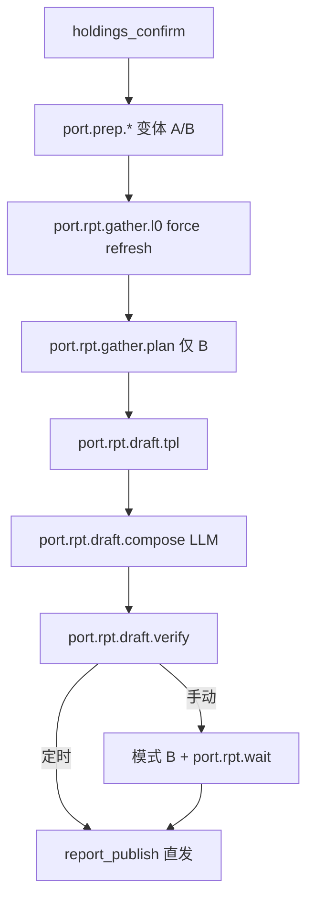

# 持仓分析报告 · 实现说明（Spec）

> **受众**：Cursor Agent、Skill 作者、前端 / Harness 研发  
> **蓝图（定稿）**：[`portfolio-report-blueprint.md`](./portfolio-report-blueprint.md)  
> **对客样例**：[`portfolio-analysis-report-sample-variant-a.md`](./portfolio-analysis-report-sample-variant-a.md) · [`portfolio-analysis-report-sample.md`](./portfolio-analysis-report-sample.md)  
> **产品规格**：PRD [§8 持仓分析](../prd/08-portfolio.md) · §8.3 对照逻辑 · §8.4 发布 · **PORT-01**

---

## 1. 文档分工

| 文件 | 给谁看 | 内容 |
|------|--------|------|
| **`portfolio-report-blueprint.md`** | 产品 / Agent | **定稿**规则、TPL/LLM/L0 分色、compose 块、gather 契约 |
| **`skills/portfolio/report.template.zh.md`** | Agent 运行时 | 章节骨架、ECharts、Verify 摘要 |
| **对客样例 A/B** | C 端投资者 | 友好话术；Preview 即阅读体验 |
| **spec（本文）** | Agent / 研发 | 章节映射、数据绑定、流程、Verify 详文 |

**原则：** 正文 **必须** 采用 sample 对客风格；技术字段进 `report_index` / `draft-meta.json`，**禁止** 正文暴露 L0/L1、内部表名。

**正文起点（RPT-PORT-CLEAN-01 · P0）**：`#` 为第一行；其后文首副标题。**禁止** 文首 Spec/PRD 链接块。

**标题编号（RPT-HEADING-NUM-01 · P0）**：Preview 自动编号；正文 **禁止** 手写「一、」。

**版式（RPT-PORT-FORMAT-01 · P0）**：章间 `---` · 文末系统免责 · **禁止「本章回答：」**（与基金解读一致；正文章以 **普通开篇段** 或直接进入表/图）。→ [`report-format-spec.md`](./report-format-spec.md) §4

---

## 2. 何时生成

| 触发 | 说明 |
|------|------|
| 用户「重新分析」/ 空态引导 | 须 `holdings_versions.is_current` |
| **定时持仓分析** | 同 Harness + compose；Verify 通过后 **直发**（RPT-SCHED-01）；变体见 **PORT-SCHED-VARIANT-01** |
| **禁止** 无持仓 / 未 `holdings_confirm` | §8.1 |

**变体选择**

| 场景 | 规则 |
|------|------|
| **手动 · N=0** | 变体 **A** |
| **手动 · N=1** | 询问是否对照 |
| **手动 · N≥2** | 场景选择器 → 再问 |
| **定时** | **有且仅有一个**已发布方案 → **自动变体 B**；否则 **A** |

**输入快照**

| 数据 | 用途 |
|------|------|
| `holdings_versions`（`is_current`） | §一 明细 |
| `holdings_nav_gather` | 行级净值/分红/pnl · 组合汇总 |
| **变体 B** | 已发布 `allocation_plans` + `plan_report_id` |
| `web_search` | **默认不调用**；若调用则 ≤5 条参考来源 |

---

## 3. 一级标题与文首（PORT-NAME-01）

| 变体 | `report_name` / `#` 标题 |
|------|--------------------------|
| **A** | `持仓分析报告-{YYYYMMDD}` |
| **B** | `{场景名}-持仓分析报告-{YYYYMMDD}` |

文首副标题：

```markdown
*为您生成 · {生成日期}*  
*数据截至 **{as_of_trade_date}（最近交易日）***{B：本报告对照 **「{场景名}」** 资产配置方案}*
```

定时追加：`*本报告由定时任务自动生成*`

---

## 4. 章节骨架与变体（PORT-01）

### 4.0 §一 必含（PORT-HOLDINGS-IN-REPORT-01 · P0）

| 项 | 规则 |
|----|------|
| **硬性要求** | **§一 您的当前持仓** P0；手动/定时、A/B **均不可删** |
| **快照** | 绑定 `holdings_version_id`；历史报告不随面板变更 |
| **行覆盖** | 表行数 = `positions` 行数；L0 失败行 **「暂无行情」** 仍占一行 |
| **章首** | 数据截止日 + 测算说明（TPL） |

### 4.1 变体对照表

| 序 | 对客章节（`##`） | A | B | 图表 |
|----|------------------|---|---|------|
| — | 阅读指引 / 三句话 / 持仓速览 | ✅ | ✅ | — |
| 一 | **您的当前持仓** | ✅ | ✅ | — |
| 二 | **组合表现与收益** | ✅ | ✅ | **1** 横条 |
| 三 | **结构分布** | ✅ | ✅ | **1** 环图 |
| 四 | **主要持仓基金要点** | ✅ | ✅ | 表 + 分基 `###` |
| 五 | **对照方案 · 配置偏离** | — | ✅ | **1** 分组柱 |
| 六 | **再平衡参考** | — | ✅ | — |
| 七 | **风险与合规** | ✅ | ✅ | — |
| — | 温馨提示 / 参考来源 | ✅ | 有联网时 | — |

变体 A **禁止** §五 §六 空章占位。

### 4.2 内容分层（PORT-LAYOUT-01）

| 区块 | 写什么 |
|------|--------|
| **三句话** | 定性 + **可含关键汇总数字**；指向 §一～§三 |
| **持仓速览** | TPL 双栏；右栏 B 时写偏离/方案名（**成本口径**） |
| **§一** | **唯一**完整明细表 + 收益双列 |
| **§二～§七** | **LLM 开篇段**（compose）+ TPL 表/图；§四 另含 LLM 分基 bullet |
| **§七** | PORT-RISK-01 **规则句** + LLM **补 1～2 句** |

### 4.3 数据绑定

| 章节 | 字段 / 来源 |
|------|-------------|
| §一 | `holdings_nav_gather` 行级：`market_value` · `pnl_abs` · `pnl_pct` |
| §二 | 组合加权 pnl；持有收益横条 |
| §三 | PORT-CATEGORY-MAP-01 · **`paid_amount` 成本占比** |
| §四 | L0 必填；L1 可选 1 句 → compose |
| §五～§六 | `plan_read` · 成本口径偏离 · `rebalance_rule` |

**持有收益（PORT-RETURN-01/02）**

> 持有收益（元）= 最新市值 − 买入支付金额 + 持有期现金分红。持有收益率 = 持有收益 ÷ 买入支付金额。

**分红（PORT-RETURN-DIV-01）**：Tushare `fund_div` → AKShare；失败 → 脚注「未纳入现金分红」。

**方案比对（PORT-ALLOC-COMPARE-01）**：**仅 `paid_amount` 成本口径**；禁止用市值与方案比。

---

## 5. 持仓确认卡列头

与 §一 对齐：代码 · 名称 · 买入日 · 买入支付金额 · 持有份额 · 来源。**无** 收益列。

---

## 6. 图表契约（PORT-VISUAL-01 · P0）

| 变体 | 必画图 |
|------|--------|
| **A** | §二 横条 + §三 环图 = **2** |
| **B** | 上 + §五 分组柱 = **3** |

**可选（默认关）**：§二末组合加权净值走势 — 持仓 ≥2 且净值序列 ≥6 交易日。

**禁止**：成本柱/树图/雷达/仪表凑数（§6.4 同前）。

---

## 7. 生成流程（Gather → TPL → compose → Verify）



### 7.1 `holdings_nav_gather`（PORT-L0-GATHER-01）

| 步 | 说明 |
|----|------|
| 1 | `positions` 去重 `fund_code` |
| 2 | 每只 `syncFundL0Local(code, { force: true })` — **每次 report gather 强制刷新** |
| 3 | 持有期分红汇总 × 确认份额 |
| 4 | 行级 pnl；组合汇总；大类拆分 |
| 5 | 失败行 `l0_ok: false` → 「暂无行情」 |

录入期 `fund_lookup` 可 **软提示** 代码是否可拉行情；**不阻断**确认卡。

### 7.2 compose（PORT-COMPOSE-01）

对齐基金 `fund.rpt.draft.compose`：

| 块 | LLM | fallback |
|----|-----|----------|
| 三句话 | ✅ | TPL 三槽 |
| §二/§三/§五/§六 开篇 | ✅ | TPL 短段 |
| §四 分基 bullet | ✅ | TPL 类型+pnl 一句 |
| §七 补句 | ✅（RULE 之后） | 省略补句 |

详文 → [蓝图 §3](./portfolio-report-blueprint.md)

### 7.3 方案上下文存储

| 层 | 键 |
|----|-----|
| 会话 | `conversations.metadata.portfolio_plan_context` |
| 草稿 | `draft-meta.json`（冻结） |
| 发布 | `report_index.allocation_plan_id` · `goal_constraint_id` · `metadata.plan_report_id` |

---

## 8. 变体 B · 方案深链（RPT-LINK-01）

§五 须含：

```markdown
**对照资产配置方案**：[{plan_report_name}](/reports?tab=plan&id={plan_report_id})（点击可在「我的报告 · 资产配置方案」中打开）
```

`draft-meta.json` 建议：`holdings_version_id` · `report_variant` · `return_estimate: true` · `allocation_plan_id` · `plan_report_id` · `goal_constraint_id` · `l0_degraded[]`

---

## 9. Verify 清单（PORT-VERIFY · P0）

| # | 检查 |
|---|------|
| 1 | `#` 符合 **PORT-NAME-01**（含「报告」二字） |
| 1a | §一 完整明细表；行数 = positions（含暂无行情行） |
| 2 | 文首「数据截至 {as_of_trade_date}」 |
| 3 | 三句话 + 持仓速览 |
| 4 | §一 测算说明 + 持有收益（元）+ 持有收益率 |
| 4b | 温馨提示含测算免责 |
| 5 | §二、§三 各 1 图 + 读图句 |
| 6 | 变体 B：§五 §六 + 深链 + 成本口径句 + 3 图 |
| 7 | 变体 B 分批：完成度公式 |
| 8 | 禁止 L0/L1、内部表名、**未剥离 compose 占位符** |
| 9 | 温馨提示；**禁止「本章回答：」** |
| 10 | 变体 A **无** §五 §六 |
| 11 | 章间 `---` · 文末免责 · PORT-RISK-01 触发句 |

---

## 10. 对客话术（PORT-COPY-01）

- 用「您」；数字 **加粗**；合规用「温馨提示」  
- **禁止** 内部代号  

**变体 B · 草稿后咨询句**（聊天 · 非正文）：见 PRD §8.3.3

---

## 11. 报告名称（RPT-NAME-01）

| report_type | 模板 |
|-------------|------|
| `portfolio` | `持仓分析报告-{YYYYMMDD}` 或 `{场景名}-持仓分析报告-{YYYYMMDD}` |

---

## 12. 编码资产索引

| 资产 | 路径 |
|------|------|
| **蓝图** | `portfolio-report-blueprint.md` |
| 编排 Skill | `skills/portfolio/portfolio_skill.md` |
| 报告模板 | `skills/portfolio/report.template.zh.md` |
| 任务图 | `skills/portfolio/portfolio_workflow_tasks.zh.yaml` |
| Verify | `skills/portfolio/portfolio_verify.yaml` |
| gather（待建） | `src/lib/portfolio/holdings-nav-gather.ts` |
| PRD | `requirement/prd/08-portfolio.md` §8.11–§8.12 |

---
