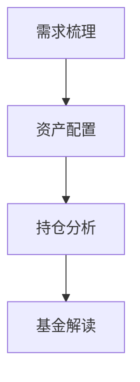

> [← PRD 索引](../PRD.md) · **1. 全局设计规范**

## 1. 全局设计规范

### 模块说明

| 项 | 说明 |
|----|------|
| **做什么** | 统一视觉与信息架构：左侧历史、中间对话、底部五场景 Tab；有报告草稿时左报告右聊天（模式 B） |
| **入口** | 全站壳；侧栏全局五项见 §1.2.3 |
| **编码锚点** | 组件 `ReportMarkdownPreview`（§1.3.4）；布局 RPT-LAYOUT-01 |

### 1.1 视觉风格

- **设计系统**：Notion 光明版黑白样式  
- **规范文件**：`D:\CursorProjects\agent-demo\design/type/notion/DESIGN.md`、`D:\CursorProjects\agent-demo\design/type/notion/preview.html`  
- **交互参考**：[Kimi](https://www.kimi.com/) — 居中对话、侧边历史、输入区带附件入口；**输出形态**以 §0.2.1 阶段式流式为准（非 Kimi 逐字流）  
- **行情颜色**：**绿涨红跌**（A 股习惯；向用户说明见 **使用说明** §5.3.9）

#### 1.1.1 色彩速查（Figma 用）

| 角色 | 色值 |
|------|------|
| 页面背景 | `#ffffff` |
| 交替区块背景 | `#f6f5f4` |
| 主文字 | `rgba(0,0,0,0.95)` |
| 次要文字 | `#615d59` |
| 占位符 | `#a39e98` |
| 主色 / 链接 / CTA | `#0075de` |
| 边框 | `1px solid rgba(0,0,0,0.1)` |
| 涨（绿） | `#1aae39` |
| 跌（红） | `#e03e3e` |

#### 1.1.2 字体

- 主字体：NotionInter / Inter 回退栈  
- 正文 16px / 行高 1.5；导航与按钮 15px weight 600  

### 1.2 信息架构（定稿）

#### 1.2.1 布局决策：「底部场景 Tab + 统一聊天壳」（已定稿）

**一个聊天壳**，五种模式以 **底部输入区附近的场景 Tab** 呈现（类似 segmented control / Tab 栏），**非**主区顶部大 Chip。

```
[+ 新对话] → 默认 Tab =「自由问答」
       ↓
  主区：消息流（上）+ 底部固定区（下）
       ↓
  底部固定区（自上而下）：
    合规短句 → [自由问答][需求梳理][资产配置][持仓][基金]（场景 Tab）
    → 输入卡片（placeholder / Agent Pill / + / 发送）
       ↓
  用户可随时点击 Tab 切换当前场景；切换后更新 placeholder、Pill、`/` 补全、附件 `+`、**主区布局模式**（§1.2.5）
```

| 区域 | 放什么 |
|------|--------|
| **左侧边栏** | `[+ 新对话]` + **历史对话** + 底部全局区（§1.2.2） |
| **主内容区** | **布局模式 A 或 B**（§1.2.5）；底栏固定：合规条 + **场景 Tab** + 输入（模式 B 时输入在 **右侧聊天列**） |
| **第三栏** | **不做** fund 专用固定右栏；自选见 **fund 主区 Tab**（§9.3.1） |

**入口定稿（UI）**：

| 问题 | 定稿 |
|------|------|
| Chatbox 是否一个？ | **是**，五场景共用同一套消息流与底部输入区 |
| 场景怎么选？ | **底部 Tab**；新建默认 UI「自由问答」；**首句或 Handoff 开跑**才锁定类型（**CH-TYPE-01** · [shared §5.1.3b](./05-chat-shared.md)） |
| Planner 何时识别？ | **五 Tab 均有** Step1；按 **intent** 分流短问 / 本场景流程 / 跨场景（[shared §5.6.2](./05-chat-shared.md)） |
| 侧栏 | **不做**五场景并列导航（G-08）；场景入口**仅**底部 Tab |

**`conversation_type`**：新建占位 `chat`；**锁定后** = 对话主场景。未锁定时 UI 读 `metadata.active_tab`（§5.1.3b）。已锁定后切 Tab → **CH-TAB-01**（§5.1.3c），**不** PATCH 改当前对话类型。

#### 1.2.2 线框（Figma 参考）

**模式 A · 聊天主区（默认）** — `chat` / `profile`，或 plan/portfolio/fund **无待确认报告草稿**：

```
┌──────────────┬──────────────────────────────────────────────┐
│ 侧边栏 260px  │  主区 max-width 768px 居中                    │
│ [+ 新对话]    │      消息流 / 空状态                          │
│ ── 历史 ──   │  （fund / portfolio 无草稿时主区 Tab 见下） │
│ ── 全局 ──   │  合规条 + [自由问答][需求梳理][资产配置][持仓][基金] │
│  我的报告…   │  输入卡片                                     │
└──────────────┴──────────────────────────────────────────────┘
```

**模式 B · 报告主区 + 右侧聊天（RPT-LAYOUT-01）** — profile / plan / portfolio / fund **有待确认报告草稿**：

```
┌──────────────┬───────────────────────────────┬─────────────────┐
│ 侧边栏       │  主区 · 报告 Preview（可宽）    │  聊天列 ~400px   │
│              │  Tab：fund [报告预览|我的自选]         │  阶段条         │
│              │       portfolio [报告预览|当前持仓]   │  消息流+确认卡   │
│              │  ReportMarkdownPreview         │  合规+场景Tab    │
│              │  （仅 Preview 单栏）            │  输入卡片        │
│              │  ← 拖拽分屏线 →                │                 │
└──────────────┴───────────────────────────────┴─────────────────┘
```

- 侧边栏折叠：260px → 56px 图标栏  
- **平台（UX-PC-01 · 已定）**：**仅 PC 桌面**（建议 viewport ≥1280px）；**不做**平板/手机专属布局与模式 B 移动端变体  
- **分屏宽度（RPT-SPLIT-01 · 已定）**：主区与右侧聊天列之间 **可拖拽分屏线**；**默认**聊天列宽约 **400px**；允许用户 **手动调宽/调窄**，刷新后 **记住**上次宽度  

| 项 | 规格 |
|----|------|
| **默认** | 聊天列 **400px**（或主区:flex + 聊天:400px） |
| **可调范围** | 聊天列 **min 280px · max 520px**（过窄难输入、过宽挤报告） |
| **持久化** | `localStorage` key：**`agent-demo:rpt-chat-pane-width`**（px 整数）；无值时用默认 400 |
| **拖拽** | 分屏线 hover 高亮；拖动时实时预览；**mouseup** 写入 localStorage |
| **恢复** | 本期 **不做**「恢复默认宽度」按钮（P2）；删 key 即回默认 |

#### 1.2.5 报告场景双布局（RPT-LAYOUT-01 · RPT-DRAFT-01 · 已定）

> **四类报告快照**（需求梳理 / 投资规划 / 持仓分析 / 基金解读）共用：**待确认草稿**在对话内预览与确认；**已发布**才进「我的报告」（[04-my-reports.md](./04-my-reports.md)）。详见 **§4.1.0**、§6、§7.4、§8.4、§9.1.2。

| 条件 | 布局 | 主区 | 右侧 |
|------|------|------|------|
| plan/portfolio/fund/profile · **无** `pending_report_draft` | **模式 A** | 聊天居中（**fund / portfolio** 见下 Tab） | 无 |
| plan/portfolio/fund/profile · **有** 待确认草稿 | **模式 B** | **报告 Preview** | **聊天**（阶段条、确认卡、输入） |
| chat · 始终 | **模式 A** | 聊天 | 无 |

**主区 Tab（fund · portfolio · 模式 A）**（**PORT-PANEL-UI-01**）

| 场景 | Tab | 内容 |
|------|-----|------|
| **fund** | **对话** \| **我的自选** | 自选：竖向列表 + 搜索添加 + AI 解析 / 删除（§9.3.1） |
| **portfolio** | **对话** \| **当前持仓** | 当前持仓：只读列表 + 总成本 + 上次确认时间；空态引导录入（§8.1.1 · §8.8） |

**主区 Tab（fund · portfolio · 模式 B）**

| 场景 | Tab | 内容 |
|------|-----|------|
| **fund** | **报告预览** \| **我的自选** | 自选同模式 A |
| **portfolio** | **报告预览** \| **当前持仓** | 持仓面板同模式 A |

**主区（plan / profile · 模式 B）**：无 Tab，整栏 **报告 Preview**。

**待确认草稿 · 数据与确认卡**：完整规则（路径、`pending_report_draft`、修订 Harness、确认发布）→ [**04-my-reports §4.1.0**](./04-my-reports.md)。本节只定义 **布局何时切换**。

**切换**：Verify 通过写草稿 → **自动**模式 B；确认发布或放弃 → **恢复**模式 A。

**例外 · 定时持仓（RPT-SCHED-01）**：无对话确认卡；Verify 通过后 **直接** `report_publish` + `trigger_source=scheduled`（§4.2、§8.4）。

#### 1.2.3 常驻功能归属

侧栏底部 **「全局」固定区**（自上而下，**五项**同组）：**我的报告 → 定时持仓分析 → 基金知识库 → 使用说明 → 设置**。历史对话区在其上方，中间用分隔线区分。

| 功能 | 入口位置 | 说明 |
|------|----------|------|
| **我的报告** | 侧栏底部全局区 · 第 1 项 | **独立页面** `/reports`；页内 **4 Tab**（需求梳理 / 投资规划 / 持仓分析 / 基金解读）；[04-my-reports.md](./04-my-reports.md) |
| **定时持仓分析** | 侧栏底部全局区 · 第 2 项 | **独立页面** `/scheduled-jobs`；状态卡片 + 编辑弹窗（[04-scheduled-tasks.md](./04-scheduled-tasks.md) §4.2） |
| **基金知识库** | 侧栏底部全局区 · 第 3 项 | **独立页面** `/fund-knowledge`；上传披露、浏览 md、更新索引（§9.2 · KB-01）；**全局常驻**，不绑 fund Tab |
| **使用说明** | 侧栏底部全局区 · 第 4 项 | 点击弹出**说明页**（非侧栏内嵌长文）；含能力总览、绿涨红跌、聊天记忆说明等（§5.3.9） |
| **设置** | 侧栏底部全局区 · 第 5 项 | 全局：**通用 / 数据库 / 数据源 / 模型 / 聊天记忆**（§2 · [02-settings.md](./02-settings.md)） |
| **我的自选** | **fund 场景 · 主区 Tab**（§9.3.1）；**无**固定第三栏 |
| **当前持仓** | **portfolio 场景 · 主区 Tab**（§8.1.1 · **PORT-PANEL-UI-01**）；**无**固定第三栏 |

#### 1.2.4 五种模式（同级，共用聊天壳）

- 点击 **「+ 新对话」** → **立即 POST**；UI 默认 **自由问答**；`type_locked=false`（CH-NEW-01 · CH-TYPE-01）  
- 用户**随时可点 Tab** 预览各场景空状态；**未发首句前**仅 PATCH `metadata.active_tab`  
- **首条用户消息** 或 **Handoff「前往」** → 锁定 `conversation_type`；Handoff 并 **自动开跑** + 阶段条（§5.13.1）  
- **已锁定后**切 Tab → **CH-TAB-01** 跳转该类型对话或新建预览（[shared §5.1.3c](./05-chat-shared.md)）；**不** PATCH 当前对话改类型  
- 侧栏历史 **仅时间分组**（§5.8.1）；**本期不做**场景筛选（CH-09）  
- **一线程一场景**（**CH-CONV-01**）：锁定后一条对话一种类型；侧栏 **场景副标题**（[shared §5.3.14](./05-chat-shared.md)）；**无**气泡 scene pill  
- 切换 Tab / 新建 / 切历史 / 进全局页：**均不因 pending 拦截**；侧栏 **待确认橙点**（SH-04）+ 切回 **对应类型对话** 恢复模式 B  
- 五种模式均为 `conversation_type` 枚举，**共用同一套**消息流 + 底部输入区组件  
- 差异：placeholder、Agent Pill 文案、后端 Subagent（§6–§9）；**附件 `+` 五场景共有**（**VISION-ALL-01** · §5.3.13）  
- **五场景 Tab 均有 Planner**（[shared §5.6.2](./05-chat-shared.md)）；**`chat` Tab** 另有空状态能力介绍（[qa §5.7](./05-chat-qa.md)）  
- **`plan` Tab · N≥2 空状态**：主区展示 **场景选择器**（完善组列表 · 单选 `goal_constraint_id`）→ 详 [§7.9 线框](./07-allocation-plan.md#场景选择器--ui-线框pl-plan-pick-goal-01--p0) · PL-PLAN-PICK-GOAL-01  
- 历史侧栏：**P0** 时间分组、逐条删除、改标题、**待确认橙点**（SH-04）；**不做**场景筛选、清空全部

| conversation_type | 对客中文 | English（registry / i18n） | Agent 标签 Pill |
|-------------------|----------|---------------------------|-----------------|
| `chat` | 自由问答 | Free Q&A | 理财助手 \| 自由问答 |
| `profile` | 需求梳理 | Investment Profile | 理财助手 \| 需求梳理 |
| `plan` | 资产配置 | Investment Plan | 理财助手 \| 资产配置 |
| `portfolio` | 持仓分析 | Portfolio Analysis | 理财助手 \| 持仓分析 |
| `fund` | 基金解读 | Fund Analysis | 理财助手 \| 基金解读 |

**输入框占位符**不固定写在表内，按 **§5.3.4** 动态计算（`chat` / `fund` 见 §5.3.3 补充规则）。

### 1.3 Markdown 源码 / Preview 双栏（全局）

凡展示长 Markdown 的内容，统一 **源码 + Preview 双栏**（布局类 Cursor：左右或上下分栏，支持拖拽调节比例）。

**两层概念（须区分）**

| 层 | 说明 |
|----|------|
| **产品页面** | **彼此独立**，各有路由与页面壳；**不是**一个大页面里塞所有功能 |
| **功能组件** | 右栏 Preview（及可选双栏壳）**共用** **`ReportMarkdownPreview`**（§1.3.4）；**禁止**按报告类型复制渲染器 |

**接入 Preview 的独立页面**

| 产品页面 | 入口 | 页面内结构 | PRD |
|----------|------|------------|-----|
| **我的报告** | 侧栏 → 我的报告 | **本页内 4 Tab**；列表 + 内嵌 Preview；可 **全屏查看** `/reports/view` | [04-my-reports.md](./04-my-reports.md) |
| **聊天记忆** | 侧栏 → 设置 → 聊天记忆 | **独立子页**；Preview 单栏 + **编辑 / 刷新**（§2.4） | §2.4 |
| **基金知识库管理** | 侧栏 → **基金知识库** | **独立页面**；浏览/编辑 vault 内 md | §9.2 |

> 上述三处 **页面分离**；仅 **Preview 渲染与双栏交互** 共用组件。列表区、工具栏、保存逻辑 **各页自有**。

**实现**：右栏 Preview **必须**复用 **`ReportMarkdownPreview`**；**禁止**为规划书 / 持仓 / 基金各写一套渲染器。

#### 1.3.1 双栏交互（定稿）

| 项 | 规格 |
|----|------|
| **左栏 · 源码** | Markdown 纯文本；等宽字体 |
| **右栏 · Preview** | 渲染后的**只读**阅读视图（标题、列表、表格、图表等） |
| **同步方向** | **仅源码 → Preview**（源码改动后实时刷新预览；防抖约 300ms）；Preview **不可**反写源码 |
| **滚动** | 可选「同步滚动」；默认可开 |

**只读 vs 可编辑**（按 **页面** 区分）：

| 产品页面 | 源码栏 | Preview 栏 | 说明 |
|----------|--------|------------|------|
| **我的报告**（§4.1 · 四 Tab） | **不展示源码栏**（`showSourcePane=false`） | 只读 + **外部编辑/刷新** | 历史快照；**不做** App 内源码编辑 |
| **聊天记忆**（§2.4 · 设置子页） | **不展示源码栏** | 只读 Preview + **外部编辑 / 刷新写库** | 见 §2.4.2 |
| **基金知识库管理**（§9.2 · 独立页） | **不展示源码栏** | 只读 Preview + **外部编辑 / 刷新 / 块删除** | 对齐 RPT-EDIT-01 · FK-UI-01；见 §9.2 |

> **本期不做**：Preview 栏所见即所得编辑、App 内嵌 Markdown 源码栏（§0.3.1）。  
> **聊天记忆 / 我的报告**：默认 **Preview 单栏**；**编辑** 走系统默认程序打开 md，**刷新** 再更新界面（记忆另写库 · §2.4.2）。

#### 1.3.2 Preview 渲染能力

| 格式 | Preview 支持 |
|------|--------------|
| Markdown 标准语法 | ✅ |
| Mermaid（`flowchart` / `sequenceDiagram`） | ✅ 前端 `mermaid` + **mermaid-cli 同源校验**（§1.3.3） |
| ECharts 代码块 | ✅ 前端 `echarts`；围栏 **` ```echarts `** + Option JSON；对客样例见 `fund-analysis-report-sample.md` |
| 独立 `.xmind` 文件 | **本期不做**；不装 XMind CLI |

> 渲染实现见 **§1.3.4 `ReportMarkdownPreview`**（**页面独立、组件共用**）。  
> **需求仓写样例**：用 `preview-report.html` +「选择 .md 文件」或 `open-preview.cmd`（§1.3.4）；**不以 Cursor 内置 Preview / MPE 侧边栏** 作为验收标准。

**脑图 / 树状结构（Agent 写报告 md）**

- Agent 在报告正文插入 **Mermaid fenced 代码块**；Preview 用前端 `mermaid` 渲染；**无需** XMind CLI。  
- **禁止** `mindmap`（Preview / CLI 兼容差）→ 统一用 **`flowchart TB` / `flowchart LR` 树状图**（MERMAID-01）。  
- Skill / `infra_md_writer` 须按 **§1.3.3** 产出；禁止输出 `.xmind` 附件或外链流程图图片代替可编辑图源。

示例（推荐写法）：

````markdown

````

#### 1.3.3 Mermaid 流程图规范与 mermaid-cli（定稿 · MERMAID-01）

> **原则**：产品内一切流程图、时序图、树状结构 **只** 用 Markdown ` ```mermaid ` fenced 块；书写须取 **mermaid-cli 与前端库均能稳定解析** 的最兼容子集，避免「编辑器能看、Preview / 导出报错」。

| 项 | 规格 |
|----|------|
| **内置依赖** | `@mermaid-js/mermaid-cli`（命令 `mmdc`）**必装**；写入 `package.json` + `{APP_ROOT}/docs/DEPLOY.md` 安装步骤 |
| **版本对齐** | 前端 `mermaid` npm 与 CLI 捆绑的 **mermaid 核心版本一致**（同一 lockfile），禁止 Preview 与 CLI 各用一版 |
| **Preview** | 浏览器 `mermaid.run()`；语法子集与下表一致 |
| **CLI 用途** | ① `report_publish` 前校验图中语法 ② 可选导出 SVG/PNG 附件 ③ CI / 脚本自检样例 md |
| **失败策略** | `mmdc` 解析失败 → 报告 **不得 publish**；对客提示「图表格式有误」；草稿保留在 run 目录 |

**兼容性书写（Agent / Skill / 需求文档 / 样例报告均须遵守）**

| 规则 | 说明 |
|------|------|
| 图类型 | **优先** `flowchart TD` / `flowchart LR`；时序用 `sequenceDiagram` |
| 弃用 | **禁止** `graph TD`（旧语法）；**禁止** `mindmap` |
| 节点 ID | 字母数字下划线；中文或空格放 **引号标签** `step1["第一步：大类配置"]` |
| 样式 | 本期 **不用** `classDef` / `style` / `linkStyle` / `click` |
| 子图 | 尽量少 `subgraph`；节点 ID 仍须全局唯一 |
| 字符 | 标签内避免 HTML、emoji、未转义 `]` / `|` |
| 代码块 | fence 为 **` ```mermaid `** + 换行 + 内容 + 换行 + **` ``` `**；块内首行即图类型声明 |

**部署与自检（`DEPLOY.md` 必含）**

```bash
npx @mermaid-js/mermaid-cli --version
npx mmdc -i docs/samples/mermaid-smoke.mmd -o /tmp/mermaid-smoke.svg
```

`docs/samples/mermaid-smoke.mmd` 为最小 smoke 图；安装后须能通过上述命令。

**与 Harness 衔接**：`infra_md_writer` / `report_publish` 定稿前，对正文内每个 `mermaid` 块调用 `mmdc` 校验（或等价 API）；校验失败进入 Verify 阻断（HARNESS §11）。

#### 1.3.4 报告 Markdown 预览组件（`ReportMarkdownPreview` · PREVIEW-01 · 已定）

> **定位**：App 内**唯一** Markdown 富 **Preview 渲染器**（+ 可选双栏壳 `MarkdownSplitView`）。  
> **不是**一个合并所有业务的大页面；**是**多个独立页面复用的 **功能组件**。  
> **范围**：规划书 / 持仓 / 基金报告、知识库 md、聊天记忆等 — **只扩展 props / 插件，不复制组件**。

**页面 vs 组件（定稿）**

```
侧栏「我的报告」 ──→ 独立页面 /reports
                      ├ Tab：需求梳理 / 投资规划 / 持仓分析 / 基金解读
                      └ /reports/view 全屏阅读        ─┐
                                                        ├→ 共用 ReportMarkdownPreview
设置「聊天记忆」 ──→ 独立子页 /settings/memory ────────┤
                                                        │
/fund-knowledge ──→ 独立页面                         ─┘
```

**各页接入方式（须全部使用本组件）**

| 产品页面 | 路由 / 入口 | 页面内结构 | 源码栏 | Preview 栏 | 模块 PRD |
|----------|-------------|------------|--------|------------|----------|
| **我的报告** | 侧栏 → 我的报告 | **页内 4 Tab**；Preview 单栏 + 外部编辑刷新 | 隐藏 | 只读 | [04-my-reports.md](./04-my-reports.md) |
| **聊天记忆** | 设置 → 聊天记忆 | Preview **单栏** + 编辑/刷新 | 隐藏 | 只读 | §2.4 |
| **基金知识库管理** | `/fund-knowledge` | 源文档树 + 块目录 + Preview 单栏（§9.2） | 隐藏 | 只读 | §9.2 |
| 未来新报告类 | 侧栏或模块入口 | 各页自有列表 / Tab | 只读 | 只读 | 须走本组件 |

**组件契约（编码仓 · P0）**

| 项 | 规格 |
|----|------|
| **组件名** | `ReportMarkdownPreview`（建议路径 `src/components/report-markdown-preview/`） |
| **布局** | 封装 §1.3.1 双栏：左 `MarkdownSourcePane`、右 `MarkdownPreviewPane`；支持 `splitDirection`、拖拽比例 |
| **输入** | `markdown: string`（完整 md 正文）；`sourceReadOnly: boolean` |
| **渲染管线** | ① 正则拆 **` ```echarts `** 块 → 占位 div + JSON ② 其余 **`marked`（GFM）** ③ `echarts.init` 逐块 ④ `mermaid.run` 逐块 ⑤ **标题编号**（RPT-HEADING-NUM-01） ⑥ **统一版式**（RPT-FORMAT-01 · `report-format.css`） |
| **ECharts 围栏** | **` ```echarts `** + **纯 JSON** Option；**禁止** `function(){…}` 字符串 |
| **扩展 props** | `citationMode?: 'none' \| 'fk-cite'`（基金报告 **FK-CITE** 脚注 + 「查看原文」）；`linkPolicy?: 'draft' \| 'published'`（**RPT-PREVIEW-LINK-01** · §4.1.0f）；`onCitationClick?`；后续规划书 / 持仓仅加 props，**不换组件** |
| **刷新** | 源码变更 → Preview 防抖刷新（~300ms，§1.3.1）；图表 **resize** 随容器 |
| **失败展示** | 单图 JSON 非法 → 该图位显示对客短错；**不** 拖垮整页 |

**与报告类型的关系**

| report_type | Preview 扩展 | 说明 |
|-------------|--------------|------|
| `profile` | 默认 `none` | 投资需求报告 |
| `plan` | 默认 `none` · 模式 B 用 `linkPolicy='draft'` | 可有 Mermaid / ECharts · §一 链投资需求报告 |
| `portfolio` | 默认 `none` | 同上 |
| `fund` | `citationMode='fk-cite'` | 「引用说明 · 查看原文」深链 [knowledge §9.2.0e](./09-fund-knowledge.md) |
| **新增** | 仅增 **props / 子插件** | **禁止** 新建 `PlanPreview` / `PortfolioPreview` 等平行组件 |

**定稿校验（与 Harness 一致）**

- 每个 **` ```mermaid `** 块：`mmdc` 校验（MERMAID-01）  
- 每个 **` ```echarts `** 块：`JSON.parse` 通过；publish 前可选对照 `echarts-smoke-test.md` 冒烟  
- 表格数字与 ECharts series **须** 与正文一致（FK-18）

##### 1.3.4.1 需求仓 · 开发期预览（非产品组件）

> 以下仅供 **写样例 / 改 md / PR 自检**；**对客与 FK 验收** 以 App 内 `ReportMarkdownPreview` 为准。

| 方式 | 说明 | 推荐 |
|------|------|------|
| **`preview-report.html`** | 需求仓静态页；与组件 **同源** 渲染逻辑（拆 echarts + marked@4.3.0 + echarts CDN） | ✅ **推荐** |
| **`open-preview.cmd`** | 启动 `localhost:8765` 并打开上述页面；可自动 fetch sample | 一键 demo |
| **手动选文件** | `file://` 打开 html 时 **须** 点「选择 .md 文件」（浏览器禁止自动读同目录 md） | 零配置 |
| **Cursor 内置 Preview** | **不支持** ` ```echarts ` | ❌ 不用验收 |
| **MPE 侧边 Preview** | webview 常拦截 iframe / 脚本 → **白框** | 仅作参考；可试 **Open in Browser** |
| **MPE + `.crossnote/parser.js`** | 可选；与产品组件 **无耦合** | 非 P0 |

##### 1.3.4.2 标题自动编号（RPT-HEADING-NUM-01 · P0）

> **场景**：对客报告层级较深时，不能仅靠字号区分章节；Preview 须为正文标题自动加 **1 / 1.1 / 1.1.1 / 1.1.1.1 / 1.1.1.1.1** 五级编号。

| 项 | 规格 |
|----|------|
| **适用范围** | 全部 `report_type`（`profile` / `plan` / `portfolio` / `fund`）及知识库 md Preview |
| **参与编号** | `##` → **1** · `###` → **1.1** · `####` → **1.1.1** · `#####` → **1.1.1.1** · `######` → **1.1.1.1.1** |
| **不参与** | `#` 文档标题（报告名）；正文 **禁止** 在标题文字里再写「一、」「4.1」等与自动编号重复的序号 |
| **实现** | Preview 容器加 class（如 `report-md-body`）+ CSS `counter`；参考 `requirement/docs/samples/report-heading-numbers.css` |
| **Agent 写稿** | 用 Markdown 层级表达结构：`##` 章 · `###` 节 · `####` 小节 … 最多 **5 级**（`######`）；Verify 检查 **无** 手写章号 |

**层级示例（基金解读 · 第一章片段）**

```markdown
## 产品介绍
### 产品身份
### 钱主要投在哪里？
#### 前十大重仓股（季报披露）
##### 行业分布说明
```

Preview 渲染为：`1 产品介绍` → `1.1 产品身份` → `1.5 钱主要投在哪里？` → `1.5.1 前十大重仓股…` → `1.5.1.1 行业分布说明`。

##### 1.3.4.3 统一版式（RPT-FORMAT-01 · P0）

> **场景**：四类报告须 **结构一眼能扫清**——章序、分隔、本章导语、表格与图表间距一致。

| 项 | 规格 |
|----|------|
| **适用范围** | 全部 `report_type` + 知识库 md Preview |
| **结构** | `#` 标题 → 副标题 → `---` → 开篇块 → 各 `##` 章（章前 `---`）→ 合规 → 文末免责 |
| **本章回答** | 正文 `##` 章 **首段** `**本章回答：** …`（开篇/合规/参考来源除外） |
| **CSS** | `report-format.css`（表格斑马纹、三句话 blockquote、章首导语高亮）+ `report-heading-numbers.css` |
| **详文** | [`report-format-spec.md`](../docs/samples/report-format-spec.md) |

**需求仓文件**

| 路径 | 用途 |
|------|------|
| `requirement/docs/samples/preview-report.html` | 开发预览 **参考实现**（逻辑应对齐编码仓组件） |
| `requirement/docs/samples/report-heading-numbers.css` | **RPT-HEADING-NUM-01** · 五级标题编号 |
| `requirement/docs/samples/report-format.css` | **RPT-FORMAT-01** · 表格/分隔/章首导语版式 |
| `requirement/docs/samples/report-format-spec.md` | **RPT-FORMAT-01** · 四类报告共用 md 结构 |
| `requirement/docs/samples/open-preview.cmd` | Windows 一键 localhost 预览 |
| `requirement/docs/samples/echarts-smoke-test.md` | 单图冒烟 |
| `.crossnote/README.md` | MPE 可选配置说明 |

**经验结论（2026-06 已验证）**

1. **ECharts 必须走 App 共用 Preview 或浏览器预览页**；IDE 内置 Markdown 预览 **不能** 作为图表验收环境。  
2. **`file://` 无法用 fetch 加载同目录 md** → 开发预览须 **选手动选文件** 或 **localhost 静态服务**。  
3. **marked 须 pin 大版本**（参考实现用 **4.3.0**）；CDN `@latest` API 不兼容会导致选文件后「无反应」。  
4. **ECharts 块应先于 marked 拆出**，再渲染其余 Markdown（与 `preview-report.html` 一致）。  
5. 报告正文 **禁止** 用外链 PNG 代替 ` ```echarts `（§9.1.1）；PDF 导出若需静态图，可在 publish 时 **额外** 导出，不替代 md 内 JSON 块。

---

