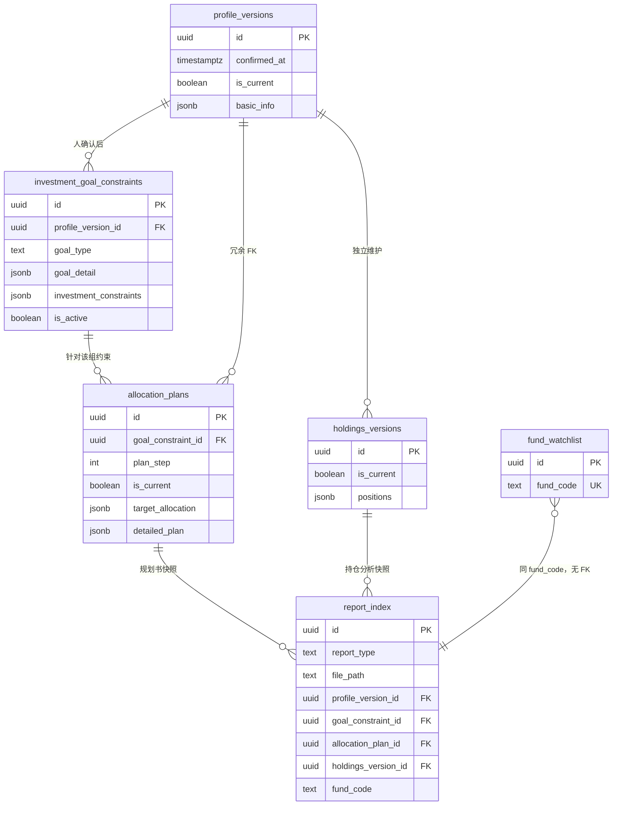

> [← PRD 索引](../PRD.md) · **3. 数据架构总览**

## 3. 数据架构总览

### 模块说明

| 项 | 说明 |
|----|------|
| **做什么** | 说明 **存什么、在哪存、实体怎么关联**；不展开各表字段七列 |
| **读者** | 产品看分层与关系；开发按 **表索引** 进对应模块 PRD 查字段 |
| **字段权威** | **各模块 PRD 的「字段规格」节**（见 §3.4）；本文件只链过去 |
| **知识库** | 披露 vault + 语义子库详文 → [09-fund-knowledge §9.2.0](./09-fund-knowledge.md) |

---

### 3.1 存储分层

| 层级 | 技术 | 存什么 |
|------|------|--------|
| **关系型** | Supabase Postgres | 对话、结构化业务数据、报告**索引**、定时持仓、自选 |
| **单基金知识库 · 披露** | `{APP_ROOT}/data/fund-knowledge/` + 本地 `index.db` | 原始材料 + 转换 md + **全文块索引**（§9.2.0） |
| **单基金知识库 · 语义** | Supabase **pgvector**（与主库同一项目） | 按基金 FAQ 约 15～30 条；与披露**分库**（KB-02） |
| **本地文件** | `{APP_ROOT}/data/reports/` | 四类报告 Markdown 快照（profile / plan / portfolio / fund） |
| **可选** | Supabase Storage | 用户上传图片（持仓截图） |

**检索原则（KB-03）**：基金相关场景按 **行情 → 披露 → 语义 → 联网** 四层瀑布，**不做**跨层全局重排。详文 → [09-fund-knowledge §9.2.0g](./09-fund-knowledge.md)。

---

### 3.2 结构化数据 vs 报告快照

| 类型 | 存储 | 版本规则 | 典型实体 |
|------|------|----------|----------|
| **结构化** | Supabase 表 | 用户确认后新版本入库，旧版 `is_current=false` | profile、allocation_plans、持仓、自选 |
| **快照** | 本地 `.md` | 发布时刻冻结；已发布后可本地改文件 + Preview 刷新（不回写库） | 四类报告正文 |

**报告路径**

| 项 | 规则 |
|----|------|
| 四类目录 | `data/reports/{profile\|plan\|portfolio\|fund}/` |
| 文件名 | 默认 `{sanitized_report_name}.md`；重名加 uuid 短后缀（§4.1.0d） |
| 库内索引 | `report_index` 只存元数据 + `file_path` |
| 待确认草稿 | `data/runs/{conversation_id}/{run_id}/draft-report.md`；**无** `report_index` |
| 「我的报告」 | **仅读已发布**；场景内模式 B 读 run 草稿 |

发布流程、确认卡、深链 → [04-my-reports §4.1.0](./04-my-reports.md)。

---

### 3.3 业务实体关系



**三层数据（需求梳理域）**

| 层 | 表 | 说明 |
|----|-----|------|
| 1 · 人 | `profile_versions.basic_info` | 身份与现金流 |
| 2 · 目标约束 | `investment_goal_constraints` + **`goal_constraint_revisions`** | 主表 = 当前有效约束；**每次 confirm** 增修订快照（PH-PROFILE-GV-02 · G2）· `profile_version_id` FK 客户信息层 · **§6.4** 后活跃行 **批量对齐** 新客户信息层 id（PH-PROFILE-PV-01） |
| 3 · 配置方案 | `allocation_plans` | 绑 `goal_constraint_id`；两步流程见 §7 |

客户信息层 / 约束字段 → [06-profile §6.12](./06-profile.md) · 方案字段 → [07-allocation-plan §7.10](./07-allocation-plan.md)。

**报告关联（摘要）**

| report_type | 必填关联 |
|-------------|----------|
| `profile` | `profile_version_id` + `goal_constraint_id` + **`goal_constraint_revision_id`**（PH-PROFILE-GV-02） |
| `plan` | 上两项 + `allocation_plan_id` |
| `portfolio` | `holdings_version_id`；有方案时加 `allocation_plan_id` |
| `fund` | **`fund_code` 仅此**；不绑投资需求/持仓/自选 |

`report_slug`、`metadata`、发布顺序 → [04-my-reports §4.1.7](./04-my-reports.md)。

**对话壳层（摘要）**

| 概念 | 存储 | 详文 |
|------|------|------|
| 待确认标记 | `conversations.metadata.has_unconfirmed` | [05-chat-shared §5.11](./05-chat-shared.md) |
| 报告草稿索引 | `metadata.pending_report_draft` | [04-my-reports §4.1.7](./04-my-reports.md) |
| 业务确认卡 payload | `propose_artifacts` + run 目录 JSON | [05-chat-shared §5.11](./05-chat-shared.md) |

---

### 3.4 表索引（字段权威在各模块）

> **字段七列**格式见 [CONVENTIONS §2](./CONVENTIONS.md)。下表只列 **表名 → 权威章节**，不在此重复字段。

| 表 | 说明 | 权威章节 |
|----|------|----------|
| `conversations` | 对话壳 | [05-chat-shared §5.11](./05-chat-shared.md) |
| `messages` | 消息流 | 同上 |
| `propose_artifacts` | 确认卡 propose 索引 | 同上 |
| `workflow_tasks` | 任务图阶段条 | 同上 |
| `workflow_locks` | 写流程互斥（SH-08） | 同上 |
| `background_jobs` | 慢任务 | 同上 |
| `profile_versions` | 客户信息层版本 | [06-profile §6.12](./06-profile.md) |
| `investment_goal_constraints` | 目标投资约束（当前有效行） | [06-profile §6.12](./06-profile.md) |
| `goal_constraint_revisions` | 约束确认修订快照（G2） | [06-profile §6.12.6](./06-profile.md#6126-goal_constraint_revisions约束修订快照--g2--ph-profile-gv-02) |
| `allocation_plans` | 资产配置方案 | [07-allocation-plan §7.10](./07-allocation-plan.md) |
| `holdings_versions` | 持仓版本 | [08-portfolio §8.9](./08-portfolio.md) |
| `report_index` | 四类报告索引 | [04-my-reports §4.1.7](./04-my-reports.md) |
| `scheduled_jobs` | 定时持仓配置 | [04-scheduled-tasks §4.2.6](./04-scheduled-tasks.md) |
| `scheduled_job_runs` | 定时执行日志 | 同上 |
| `trading_calendar` | 沪深交易日历缓存 | 同上 |
| `fund_watchlist` | 我的自选 | [09-fund-watchlist §9.3.8](./09-fund-watchlist.md) |
| `fund_lookup` | L0 行情契约（Tool 出参，非表） | [09-fund-analysis §9.1.8](./09-fund-analysis.md) |
| `model_settings` | 模型槽位配置 | [02-settings-models §2.2.8](./02-settings-models.md) |
| `user_memory` | 聊天记忆 | [02-settings-memory §2.4.1](./02-settings-memory.md) |
| `fund_semantic_entries` | L2 语义 FAQ（pgvector） | [09-fund-knowledge §9.2.0f](./09-fund-knowledge.md) |
| `knowledge_chunks` | 披露块索引（SQLite） | [09-fund-knowledge §9.2.0e](./09-fund-knowledge.md) |
| `maintenance_log` | 知识库维护日志（SQLite） | 同上 |

**本地目录（非 Supabase 表）**

| 路径 | 用途 |
|------|------|
| `data/reports/` | 已发布报告 md |
| `data/runs/{conversation_id}/{run_id}/` | 草稿 md、artifact JSON、draft-meta |
| `data/fund-knowledge/` | 披露 vault + `index.db` |

路径清单 → [appendix-c-paths](./appendix-c-paths.md)。

---

### 3.5 跨模块数据流（摘要）

**需求梳理 / 资产配置 / 持仓 · 确认写库**

```
Agent propose → propose_artifacts + JSON 文件 → 瘦 confirm_card（消息流）
  → 用户确认 → Verify → 写业务表（§3.4 对应模块）→ artifact status=confirmed
```

**报告 · 手动发布**

```
生成 draft-report.md → Verify → 模式 B + 确认卡
  → report_publish → 写 md 到 data/reports/ → INSERT report_index → 清 pending
```

**报告 · 定时持仓**

Verify 通过后 **直发** `report_index`（无草稿卡 · RPT-SCHED-01）→ [04-scheduled-tasks §4.2](./04-scheduled-tasks.md)。

**清空持仓 → 关定时**

`holdings_confirm` 写路径在清空成功后 **同一事务** `UPDATE scheduled_jobs SET enabled=false` → [04-scheduled-tasks §4.2.0d](./04-scheduled-tasks.md)。

---

### 3.6 与模块 PRD 的分工

| 本文件 | 模块 PRD |
|--------|----------|
| 存什么、在哪、实体关系 | 用户场景、流程、UI、对客问卷 |
| 表索引与跨模块流 | **字段规格**、Command、REST、验收 |
| ER 图、分层决策 | 该模块全部可执行细节 |

改某一表字段 → **只改对应模块** §字段规格；本文件 §3.4 索引行如有表名变更须同步。
