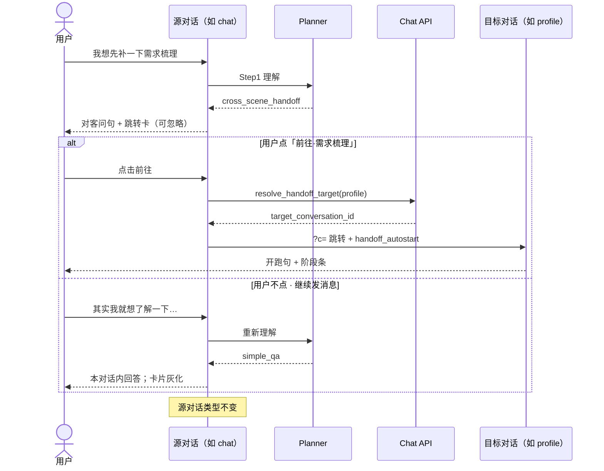
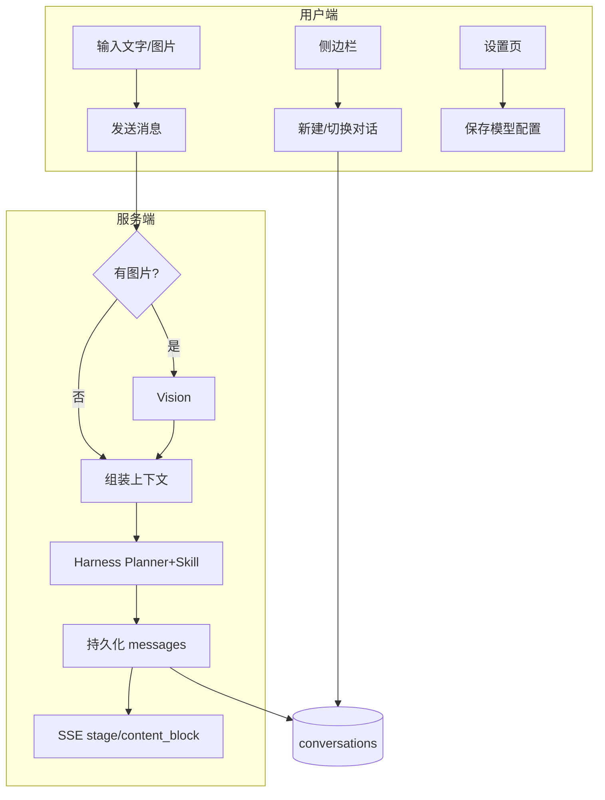
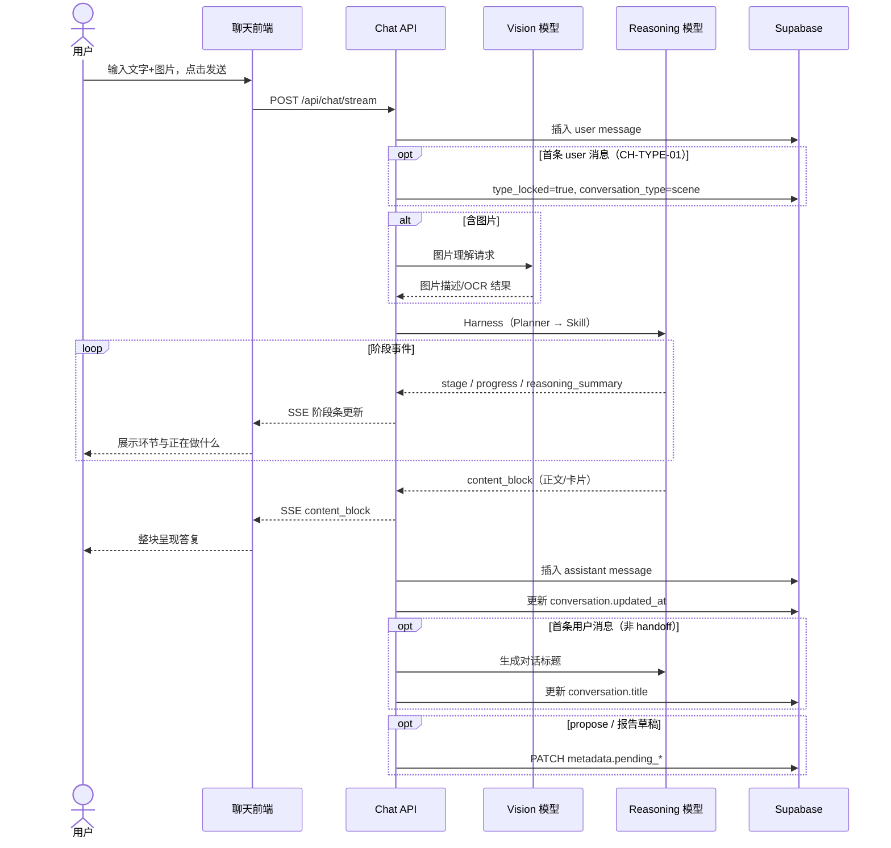
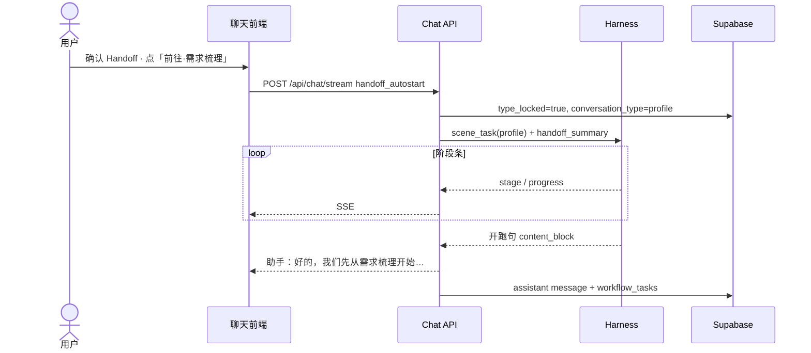

> [← 聊天总览](./05-chat.md) · **5.1 聊天共有（全场景壳）**

## 5.1 聊天共有（全场景壳）

### 模块说明

| 项 | 说明 |
|----|------|
| **做什么** | 五 Tab **共用**壳：侧栏历史、底栏场景、阶段条、跳转确认、输入框与流式 |
| **用户感受** | 换 Tab 不丢对话；跨场景时 **先问** 是否跳转；短问在当前 Tab 直接答 |
| **不做** | 侧栏按场景筛历史；会话内搜索；业务报告正文（→ §4 / §6–§9） |
| **编码锚点** | Planner §5.6.2 · Handoff §5.6.3 · `workflow_tasks` §5.11 · 布局见 §1.2 |

视觉与模式 A/B → [01-global-design §1.2](./01-global-design.md)。自由问答 → [05-chat-qa.md](./05-chat-qa.md)。

### 5.1.1 共有范围（Agent 拆分用）

| 属于本文件 | 不属于本文件 |
|------------|--------------|
| 侧栏：新对话、历史、折叠、**待确认橙点**（SH-04） | 各场景 Subagent 业务细则（§6–§9） |
| **Planner 路由（五 Tab）** · 短问 vs 场景流程 | chat 空状态 / 能力介绍（→ qa §5.7） |
| 底部五场景 Tab、合规条、输入卡片 | 报告正文、Verify 细则 |
| 布局 **模式 A / B** 切换 | 基金 Command 表（→ 09-fund） |
| 阶段式流式、停止生成 | 「我的报告」独立页 |
| 占位符 **机制** + 四业务 Tab 文案 | |
| 跨场景跳转卡 **组件** | |
| `/` 补全 **框架** + **§5.3.9a 五场景清单** | 各场景 Harness 内部 Command（§6.9 / §7.7） |
| 历史删改、前后端契约、数据表 | |

**单一数据源**

| 概念 | 字段 / 存储 |
|------|-------------|
| 当前对话 | URL `?c={conversation_id}` |
| **生效场景 Tab**（UI） | `type_locked` ? `conversation_type` : `metadata.active_tab ?? 'chat'`（**CH-TYPE-01** · §5.1.3b） |
| 当前场景 Tab（落库） | `conversations.conversation_type` — **首句或 Handoff 开跑后**锁定；**一线程一场景**（**CH-CONV-01** · §5.3.14） |
| 待确认（壳层） | `conversations.metadata.has_unconfirmed`（**唯一**角标/删对话判断） |
| 报告草稿索引 | `metadata.pending_report_draft` + `data/runs/…`（§4.1.0 · 模式 B） |
| 需求梳理/资产配置/持仓确认卡 | **messages** 瘦 `confirm_card` + **`propose_artifacts`**（§5.3.10b）· 各模块 PRD（§6/§7/§8） |
| **metadata 说明** | 本节 §5.11 |
| 写流程互斥 | `workflow_locks`（§0.12.5 · **SH-08**）— **进行中写流程**，非待确认 UI |

---

### 5.1.2 导航动作矩阵（SHELL-NAV · 已定）

> **核心原则**：待确认内容 **绑定对话**，在 **消息流**（和/或模式 B 报告区）；切 Tab / 切历史 / 新建 **不弹窗**。  
> **壳层待确认**：只看 `has_unconfirmed`。**写流程冲突**：只看 **SH-08**（`workflow_locks`）。

| 用户动作 | `has_unconfirmed=true` | 无待确认 |
|----------|------------------------|----------|
| **同对话 · 切 Tab**（类型一致或未锁定） | ❌ 不拦截 | 预览空状态或保持当前对话 |
| **切 Tab**（已锁定且 **≠** 当前 `conversation_type`） | ❌ 不拦截 | **CH-TAB-01**：无历史 → 静默新建；有历史 → 确认新建或侧栏自选（§5.1.3c） |
| **新建 / 切历史 / 进全局页** | ❌ 不拦截 | 直接切换 |
| **删除对话** | ✅ 加强二次确认（§5.8.3） | 简版确认 |
| **另一对话 · 发起需求梳理/资产配置/持仓写流程** | — | 若 **写锁被占** → SH-08（见下） |

**为何不拦截 Tab 切换**

| 理由 | 说明 |
|------|------|
| **数据不丢** | 确认卡、报告草稿留在 **该对话消息流**；切走只是换当前视图 |
| **可找回** | 侧栏 **橙点**（SH-04）；滚历史仍见确认卡/草稿 |
| **切走 ≠ 写锁** | 对话留在历史里、卡未点确认 → **可以**切走；**不**因此占 SH-08 写锁（见下） |

**侧栏待确认标识（SH-04 · 定稿）**

| 项 | 规格 |
|----|------|
| **条件** | `has_unconfirmed === true`（有报告草稿 **或** 未处理的确认卡） |
| **展示** | 标题 **左侧橙点**（**仅**圆点，**不加**「待确认」等文字） |
| **视觉** | 直径 **8px** · `#F59E0B` · 实心；距标题 **6px** |
| **当前项** | 正在查看的对话有待确认 → **同样**显示 |
| **Tooltip** | 悬停：**「有待确认的内容」** |
| **无待确认** | 不显示圆点 |

**写流程互斥（SH-08 · P0）** — 与 `has_unconfirmed` **无关**

| 项 | 规则 |
|----|------|
| **是什么** | 全实例同时只允许 **一条** 需求梳理 / 资产配置 / 持仓 **写流程正在跑**（Harness 执行写类 Skill 期间） |
| **不是什么** | 不是「历史里有没有未点确认的卡片」；**不是**禁止切对话 |
| **加锁** | profile/plan/portfolio **写流程 stream 开始** → 写 `workflow_locks` |
| **释放** | 本轮 stream **结束**（成功 / 失败 / 用户停止）— **未 confirm 的卡留在历史，锁已释放** |
| **拦截点** | **仅当**用户在 **任意对话** **新发起** 上述写流程且锁仍被占用 → 助手消息 SH-08 文案，**阻断开跑** |
| **不拦截** | 切 Tab、切历史、新建对话、自由问答、基金解读（与 §0.12.5 并行表一致） |

> 历史对话里可以躺着未确认的需求梳理确认卡；只要 **当前没有写流程在跑**，别处 **可以**再开新写流程（产品接受；若后续要「一实例一 propose」再单独立项）。

**切 Tab 后布局**

| 目标 Tab | 有匹配类型草稿 | 布局 |
|----------|----------------|------|
| profile / plan / portfolio / fund | 是 | **模式 B** |
| profile / plan / portfolio / fund | 否 | **模式 A** |
| chat | 有他类草稿 | **模式 A**（Preview 收起，确认卡仍在消息流） |

---

### 5.1.3 新建 / 历史 / 全局页

| 动作 | 规格 |
|------|------|
| **首屏 / 无 `?c=`**（CH-FIRST-01 · SH-06） | 进入 `/`（或聊天根路由）且 URL **无** `?c=` → `GET /api/conversations`（limit 1 · `updated_at` DESC）：**有历史** → 重定向 **`?c={最近一条 id}`**；**无历史** → **等同**点「+ 新对话」（POST + `?c=`） |
| **+ 新对话**（CH-03 · CH-NEW-01 · SH-01） | 点击 → **立即** `POST /api/conversations` → 空对话 + 模式 A → URL **`?c={新 id}`**；UI 默认 Tab **自由问答**；DB：`conversation_type=chat`、`metadata.type_locked=false`、`metadata.active_tab=chat`（§5.1.3b） |
| **切历史**（CH-04 · SH-02） | `?c=` 切换；读 `type_locked` / `conversation_type` / `active_tab` + pending 恢复布局 |
| **进全局页**（SH-03） | 我的报告 / 定时持仓分析 / 知识库 / 使用说明 / 设置 — **不拦截**；返回时：原 `?c=` **仍存在** → 恢复该对话；**已被删** → 全局默认 **CH-FIRST-01**，**例外**「我的报告 / 定时持仓分析」点 **返回对话** → [04-my-reports §4.1.0c](./04-my-reports.md) **友好报错**（RPT-NAV-05） |
| **场景 Tab**（SH-07 · CH-03b · **CH-TAB-01**） | **未锁定**：PATCH `metadata.active_tab`（**不改** `conversation_type`）；**已锁定且 Tab≠当前类型**：**不 PATCH 当前对话** → §5.1.3c 场景入口导航；placeholder / `/` / 附件 `+` 随 **当前 `?c=` 对话** 的生效 Tab 刷新 |

历史分组、删改标题 → §5.8。

#### 5.1.3b 对话类型生命周期（CH-TYPE-01 · P0）

> **产品原则（CH-CONV-01）**：**一条对话锁定后只承载一种场景**；不在同一线程混多种场景消息。新建时可先预览 Tab 空状态；**真正类型**在 **首条用户消息** 或 **Handoff「前往」开跑** 时落库。

| 阶段 | `conversation_type` | `metadata.type_locked` | `metadata.active_tab` | UI |
|------|---------------------|------------------------|----------------------|-----|
| **POST 新建** | `chat`（占位默认） | `false` | `chat` | 空状态 · 默认自由问答 Tab |
| **未锁定 · 仅切 Tab** | 仍为 `chat` | `false` | 用户所选 Tab | 空状态随 Tab 换文案 / placeholder / `/` |
| **首条用户消息** | **= 发送时生效 Tab**（`scene`） | **`true`** | 清除或忽略 | 进入 Planner；`messages[0].metadata.scene` 同上 |
| **已锁定 · 切 Tab（≠ 当前类型）** | **不变** | `true` | — | **CH-TAB-01** → 无历史静默新建；有历史确认新建或侧栏自选 |
| **Handoff · 前往**（§5.6.3） | 在 **目标对话** 上锁定为 `target_scene` | **`true`** | — | 跳转 `?c=` → **目标对话**内 **自动开跑** `scene_task` · §5.13.1 |

#### 5.1.3c 场景 Tab 入口导航（CH-TAB-01 · P0）

> 底部 Tab = **场景能力入口**；**不等于**在当前对话上 PATCH 改类型（**CH-CONV-01**）。

| 当前 `?c=` 对话 | 用户点击 Tab **T** | 行为 |
|-----------------|-------------------|------|
| `type_locked=false` | 任意 **T** | PATCH `active_tab=T`；主区空状态随 **T**（不发消息则 DB 仍 `conversation_type=chat`） |
| `type_locked=true` · `conversation_type=T` | **T** | 无导航；底栏高亮 **T** |
| `type_locked=true` · `conversation_type≠T` | **T** | `GET /api/conversations?conversation_type=T&type_locked=true&limit=1`（`updated_at` DESC）：**无** → **POST** 新对话 · `active_tab=T` · 空状态预览 **T**（静默，不确认）；**有**（可能多条）→ 确认「已有{T中文}对话，要新建吗？取消后可从侧栏选择已有对话。」→ **确定** → POST 新建；**取消** → 留在当前对话，用户自侧栏选历史 |

**编码**：切换 `?c=` 后 UI 读 **新对话** 的 `conversation_type` / `type_locked` / pending，**禁止**把 Tab 点击写成对旧对话的 `conversation_type` PATCH。

**编码 · 生效 Tab**

```ts
effectiveTab(c) =
  c.metadata.type_locked ? c.conversation_type
                         : (c.metadata.active_tab ?? 'chat')
```

**锁定触发（二选一）**

| 触发 | 行为 |
|------|------|
| **A · 首条用户消息** | 用户发送首条文字/图片 → `conversation_type = scene` · `type_locked=true` · 异步标题 |
| **B · Handoff / 场景自动开跑** | 用户点跳转卡 **「前往」**（或 CH-10「去持仓分析更新」）→ 解析 **目标场景对话**（§5.6.3）→ `?c=` 跳转 → `POST /api/chat/stream` · `trigger=handoff_autostart` · **`conversation_id`=目标** → 锁定 + 跑 `scene_task` · §5.13.1 |

**与 Planner**：锁定类型 **≠** 一定走 `scene_task`（A 路径下仍可能 `simple_qa`）；**B 路径**固定 `scene_task`。

#### 5.1.3a 壳导航 ID 映射（SH-01～SH-08 · P0）

| ID | 能力 | 规格锚点 |
|----|------|----------|
| **SH-01** | **+ 新对话** | §5.1.3 · CH-NEW-01 |
| **SH-02** | 侧栏切历史 | §5.8 · `?c=` 切换 |
| **SH-03** | 进全局页 / 返回 | §5.1.3；删对话后返回 → CH-FIRST-01 |
| **SH-04** | 待确认 **橙点** | §5.1.2 · `has_unconfirmed` |
| **SH-05** | 侧栏折叠 | §5.3.1 · 260px ↔ 56px |
| **SH-06** | 首屏无 `?c=` | **CH-FIRST-01** · §5.1.3 |
| **SH-07** | 场景 Tab | §5.1.3 · **§5.1.3b–§5.1.3c**（**CH-TAB-01**） |
| **CH-CONV-01** | **一线程一场景** | §5.3.14 · 锁定后禁止同对话混场景 |
| **CH-TAB-01** | Tab 入口导航 | §5.1.3c · 已锁定且类型不同 → 换对话或新建 |
| **SH-08** | 写流程进行中 · 互斥 | §5.1.2 · `workflow_locks` |

---

### 5.1.4 功能清单（共有 · SH / CH）

| ID | 功能 | 优先级 | 说明 |
|----|------|--------|------|
| SH-01～SH-08 | 壳导航 / 角标 / 锁冲突 | P0 | §5.1.2–§5.1.3 · **§5.1.3a** |
| CH-FIRST-01 | 首屏无 `?c=` 自动定位/新建 | P0 | §5.1.3 |
| CH-TYPE-01 | **首句 / Handoff 开跑** 才锁定 `conversation_type` | P0 | §5.1.3b |
| CH-01 | 简体中文 | P0 | 全产品固定简体中文 |
| CH-02 | 阶段式流式输出 | P0 | §5.3.10 |
| CH-03 | 新建对话 | P0 | §5.1.3 |
| CH-03b | 场景 Tab 切换 | P0 | 随时切换；**不因 pending 拦截**（§5.1.2） |
| CH-04 | 历史对话 | P0 | §5.8 |
| CH-05 | 模式空状态 **壳** | P0 | Logo + 底栏；**chat** 文案见 [qa §5.7](./05-chat-qa.md) |
| CH-06 | 图片上传 | P0 | **五 Tab**（§5.3.12–§5.3.13 · **VISION-ALL-01**） |
| CH-07 | 文本输入 | P0 | Enter 发送 / Shift+Enter 换行 |
| CH-08 | 对话持久化 | P0 | `conversation_type` 锁定（CH-TYPE-01）、自动标题（首条用户消息后） |
| CH-09 | 历史场景筛选 | P0 | 按 Tab 筛选历史对话（§5.8.1） |
| CH-10 | 会话内搜索 | P0 | 在当前对话内搜索消息内容（§5.8.2） |
| CH-11 | 理解对话 · Planner 路由 | P0 | **五 Tab** §5.6.2 · PLANNER-ROUTER-01 |
| CH-13 | 跨场景 **先问 + 跳转卡** | P0 | **HANDOFF-CONFIRM-01** · §5.6.3；**仅**点「前往」转化 |
| CH-14 | 合规提示条 | P0 | §5.3.7 |
| CH-16 | 停止生成 | P0 | §5.3.8 |
| CH-17 | 编辑再发 | P0 | 编辑已发送的消息并重新发送（§5.3.17） |
| CH-18 | 重新生成 | P0 | 对助手回答不满意时重新生成（§5.3.18） |
| CH-22 | 历史改标题 | P0 | §5.8.3 |
| CH-25 | 使用说明页 | P0 | §5.3.9 |
| CH-26 | 环节进度流式 | P0 | §5.3.10 |
| CH-27 | **`/` Command 补全 · 交互** | P0 | §5.3.11 |
| CH-CMD-01 | 五 Tab **各自** `/` Command 清单 | P0 | §5.3.9a · registry `scenes` |

---

### 5.3 聊天界面（共有 · 参考 Kimi）

#### 5.3.1 布局规格（Figma 级）

| 区域 | 规格 |
|------|------|
| 侧边栏宽 | 260px（可折叠至 56px）；底部全局区五项（§1.2.3） |
| 主内容区 | 模式 A/B（§1.2.5）；profile/plan/portfolio/fund 有草稿 → 模式 B |
| fund 自选 | 主区 Tab「我的自选」（§9.3.1） |
| 主对话区最大宽 | 768px 居中（模式 A） |
| **场景 Tab 栏** | 输入卡片上方；五枚 Tab；空状态与有消息时均固定底部 |
| 输入区 | 合规条 → Tab → 圆角输入卡片；左附件 + textarea + 发送 |
| 消息气泡 | 用户 `#f6f5f4` 右对齐；助手白底 + whisper 边框 |
| 阶段条 | §5.3.10 |

#### 5.3.2 空状态与底部输入区

- **主区上部**：无消息时 Logo + **场景相关**空状态（`chat` → [qa §5.7](./05-chat-qa.md)；`profile` → [§6.11](./06-profile.md)；`plan` → [§7.9](./07-allocation-plan.md)；`portfolio` → [§8.8](./08-portfolio.md)；`fund` → [§9.1.0c](./09-fund-analysis.md)）  
- **底栏**：合规条 → 场景 Tab → 输入卡片  
- Pill：`🧪 理财助手 | {当前 Tab 场景名}`  
- **换场景**：点 Tab 或跳转卡「前往」（§5.6.3）  
- `+` 附件：**五 Tab 均可用**（**VISION-ALL-01** · §5.3.13）；须已配 Vision 且检测通过  
- placeholder：§5.3.4 + §5.3.13 图片分支（`chat` 专表 → [qa §5.3.3](./05-chat-qa.md)）

#### 5.3.4 场景占位符逻辑（对客 · P0）

> **完善的投资需求**定义见 [§6.0.1](./06-profile.md#601-完善的投资需求n-的定义--p0)；编码：`GET /api/placeholder?scene=` 或 stream 首包 `input_placeholder`。

##### `profile` · 需求梳理

> **M** = 待续接组数（§6.0.2 · 库推导）；**本对话模式 B** = 当前 `?c=` 已有 `pending_report_draft` 且未 publish。placeholder **优先级**：本对话模式 B **>** **M≥1** **>** 默认。

| 条件 | 占位符（对客） |
|------|----------------|
| **默认** | 聊聊你的年龄、收入与可投金额，我来帮你**梳理投资需求**。围绕**现金增值、养老、买房、结婚生育、教育**等场景，你可以分别为每个目标整理一份需求，供后续资产配置与持仓分析使用。 |
| **M = 1**（且无本对话模式 B） | 「{场景名}」的投资需求报告还没有确认发布。请直接说「继续发报告」或说明要改哪里；我会生成草稿，您确认后再发布。 |
| **M ≥ 2**（且无本对话模式 B） | 您还有 **{场景名列表}** 的投资需求报告尚未确认发布。请先告诉我要处理哪一个（序号或名称，例如「先发养老的」），我再生成草稿供您修改和确认发布。 |
| **本对话 · 模式 B 待发** | 请看左侧报告预览。有不对的地方直接在聊天里说，我会改好后请您 **确认发布**。 |

##### `plan` · 资产配置

设 **N** = 满足 [§6.0.1 **PH-PROFILE-ENC-01**](./06-profile.md#601-完善的投资需求n-的定义--p0) 的活跃约束组数（`is_active=true` + 约束已写库 + 已发布报告与 **当前客户信息层 P + 当前修订 R\*** 一致）；**禁止** 用「有任意 profile 报告行」代替。

| 条件 | 占位符（对客） |
|------|----------------|
| **N = 0** | 请先完善任意 1 份投资需求（可点上方「需求梳理」Tab）。 |
| **N = 1** | 您已围绕「{场景名}」完成投资需求梳理。需要我为您**生成**或**校准**资产配置吗？ |
| **N ≥ 2** | 您已围绕{场景名列表}完成投资需求梳理。请选择其一，我来为您生成或校准资产配置。 |

##### `portfolio` · 持仓分析

| 分支 | 判定 | 占位符（对客） |
|------|------|----------------|
| **A · 无当前持仓** | 无 `holdings_versions.is_current=true` 或为空 | 描述你的持仓，或上传**对账单/持仓截图**（一次最多 20 张），我来帮你录入。 |
| **B · 已有当前持仓** | 有 `is_current=true` 且有条目 | 您已存有历史持仓。要**更新持仓**（可上传对账单截图），还是**重新启动**持仓分析？ |

##### `fund` · 基金解读

| 条件 | 占位符（对客） |
|------|----------------|
| **默认** | 问费率、业绩等可直接提问；要 **完整解读报告** 请说明，或到「我的自选」点 **AI 解析**。 |

##### 逻辑自检

| # | 检查项 |
|---|--------|
| 1 | 客户信息层仅有、约束未完善 → **N=0** |
| 2 | 客户信息层未确认 → **N=0** |
| 3 | `is_active=false` → 不计入 N |
| 4 | 约束已写库、投资需求报告 **未确认发布**（含放弃草稿）→ 该组 **N 不计入**（§6.0.1 · PH-PROFILE-ENC-01 · RPT-PROFILE-04） |
| 5 | **M≥1** 时 profile placeholder 走 **待续接** 分支；**不** silent 自动 `report_draft`（§6.0.2 · RPT-PROFILE-05） |
| 6 | Tab 切换 / 写库 / 报告 publish 后 → **立即刷新** placeholder |
| 7 | `chat` 见 [qa §5.3.3](./05-chat-qa.md) |
| 8 | DB 未通过时四业务 Tab placeholder 见 [02-settings §2.0.2](./02-settings.md) |

#### 5.3.7 合规提示条（全局 · 常驻）

**位置**：场景 Tab **上方**；12px `#a39e98`；不可关闭。

> AI 生成内容，仅供参考，请审慎决策。

#### 5.3.8 消息操作（P0）

| 操作 | 说明 |
|------|------|
| **停止生成** | 流式时中断 SSE；已生成部分保留 |
| **联网引用** | 助手消息底部「参考来源」≤5 条（**chat 域为主** · [qa CH-18](./05-chat-qa.md)） |

#### 5.3.9a `/` Command · 五场景各自快捷（共有 · REG-01 · CH-27 · P0）

> **原则**：**五个 Tab 均支持**输入 **`/`** 唤起 **当前 Tab 专属** Command 列表；**禁止**五场景混列、禁止硬编码与注册表不一致。  
> **单一数据源**：`agents/registry.yaml` 的 `commands[].scenes` + `slash_completion: true`；运行时 `list_commands(scene={conversation_type})`。  
> **与 Planner 关系**：`/` 是 **辅助记忆**；发送后仍走 Step1 理解 → **`simple_qa` 不强制调写 Command**（§5.6.2）。

**五场景 `/` 清单（对客 · 与 registry 同步）**

| Tab | `conversation_type` | `/` 补全 Command | 详细 PRD |
|-----|---------------------|------------------|----------|
| 自由问答 | `chat` | `web_search`、`vision_parse` | [qa §5.3.9b](./05-chat-qa.md) |
| 需求梳理 | `profile` | `web_search`、`vision_parse`、`profile_read`、`profile_propose`、`profile_confirm` | [§6.9](./06-profile.md#69-研发--skill--command) |
| 资产配置 | `plan` | `web_search`、`vision_parse`、`plan_read`、`plan_propose`、`plan_confirm`、`report_draft`、`report_publish` | [§7.7.1](./07-allocation-plan.md) |
| 持仓分析 | `portfolio` | `web_search`、`vision_parse`、`holdings_read`、`holdings_propose`、`holdings_confirm`、`fund_lookup`、`plan_read`、`report_draft`、`report_publish` | [§8.7](./08-portfolio.md) |
| 基金解读 | `fund` | 解析 + 自选两组（含 `vision_parse` · 见下） | [§9.4.2](./09-fund-analysis.md) · [watchlist §9.3.3](./09-fund-watchlist.md) |

**基金 Tab · `/` 分组**

| 分组 | Command |
|------|---------|
| 基金解析 | `fund_lookup`、`fund_knowledge_explore`、`fund_knowledge_semantic_search`、`web_search`、`vision_parse`、`profile_read`、`report_draft`、`fund_report_verify`、`report_publish` |
| 我的自选 | `fund_search`、`fund_watchlist_add`、`fund_watchlist_remove` |

**不在 `/` 补全展示（全场景）**

| Command / 类 | 原因 |
|--------------|------|
| `compact` | Harness 内部（`slash_completion: false`） |
| `fund-knowledge *` CLI | 知识库运维；使用说明 · 知识库页，非聊天 `/` |
| Skill 内部 Hook Command | 如 `profile_check_*`、`plan_propose_allocation` — Skill 编排调用，**不对**用户 `/` 暴露 |

**写类约束**：`propose` / `write` 可出现在 `/` 列表，但发送后 **须**确认卡，**不得**跳过。

**切换 Tab**：`/ ` 列表与 placeholder、附件 `+` **同步**切换为 target Tab 集合。

#### 5.3.9 使用说明（侧栏入口 · P0）

| 项 | 定稿 |
|----|------|
| **入口** | 侧栏全局区「使用说明」→ Modal / 全屏抽屉 |
| **常驻** | 能力摘要（[qa §5.7.2](./05-chat-qa.md)）、绿涨红跌、聊天记忆、合规短版 |
| **按 Tab** | 五场景各一页；Command 表与 **`/` 补全**、**§5.3.9a** **同一数据源** |
| **Command 分场景** | chat → [qa §5.3.9b](./05-chat-qa.md)；profile §6.9；plan §7.7.1；portfolio §8.7；fund §9.4 |

#### 5.3.10 阶段式流式（P0）

> 对客定义 §0.2.1。阶段条 + 工作过程；**非**逐字打字机为主。

**阶段条示例**：正在理解您的问题… / 正在检索公开信息… / 等待您确认…

| 规则 | 说明 |
|------|------|
| ExecutionPlan | JSON **不对用户展示**；`workflow_tasks` 驱动阶段条；**全部一级平铺**（`node_depth=1` · §5.11.4） |
| 展示 | 按 `sort_order` **一行一步**；**仅高亮当前 `running` / `blocked` 节点**；已完成 ✓、未到达留空 |
| **`label` vs `reasoning_summary`** | **`stage.label`** = `workflow_tasks` **预置固定**文案 · **禁止** LLM 改写；**`reasoning_summary`** = 可选 **口语化工作过程**（如「正在核对月收入和年收入口径…」）· **不** 改 `task_key` / **不** 替代 `label` |
| 最终输出 | `content_block` 整块挂载正文 / 确认卡 / 跳转卡 |
| 简单问答 | 1–2 阶段（§5.6.2 · `simple_qa`） |

**SSE 事件**：`stage` · `progress` · `reasoning_summary` · `content_block` · `handoff_ready` · `job_done` · 可选 `token_delta`

#### 5.3.10a `content_block` 类型（P0）

> 助手消息除 `content` 纯文本外，结构化块写入 **`messages.metadata.content_blocks[]`**（或单块 `content_block`）；SSE `content_block` 事件 payload **与落库一致**。

**共用字段**

| 中文含义 | 字段名称 | 字段类型 | 字段说明 |
|----------|----------|----------|----------|
| 块类型 | `type` | string | 见下表 |
| 交互状态 | `status` | string | `active` \| `dismissed` \| `accepted` \| `superseded` |
| 所属 Run | `run_id` | string? | 产出该块的 run |

**`handoff_card`（CH-13 · HANDOFF-CONFIRM-01）**

| 中文含义 | 字段名称 | 字段类型 | 字段说明 |
|----------|----------|----------|----------|
| 块类型 | `type` | string | 固定 `"handoff_card"` |
| 源对话 | `source_conversation_id` | uuid | 出卡时所在对话 |
| 跳转选项 | `offers` | array | `{ target_scene, label_zh, sort_order }` |
| 跳转摘要 | `handoff_summary` | string? | 点「前往」注入目标 run · ≤500 字 |
| 灰化原因 | `dismissed_reason` | string? | `user_declined` \| `superseded_by_message` \| `accepted` |

**状态迁移**

| 事件 | `status` | UI |
|------|----------|-----|
| 刚 SSE 落库 | `active` | 按钮可点 |
| 点「暂不」 | `dismissed` · `dismissed_reason=user_declined` | 灰化 |
| 用户未点卡 · 发下一条 | `superseded` · `dismissed_reason=superseded_by_message` | 灰化 |
| 点「前往」且 prepare 成功 | `accepted` | 灰化；源对话保留历史 |

**示例（落库 / SSE `data.block`）**

```json
{
  "type": "handoff_card",
  "status": "active",
  "source_conversation_id": "a1b2…",
  "offers": [
    { "target_scene": "profile", "label_zh": "需求梳理", "sort_order": 1 },
    { "target_scene": "plan", "label_zh": "资产配置", "sort_order": 2 }
  ],
  "handoff_summary": "用户希望梳理家庭资产与风险承受力，建议从需求梳理开始。"
}
```

**其它块（引用 · 本期最小）**

| `type` | 场景 PRD |
|--------|----------|
| `confirm_card` | §5.3.10b · §6 / §7 / §8 业务确认卡（**指针化** · ARTIFACT-01） |
| `markdown` | 助手正文（可选与 `content` 二选一；P0 可仅用 `content` 文本） |

#### 5.3.10b 业务确认卡 · Propose Artifact 指针化（ARTIFACT-01 · P0）

> **原则**：`profile_propose` / `plan_propose` / `holdings_propose` 等产出的 **完整结构化草案** 不进 `messages` 大 JSON；**真源**在 **`propose_artifacts` 表 + run 目录 JSON 文件**；消息里只留 **`artifact_id` + 短摘要 + 交互态**。用户 **confirm** 后业务真源在 **Supabase 业务表**（各模块 §字段规格）；LLM 上下文 **禁止** 从历史 message 复读全量 propose。

**与报告草稿（§4.1.0）分工**

| | **Propose Artifact** | **报告草稿** |
|---|---------------------|--------------|
| 内容 | 结构化 propose（表字段） | Markdown 报告正文 |
| 存储 | `propose_artifacts` + `…/artifacts/{id}.json` | `draft-report.md` |
| 消息块 | 瘦 `confirm_card` | 报告 **确认发布卡**（RPT-CARD-01） |
| confirm 后 | 写 **业务表** | **publish** → `report_index` |

**`confirm_card` 字段（瘦卡 · 落库 / SSE 一致）**

| 中文含义 | 字段名称 | 字段类型 | 字段说明 |
|----------|----------|----------|----------|
| 块类型 | `type` | string | 固定 `"confirm_card"` |
| 交互状态 | `status` | string | 同 handoff_card |
| 所属 Run | `run_id` | string? | |
| 草案 ID | `artifact_id` | uuid | → `propose_artifacts.id` |
| 卡种类 | `card_kind` | string | 见下表 `kind` 枚举 |
| 中文摘要 | `summary_zh` | string | ≤120 字 |
| UI 提示 | `display_hint` | object? | 仅 UI 小字段；**禁止**塞全量 propose |
| 灰化原因 | `dismissed_reason` | string? | 含 `superseded_by_revision` |

**`card_kind` ↔ 模块**

| `card_kind` | 场景 | 对应 Command / 写库 |
|-------------|------|---------------------|
| `profile_basic` | 需求梳理 · 客户信息 | `profile_propose` → `profile_confirm` |
| `goal_constraint` | 需求梳理 · 目标约束 | `goal_constraint_propose` → 约束写库 |
| `plan_allocation` | 方案 · 第一步大类 | `plan_propose` step=1 → `plan_confirm` |
| `plan_detail` | 方案 · 第二步明细 | `plan_propose` step=2 → `plan_confirm` |
| `holdings` | 持仓 | `holdings_propose` → `holdings_confirm` |

**Artifact 生命周期**

| 阶段 | `propose_artifacts.status` | `confirm_card.status` | `has_unconfirmed` |
|------|----------------------------|----------------------|-------------------|
| propose 完成 | `pending` | `active` | `true` |
| 用户聊天修订 → 新 propose | 旧 `superseded` · 新 `pending` | 旧 `superseded` · 新 `active` | `true` |
| 用户确认写库 | `confirmed` | `accepted` | 若须出投资需求/规划等报告草稿 → **`true` 直至报告确认发布** |
| 用户放弃 **业务确认卡**（写库前） | `abandoned` | `dismissed` | 无其它 pending / 无未发报告 → `false` |
| 用户放弃 **报告草稿**（投资需求/规划/持仓等 · 写库后 · **卡上按钮**） | 报告卡 `dismissed`；业务表 **不回滚**（第一步） | `dismissed` | **`true` 保持**（RPT-PROFILE-04 · 仍有待发报告义务） |
| profile · **放弃草稿后追问** · 选 **继续完成投资需求确认**（PH-PROFILE-UNDO-02） | 草稿清 · 写库 **保留** | — | **`true` 保持** · **须** §6.0.2 续接直至 publish |
| profile · **放弃草稿后追问** · 选 **放弃这些修改，恢复上一版** | 写库 **回滚**（§6.2.8 · 客户信息层 flip + 约束从 **`goal_constraint_revisions`** 还原）· 清该 id 未 publish 队列/草稿 | — | 无其它待发 → **`false`**；否则 **`true`** |
| profile · **放弃草稿后追问** · 选 **取消本次新建**（PH-PROFILE-UNDO-03 · **无** 已发布报告） | 该组 **`is_active=false`** · **不** 假装还原 · 同轮 **客户信息层修改保留** · 清草稿/队列 | — | 视是否仍有其它待发 |
| profile · **重新开始**（§6.0.3） | 待确认 → **`abandoned`**；`has_unconfirmed` → **`false`**；**必问** 1 基本情况 / 2 选场景 → **§6.1 / §6.2 全量**（不看草稿/M/发布史） |
| DELETE 对话 | 级联删 artifact 行 + run 内文件 | — | — |

**UI 渲染（P-04 · 只读核对）**

1. SSE `content_block` 收到瘦 `confirm_card`（含 `artifact_id`）  
2. 前端 **`GET /api/artifacts/:id`** 拉 payload → 按 **§5.3.10b 对客通则** 只读渲染（✅/❌、公式拆解等 **不对客暴露字段名**）  
3. 用户点 **确认** → `*_confirm` 以 artifact payload 为输入 → Verify → `infra_db_write`  
4. 用户 **觉得不对** → 在输入框说明或再贴问卷 → Agent **新 propose**（旧卡 `superseded`）；**本期不做**卡上改字段、`PATCH /api/artifacts/:id`

##### 对客展示通则（P-04 · 全产品统一）

> **本质**：确认卡 = 把 **刚才和用户谈妥的内容** 整理出来请其核对「是不是这样」——不是展示库表、字段名或内部分组结构。  
> **Mock 全文**（各 `card_kind` 排版示例）→ `skills/shared/confirm_card.mock.zh.md`。

| 项 | 规格 |
|----|------|
| **标签** | **中文含义**（来自各模块字段表或下表「对客列名」）· **禁止** `name`、`goal_type`、`allocation_rationale` 等内部键名作标签 |
| **值** | parse / propose 后的 **白话结论**（金额带「元」、枚举用中文、日期可读） |
| **顺序** | 与问卷题序或业务阅读顺序一致 |
| **修订** | 不对 → **聊天说明**或 **再贴问卷** → 新 propose；**不做**卡上 inline 编辑 |
| **内部态** | Hook 未过、缺项 → 项旁 ✅/❌ 或整卡不可确认；**不对客**写 Hook 编号 |
| **禁止上卡** | 库表名、jsonb 键名、编排分组代号、artifact_id（除调试） |

**卡片形态**

| 形态 | 适用 `card_kind` | 展示方式 |
|------|------------------|----------|
| **字段清单** | `profile_basic` · `goal_constraint` · `holdings` | 一行一条「标签：结论」；字段清单 **唯一真相** = 各模块字段表「中文含义」列 |
| **表格** | `plan_allocation` · `plan_detail` | 表头用 **对客列名**（§7.4）；方案明细 **须展示基金代码**（B1） |
| **动作确认** | 报告发布 · 加自选 · 跳转等 | 一句说明 + 按钮；见 Mock §四–§六 |

##### Mock 模板索引

| `card_kind` / 类型 | PRD | Mock（Skill） |
|--------------------|-----|---------------|
| `profile_basic` | §6.1.4 | `confirm_card.mock.zh.md` §一 |
| `goal_constraint` | §6.2.2 | 同上 §二 |
| `plan_allocation` | §7.4 第一步 | 同上 §三 |
| `plan_detail` | §7.4 第二步 | 同上 §四 |
| `holdings` | §8（录入） | 同上 §五 |
| `report_publish`（RPT-CARD-01） | §4.1.0a | 同上 §六 |
| `fund_watchlist_add` | §9.3.2a/b | 同上 §七 |

**LLM / 上下文（配合 HARNESS §6–§7）**

| 注入 working copy | **禁止** |
|-------------------|----------|
| `pending_artifacts: [{ id, card_kind, summary_zh }]` | 历史 message 内全量 propose JSON |
| 已 confirm：「用户已确认 · plan_id=…」 | 从聊天历史 **猜** 持仓/方案字段 |
| 需改 propose 细节时：**`artifact_read(id)`** | 把 superseded artifact 全文留多轮 |

**修订**：同 `run_id` 出新 artifact 时，`supersedes_id` 指旧 id；旧卡 `status=superseded` · `dismissed_reason=superseded_by_revision`。

**示例（瘦卡 · 落库）**

```json
{
  "type": "confirm_card",
  "status": "active",
  "run_id": "run_…",
  "artifact_id": "a1b2c3d4-…",
  "card_kind": "plan_detail",
  "summary_zh": "养老约束 · 5 只公募明细 · 股债约 40/60",
  "display_hint": { "goal_name": "养老", "row_count": 5 }
}
```

表结构 · REST · 文件路径 → 本节 §5.11.5、§5.10.1。

#### 5.3.11 输入框 `/` Command 补全 · 交互（CH-27）

> **五场景 Command 清单** → **§5.3.9a**（各 Tab 各自列表）。

| 项 | 定稿 |
|----|------|
| **触发** | 任意 Tab 输入 **`/`** → 弹出 **当前 Tab** Command 列表 |
| **数据源** | `agents/registry.yaml` · `list_commands(scene=conversation_type)` · 仅 `slash_completion: true` |
| **过滤** | **仅** `commands[].scenes` 含当前 Tab 的项；**禁止**跨 Tab 混列 |
| **展示** | 每行：`command_id` + 一行中文说明 + 可选「读 / 提议 / 写」 |
| **交互** | 输入过滤、`↑↓` 选择、`Enter` 插入、`Esc` 关闭 |
| **插入后** | 写入输入框；用户可补自然语言；**Enter 发送** → Planner → Harness |
| **与使用说明** | `usage_pages.{scene}` 与补全列表 **完全一致** |

#### 5.3.12 图片上传（格式）

- JPG / PNG / WebP；单张 ≤10MB  
- **每轮最多 5 张**（**例外**：**持仓分析 Tab** 单次最多 **20 张** · **PORT-VISION-BATCH-01** · §8.1.3a）  
- 聊天区 **不支持** PDF/Excel/Word/**任意业务文件**（§0.3 · §0.4）；基金 PDF 仅知识库页；**已发布报告**用 §4.1.2 **复制链接**引用，**非**聊天附件  
- 缩略图条可删；发送后走 Vision 再进推理

#### 5.3.13 图片理解与场景范围（VISION-ALL-01 · P0）

> **五场景 Tab 均支持**聊天区发图 + `vision_parse`（registry · §5.3.9a）。**仍不支持** PDF/Excel/Word（§0.3）。

**输入区 `+` 附件**

| 项 | 规格 |
|----|------|
| **显示** | **五 Tab 均显示** `+`（当图片理解槽位 **已配置且检测通过**） |
| **隐藏** | Vision 未就绪 → **五 Tab 均隐藏** `+`；纯文本对话 **不阻断** |
| **格式** | 同 §5.3.12 |

**各 Tab 典型用法（Planner 路由不变 · §5.6.2）**

| Tab | 发图后常见路径 |
|-----|----------------|
| `chat` | `simple_qa` 或 CH-10 持仓截图 → 跳转卡 |
| `profile` | 辅助提取收入/资产 → `scene_task` propose；概念题仍 `simple_qa` |
| `plan` | 截图对照/追问 → `scene_task` 或 `simple_qa` |
| `portfolio` | **对账单/持仓截图**（单次最多 **20 张**）→ 合并 `vision_parse` → `holdings_propose` 等 **持仓主流程** |
| `fund` | 识别截图中的基金代码/业绩 → `fund_qa` 或澄清是否 **完整报告** |

**占位符 · 图片分支**（Vision 就绪时在 §5.3.4 默认文案基础上 **追加** 或 **替换** 如下）

| Tab | 有 Vision | 无 Vision |
|-----|-----------|-----------|
| `chat` | [qa §5.3.3](./05-chat-qa.md) | 同 qa |
| `profile` | 聊聊你的年龄、收入与可投金额…**也可发截图辅助说明。** | §5.3.4 `profile` 默认 |
| `plan` | 在 §5.3.4 `plan` 各分支文案末加 **「也可发截图提问。」** | §5.3.4 默认 |
| `portfolio` | 描述持仓，或上传**对账单/持仓截图**（推荐对账单，**一次最多 20 张**），我来帮你录入。 | 分支 B：**可上传对账单截图更新**（最多 20 张）。 |
| `fund` | 问费率、业绩可直接提问或 **发基金详情截图**；完整报告请说明或点「AI 解析」。 | §5.3.4 默认 |

**未配 Vision 时发图**：拦截发送；Toast / inline 见 [qa §5.14](./05-chat-qa.md)「图片未配置」文案（**五 Tab 通用**）。

#### 5.3.14 一线程一场景（CH-CONV-01 · P0）

> **取代** ~~混场景气泡小标签（SCENE-PILL-01）~~：**不对客**展示 per-message 场景 pill；场景归属由 **对话打标** + 侧栏副标题表达。

**规则**

| 项 | 规格 |
|----|------|
| **对话粒度** | `type_locked=true` 后，该对话 **仅一种** `conversation_type`；**禁止**在同一线程内把消息写到另一种场景 |
| **短问** | **任意已锁定对话** 内均可 `simple_qa`（概念、闲聊、单点事实）；**不**因此改对话类型 |
| **本场景任务** | 仅当 Planner 判 `scene_task` **且** 意图匹配 **当前对话** `conversation_type` |
| **跨场景** | `cross_scene_handoff` → 跳转卡 → **目标场景的另一条对话**（§5.6.3）；**禁止**在源对话 PATCH 改类型或静默写库 |
| **消息审计** | 每条 message 仍写 `metadata.scene`；锁定后 **须与** `conversation_type` **一致** |
| **对客 UI** | **无**气泡场景 pill；侧栏见 §5.8.1 **场景副标题** |

**侧栏场景副标题（对客 · 定稿）**

| 条件 | 展示 |
|------|------|
| `type_locked=true` | 标题下方 **11px** · `#787066` · 场景中文名（与 §1.2.4 表一致） |
| `type_locked=false` | **不展示**副标题（仍为「新对话」或异步标题） |

副标题 **仅**帮助辨认，**不可点击**筛选。

#### 5.3.17 编辑再发（CH-17 · P0 · Cursor 式）

| 项 | 规格 |
|----|------|
| **触发** | 最后一条 user 消息 hover → **编辑** |
| **编辑位置** | 内容复制到底部输入框；**不在**气泡内 inline 编辑 |
| **编辑中** | 输入框上方灰条：「正在编辑上一条消息，发送将替换并重新生成」；**不** interrupt 进行中的生成 |
| **确认发送** | ① abort 当前流 ② `POST .../edit-resend` 截断后续 messages 并更新该 user ③ 重新 stream（`edit_resend_message_id`） |
| **限制** | 仅最后一条 user；`has_unconfirmed=true` 时禁止 |

#### 5.3.18 重新生成（CH-18 · 本期不做）

助手消息 **不提供**「重新生成」按钮。

#### 5.3.15 流式 / 发送错误态（P0）

| 场景 | UI 行为 | 文案键 |
|------|---------|--------|
| **SSE / API 5xx** | 阶段条停；助手 **错误气泡**（灰底）；输入恢复 | `ERR-STREAM` |
| **API 4xx / 解析失败** | 同上 | `ERR-STREAM` |
| **请求超时**（建议 120s） | 同上 | `ERR-TIMEOUT` |
| **网络离线** | 发送前检测 / fetch 失败 → Toast | `ERR-OFFLINE` |
| **图片超限 / 格式** | 发送前拦截 Toast；**不**发请求 | `ERR-IMAGE-SIZE` / `ERR-IMAGE-TYPE` |
| **模型 / 联网未就绪** | 顶栏横幅 + 输入 disabled | `BANNER-MODEL` · [02-settings §2.0.2](./02-settings.md) |
| **DB 未通过 · 四业务 Tab** | 横幅 + 输入 disabled + placeholder 引导 | `BANNER-DB` |
| **停止生成**（CH-16） | 阶段条末行文案；已出 `content_block` **保留** | `MSG-STOPPED` |
| **SH-08 写锁** | 助手气泡说明；**不**开新 stage | `ERR-WRITE-LOCK` |
| **发送中** | 「停止生成」钮；**编辑模式**下输入框仍可编辑 | — |
| **Markdown** | GFM 子集；**禁止** raw HTML |

#### 5.3.16 空态（P0 · EMPTY-UI-01）

| 场景 | 展示 | 文案键 |
|------|------|--------|
| **新建 / 无消息 · chat** | Logo + §5.7.2 能力介绍（可折叠） | [qa §5.7](./05-chat-qa.md) |
| **新建 / 无消息 · profile** | Logo + §6.11 | [06-profile §6.11](./06-profile.md) |
| **新建 / 无消息 · plan** | Logo + §7.9（按 N 分支） | [07-allocation-plan §7.9](./07-allocation-plan.md) |
| **新建 / 无消息 · portfolio** | Logo + §8.8（按持仓分支） | [08-portfolio §8.8](./08-portfolio.md) |
| **新建 / 无消息 · fund** | Logo + §9.1.0c | [09-fund-analysis §9.1.0c](./09-fund-analysis.md) |
| **切换 Tab（未锁定）** | 空状态随 **effectiveTab** 切换 | 同上 |
| **DB 未通过 · 四业务 Tab** | 仍展示该 Tab **默认**空状态；顶栏 `BANNER-DB`；输入 disabled；placeholder → [02-settings §2.0.2](./02-settings.md) | — |
| **加载对话中** | 消息区 **骨架屏** 3 条；底栏 Tab 可用 | — |
| **对话不存在**（404 `?c=`） | Toast `ERR-CONV-NOTFOUND` → CH-FIRST-01 | §5.14 |
| **消息加载失败** | 消息区居中文案 + **重试** 按钮 | `ERR-LOAD-MSGS` |
| **侧栏无历史** | 仅 `[+ 新对话]` + 分组为空（首屏 POST 后通常 **有** 1 条） | — |
| **历史加载失败** | 侧栏底部小字 + **重试** | `ERR-LOAD-HISTORY` |

### 5.6 Planner 与场景编排（共有 · **五 Tab 均有**）

#### 5.6.1 设计结论

| 方案 | 结论 |
|------|------|
| A. 任意 Tab 内静默跑 **非本 Tab** 写流程 | **不做** |
| B. 仅 Tab 手动选，无理解 | **不做** |
| **C. 跳转编排（采纳）** | **五场景均有 Planner**：先理解 → **短问**本对话答；**场景任务**走本 Tab 流程；**跨场景**确认 + 跳转卡 |

#### 5.6.2 每轮 Planner 路由（五场景通用 · PLANNER-ROUTER-01 · P0）

> **每条用户消息**第一步：**理解对话**（流式 + `ExecutionPlan` JSON · §0.12.4）。  
> **与当前 Tab 无关**：用户站在 **持仓 / 基金 / 需求梳理** Tab 问概念题，同样是 **短问**，**不得**误启持仓分析、基金报告、需求梳理 propose 等 **场景流程**。

**三类意图**

| `ExecutionPlan.intent` | 含义 | 行为 |
|------------------------|------|------|
| **`simple_qa`** | **短问**：概念解释、追问、闲聊、单点事实（含基金费率/业绩 **简答**） | 本对话 **推理 + 可选 Tool（联网等）** → 气泡结束；**无** propose 卡、**无** report 草稿、**无**写库 |
| **`scene_task`** | **本 Tab 主任务**：当前场景该做的 **正式流程** | 走 §6–§9 对应 Skill（propose → confirm、report 草稿等） |
| **`cross_scene_handoff`** | Planner **推测**用户可能需要 **别的 Tab** 的能力 | **先问** → **再出跳转卡**（§5.6.3 · **HANDOFF-CONFIRM-01**）；**仅**点「前往」才转化；**禁止**静默切 Tab 或写库 |

**硬规则（防误触发 · HANDOFF-CONFIRM-01）**

| # | 规则 |
|---|------|
| 1 | **短问永远不启场景流程**——不管用户在哪个 Tab |
| 2 | `chat` Tab **无** `scene_task` 写路径（不写业务表）；要进四业务场景须 `cross_scene_handoff` |
| 3 | 提到基金代码 **≠** 自动出报告（[FUND-INTENT-01](./09-fund-analysis.md)）；`fund` Tab 也须判 `fund_qa` vs `fund_full_report` |
| 4 | **跨场景转化** = Planner **建议** + **对客先问** + 跳转卡；**唯一开跑动作** = 用户 **点击**「前往」；**禁止**口头「好的」 alone 触发 handoff |
| 5 | 用户 **可不点卡片**、直接发下一条 → 卡片 **过时/灰化**，按 **新消息** 重新理解；**默认继续本对话**（常回落 `simple_qa`）——因 **语义理解可能不准** |
| 6 | 出跳转卡 **不禁用** 输入框；**不**弹窗拦截；**不**自动切 Tab / 开新对话 |
| 7 | 跨场景须点「前往」后 **解析/新建目标场景对话**（**CH-CONV-01**）；**禁止**在源对话内 PATCH 改类型 |
| 8 | 用户消息含 **我的报告深链**（§4.1.2）→ **`report_read`**；**不**当作文件上传 |
| 9 | 「你能做什么」→ 固定 [qa §5.7.2](./05-chat-qa.md)（任意 Tab 均同） |

**各 Tab 路由样例（联调参考 · 非穷举）**

| 当前 Tab | 用户话术 | intent | 行为 |
|----------|----------|--------|------|
| **任意** | 什么是最大回撤？ | `simple_qa` | 本对话解释；**不**跑持仓/需求梳理/资产配置/基金流程 |
| **任意** | 你能做什么 | `simple_qa` | 固定 §5.7.2 |
| **chat** | 019305 管理费多少？ | `simple_qa` | 短答 + 可选联网；**不出**基金报告 |
| **chat** | 我想做完整理财规划 | `cross_scene_handoff` | **先问**是否跳转 → 出卡 → **仅**点「前往」才开 profile 对话 |
| **profile** | 帮我梳理投资需求 | `scene_task` | §6 propose → confirm 流程 |
| **profile** | 养老和投资期限冲突怎么办？ | `simple_qa` | 本对话解释；**不**自动 propose |
| **plan** | 按「养老」生成方案 | `scene_task` | §7 两步方案流程 |
| **plan** | 什么是股债平衡？ | `simple_qa` | 本对话解释 |
| **portfolio** | 更新我的持仓并分析 | `scene_task` | §8 持仓流程 |
| **portfolio** | 什么是再平衡？ | `simple_qa` | 本对话解释 |
| **fund** | 019305 管理费多少？ | `simple_qa` | `fund_qa` 短答；**无**草稿 |
| **fund** | 出具 019305 完整解读报告 | `scene_task` | `fund_full_report` → 草稿 → 模式 B |
| **fund** | 我想先补需求梳理 | `cross_scene_handoff` | **先问** → 出卡 → **仅**点「前往·需求梳理」 |

**处理步骤（编码）**

1. Step1 Planner → 输出 `intent` + 可选 `target_scene` + `steps[]`  
2. **`simple_qa`** → 快模型答复；阶段条 1–2 段；结束  
3. **`scene_task`** → 当前 Tab Handler 执行业务 Skill（须 Verify / 用户 confirm 的仍走卡）  
4. **`cross_scene_handoff`** → **对客问句**（同轮或助手气泡）→ **跳转卡**（§5.6.3）→ **仅**用户点「前往」→ 解析目标对话 + handoff（CH-TYPE-01）  

#### 5.6.3 引导跳转卡片 UI（CH-13 · HANDOFF-CONFIRM-01 · 全模式通用）

> **产品原则**：Planner 判「可能要换场景」**不等于**用户真要换。每次转化前 **必须先问**；用户 **可以完全不点卡片**，继续在本对话聊——避免误理解强行带节奏。

**标准流程（三步 · 缺一不可的顺序）**

| 步 | 谁 | 做什么 |
|----|-----|--------|
| **① 先问** | 助手气泡 | 用 **询问语气**说明推测与建议（§5.14.3）；例：「听起来您想…，要跳转到 **需求梳理** 吗？」 |
| **② 出卡** | 同轮 `content_block` · 跳转卡 | 卡片在气泡 **下方**；含目标场景「**前往**」按钮 +「**暂不，继续当前对话**」 |
| **③ 才转化** | **仅**用户点「**前往**」 | 解析/打开目标对话 · `handoff_autostart`（§5.6.3 · CH-CONV-01） |

**用户可不点卡片（默认允许）**

| 行为 | 系统响应 |
|------|----------|
| **直接发下一条消息**（未点「前往/暂不」） | 跳转卡 **灰化/过时**（仍留历史）；**不** handoff；对新消息 **重新** Step1 理解 |
| 点 **「暂不，继续当前对话」** | 同灰化；助手追加 §5.14.3「Handoff 暂不」 |
| 聊天里回复「好的 / 要」但 **未点「前往」** | **不** handoff；按新消息重新理解（避免口头误判） |
| 点 **「前往」** | 唯一转化入口 · 见下表 |

**交互约束**

| 项 | 规格 |
|----|------|
| **输入框** | 出卡后 **仍可用**；**无**全屏确认、**无** pending 拦截 |
| **语气** | 问句用「听起来 / 是否要 / 您也可以继续在这里聊」——明示 **理解可能不准** |
| **CH-10 截图跳转** | 同原则：先问「是否去更新持仓？」→ 卡上 **去更新** =「前往」；**暂不**或 **继续发消息** = 不跳转 |

```
┌─────────────────────────────────────────┐
│ 建议接下来：需求梳理 → 方案 → 持仓 → 基金   │
│ ┌──────────┐ ┌──────────┐ ┌──────────┐ │
│ │ ① 需求梳理 │ │ ② 资产配置 │ │ ③ 持仓分析 │ ... │
│ │  [ 前往 ]  │ │  [ 前往 ]  │ │  [ 前往 ]  │     │
│ └──────────┘ └──────────┘ └──────────┘           │
│ [ 暂不，继续当前对话 ]                          │
└─────────────────────────────────────────┘
```

**「前往」（CH-TYPE-01 · CH-CONV-01 · Handoff 自动开跑 · P0）**

| 步骤 | 规格 |
|------|------|
| 0 | **前置**：同轮已输出 **对客问句**（§5.14.3）+ 跳转卡；用户 **已点击**「前往」（**非**仅口头说「好的」） |
| 1 | 点击目标 **「前往」** → **`POST /api/handoff/prepare`**（`source_conversation_id`, `target_scene`）→ **`resolve_handoff_target`**：`type_locked=true` 且 `conversation_type=target_scene` 的 **最近一条**；**无** → 新建对话（`active_tab=target_scene` · 待开跑锁定） |
| 2 | 前端 **`?c={target_conversation_id}`**；底栏 Tab 同步 **target_scene** |
| 3 | `POST /api/chat/stream` · `{ conversation_id: target, trigger:"handoff_autostart", target_scene, handoff_summary, source_conversation_id, handoff_card_message_id? }` |
| 4 | 目标对话：**`type_locked=true`** · **`conversation_type=target_scene`** · Harness **`scene_task`** → 开跑句（§5.14）→ 阶段条 |
| 5 | **源对话**：跳转卡 **灰化/已读**；**不**改源对话 `conversation_type`；Planner 摘要写入 **目标** run / reminder |

- **须用户点「前往」** 后才可新建/打开目标对话；**禁止**因聊天文字「好的/要」 alone 触发 Handoff

**SSE（Handoff）**：`handoff_ready` 或 stream 首包须含 **`target_conversation_id`**、`source_conversation_id`（与 `?c=` 一致），供前端校正路由。

**「暂不，继续当前对话」**（与 **不点卡片继续聊** 等价）

| 项 | 规格 |
|----|------|
| **点击「暂不」** | 卡片 **灰化/已读**；**不** handoff；助手追加 §5.14.3 · Handoff 暂不 |
| **不点卡片 · 直接发新消息** | 卡片 **灰化/过时**；**不** handoff；对新消息 **重新** Planner（§5.6.3 上表） |
| **输入** | 全程 **不禁用** 输入框 |

**Handoff 对客问句示例**（须与跳转卡 **同轮** 出现 · 询问语气）

> 听起来您想做一次完整的理财梳理。如果我理解对了，可以从 **需求梳理** 开始；**也可以继续在这里聊**。要跳转到需求梳理吗？

#### 5.6.4 标准四步顺序（Planner 默认）

| 顺序 | 场景 | 前置 |
|------|------|------|
| 1 | 需求梳理 | — |
| 2 | 资产配置 | 完善投资需求 |
| 3 | 持仓分析 | 建议已有持仓 |
| 4 | 基金解读 | 可选 |

#### 5.6.5b 时序（跨场景 · 源对话 → 目标对话）



---

### 5.8 历史对话（CH-04）

#### 5.8.1 列表与分组（Kimi 式 · 已定）

> 历史为 **单一时间序列表**，按自然日折叠分组；支持 **标题搜索**（CH-10）；**不做**场景 Tab 筛选（CH-09）。

**排序**

| 规则 | 说明 |
|------|------|
| **组间** | **今天** → **昨天** → **更早**（按日历日从新到旧） |
| **组内** | `updated_at` **DESC**（**最近对话在最上**） |
| **上限** | 全类型合计 **300** 条；**不归档** |
| **满 300 淘汰**（C-08） | **仅**在 `POST /api/conversations` 时：若已有 **300** 条 → **先 DELETE 最旧 1 条**（`created_at` ASC）再 INSERT；响应 **`evicted_oldest: true`** → 前端 Toast（§5.14）；**其它 API 不触发**淘汰 |

**侧栏结构（示例）**

```
[+ 新对话]
[🔍 搜索对话...]

今天
  📌 【自由问答】-养老规划咨询-20250620    09:15
  【资产配置】-稳健方案-20250619            14:32
昨天
  【持仓分析】-最大回撤-20250618            21:08
```

| 列表项 | 展示 |
|--------|------|
| **标题** | `conversations.title`；格式 **`【场景名】-摘要-YYYYMMDD`**（§5.8.2）；未生成前 **「新对话」** |
| **场景副标题** | ~~`type_locked=true` → 标题下场景中文~~ **已废弃**：场景信息并入标题前缀 |
| **时间** | 今天/昨天组内右侧 **HH:mm**；「更早」组标题为 **M月D日**，条目可省略重复日期 |
| **角标** | `has_unconfirmed` → 标题左 **橙点**（SH-04 · §5.1.2）；`pinned` → **📌** |
| **当前项** | 与 `?c=` 一致条目高亮 |
| **搜索** | 侧栏搜索框 **按标题** 过滤（CH-10）；**无**场景筛选（CH-09 不做） |

**其它 P0**

- **删除单条**（⋯ 菜单 · §5.8.3）、改标题（§5.8.3）  
- 满 300 条：Toast「历史对话已满 300 条，将自动清理最早的对话以释放空间。」（§5.14）

#### 5.8.1a 场景筛选（CH-09 · 不做）

> **PRD 变更（2025-06）**：用户反馈场景筛选与标题前缀重复，**移除**侧栏场景 Tab 筛选；保留 **标题搜索**（§5.8.1b）。

#### 5.8.1b 标题搜索（CH-10 · P0）

| 项 | 规格 |
|----|------|
| **位置** | 侧栏顶部，「+ 新对话」下方 |
| **搜索范围** | 对话 **标题**（含 `【场景名】`、摘要、日期） |
| **搜索方式** | 关键词子串匹配（不区分大小写） |
| **清除** | 搜索框右侧 ✕ |

#### 5.8.2 对话标题生成（CH-TITLE-01 · P0）

首条 **用户消息** 发送后，Harness 异步生成结构化标题：

| 段 | 规则 |
|----|------|
| **场景前缀** | `【{场景中文}】-`；映射：自由问答 / 需求梳理 / 资产配置 / 持仓分析 / 基金解析 |
| **摘要 XXXXX** | 首条 user：**先**截断 fallback → **再**异步 LLM ≤20 字摘要覆盖；失败保留 fallback |
| **侧栏展示** | 13px；**最多 4 行** + 省略号 |
| **侧栏宽度** | 可拖拽 200–600px；`localStorage` 持久化；全站侧栏一致 |
| **日期** | 对话 `created_at` 本地日历 **`YYYYMMDD`** |
| **示例** | `【自由问答】-什么是最大回撤-20250620` |
| **不覆盖** | `metadata.title_customized=true`（用户已重命名）；`定时持仓分析 · …` 等系统标题 |

SSE：`conversation_title` 事件推送新标题，前端侧栏即时更新。

#### 5.8.3 置顶 / 重命名 / 删除（CH-DEL-01 · P0）

| 操作 | 交互 | 数据 |
|------|------|------|
| **置顶** | 条目右侧 **📌**（hover 显示）；再次点击 **取消置顶** | `metadata.pinned` · `metadata.pinned_at` |
| **单置顶（互斥）** | **全局仅一条**可置顶；置顶 B 时 **自动取消** 此前置顶的 A | PATCH `{ pinned: true }` 时后端先清除其它 `pinned` |
| **取消置顶** | 再次点 **📌** | PATCH `{ pinned: false }` → 清除 `pinned_at`；**不影响**其它对话 |
| **排序** | 置顶项 **始终在最上**（全局最多一条）；其余按 `updated_at` DESC | `sortConversationsForSidebar`：pinned 优先 → `pinned_at` DESC → `updated_at` DESC |
| **重命名** | 双击标题或 ✎；**结构化标题仅可编辑摘要段 XXXXX**；前缀 `【场景】-` 与后缀 `-日期` 只读；**✓ 确认** / **✕ 取消** | PATCH `{ title }` → 设 `title_customized=true` |
| **删除** | 条目 **✕** → 确认弹窗 | `DELETE` conversation + messages |

**本期不做**：侧栏 **「清空全部」**、批量删除（UX-01）。

##### 删除确认弹窗（对客 · 定稿）

**判定**：`metadata.has_unconfirmed === true`（含报告草稿或未处理的业务确认卡）→ **加强文案**；否则 → **简版**。

| 版本 | 标题 | 正文 | 按钮 |
|------|------|------|------|
| **简版** | 删除这条对话？ | 删除后，聊天记录将无法恢复。 | **取消** · **删除** |
| **加强** | 删除这条对话？ | 这条对话里还有**尚未发布的报告**，或**等待您确认的内容**。删除后，这些内容将**一并清除且无法恢复**。<br><br>已发布到「我的报告」的内容**不会**被删除，您仍可在侧栏「我的报告」中查看。 | **取消** · **删除对话** |

**说明（产品 · 不对客展示）**

| 项 | 规则 |
|----|------|
| **已发布报告** | 在 `report_index` / `data/reports/`，**不**随删对话而删 |
| **未发布草稿** | 绑对话的 run 目录（`draft-report.md` · `artifacts/`）与 `pending_report_draft` / `pending_artifact_ids`，**随删对话清除** |
| **待确认业务卡** | 随 messages 删除；卡 UI 见 §6/§7/§8 |
| **已 confirm 写库的业务真源** | `profile_versions` · `investment_goal_constraints` · `allocation_plans` 等 **不**随删对话回滚（§6.2.8）；该组若报告未发布 → 仍 **未完善**（§6.0.1），须在 **新/原** 需求梳理对话中 **续接** §6.2.8 |

删除成功后：若删的是当前 `?c=` 对话 → 跳转 **最新一条**历史或 **+ 新对话**空状态。

---

### 5.9 前端实现要点

| 项 | 方案 |
|----|------|
| 框架 | Next.js App Router + React |
| 流式 | fetch + ReadableStream |
| 状态 | `?c={conversationId}` |
| 样式 | Tailwind + Notion token |

### 5.10 后端实现要点

> **Harness 必遵**：§0.11、[HARNESS.md](../HARNESS.md)、[CODING.md](../CODING.md)。业务逻辑进 `{APP_ROOT}/src/harness/`。

| 项 | 方案 |
|----|------|
| **流式 API** | `POST /api/chat/stream`（薄路由 → `harness/loop`） |
| **对话 CRUD** | §5.10.1 REST |
| **Handoff** | `POST /api/handoff/prepare` · §5.10.1 |
| **主编排** | **Gather → Act → Verify → Repeat**（§0.11.1） |
| **注册表** | `{APP_ROOT}/agents/registry.yaml`；Planner 调 `list_agents` / `list_skills` / `list_commands` |
| **Planner** | `ExecutionPlan` JSON（§0.12.4）；`intent` = `simple_qa` \| `scene_task` \| `cross_scene_handoff` |
| **类型锁定** | **CH-TYPE-01** · **CH-CONV-01** · §5.1.3b |
| **场景 Tab** | 未锁定 → PATCH `active_tab`；已锁定 → **CH-TAB-01** 换 `?c=`；**禁止** PATCH 改已锁定对话的 `conversation_type` |
| **Handoff 开跑** | 在 **目标** `conversation_id` 上 `handoff_autostart` · §5.13.1 |
| **消息 scene** | 锁定后 `metadata.scene` **=** `conversation_type`（审计用，不对客 pill） |
| **占位符** | `GET /api/placeholder?conversation_id=&scene=` 或 stream 首包 `input_placeholder` |
| **路由** | 按 **生效 Tab** → Planner（§5.6.2）→ Handler / Handoff |
| **场景 Handler** | `scene_chat` `scene_profile` `scene_plan` `scene_portfolio` `scene_fund` |
| **基础设施 Agent** | `infra_md_writer` `infra_db_read/write` `infra_fund_knowledge_read/write`（§0.12.3） |
| **并行** | `workflow_locks` 互斥 profile / plan / portfolio（§0.12.5 · SH-08） |
| **检查点** | **本期不做**（C-12）；`conversations.checkpoint` 可预留 |
| **Tools** | Command 实现；清单 [HARNESS.md §4](../HARNESS.md) |
| **Subagent 回传** | `{ summary, artifact_refs, requires_user_confirm }` |
| **快慢模型** | `task_type` 路由快/深（§2.2.6） |
| **鉴权** | 无登录；单实例单用户（§2.3） |
| **上下文** | system = 合规 §0.7 + 聊天记忆 §2.4 + 场景 Skill + §0.8；基金 explore 只注入摘要 |
| **压缩** | **每轮 LLM 前** HARNESS §6（五场景）；L4/reactive 后 §7 重注入 |
| **任务图 s12** | `workflow_tasks` 落盘；SSE 阶段条由任务节点驱动（§5.11） |
| **后台 s13** | `harness/background/`；慢任务 + `job_done`（§0.11.10） |
| **Prompt 管道 s10a** | `harness/prompt/` blocks + normalize + assemble（§0.11.11） |
| **消息表** | `conversations` + `messages` append-only；tool_calls · transcript 路径 |
| **落盘** | `data/runs/{conversation_id}/{run_id}/`（含 `artifacts/` · §5.3.10b）；`data/reports/`；`data/transcripts/`（HARNESS §6、§8b） |
| **Propose Artifact** | `propose_artifacts` 表 + `artifact_read` Tool（§5.3.10b · ARTIFACT-01） |
| **模型路由** | `model_settings`（§2.2）；`POST /api/settings/models/test`（§2.2.4）；联网槽位（§2.2.5） |
| **联网** | `web_search` Tool → 联网槽位 → 摘要进推理 |
| **Verify** | `harness/verify`：schema、fund_code、合规；写库前用户确认 |

#### 5.10.1 REST 契约（P0）

| Method | Path | Request | Response / 行为 |
|--------|------|---------|-----------------|
| **POST** | `/api/conversations` | — | `{ id, conversation_type:"chat", metadata:{ type_locked:false, active_tab:"chat" }, title:"新对话", evicted_oldest? }` |
| **GET** | `/api/conversations` | `?limit=&offset=&conversation_type=&type_locked=` | 列表；**CH-TAB-01 / Handoff** 用 `conversation_type` + `type_locked=true` + `limit=1` 取最近一条 |
| **GET** | `/api/conversations/:id` | `?messages_limit=50` | 对话 + messages（`created_at` ASC） |
| **PATCH** | `/api/conversations/:id` | 见下 | 改标题 / 未锁定 Tab 预览 |
| **DELETE** | `/api/conversations/:id` | — | 级联 messages；删 runs；清 pending |
| **POST** | `/api/handoff/prepare` | 见下 | 解析 Handoff **目标对话**（§5.6.3） |
| **POST** | `/api/chat/stream` | 见下 | `text/event-stream` |
| **GET** | `/api/placeholder` | `conversation_id`, `scene` | `{ placeholder }` |
| **GET** | `/api/reports` | `type`, `q?`, `limit?`, `offset?` | 报告列表 · [04-my-reports §4.1.5a](./04-my-reports.md) |
| **GET** | `/api/reports/:id` | `include?`, `body?` | 报告元数据 + 可选 md 正文 |
| **POST** | `/api/reports/actions/open-folder` | `{ report_type }` | 打开本类 `data/reports/{type}/` 目录 |
| **POST** | `/api/reports/:id/actions/open-file` | — | 系统默认程序打开 md |
| **GET** | `/api/artifacts/:id` | — | Propose payload（§5.3.10b）；只读渲染；`abandoned` 且文件已删 → 404 + `summary_zh` 回退 |
| ~~**PATCH**~~ | ~~`/api/artifacts/:id`~~ | — | **本期不做**（P-04）；修订走聊天 → 新 propose |

> 报告 REST / IPC 完整契约、错误码、边界态 → **[04-my-reports.md §4.1.5–§4.1.6](./04-my-reports.md)**。  
> **返回对话**校验：``GET /api/conversations/:c?messages_limit=0`` · 404 → RPT-NAV-05（§4.1.0c）。

**`PATCH /api/conversations/:id`**

| 条件 | Body | 行为 |
|------|------|------|
| `type_locked=false` | `{ active_tab }` | 只更新 `metadata.active_tab`；**禁止**改 `conversation_type` |
| `type_locked=false` | `{ title }` | 改标题 |
| `type_locked=true` | `{ title }` | **仅**改标题 |
| `type_locked=true` | `{ conversation_type }` 或 `{ active_tab }` | **400** · `ERR-CONV-LOCKED`；换场景走 **CH-TAB-01**（§5.1.3c），**禁止** PATCH 改类型 |

> **Tab 切换**：未锁定 → PATCH `active_tab`；已锁定且 Tab≠当前类型 → **不 PATCH**，改 `?c=`（§5.1.3c）。

**`POST /api/handoff/prepare` · Body（P0）**

| 中文含义 | 字段名称 | 字段类型 | 字段说明 |
|----------|----------|----------|----------|
| 源对话 | `source_conversation_id` | uuid | 跳转卡所在对话 |
| 目标场景 | `target_scene` | string | 用户点击「前往」的目标 Tab |
| 跳转卡消息 | `handoff_card_message_id` | uuid? | 成功后卡 `status=accepted` |

**Response**：`{ target_conversation_id, created: boolean }`

**`resolve_handoff_target` 逻辑**（本接口实现 · 同 §5.6.3 步骤 1）

1. `GET` 等价：`conversation_type=target_scene` · `type_locked=true` · `limit=1` · `updated_at DESC`  
2. **有** → 返回该 `id` · `created=false`  
3. **无** → `POST /api/conversations`（`metadata.active_tab=target_scene`）→ `created=true`（待 `handoff_autostart` 锁定）

**`POST /api/chat/stream` · Body**

| 模式 | 字段 | 说明 |
|------|------|------|
| **普通发送** | `conversation_id`, `content`, `attachments?`, `scene` | `scene` = **effectiveTab**（§5.1.3b）；写入 `messages.metadata.scene`；**首条** user 消息 → CH-TYPE-01 锁定为 `scene` |
| **普通发送 · 已锁定** | 同上 | 服务端校验 `scene === conversation_type`；不等 → **400** · `ERR-SCENE-MISMATCH` |
| **Handoff 开跑** | `conversation_id`（**目标**）, `trigger:"handoff_autostart"`, `target_scene`, `handoff_summary`, `source_conversation_id`, `handoff_card_message_id?` | 目标对话锁定 + `scene_task` · §5.13.1；源对话 **不改** `conversation_type` |
| **CH-10 去持仓** | 同 Handoff · `target_scene:"portfolio"` | 来自截图确认卡「去更新」 |

**SSE 事件** — 同 §5.3.10（含 `handoff_ready`），另增 **`error`**（§5.3.15）。

**`handoff_ready`**（Handoff prepare 后或 stream 首包 · 供前端校正 `?c=`）

```json
{ "target_conversation_id": "…", "target_scene": "profile", "source_conversation_id": "…" }
```

**metadata 写入时机**

| 字段 | 设置 | 清除 |
|------|------|------|
| `type_locked` / `conversation_type` | 首条 user 消息 **或** `handoff_autostart` | DELETE 对话 |
| `active_tab` | POST 新建；未锁定时的 PATCH | `type_locked=true` 后可忽略 |
| `has_unconfirmed` | 报告草稿 / 业务确认卡展示 | 确认 / 放弃 / publish / DELETE |
| `pending_report_draft` | Verify 后写报告草稿 | publish / 放弃草稿 / DELETE |
| `pending_artifact_ids` | 可选 · 当前对话 `status=pending` 的 artifact id 列表（壳层/§7 重注入）；**不**存 payload | 确认 / 放弃 / supersede / DELETE |

Schema → 本节 §5.11。

### 5.11 字段规格（Supabase · 聊天壳）

> **本模块权威**：对话、消息、确认卡索引、工作流表。业务表见各模块 §字段规格；总索引 → [03-data-architecture §3.4](./03-data-architecture.md)。

#### 5.11.1 `conversations`

| 中文含义 | 字段名称 | 字段类型 | 字段长度 | 是否必填 | 字段校验 | 值的相关说明 |
|----------|----------|----------|----------|----------|----------|--------------|
| 主键 | `id` | uuid PK | uuid | 系统 | `gen_random_uuid()` | `messages` / `propose_artifacts` / `workflow_*` |
| 对话标题 | `title` | text | ≤200 字 | 是 | 非空；LLM 未生成前默认「新对话」 | 侧栏展示 |
| 场景类型 | `conversation_type` | text | 枚举 5 值 | 是 | CH-TYPE-01：锁定后不可 PATCH 改 | `chat`（自由问答）/ `profile` / `plan` / `portfolio` / `fund` |
| 元数据 | `metadata` | jsonb | — | 是 | 键见 §5.11.2 | 壳层 `has_unconfirmed` / 报告草稿 |
| 工作流检查点 | `checkpoint` | jsonb? | — | 否 | — | **本期不做** C-12 预留 |
| 创建时间 | `created_at` | timestamptz | — | 系统 | `now()` | — |
| 更新时间 | `updated_at` | timestamptz | — | 系统 | 每次 PATCH/新消息更新 | 侧栏排序 CH-FIRST-01 |

#### 5.11.2 `conversations.metadata`（jsonb · P0）

| 中文含义 | 字段名称 | 字段类型 | 字段长度 | 是否必填 | 字段校验 | 值的相关说明 |
|----------|----------|----------|----------|----------|----------|--------------|
| 类型已锁定 | `type_locked` | boolean | — | 是 | 默认 false CH-TYPE-01 | `conversation_type` |
| 当前预览 Tab | `active_tab` | string | 枚举 5 值 | 是 | 未锁定时生效 | placeholder |
| 有待确认内容 | `has_unconfirmed` | boolean | — | 是 | 默认 false | 侧栏橙点 SH-04 |
| 报告草稿索引 | `pending_report_draft` | object \| null | — | 否 | — | 键见 [04-my-reports §4.1.7](./04-my-reports.md) |
| 审视待确认修改场景 ID 名单 | `pending_profile_report_queue` | object \| null | — | 否 | — | 去重 `goal_constraint_id[]` + 下标 · **客户信息层/约束层写库后并入 · 每 id 触发 1 份报告** · PH-PROFILE-RPT-Q-01 · [§6.2.8](./06-profile.md) |
| 待确认 artifact 列表 | `pending_artifact_ids` | uuid[]? | — | 否 | 仅 id | `propose_artifacts` |
| 报告-only 增量 | `report_overlay` | object \| null | — | 否 | §4.1.0h | 删对话清除 · publish 后清除 |

**POST 默认**：`{ "type_locked": false, "active_tab": "chat", "has_unconfirmed": false }`

**`has_unconfirmed` 用法**：有 **未处理业务确认卡**、或 **报告草稿未确认发布**（且 **未** 执行 §6.0.3 重新开始）时为 `true`（侧栏橙点 · SH-04）。**保持上一版**（§6.0.4 · UNDO-01）：无其它 pending 时可 **`false`**。**投资需求报告 · 放弃草稿**：第一步 **`true` 保持**；UNDO-02 选 **继续完成** 仍 **`true` 直至 publish**；选 **放弃修改（整包回滚 · UNDO-04）** 后视是否仍有其它待发。**重新开始**：待确认 → abandoned 后 **`false`**；**M≥1** 仍靠 Tab placeholder（§6.0.2）。

#### 5.11.3 `messages`

| 中文含义 | 字段名称 | 字段类型 | 字段长度 | 是否必填 | 字段校验 | 值的相关说明 |
|----------|----------|----------|----------|----------|----------|--------------|
| 主键 | `id` | uuid PK | uuid | 系统 | 自动生成 | Handoff 卡 `handoff_card_message_id` |
| 所属对话 | `conversation_id` | uuid FK | — | 是 | 须存在 `conversations.id` | ON DELETE CASCADE |
| 角色 | `role` | text | — | 是 | 三选一 | `user` / `assistant` / `system` |
| 正文 | `content` | text? | 单条建议 ≤32KB | 条件 | — | 可有纯 `content_blocks` |
| 附件 | `attachments` | jsonb? | 数组 ≤5 张（**portfolio** ≤20 · PORT-VISION-BATCH-01） | 否 | 项含 `type:image` + `url` | Vision §5.3.13 |
| 元数据 | `metadata` | jsonb? | — | 否 | `scene` 锁定后须=`conversation_type` | `content_blocks` §5.3.10a–b |
| 联网引用 | `citations` | jsonb? | ≤5 条 | 否 | 项含 `title`+`url` CH-18 | — |
| 创建时间 | `created_at` | timestamptz | — | 系统 | append-only | 消息流 ASC 排序 |

#### 5.11.4 `workflow_tasks` · `workflow_locks` · `background_jobs`

**`workflow_tasks`（任务图 · s12）**

| 中文含义 | 字段名称 | 字段类型 | 字段长度 | 是否必填 | 字段校验 | 值的相关说明 |
|----------|----------|----------|----------|----------|----------|--------------|
| 主键 | `id` | uuid PK | uuid | 系统 | — | SSE 阶段条 |
| 所属对话 | `conversation_id` | uuid FK | — | 是 | FK 存在 | — |
| 所属 Run | `run_id` | text | ≤64 | 是 | 非空 | `data/runs/…` |
| 任务键 | `task_key` | text | ≤64 | 是 | 同 run 内唯一 | §7 **PL-STAGE-PLAN-01** · §6 **PL-STAGE-PROFILE-01** · §9.1 **PL-STAGE-FUND-01** |
| 父任务键 | `parent_task_key` | text? | ≤64 | 否 | 须同 run 内已存在 | 空 = **一级**；非空 = **二级** 子节点 |
| 节点层级 | `node_depth` | int | 1 或 2 | 是 | 默认 `1` | 阶段条 UI 缩进；**二级** 须设 `parent_task_key` |
| 阶段条文案 | `label` | text | ≤120 字 | 是 | 非空 | 对客阶段条 |
| 状态 | `status` | text | — | 是 | 五态 | `pending` / `running` / `done` / `blocked` / `cancelled` |
| 阻塞原因 | `blocked_by` | jsonb? | — | 否 | — | `status=blocked` 时使用 |
| 关联 Skill | `skill` | text? | ≤64 | 否 | registry 存在 | — |
| 关联 Command | `command` | text? | ≤64 | 否 | registry 存在 | — |
| 排序 | `sort_order` | int | ≥0 | 是 | 同 run 内递增 | 阶段条顺序 |
| 更新时间 | `updated_at` | timestamptz | — | 系统 | 状态变更时更新 | — |

**`workflow_locks`（写流程互斥 · SH-08）**

| 中文含义 | 字段名称 | 字段类型 | 字段长度 | 是否必填 | 字段校验 | 值的相关说明 |
|----------|----------|----------|----------|----------|----------|--------------|
| 锁键 | `lock_key` | text PK | — | 是 | 全局单行/键 | `profile` / `plan` / `portfolio` |
| 持有对话 | `holder_conversation_id` | uuid | — | 条件（加锁时） | FK | 写 stream 占用方 |
| 加锁时间 | `acquired_at` | timestamptz | — | 条件 | stream 开始写入 | 结束即释放 |

**`background_jobs`（慢任务 · s13）**

| 中文含义 | 字段名称 | 字段类型 | 字段长度 | 是否必填 | 字段校验 | 值的相关说明 |
|----------|----------|----------|----------|----------|----------|--------------|
| 主键 | `id` | uuid PK | uuid | 系统 | — | — |
| 所属对话 | `conversation_id` | uuid FK | — | 是 | FK | 定时任务新建 portfolio 对话 |
| 所属 Run | `run_id` | text | ≤64 | 是 | 非空 | — |
| 任务类型 | `job_type` | text | — | 是 | 三选一 | `deep_report` / `deep_analysis` / `scheduled` |
| 状态 | `status` | text | — | 是 | 四选一 | `running` / `done` / `failed` / `cancelled` |
| 创建时间 | `created_at` | timestamptz | — | 系统 | — | — |
| 结束时间 | `finished_at` | timestamptz? | — | 否 | ≥ `created_at` | 终态时写入 |

#### 5.11.5 `propose_artifacts`（ARTIFACT-01 · P0）

> 需求梳理 / 资产配置 / 持仓 **propose 全量 JSON** 存 **本表 + run 目录文件**；`confirm_card` **仅** `artifact_id` + `summary_zh`（§5.3.10b）。

**文件路径**：`{APP_ROOT}/data/runs/{conversation_id}/{run_id}/artifacts/{artifact_id}.json`

| 中文含义 | 字段名称 | 字段类型 | 字段长度 | 是否必填 | 字段校验 | 值的相关说明 |
|----------|----------|----------|----------|----------|----------|--------------|
| 主键 | `id` | uuid PK | uuid | 系统 | =文件名 `{artifact_id}` | 瘦卡 `artifact_id` |
| 所属对话 | `conversation_id` | uuid FK | — | 是 | FK | ON DELETE CASCADE |
| 所属 Run | `run_id` | text | ≤64 | 是 | 非空 | `payload_path` 目录 |
| 草案类型 | `kind` | text | 枚举 5 值 | 是 | 见下表 | 确认卡 `card_kind` |
| 状态 | `status` | text | — | 是 | 四态 | `pending` / `confirmed` / `abandoned` / `superseded` |
| 中文摘要 | `summary_zh` | text | ≤120 字 | 是 | 与瘦卡同步 | — |
| 载荷路径 | `payload_path` | text | 相对路径 | 是 | 文件须存在 | run 目录下 JSON |
| Schema 版本 | `schema_version` | int | ≥1 | 是 | 默认 `1` | payload JSON schema |
| 被取代的上一条 | `supersedes_id` | uuid? | — | 否 | FK 同表 | 修订链 |
| 确认时间 | `confirmed_at` | timestamptz? | — | 条件 | confirmed 时 | 写业务表后 |
| 创建时间 | `created_at` | timestamptz | — | 系统 | — | — |
| 更新时间 | `updated_at` | timestamptz | — | 系统 | 新 propose 覆写时 | — |

**`payload` JSON（按 `kind`）**

| `kind` | 主要字段 |
|--------|----------|
| `profile_basic` | `basic_info` |
| `goal_constraint` | `goal_type` · `goal_detail` · `investment_constraints` · 金额 |
| `plan_allocation` | `target_allocation` · `allocation_rationale` |
| `plan_detail` | `detailed_plan[]` · `execution_schedule` · `rebalance_rule` |
| `holdings` | 持仓行列表 · 可选 `vision_parse` 引用 |

**索引（建议）**：`conversations(updated_at DESC)`；`messages(conversation_id, created_at)`。

**本地 vs Supabase**：`report_index.file_path`、`data/runs/`、`data/reports/` → [03-data-architecture §3.2](./03-data-architecture.md)。

### 5.12 功能分析图



### 5.13 时序图（发送消息）



#### 5.13.1 时序图（Handoff · 前往自动开跑 · CH-TYPE-01）



### 5.14 对客文案示例（共有 · 定稿）

> **键名**供 i18n / 前端常量；MVP 仅简体中文。

#### 5.14.1 通用 / 壳层

| 键 | 场景 | 文案 |
|----|------|------|
| — | 输入区合规条 | AI 生成内容，仅供参考，请审慎决策。 |
| — | 300 条上限 Toast | 历史对话已满 300 条，将自动清理最早的对话以释放空间。 |
| — | 侧栏橙点 Tooltip | 有待确认的内容 |
| `MSG-STOPPED` | 停止生成 | 已停止生成 |
| `ERR-STREAM` | 流式 / 服务失败 | 抱歉，这次没能完成回复。请稍后再试；若多次失败，请到「设置 → 模型」检查配置。 |
| `ERR-TIMEOUT` | 请求超时 | 等待时间有点长，本次回复已中断。你可以重新发送问题。 |
| `ERR-OFFLINE` | 网络不可用 | 当前网络不可用，请检查连接后重试。 |
| `ERR-LOAD-MSGS` | 消息加载失败 | 对话内容加载失败。[重试] |
| `ERR-LOAD-HISTORY` | 历史加载失败 | 历史列表加载失败。[重试] |
| `ERR-CONV-NOTFOUND` | 对话不存在 | 这条对话不存在或已被删除。 |
| `ERR-IMAGE-SIZE` | 图片 >10MB | 单张图片不能超过 10MB，请压缩后重试。 |
| `ERR-IMAGE-TYPE` | 非 JPG/PNG/WebP | 仅支持 JPG、PNG、WebP 格式的图片。 |
| `ERR-IMAGE-COUNT-PORT` | portfolio 单轮 >20 张 | 单次最多上传 20 张图片。请先发送最重要的几页，之后再补充剩余截图。 |
| `ERR-HOLDINGS-ROW-LIMIT` | `positions` >100 行 | 单次最多保存 100 笔持仓记录。请删减或分批录入后再确认。 |
| `MSG-LINK-COPIED` | 我的报告 · 复制链接 | 链接已复制 |
| `ERR-WRITE-LOCK` | SH-08 | 需求梳理、资产配置或持仓的分析正在进行中，请等当前流程结束后再试。 |
| `BANNER-MODEL` | 模型 / 联网未就绪 | 请先完成「设置 → 模型」配置并通过检测，再开始对话。 |
| `BANNER-DB` | 四业务 Tab · DB 未通过 | 请先完成「设置 → 数据库配置」并通过检测，再使用投资规划、持仓分析与基金解读。 |
| `BTN-GO-SETTINGS` | 横幅按钮 | 前往设置 |

#### 5.14.2 删除对话弹窗

| 版本 | 标题 | 正文 | 主按钮 |
|------|------|------|--------|
| 简版 | 删除这条对话？ | 删除后，聊天记录将无法恢复。 | 删除 |
| 加强 | 删除这条对话？ | 这条对话里还有**尚未发布的报告**，或**等待您确认的内容**。删除后，这些内容将**一并清除且无法恢复**。<br><br>已发布到「我的报告」的内容**不会**被删除，您仍可在侧栏「我的报告」中查看。 | 删除对话 |
| 共用 | — | — | 取消 |

#### 5.14.3 Handoff / 跨场景

| 键 | 文案 |
|----|------|
| Handoff 确认（Planner · 同轮问句） | 听起来您想做一次完整的理财梳理。如果我理解对了，可以从 **需求梳理** 开始；**也可以继续在这里聊**。要跳转到需求梳理吗？ |
| Handoff 暂不 | 好的，我们继续在这里聊。如果我理解有误，您直接说就好；需要跳转时再点卡片或告诉我即可。 |
| Handoff 开跑 · profile | 好的，我们先从**需求梳理**开始。我会根据你的年龄、收入与目标，整理一份可引用的投资约束。 |
| Handoff 开跑 · plan | 好的，接下来为你**生成资产配置**。我会先读取你已完善的投资需求，再给出资产配置建议。 |
| Handoff 开跑 · portfolio | 好的，我们开始**持仓分析**。你可以描述持仓，或上传**对账单/持仓截图**（一次最多 20 张）让我帮你录入。 |
| Handoff 开跑 · fund | 好的，进入**基金解读**。请告诉我基金代码或名称；若要完整报告，我会分步检索并生成草稿。 |

#### 5.14.4 占位符、空态与其它

| 键 | 文案 / 指向 |
|----|-------------|
| `profile` / `plan` / `portfolio` / `fund` **placeholder** | 见 §5.3.4 |
| 四业务 Tab **空状态**（Logo 主区） | [§6.11](./06-profile.md) · [§7.9](./07-allocation-plan.md) · [§8.8](./08-portfolio.md) · [§9.1.0c](./09-fund-analysis.md) |
| `chat` 空态 | [qa §5.7.2](./05-chat-qa.md) |
| 报告发布成功（助手） | 报告已保存，您可以在侧栏「我的报告」中查看。 |

---

### 5.1.5 壳层验收要点（P0）

> **部署勾选**：[docs/DEPLOY.md](../../docs/DEPLOY.md) **§5.0** · 自由问答见 [qa §5.15](./05-chat-qa.md)。

#### 5.1.5a 功能验收表

| # | 类别 | 步骤 | 预期 |
|---|------|------|------|
| **A · 路由与类型** |
| A1 | 首屏 | 打开 `/` 无 `?c=` | CH-FIRST-01：有历史 → 最近一条；无 → POST 新建 |
| A2 | 新建 | 点 **+ 新对话** | POST；`type_locked=false`；UI Tab=自由问答 |
| A3 | CH-TYPE | 新建 → 切 **需求梳理** Tab **不发消息** | DB `conversation_type=chat`；`active_tab=profile` |
| A4 | CH-TYPE | 在需求梳理 Tab **发首句** | `type_locked=true`；`conversation_type=profile`；异步标题 |
| A5 | Handoff | chat · Planner 判跳转 | 同轮 **问句 + 跳转卡**；**仅**点「前往」→ 目标对话 handoff |
| A5b | Handoff | 出卡后 **不点 · 继续发消息** | 卡片灰化；**不** handoff；重新 Planner |
| A5c | Handoff | 出卡后聊天回复「好的」**未点前往** | **不** handoff |
| **B · 侧栏与历史** |
| B1 | 分组 | 侧栏历史 | 今天/昨天/更早；组内 **最近在上** |
| B2 | 橙点 | 某对话 `has_unconfirmed=true` | 标题 **左侧 8px 橙点**；**无**「待确认」文字 |
| B3 | 橙点 | `has_unconfirmed=false` | **无**圆点 |
| B4 | Tooltip | 悬停橙点 | 「有待确认的内容」 |
| B5 | 筛选 | — | **无**场景筛选（CH-09 不做）；**有**标题搜索（CH-10） |
| B5b | 标题 | 首条消息后 | 侧栏标题 **`【场景】-摘要-YYYYMMDD`** |
| B5c | 置顶 | 点击 📌 | 置顶项排在列表最上 |
| B5d | 重命名 | 双击 / ✎ | 仅编辑 **摘要** 段；✓ 确认 |
| B6 | C-08 | 已有 300 条再 **+ 新对话** | `evicted_oldest` + Toast §5.14 |
| **C · 导航不拦截** |
| C1 | pending | 有待确认 · **切 Tab** | 无弹窗；卡/草稿仍在 |
| C2 | pending | 有报告草稿 · 切走再切回 profile/plan/portfolio/fund | 模式 B 恢复 |
| C3 | pending | **+ 新对话** / 切历史 / 进设置 | 均无弹窗；原对话橙点仍在 |
| **D · Tab / 输入** |
| D1 | Tab | 五 Tab 切换 | placeholder、`/`、附件 `+` 随 **effectiveTab** 刷新 |
| D2 | Planner | 持仓 Tab ·「什么是最大回撤？」 | `simple_qa`；不启 §8 流程 |
| D3 | Command | plan Tab · `/` | 仅 plan 域 Command |
| **E · 消息 UI** |
| E1 | VISION-ALL | profile Tab · Vision 已配 | 显示 `+`；发截图 → `vision_parse` |
| E2 | VISION-ALL | Vision 未配 · 任意 Tab | **无** `+`；纯文本可发 |
| E3 | CH-CONV | 已锁定 profile 对话 | **无**气泡 scene pill；侧栏有场景副标题 |
| E4 | 停止 | 流式中 **停止生成** | `MSG-STOPPED`；已生成内容保留 |
| **F · 错误与空态** |
| F1 | 空态 | 新建 chat | qa §5.7.2 |
| F8 | 空态 | 新建 · 切 **需求梳理** Tab（无消息） | §6.11 默认文案 |
| F9 | 空态 | 新建 · **资产配置** Tab · N=0 / N≥1 | §7.9 对应分支 |
| F10 | 空态 | 新建 · **持仓分析** Tab · 无持仓 | §8.8 分支 A |
| F11 | 空态 | 新建 · **基金解读** Tab | §9.1.0c |
| F2 | 骨架 | 切换 `?c=` | 消息骨架 → 加载完成 |
| F3 | ERR-STREAM | 模拟 500 | 错误气泡 + 文案 §5.14.1 |
| F4 | BANNER-MODEL | 模型未检测通过 | 横幅 + 输入 disabled |
| F5 | BANNER-DB | DB 未通过 · profile Tab | 横幅 + placeholder §2.0.2 |
| F6 | ERR-IMAGE | chat 上传 15MB 图 | Toast `ERR-IMAGE-SIZE` |
| F7 | SH-08 | A 对话写流程进行中 · B **新发起**写流程 | `ERR-WRITE-LOCK`；**不**开 stage |
| **G · 删除** |
| G1 | 删除 | `has_unconfirmed=false` | 简版弹窗 §5.14.2 |
| G2 | 删除 | `has_unconfirmed=true` | 加强弹窗；已发布报告仍在「我的报告」 |
| **H · 跨域** |
| H1 | chat | [qa §5.15.1](./05-chat-qa.md) | 自由问答专项 |

#### 5.1.5b Registry / API 速验

- [ ] `confirm_card` 瘦卡 + **`GET` `/api/artifacts/:id` 只读渲染** · §5.3.10b（ARTIFACT-01 · P-04）  
- [ ] 修订走聊天 → 新 propose / 旧卡 `superseded`；**无** PATCH artifact
- [ ] `*_confirm` 读 artifact payload，**不** parse message 全量 JSON  
- [ ] `GET/POST/PATCH/DELETE /api/conversations` 行为 §5.10.1（已锁定 **不可** PATCH 改类型）  
- [ ] `POST /api/handoff/prepare` + `handoff_autostart` 与 §5.6.3 一致  
- [ ] `handoff_card` `content_block` 状态迁移 §5.3.10a  
- [ ] `has_unconfirmed` 与橙点 / 删对话文案一致  
- [ ] 五 Tab `/` 与 `registry.yaml` · `usage_pages` 同源  
- [ ] `GET /api/reports` · `GET /api/reports/:id` · 桌面 open-folder / open-file 与 [04-my-reports §4.1.5](./04-my-reports.md) 一致  
- [ ] 报告页边界态 §4.1.6（空列表 / 深链 / 文件缺失 / 返回对话已删）  
