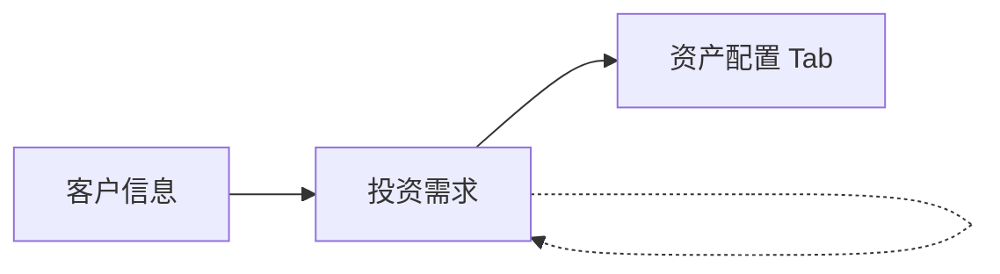
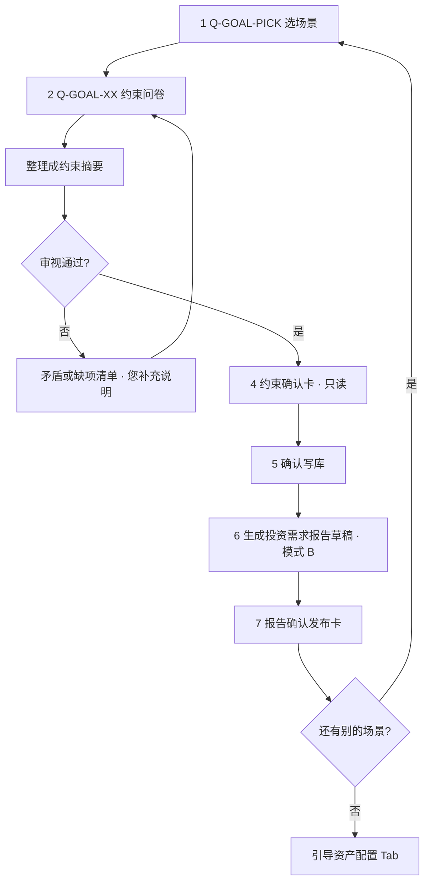
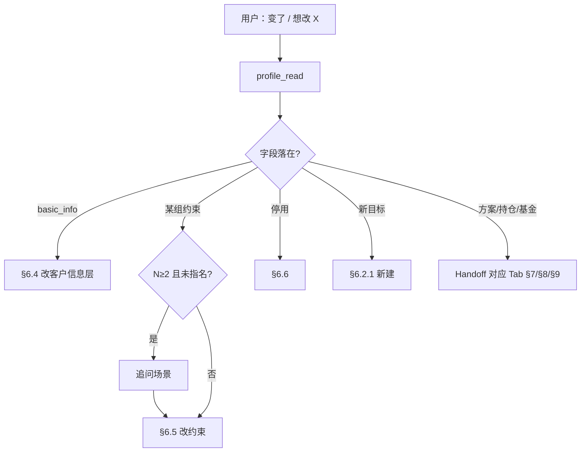
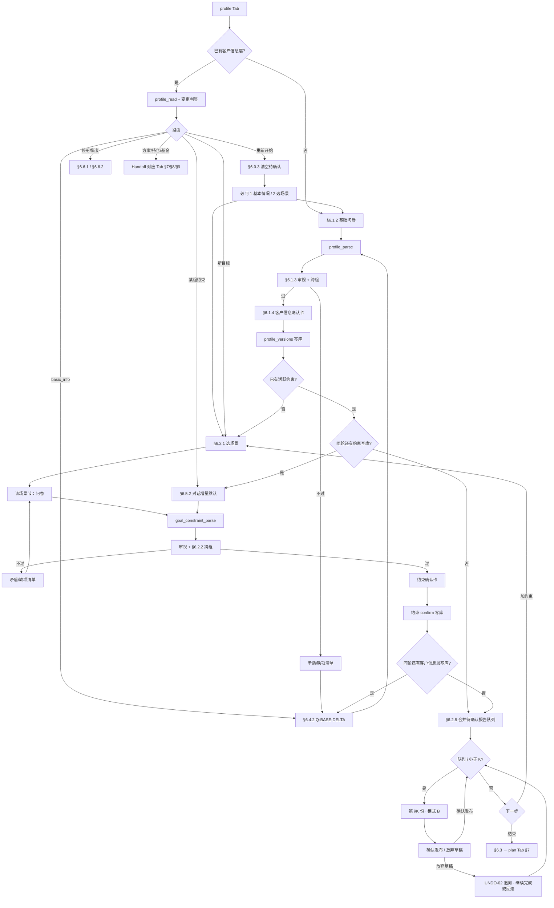

> [← PRD 索引](../PRD.md) · **6. 需求梳理与目标投资约束**

## 6. 需求梳理与目标投资约束

### 模块说明

| 项 | 说明 |
|----|------|
| **做什么** | 采 **客户信息层** 现金流，再按场景建 **目标投资约束**（投资边界，非基金列表）；规划书在 §7 |
| **入口** | Tab **需求梳理** |
| **完成标志** | 每个场景：**约束确认写库** + **《投资需求报告》确认发布**（§6.2.8）；≥1 场景完成后可进 **资产配置** Tab |
| **不做** | 写入聊天记忆；401(k) 专表；代客下单 |
| **依赖** | 确认卡 [shared §5.3.10b](./05-chat-shared.md) · 已发布报告 [§4 我的报告 · 投资需求 Tab](./04-my-reports.md) · 字段 [§6.12](./06-profile.md) |

**对客命名（P0 · 2026-06）**

| 层级 | 对客 | 内部（不改表） |
|------|------|----------------|
| Chat Tab | **需求梳理** | `conversation_type=profile` |
| 并列 Tab | 需求梳理 · **资产配置** · 持仓分析 · 基金解读 | `plan` / `portfolio` / `fund` |
| 空态标题 | **梳理你的投资需求** | EMPTY-UI-01 |
| 报告 | **《投资需求报告》** | `report_type=profile` · `data/reports/profile/` |
| 我的报告 Tab | **投资需求** | 与 Chat Tab 区分 |
| 层 1 · 客户信息 | **客户信息** | `profile_versions`（**客户信息层** · `basic_info`） |
| 层 2 · 投资需求 | **投资需求** / **本组需求** | `investment_goal_constraints` · `goal_constraint_id` |
| 约束（报告正文/确认卡） | **目标** / **针对目标：{场景名}** | 同上 · 不用 ~~约束层~~ 等对客词 |

不用 ~~人层~~、~~客户画像~~、~~产品池~~、~~投资画像~~、~~投资方案~~（旧 Tab 名）。

**中国 MVP**：不采 401(k)/529/信托/精算；公积金 **余额不采**（P-12），在税后收入与月供中体现；社保写在养老约束里。

---

### 6.0 主流程一览

拆 **客户信息层 / 目标投资约束 / 资产配置方案** 三层，是为避免「人生计划」与「投资期限」混在一处产生矛盾（如养老 30 年 vs 资金期限 1–3 年）。

| 顺序 | 做什么（对客） | 文档 |
|------|----------------|------|
| **① 客户信息** | 基本情况问卷 → 审视 → 确认 → 保存 | §6.1 · 阶段条 §6.15 |
| **② 投资需求** | 选场景 → 本组问卷 → 审视 → 确认 → 保存 → 投资需求报告 | §6.2 · 阶段条 §6.15 |
| **③ 资产配置 Tab** | 选一组 **完善** 需求 → §7 出规划书 | §6.3 |
| *分支* | 改客户信息 / 改某一组投资需求 / 续发第 i/K 份报告 | §6.4 · §6.5 · §6.0.2 · §6.15 |

> **对内仍分两层存储**（`profile_versions` · `investment_goal_constraints`）；**对客与阶段条** 统一称 **客户信息**、**投资需求**，**禁止** 在阶段条/placeholder 写「客户信息层」「约束层」。

**口径**：收入一律 **税后**；**不单独问公积金**。**P0 只采必填项**；原选填项本期问卷不出现，后续若需要再升格为必填。



#### 6.0.1 完善的投资需求（N 的定义 · P0）

> **权威定义**：全产品 **`N`**（资产配置 Tab placeholder、§7 准入、Handoff 文案等）**以此为准**；[shared §5.3.4](./05-chat-shared.md) 仅引用本节。

**一组目标算「完善」须同时满足**（该 `goal_constraint_id`）：

| # | 条件 |
|---|------|
| 1 | `is_active=true` |
| 2 | 约束已 **确认写库**（`investment_goal_constraints.confirmed_at` 有效） |
| 3 | 已有 **确认发布** 的《投资需求报告》（`report_index` · `report_type=profile` · 该 `goal_constraint_id` **最新一条**），且 **`profile_version_id` + `goal_constraint_revision_id` 与当前主表/客户信息层一致**（编码见下 · PH-PROFILE-ENC-01） |

**以下情况一律不算完善（该组 N 不计入）**：

| 情况 | 系统行为 |
|------|----------|
| 仅客户信息层确认、该组约束未写库 | 引导 §6.2 |
| 约束已写库，报告 **草稿未确认发布**（含用户点 **放弃草稿**） | **须** 经 §6.2.8 **确认发布** 后才算完善；续接触发见 **§6.0.2** |
| 客户信息层或约束已变更写库，但 **新版报告尚未确认发布** | 同上；旧已发布报告 **保留** 作历史，**不以旧版充当** 当前完善态 |

**编码 · N**：`COUNT` 满足上表三条件的活跃约束组。`is_active=false` **不计入**（§6.6）。

**完善判定 · 可编码公式（PH-PROFILE-ENC-01 · P0）**

对每组 `goal_constraint_id`（`g`），设：

- `P` = 当前 `profile_versions WHERE is_current=true` 的 `id`
- `R*` = 该组主表当前有效修订：`goal_constraint_revisions` 中 `goal_constraint_id=g` **`revision_no` 最大** 的一条（须与主表字段 **一致**）
- `Rep` = `report_index WHERE report_type='profile' AND goal_constraint_id=g ORDER BY generated_at DESC LIMIT 1`

**完善** ⟺ `is_active=true` **且** `Rep` 存在 **且** `Rep.profile_version_id = P` **且** `Rep.goal_constraint_revision_id = R*.id`。

**读侧 API（P0 · 各 Tab 统一）**

| 接口 | 返回 | 用途 |
|------|------|------|
| `GET /api/goal-constraints?eligible_for_downstream=true` | 满足 **完善** 的组列表（含 `goal_constraint_id` · 场景对客名 · `goal_type`） | §7 / §8 选组 · Handoff |
| `profile_read` / `GET /api/placeholder?scene=profile` | `eligible_groups[]`（= N）· `incomplete_groups[]`（= **M** · 含 id + 对客名）· `profile_version_id` · 活跃约束摘要 | placeholder · Planner 路由 |

**禁止**：各 Tab 自行用 `is_active` 或「有任意 profile 报告行」代替上式。

**下游可见性（与 N 一致 · P0 · RPT-PROFILE-04）**

**原则**：后续环节 **只能接触「完善」组**（满足上表三条件）；未完善组 **不出现在任何选组 UI、默认选中、Handoff 目标、API 可选列表** 中——**不是**选中了再拦截，而是 **根本不可选**。

| 环节 | 可选范围 | 说明 |
|------|----------|------|
| **资产配置 Tab · §7** | **仅** N 个完善组 | `N=0` → 占位回需求梳理 Tab；`N=1` 默认该组；`N≥2` 用户 **只在完善组列表** 中指定 |
| **持仓分析 · §8**（对照目标方案 / 再平衡） | **仅** 绑定 **完善** `goal_constraint_id` 且 `allocation_plans.is_current=true`（step=2）的方案 | 未完善组 **不得** 作为对照目标，**即使** 历史上曾存在方案行 |
| **Handoff / 跨 Tab 建议** | 目标场景内 **只引用完善组** | 禁止引导用户对未完善组「先生成方案」 |

用户 **只能** 在 **需求梳理** Tab 内，按 **§6.0.2** 对用户 **指名的一组** 续接 §6.2.8 直至 **确认发布** → 该组 **首次** 进入 N 并可被 §7 / §8 选用。

| 禁止 | 说明 |
|------|------|
| 选组列表混入未完善组 | 数据源 = §6.0.1 三条件 **交集**；`is_active=true` ** alone 不够** |
| 静默用 **旧版** 已发布报告开方案 | 报告未与当前客户信息层/约束一致 → 该组仍 **未完善**（**PL-PROFILE-PLAN-A** · **无**「继续用旧需求做资产配置」双按钮） |
| 对未完善约束只读跑 §7 / 用其旧方案跑 §8 偏离 | 须先在需求梳理 Tab **确认发布** 报告 |

**编码**：下游读组统一 `GET …/goal-constraints?eligible_for_downstream=true`（或等价），过滤逻辑 **等同** PH-PROFILE-ENC-01；**禁止**各 Tab 自行用 `is_active` 代替。

**对客话术（约束已存、报告未发 · 模板）**

```markdown
「{场景名}」这一组的约束已经保存，但 **投资需求报告还没有确认发布**，所以还不能用于生成资产配置。

左侧是报告草稿预览；若有不对的地方，直接在聊天里告诉我怎么改，我会更新后再请您 **确认发布**。
```

#### 6.0.2 未完善组 · 续接 §6.2.8（RPT-PROFILE-05 · P0）

> **必须续接**：未完善组 **只有** 走 §6.2.8 并 **确认发布** 后才能变为完善（§6.0.1）。  
> **怎么续接**：**Tab/placeholder 提示 + 用户发话开跑**；**禁止** 切到需求梳理 Tab 或新建对话时 **silent 自动** `report_draft`（与 [shared §5.6.2](./05-chat-shared.md) 一致）。

**待续接判定（库推导 · 不绑某条对话）**

设 **M** = `is_active=true` **且** 约束已 confirm 写库（`confirmed_at` 有效）**且** **不满足** PH-PROFILE-ENC-01 **完善** 公式的组数（= §6.0.1 条件 3 取反）：

| 来源 | 说明 |
|------|------|
| `profile_read` / `GET /api/placeholder?scene=profile` | 返回 `incomplete_groups[]`（`goal_constraint_id` + 场景对客名） |
| 删对话后 | **M 不变**（约束仍在库）；仅该对话的草稿/pending/`has_unconfirmed` 清除 → 靠 **Tab 级 placeholder** 提示，不靠旧对话橙点 |

**续接流程（一次只处理一组）**

| 步骤 | 行为 |
|------|------|
| 1 | **M≥1** → 需求梳理 Tab placeholder / 空态 **全局提示**（见 [shared §5.3.4](./05-chat-shared.md)）；**不** 自动进入模式 B |
| 2 | 用户 **发话** 指名或选序号（`M=1` 可省略指名）→ Planner `scene_task` → 选定 **一个** `goal_constraint_id` |
| 3 | `report_draft` → Verify → **模式 B** + **报告确认发布卡** |
| 4 | 用户 **确认发布** → 该组变为完善；若 **M 仍≥1**（其他未完善组）→ placeholder 刷新，**下一轮仍须用户指名** |

**M≥2 对客话术（placeholder · 模板）**

```markdown
您还有 {场景名列表} 的投资需求报告尚未确认发布，暂时不能用于资产配置。

请先告诉我要处理哪一个（回复序号或名称，例如「先发养老的」）；我会生成报告草稿，您可以在聊天里修改后再确认发布。
```

**与 RPT-PROFILE-04 / PH-PROFILE-UNDO-02 的关系**

| 场景 | 续接 |
|------|------|
| 同对话内 **放弃报告草稿** · 选 **继续完成投资需求确认** | **`has_unconfirmed=true`** · 用户 **发话**（含「继续发报告」）→ 步骤 3；**不** 切 Tab 自动开跑 · **须** 续接直至 publish 或之后再选 **放弃这些修改** |
| 同对话内 **放弃报告草稿** · 选 **放弃这些修改，恢复上一版** | 写库 **回滚**（§6.2.8）· 若恢复完善 → **M 减 1** · `has_unconfirmed` 视是否仍有其它待发报告 |
| 删对话后 · 新/其他需求梳理对话 | **M≥1** placeholder 提示 → 用户 **发话** 指名 → 步骤 3 |
| 当前对话已在模式 B（未 publish） | placeholder 走 **「本对话 · 模式 B 待发」** 分支（[shared §5.3.4](./05-chat-shared.md)） |

#### 6.0.3 对话内重新开始（PH-PROFILE-RESTART-01 · P0）

> 用户说 **重新开始 / 从头开始** 时，**一律** 走本节——**不区分** 当前是否有报告草稿、是否 **M≥1**、是否 **已全部发布**；**不是** 修改路径（§6.4 / §6.5）；**不是** 删对话。

**触发（Planner · `scene_task`）**

| 用户说法（示例） | 路由 |
|------------------|------|
| 「重新开始」「从头开始」「放弃刚才的，重来」 | **§6.0.3 重新开始** |
| 「我涨工资了」「教育金改成…」 | **修改路径** §6.4 / §6.5 |
| 「先完成某某报告」 | **续接** §6.0.2（**不是** 重新开始） |

**第一步 · 待确认一律置为放弃（与历史草稿/发布态无关）**

| 对象 | 行为 |
|------|------|
| **`propose_artifacts`**（本条对话 · `pending`） | → **`abandoned`** / `superseded_by_restart` |
| **确认卡 / 报告发布卡** | **灰化** |
| **`pending_report_draft` · run 内未 publish 草稿** | **清除** |
| **模式 B** | → **模式 A** |
| **`has_unconfirmed`** | → **`false`** |

> **待确认** = 尚未 confirm 写库 / 尚未 publish 的 propose 与草稿；**不 DELETE** 已 confirm 的客户信息层/约束/已发布「我的报告」。

**第二步 · 必问：从哪一层重新设计（固定二选一）**

清完待办后 **须先问客户**，**禁止** 静默发问卷：

```markdown
好的。这条对话里**还没确认的内容**我都会当作放弃处理；**已经保存进系统**的数据不会删。

您想从哪里重新开始？
1. **基本情况**（收入、资产、家庭等）—— 从客户信息层重新整理
2. **选投资目标场景**（如养老、教育、买房等）—— 从选场景开始重新设计

回复 **1** / **2**，或直接说「基本情况」/「选场景」。
```

**第三步 · 按客户选择走对应主流程（全量 · 非修改问卷）**

| 客户选择 | 进入 | 规格 |
|----------|------|------|
| **1 · 基本情况** | **§6.1** | 发 **§6.1.2 Q-BASE 全量**（`questionnaire.base.zh.md`）→ §6.1.3 审视 → 客户信息确认卡 → 写库 |
| **2 · 选场景** | **§6.2** | 见下表 **前置** → **§6.2.1 Q-GOAL-PICK** → 该场景 **§6.2.3–§6.2.7 问卷全量** → 约束确认卡 → §6.2.8 报告 |

**选场景 · 前置**

| 条件 | 行为 |
|------|------|
| **尚无** `profile_versions.is_current` | 对客：做目标场景前须先有 **客户信息** → **改走 §6.1 Q-BASE 全量**（或客户改选 **1**） |
| **已有** 当前客户信息层 | 直接 **§6.2.1**；选场景后走 **该场景整节问卷**（**不是** §6.5 增量修改） |

**重新开始下仍成立的后台事实（不对客展开 M/N 分支）**

| 事实 | 说明 |
|------|------|
| 旧组 **未完善**（报告未与当前数据一致） | **M** 仍可能存在；Tab placeholder **仍可能** 提示；**续接** 仍走 §6.0.2——但 **重新开始对话内** 不先谈 M |
| 已 publish 报告 | **保留** 在「我的报告」；新 confirm 后按 §6.2.8 / §6.4 产生 **新版** |
| 新客户信息层 confirm | 触发 §6.4 跨组审视、旧组方案 **待重审** 等（§7.5）——数据层规则 **不变** |

**与「放弃报告草稿」按钮**

| | **放弃草稿**（+ UNDO-02 追问） | **重新开始** |
|--|--------------|---------------------|
| 触发 | **仅** 报告卡 · **放弃草稿** | 用户 **发话** |
| 待确认 | 报告环节；追问可选 **回滚写库** | **全部** abandoned |
| 下一步 | 选 **继续完成** → §6.0.2 续接直至 publish；选 **放弃修改** → 回滚上一版已发布对齐 | **必问** 1 基本情况 / 2 选场景 |

**与删对话（[shared §5.8.3](./05-chat-shared.md)）**

| | **重新开始** | **删对话** |
|--|------------------|------------|
| 对话 / 消息 | **保留** | **删除** |
| 已 confirm 业务表 | **保留** | **保留** |

#### 6.0.4 写库前「保持上一版」（PH-PROFILE-UNDO-01 · P0）

> 适用 **`profile_basic`** · **`goal_constraint`** 确认卡第三按钮；**不** 适用报告发布卡（报告侧走 PH-PROFILE-UNDO-02）。

| 场景 | 行为 |
|------|------|
| **首次采集**（库内 **无** 上一版客户信息层 / 该组约束） | **等同**「放弃，暂不保存」：卡 `dismissed` · propose `abandoned` · **不写库** · 无差异展示 |
| **§6.4 / §6.5 修改路径**（库内 **有** 上一版） | 丢弃 **本轮** propose · **不写库** · 主表/修订链 **不变** · 对客：「好的，仍按您之前保存的内容为准。」**不做** 旧值→新值差异卡 |
| **`has_unconfirmed`** | 若 **无** 其它 `pending` 业务卡 **且** 无未 publish 报告草稿 → **`false`**；否则 **`true`** |
| **下一步** | 用户可在聊天 **重新说明** 变更 → 新 propose；或切换话题 |

**禁止**：点「保持上一版」后静默写库；在修改路径弹出第二套 UNDO-02 追问。

---

## 主流程

### 6.1 第一步 · 客户信息层（`basic_info`）

只存客户信息层现金流与身份快照；人生目标与投资边界在层 2。废弃字段：`life_goals`、`investment_constraints`。

> **场景 → 流程 → 功能**：客户信息层为单一场景；**流程**见 §6.0；以下为 **功能**（字段 → 问卷 → 审视 → 确认卡 → 写库）。

#### 6.1.1 字段（写什么）

> 七列详文 → [§6.12 `basic_info`](./06-profile.md#612-字段规格supabase)。**P0 问卷采 11 项**（不含 `city_tier` · 本期不采）。

| 中文含义 | 字段名称 | 必填 | 问卷题号 | 编排分组（不对客） |
|----------|----------|------|----------|------------|
| 身份 | `name` | 是 | #1 | identity |
| 年龄 | `age` | 是 | #1 | identity |
| 家庭现状 | `marital_status` | 是 | #2 | identity |
| 职业 | `occupation` | 是 | #3 | identity |
| 税后年收入 | `annual_income_after_tax` | 是 | #4 | income |
| 月税后到手 | `monthly_income_after_tax` | 是 | #5 | income |
| 可投资金融资产 | `financial_assets` | 是 | #6 | balance |
| 贷款待还总额 | `loan_balance_total` | 是 | #7 | balance |
| 月还贷现金 | `monthly_loan_payment` | 是 | #8 | balance |
| 月固定支出 | `monthly_fixed_expense` | 是 | #9 | surplus |
| 月可投资 | `monthly_investable` | 是 | #10 | surplus（可预填） |

**月可投资公式**（P-12）：

```
monthly_investable = monthly_income_after_tax − monthly_fixed_expense − monthly_loan_payment
```

无贷款：`loan_balance_total=0` 且 `monthly_loan_payment=0`。

#### 6.1.2 问卷（怎么采）

> 问卷 ID：**Q-BASE** · 同步路径：`skills/profile/questionnaire.base.zh.md`。复制整段粘贴；**不出现**字段名与内部编号。

```markdown
你好，我想先整理一下基本情况，请按下面几项回复（金额单位：元）：

1. 怎么称呼你？今年多大？
2. 方便介绍一下家庭情况吗？
   - 婚姻：单身、已婚、离异等，按你的实际情况说就行
   - 孩子：有的话写几个、大概几岁；暂时没有可以写「暂无子女」
   举例：「已婚，一个 8 岁的儿子」或「已婚，一儿一女，8 岁和 5 岁」
3. 你是做什么工作的？收入稳不稳定？（例如：国企上班、工资比较固定 / 自由职业 / 自己做生意等）

4. 税后年收入大约多少？
5. 每月税后到手大约多少？（若含年终奖分摊，可注明）
6. 目前可用于投资的金融资产有多少？（不含自住房、不含公积金账户余额）
7. 各类贷款还剩多少没还？如无贷款请写 0。
8. 每月实际从手里拿出去还贷款多少？（已扣公积金抵扣的部分不用再算；无贷款写 0）
9. 每月固定生活开支大约多少？（不含还贷款）
10. 扣完上面这些，你估计每月还能拿出多少来投资？我会根据前几项帮你核对，数字以最后确认为准。

补充说明：公积金不用单独填；如果房贷已经用公积金抵扣了，第 8 项只写你自己额外掏的现金。
```

解析：`profile_parse` → 各字段 ✅/❌。可对话补全；**禁止**未过审视出卡或写库。

#### 6.1.3 审视（能不能出确认卡）

**Hook1 · 矛盾**（须清零后再出卡）

| # | 矛盾 | 处理 |
|---|------|------|
| 1 | 月收入×12 与年收入偏差 >15% | 核对口径/奖金 |
| 2 | 月可投资 ≠ 收入−固定支出−月供（±500） | 按 §6.1.1 公式核对 |
| 3 | 支出+可投资 > 月收入 | 调数字 |
| 4 | 金融资产为负或明显异常 | 核对是否含房/公积金 |
| 5 | 贷款余额与月供一方为 0 且无说明 | 补月供或确认还清 |
| 6 | 家庭现状与年龄等表述矛盾 | 更新现状 |

**Hook2 · 缺项**：§6.1.1 全部必填项须齐；缺项 **一次列全** 打回问卷。

未通过 → 助手消息 **矛盾清单 / 缺项清单** → 用户调整后重跑 `profile_check_*`。

#### 6.1.4 确认卡（怎么确认 · P-04）

> **`card_kind=profile_basic`** · 对客通则与 Mock → [shared §5.3.10b 对客展示通则](./05-chat-shared.md) · `skills/shared/confirm_card.mock.zh.md` §一。

| 项 | 规格 |
|----|------|
| **展示** | 字段表「中文含义 + 结论」逐行只读；顺序同 §6.1.1 |
| **核对辅助** | 「月可投资」旁可附 **公式拆解**（只读，帮用户对收入/支出/月供） |
| **按钮** | **确认** / **放弃，暂不保存** / **保持上一版**（PH-PROFILE-UNDO-01 · 同「放弃暂不保存」· **不写库** · 对客说明恢复为已保存状态） |
| **修订** | 不对 → 聊天说明或再贴 §6.1.2 问卷 → 新 propose（P-04） |
| **机制** | [shared §5.3.10b](./05-chat-shared.md) |

系统对 #10 月可投资 **预填**公式结果；若用户聊天修正后出新卡，须再过 Hook1#2。

#### 6.1.5 写库与下一步

| 项 | 行为 |
|----|------|
| **写库** | 新行 `profile_versions` · `is_current=true`；旧版 `is_current=false` |
| **对客** | 助手摘要「客户信息已确认」；侧栏 **`has_unconfirmed=false`**（**仅** 尚未进入 §6.2 约束确认 / §6.2.8 报告链；进入后随 pending 卡或模式 B 再变 **`true`**） |
| **下一步** | 引导 **选投资目标场景** → §6.2（若已有约束，可 **跳过客户信息** 直接加约束） |

---

### 6.2 第二步 · 目标投资约束（层 2）

一人可有 **多组** 约束（养老 + 教育等 **不同类型** 各一组），每组对应 **一个理财场景**，**不是**基金列表。  
**本期**：每种场景类型（`goal_type`）**最多 1 个** `is_active=true` 组（PH-PROFILE-GT-01 · MVP）。
**每组走完一整条链路**（§6.2.0）后，再问是否添加下一个场景。

**本节怎么读**

| 节 | 写什么 |
|----|--------|
| §6.2.0 | 约束层 **整体流程**（对客步骤 · 写库 · 报告 · 下一组） |
| §6.2.1 | **选场景**（Q-GOAL-PICK） |
| §6.2.2 | 五场景 **共用通则**（写库映射 · 审视 · 确认卡） |
| §6.2.3–§6.2.7 | **选完场景后** 各目标一节；节内按 **场景 → 流程 → 功能** 拆分 |
| §6.2.8–§6.2.9 | 写库 · 投资需求报告 · 下一组 |

> **场景 → 流程 → 功能** 只用于 §6.2.3–§6.2.7 各目标节，**不是**整章 §6.2 的三级标题。


#### 6.2.0 流程概览（对客）

| 步骤 | 系统在做什么 | 您要做什么 |
|------|--------------|------------|
| **1 · 选场景** | 发 **Q-GOAL-PICK**（§6.2.1） | 从列表选一项（如「买房」「教育金」） |
| **2 · 问卷** | 发该场景 **Q-GOAL-XX**（§6.2.3–§6.2.7） | 按问卷回复；不懂就问 |
| **3 · 整理与核对** | 把您的回答整理成结构化摘要，检查有没有矛盾 | 看 **确认卡**（只读）；不对就在聊天里说明 |
| **4 · 确认写库** | 您点确认后，这一组 **投资约束** 正式保存 | 点 **确认** 或 **放弃** |
| **5 · 投资需求报告** | 自动生成该场景的 **《投资需求报告》** 草稿，左侧预览 | 看报告 → 点 **确认发布** 保存到「我的报告」 |
| **6 · 下一组？** | 询问是否还有其他场景 | 继续添加，或去 **资产配置** Tab（**须本组已确认发布** · §6.0.1 **完善**） |

**您需要知道的三件事**（助手在 §6.2.1 选场景后 **必须口述或展示**）：

1. **一组场景 = 一笔「有名字的钱」**  
   例如「退休养老」「孩子教育金」，后面出方案、看持仓都会问：「针对哪一组？」

2. **每个场景，须「约束确认写库 + 投资需求报告确认发布」才算完善**  
   您如果更新了某组约束并再次确认，系统会保存 **新约束** 并请您 **确认发布** 新版《投资需求报告》；旧报告仍留在「我的报告」供回顾。在 **新版报告发布且与当前客户信息/约束一致之前**，该组 **不能** 用于资产配置（§6.0.1 · PH-PROFILE-ENC-01 · RPT-PROFILE-01）。

3. **问卷只是采集方式，随时可聊**  
   您可以复制问卷一次答完，也可以逐条聊；对某道题不理解，**直接问**「第 3 题什么意思？」——我会解释后再继续，不必脱离对话去查资料。




#### 6.2.1 选场景（Q-GOAL-PICK）

> 选场景本身也是 **问卷采集**（**Q-GOAL-PICK**）：用户从固定列表选一项 → 映射 `goal_type` → 再发该场景约束问卷。  
> Skill：`skills/profile/questionnaire.goal.pick.zh.md`

**内部 · 列表展示顺序（P0 · 不对客口述）**

> 界面与助手 **枚举顺序** 固定如下（典型人生时间线：成家 → 置业 → 育子 → 养老；闲钱无固定节点放末位）。  
> 用户 **可任选**，**不按年龄隐藏**；**禁止**在对客话术中解释排序理由（不说「人生阶段」「人生里程」「按年龄」等）。

| 顺序 | `goal_type` | 对客名称 | 副说明（可选展示 · 一行以内） |
|------|-------------|----------|------------------------------|
| 1 | `marriage_child` | 结婚 / 生育准备金 | 婚礼、生育、育儿前期等 |
| 2 | `housing` | 买房相关资金 | 为买房单独准备（不含现有房贷） |
| 3 | `education` | 子女教育 | 升学、留学等 |
| 4 | `retirement` | 退休养老 | 退休后的生活 |
| 5 | `wealth_growth` | 财富增值 | 暂无明确用途、希望保值增值 |

**对客话术（模板 · 首次选场景）**

```markdown
您这次想先为哪个目标做规划？请从下面选一项，也可以直接说名称：

1. 结婚 / 生育准备金
2. 买房相关资金
3. 子女教育
4. 退休养老
5. 财富增值

回复序号或名称即可，例如「2」或「买房」。
```

**对客话术（模板 · 已有其他组 · 继续添加）**

```markdown
还有别的目标要单独做一组吗？同样可以从下面选：

1. 结婚 / 生育准备金
2. 买房相关资金
3. 子女教育
4. 退休养老
5. 财富增值

回复序号或名称即可。
```

**每种场景最多一组（PH-PROFILE-GT-01 · MVP · P0）**

| 项 | 规格 |
|----|------|
| **规则** | 每个 `goal_type` 同时 **最多 1 个** `is_active=true` 约束行 |
| **选场景时** | `profile_read` 后若该类型 **已有活跃组** → **禁止** 再发该场景问卷；引导 **§6.5 修改** 或 **§6.6 停用后重建** |
| **继续添加** | Q-GOAL-PICK **只展示尚无活跃组的类型**（对客列表可省略已做项） |
| **P2** | 「同类型多组」（如二孩各一组教育金）**本期不做** |

**对客 · 该类型已有活跃组（模板）**

```markdown
您已经有「{场景对客名}」这一组了。本期每种目标只做一组——要调整内容请直接说想改什么（我会按这一组帮您改）；若确实不要这组了，可以说停用后再重新做。
```

**重新做某场景（PH-PROFILE-ROUTE-01 · P0 · 已确认）**

> 触发：该 `goal_type` **无** `is_active=true` 组，但 **存在** 同类型 **`is_active=false`** 停用行（含 UNDO-03 **取消本次新建** · §6.6 停用）。用户说「重新做教育金」「再做买房」等。

| 步骤 | 行为 |
|------|------|
| 1 | **禁止** 静默走 §6.2.1 或 §6.6.2 |
| 2 | **必问一句**（固定澄清） |
| 3 | 按用户选择路由 |

**对客话术（模板 · 澄清）**

```markdown
您之前做过「{场景对客名}」这一组，目前是 **停用** 状态。

您想：
1. **恢复** 之前那一组（沿用当时保存的内容，再确认发布投资需求报告）
2. **重新填一份**（当全新目标，走完整问卷）

回复 **1 / 2**，或直接说「恢复」/「重新填」。
```

| 用户选择 | 路由 |
|----------|------|
| **恢复** / **1** | **§6.6.2** · **同一** `goal_constraint_id` · 跨组审视 → §6.2.8 **须用户确认发布** |
| **重新填** / **2** | **§6.2.1** → 该场景 **§6.2.3–§6.2.7 全量问卷** · **新** `goal_constraint_id`（旧停用行 **保留**） |

**禁止**：未澄清时默认新建或默认恢复。

- 不说「我按人生阶段帮您列好了」「不必按顺序做」等 **暴露内部排序逻辑** 的表述
- 列表 **只呈现选项**，不解释为什么是这个顺序

**前置**：客户信息已确认（§6.1.5）。若尚未做，先引导 §6.1。

> 用户选定场景后：先口述 §6.2.0「三件事」（若尚未说过），再发该场景约束问卷。开场话术见 Skill `questionnaire.goal.pick.zh.md`。

#### 6.2.2 通则（五场景共用）

> **字段表定位**：各场景 **「字段（写库结构）」** 表 = 该套问卷答完、审视通过后 **实际落库** 的列清单（`investment_goal_constraints` 一行 + 内嵌 jsonb）。问卷是采集手段；**字段表是表结构真相**。

**目标约束问卷（选场景 → 打开对应 §6.2.3–§6.2.7 整节）**

| `goal_type` | 问卷 ID | PRD 节 | Skill 路径 |
|-------------|---------|--------|------------|
| `marriage_child` | Q-GOAL-MC | §6.2.3 | `skills/plan/questionnaire.goal.marriage_child.zh.md` |
| `housing` | Q-GOAL-HO | §6.2.4 | `skills/plan/questionnaire.goal.housing.zh.md` |
| `education` | Q-GOAL-ED | §6.2.5 | `skills/plan/questionnaire.goal.education.zh.md` |
| `retirement` | Q-GOAL-RT | §6.2.6 | `skills/plan/questionnaire.goal.retirement.zh.md` |
| `wealth_growth` | Q-GOAL-WG | §6.2.7 | `skills/plan/questionnaire.goal.wealth_growth.zh.md` |

**写库映射（一行约束）**

| 存储位置 | 内容 |
|----------|------|
| 行字段 `profile_version_id` | 写库时 **`profile_versions.is_current` 的 id**（§6.1 / §6.4 确认后当前客户信息层） |
| 行字段 `goal_type` | 场景枚举 |
| 行字段 `principal_amount` · `monthly_amount` | 本组金额 |
| `goal_detail` jsonb | 该场景字段表中「存储位置 = goal_detail」的键 |
| `investment_constraints` jsonb | 字段表中「存储位置 = investment_constraints」的键 |

**写库方式（PH-PROFILE-GV-02 · G2）**：**§6.2 首次** → `INSERT` 主表 + **INSERT** 首条修订快照；**§6.5 修改** → **先快照、再 `UPDATE` 主表**同行 + 刷新 `confirmed_at`（**`goal_constraint_id` 不变** · 见 §6.5.5）。

**Hook1 · 通用单组矛盾**（五场景均适用 · 与各节 Hook1 合并检查）

| # | 矛盾 | 处理 |
|---|------|------|
| 2 | 保守 + 期望收益 ≥8% | 调收益或回撤 |
| 3 | 回撤 ≤-5% + 进取 | 收紧偏好或放宽回撤 |
| 4 | 期限 &lt;1 年 + 期望 ≥8% | 调预期 |
| 7 | 流动性 vs 投入方式矛盾 | 对齐 `deploy_mode` |

**Hook · 跨组（+ 客户信息层）**（本组 **出确认卡前** 必过 · 系统校验）

| # | 规则 | 处理 |
|---|------|------|
| 1 | Σ 活跃组月投入 + **本组待确认**月投入 > 客户信息层月可投资（容差 0） | 调各组或停用 |
| 2 | Σ 活跃组已有金额 + **本组待确认**已有金额 > 客户信息层金融资产（容差 0） | 调本金或核对 |
| 3 | 同年多笔大额 + 月结余低 | 谈优先级 |
| 4 | （**本期无** · PH-PROFILE-GT-01）同类型多组 | — · **库层禁止** 第二组活跃同类型 |

**跨组校验 · 对客口径**

| 项 | 规格 |
|----|------|
| **是什么** | 静默核对：各组「已有金额 / 月投入」加总是否 ≤ 客户信息层 `financial_assets` / `monthly_investable`（§6.1） |
| **何时跑** | `goal_constraint_parse` **之后**、出确认卡 **之前**（与各场景节「跨组审视」一致）· **不是**发问卷前的固定话术 |
| **通过** | **客户无感**——不主动解释规则、不口头提醒加总上限；直接进入下一审视项或出确认卡 |
| **未通过** | 对客 **白话矛盾清单**（哪几组加起来超了、大约差多少、建议调哪组或回 §6.1 / §6.5）；**禁止**出确认卡或写库 |
| **禁止** | 校验已通过仍「顺口提醒」加总规则；发问卷前无依据地预警（本组金额尚未采集时无从校验） |


**约束确认卡（五场景共用 · P-04）**

> **`card_kind=goal_constraint`** · 对客通则与 Mock → [shared §5.3.10b](./05-chat-shared.md) · `skills/shared/confirm_card.mock.zh.md` §二。  
> 字段标签与顺序 = **该场景字段表「中文含义」列**（§6.2.3–§6.2.7）；**不**为五场景各写一份卡内正文。

| 项 | 规格 |
|----|------|
| **标题** | 「请确认：{场景对客名}」 |
| **展示** | 已采字段：**中文含义：结论** · 只读 · 顺序同问卷/字段表 |
| **按钮** | **确认这一组** / **放弃，暂不保存** / **保持上一版**（PH-PROFILE-UNDO-01 · **不写库**） |
| **修订** | 不对 → 聊天说明或再贴该场景问卷 → 新 propose（P-04） |

**实现 · 编排分组（不对客）**

字段表「编排分组（不对客）」列（`goal` / `constraint` / `amount`）仅用于前端 **行间距 / 折叠**；**不得**作为卡片分区标题。

**填问卷 · 随时可问**

| 情况 | 助手怎么做 |
|------|------------|
| 用户问「第 X 题什么意思？」 | 先解释题意和举例 |
| 用户问「保守和稳健差在哪？」 | 白话对比；说明影响后面方案 |
| 用户只答一部分 | 按 **当前场景字段表** 列还缺哪几题 |
| 用户想换场景 | 确认放弃未确认结果 → §6.2.1 |

**禁止**：对客出现内部字段名；未过审视出卡或写库。

---

#### 6.2.3 `marriage_child` · 结婚 / 生育准备金（Q-GOAL-MC）

> Skill：`skills/plan/questionnaire.goal.marriage_child.zh.md`

##### 场景

- **对客名**：结婚 / 生育准备金
- **这一组是什么**：婚礼、生育、育儿前期等 **专款**；与日常开销分开的一笔「有名字的钱」。

##### 流程

§6.2.1 选定 → **本节问卷** → parse → 审视（本节 Hook + §6.2.2 通则）→ **确认卡** → §6.2.8 写库 · 投资需求报告

##### 功能 · 字段（写库结构）

**本节字段表 = 问卷 parse 通过后写入 `investment_goal_constraints` 一行的真实结构**（非仅采集清单）。七列详文 → [§6.12](./06-profile.md#612-字段规格supabase)。

| 中文含义 | 字段名称 | 存储位置 | 必填 | 问卷题号 | 编排分组（不对客） |
|----------|----------|----------|------|----------|------------|
| 用钱时间线 | `timeline` | `goal_detail` | 是 | #1 | goal |
| 费用粗算 | `estimated_cost` | `goal_detail` | 是 | #2 | goal |
| 投资期限 | `investment_horizon` | `investment_constraints` | 是 | #3 | constraint |
| 风险偏好 | `risk_tolerance` | `investment_constraints` | 是 | #4 | constraint |
| 最大回撤 | `max_drawdown` | `investment_constraints` | 是 | #5 | constraint |
| 期望年化 | `expected_return` | `investment_constraints` | 是 | #6 | constraint |
| 流动性需求 | `liquidity_need` | `investment_constraints` | 是 | #7 | constraint |
| 投入方式 | `deploy_mode` | `investment_constraints` | 是 | #8 | constraint |
| 投资范围 | `investment_scope` | `investment_constraints` | 是 | — | constraint（固定默认） |
| 本组已有金额 | `principal_amount` | 行字段 | 是 | #9 | amount |
| 本组月投入 | `monthly_amount` | 行字段 | 是 | #10 | amount |


##### 功能 · 问卷（怎么采）

> 题号与 **本节字段表** 一一对应；对客 **不出现**字段名、`goal_type`、问卷 ID。

```markdown
【结婚 / 生育准备金】

1. 大概时间线？（例如：2 年内结婚 / 3 年内要孩子；若两项都有，可以分开写）
2. 费用粗算：婚礼、生育、育儿前期等，总共大概准备多少？（区间也可以，例如 15–25 万；还没算过可写「不确定」）
3. 打算放多久：不到 1 年 / 1–3 年 / 3–5 年 / 5 年以上
4. 风险程度：保守 / 稳健 / 平衡 / 进取
5. 最多能接受账面回撤大概多少？（例如 -10%、-20%；不确定可写「不太清楚，偏稳一点」）
6. 期望年化收益大概多少？（没有硬性要求也可以直说）
7. 什么时候可能需要动用这笔钱？
8. 一次性投入还是分批？分批的话希望多久投完？
9. 这一组里，现在已经有多少钱专门留给婚育？（元；没有就写 0）
10. 以后每月打算再往这一组里投多少？（元；暂不追加就写 0）

说明：专用于婚育的那笔钱，和日常开销分开想。投资范围为中国公募基金；具体买哪只基金在后面的「资产配置」里再定。
```

解析：`goal_constraint_parse` → 按本节字段表填 `goal_detail` / `investment_constraints` / 行字段。

##### 功能 · 审视（能不能出确认卡）

**Hook2 · 缺项**：**本节字段表** 全部必填项须齐（含条件必填）；缺项 **一次列全**。

**Hook1 · 单组矛盾**（须清零 · **本节特有** + §6.2.2 Hook1 通用）

| # | 矛盾 | 处理 |
|---|------|------|
| 9 | 婚育时间线 vs 客户信息层家庭现状 | 更新客户信息层 §6.4 或调整计划 |

**跨组审视**：§6.2.2 跨组校验（**通过则无对客提示**）。


未通过 → 对客矛盾/缺项清单（白话 · 带题号）→ 用户补充 → 重新 parse **本节问卷**。

##### 功能 · 确认卡

> 展示规格同 §6.2.2 **约束确认卡**（通则见 [shared §5.3.10b](./05-chat-shared.md)）；字段与顺序按 **本节字段表**。

---

#### 6.2.4 `housing` · 买房相关资金（Q-GOAL-HO）

> Skill：`skills/plan/questionnaire.goal.housing.zh.md`

##### 场景

- **对客名**：买房相关资金
- **这一组是什么**：为 **将来买房** 单独准备的目标资金（不含已在客户信息层登记过的现有房贷）。

##### 流程

§6.2.1 选定 → **本节问卷** → parse → 审视（本节 Hook + §6.2.2 通则）→ **确认卡** → §6.2.8 写库 · 投资需求报告

##### 功能 · 字段（写库结构）

**本节字段表 = 问卷 parse 通过后写入 `investment_goal_constraints` 一行的真实结构**（非仅采集清单）。七列详文 → [§6.12](./06-profile.md#612-字段规格supabase)。

| 中文含义 | 字段名称 | 存储位置 | 必填 | 问卷题号 | 编排分组（不对客） |
|----------|----------|----------|------|----------|------------|
| 有没有买房计划 | `has_purchase_plan` | `goal_detail` | 是 | #1 | goal |
| 目标城市 | `target_city` | `goal_detail` | 条件 | #2 | goal |
| 几年内买房 | `purchase_timeline` | `goal_detail` | 条件 | #2 | goal |
| 总价或首付预期 | `target_amount` | `goal_detail` | 条件 | #3 | goal |
| 投资期限 | `investment_horizon` | `investment_constraints` | 是 | #5 | constraint |
| 风险偏好 | `risk_tolerance` | `investment_constraints` | 是 | #6 | constraint |
| 最大回撤 | `max_drawdown` | `investment_constraints` | 是 | #7 | constraint |
| 期望年化 | `expected_return` | `investment_constraints` | 是 | #8 | constraint |
| 流动性需求 | `liquidity_need` | `investment_constraints` | 是 | #9 | constraint |
| 投入方式 | `deploy_mode` | `investment_constraints` | 是 | #10 | constraint |
| 投资范围 | `investment_scope` | `investment_constraints` | 是 | — | constraint（固定） |
| 本组已有金额 | `principal_amount` | 行字段 | 是 | #11 | amount |
| 本组月投入 | `monthly_amount` | 行字段 | 是 | #12 | amount |

> #2 一题写入 `target_city` + `purchase_timeline`；#3 在「有买房计划」时必填。

##### 功能 · 问卷（怎么采）

> 题号与 **本节字段表** 一一对应；对客 **不出现**字段名、`goal_type`、问卷 ID。

```markdown
【买房相关资金】

1. 您有买房计划吗：有 / 暂时没有 / 还不确定？
2. 如有计划，大概几年内？目标在哪个城市？（暂无计划可写「暂无」）
3. 心里总价或首付大概多少？（区间也可以，例如首付 80–100 万）
4. 说明：这里问的是**为买房单独准备的目标资金**，不是您名下**现有**房贷（已在基础信息里填过）。
5. 打算放多久：不到 1 年 / 1–3 年 / 3–5 年 / 5 年以上
6. 风险程度：保守 / 稳健 / 平衡 / 进取
7. 最多能接受账面回撤大概多少？
8. 期望年化收益大概多少？
9. 什么时候可能需要动用这笔钱？（例如：交首付前原则上不动）
10. 一次性投入还是分批？分批的话希望多久投完？
11. 这一组里，现在已经有多少钱专门留给买房？（元；没有就写 0）
12. 以后每月打算再往买房这一组里投多少？（元；暂不追加就写 0）

说明：投资范围为中国公募基金；具体买哪只基金在后面的「资产配置」里再定。
```

解析：`goal_constraint_parse` → 按本节字段表填 `goal_detail` / `investment_constraints` / 行字段。

##### 功能 · 审视（能不能出确认卡）

**Hook2 · 缺项**：**本节字段表** 全部必填项须齐（含条件必填）；缺项 **一次列全**。

**Hook1 · 单组矛盾**（须清零 · **本节特有** + §6.2.2 Hook1 通用）

| # | 矛盾 | 处理 |
|---|------|------|
| 5 | 3 年内要用 + 长锁高权益 | 调流动性或降权益 |
| 8 | 短期再买 + 客户信息层房贷已高 | 分清首套/改善/投资 |

**跨组审视**：§6.2.2 跨组校验（**通过则无对客提示**）。


未通过 → 对客矛盾/缺项清单（白话 · 带题号）→ 用户补充 → 重新 parse **本节问卷**。

##### 功能 · 确认卡

> 展示规格同 §6.2.2 **约束确认卡**（通则见 [shared §5.3.10b](./05-chat-shared.md)）；字段与顺序按 **本节字段表**。

---

#### 6.2.5 `education` · 子女教育（Q-GOAL-ED）

> Skill：`skills/plan/questionnaire.goal.education.zh.md`

##### 场景

- **对客名**：子女教育
- **这一组是什么**：子女升学、留学等 **教育用途** 的 **家庭专款**（**本期一组** 覆盖家里所有子女教育安排 · PH-PROFILE-GT-01）。

**二孩 / 多孩（MVP · 一组内合并 · 不对客拆成两个约束）**

| 层 | 做法 |
|----|------|
| **需求梳理 · 本组** | **一组** `education`；在 `beneficiary`、流动性等字段写清「大宝/二宝」或「两个孩子」 |
| **`target_year`** | 取 **最晚** 要用钱那一年（取晚不取早） |
| **`estimated_cost`** | **两孩合计** 或区间 |
| **资产配置 Tab** | 大类配置、投入节奏按 **这一组边界** 算；**不** 在需求梳理层拆两个独立约束 |
| **报告 §3** | 如实写用户确认过的 **合并表述**；**禁止** 假装有两个独立子账户 |
| **对客边界（一句）** | 本期每种场景只做一组；二孩差异 **在这一组里描述**；以后若要「一人一组教育金」再开版本 |

##### 流程

§6.2.1 选定 → **本节问卷** → parse → 审视（本节 Hook + §6.2.2 通则）→ **确认卡** → §6.2.8 写库 · 投资需求报告

##### 功能 · 字段（写库结构）

**本节字段表 = 问卷 parse 通过后写入 `investment_goal_constraints` 一行的真实结构**（非仅采集清单）。七列详文 → [§6.12](./06-profile.md#612-字段规格supabase)。

| 中文含义 | 字段名称 | 存储位置 | 必填 | 问卷题号 | 编排分组（不对客） |
|----------|----------|----------|------|----------|------------|
| 为谁准备 | `beneficiary` | `goal_detail` | 是 | #1 | goal |
| 升学路径 | `education_path` | `goal_detail` | 是 | #2 | goal |
| 哪一年要用 | `target_year` | `goal_detail` | 是 | #3 | goal |
| 总共准备多少 | `estimated_cost` | `goal_detail` | 是 | #4 | goal |
| 投资期限 | `investment_horizon` | `investment_constraints` | 是 | #5 | constraint |
| 风险偏好 | `risk_tolerance` | `investment_constraints` | 是 | #6 | constraint |
| 最大回撤 | `max_drawdown` | `investment_constraints` | 是 | #7 | constraint |
| 期望年化 | `expected_return` | `investment_constraints` | 是 | #8 | constraint |
| 流动性需求 | `liquidity_need` | `investment_constraints` | 是 | #9 | constraint |
| 投入方式 | `deploy_mode` | `investment_constraints` | 是 | #10 | constraint |
| 投资范围 | `investment_scope` | `investment_constraints` | 是 | — | constraint（固定） |
| 本组已有金额 | `principal_amount` | 行字段 | 是 | #11 | amount |
| 本组月投入 | `monthly_amount` | 行字段 | 是 | #12 | amount |


##### 功能 · 问卷（怎么采）

> 题号与 **本节字段表** 一一对应；对客 **不出现**字段名、`goal_type`、问卷 ID。

```markdown
【子女教育】

说明：本期家里所有子女教育安排做 **一组**。若有 **两个孩子**，请在一组里写清楚——**用钱年份取最晚那一年**，**总额写两孩合计或区间**，在为谁准备、流动性里注明「大宝/二宝」或「两个孩子」。

1. 是为现有孩子准备，还是为将来生育准备？（有孩子可顺便写大概几岁；二孩请都写上）
2. 您倾向的升学路径：国内公立 / 国内私立 / 海外 / 还没想好？
3. 大概 **最晚** 哪一年要用到这笔钱？（例如 2032 年上大学；二孩取 **更晚** 那一年；还不确定可写年份区间）
4. 粗算 **总共** 需要准备多少？（允许区间，例如 30–50 万；二孩可写 **合计**；不确定可写「还没算过」）
5. 打算放多久：不到 1 年 / 1–3 年 / 3–5 年 / 5 年以上
6. 风险程度：保守 / 稳健 / 平衡 / 进取
7. 最多能接受账面回撤大概多少？
8. 期望年化收益大概多少？
9. 什么时候可能需要动用这笔钱？
10. 一次性投入还是分批？分批的话希望多久投完？
11. 这一组里，现在已经有多少钱专门留给教育？（元；没有就写 0）
12. 以后每月打算再往教育这一组里投多少？（元；暂不追加就写 0）

说明：投资范围为中国公募基金；具体买哪只基金在后面的「资产配置」里再定。
```

解析：`goal_constraint_parse` → 按本节字段表填 `goal_detail` / `investment_constraints` / 行字段。

##### 功能 · 审视（能不能出确认卡）

**Hook2 · 缺项**：**本节字段表** 全部必填项须齐（含条件必填）；缺项 **一次列全**。

**Hook1 · 单组矛盾**（须清零 · **本节特有** + §6.2.2 Hook1 通用）

| # | 矛盾 | 处理 |
|---|------|------|
| 6 | 用钱年份近 + 期限 5 年+ 且无说明 | 对齐时间与期限 |

**跨组审视**：§6.2.2 跨组校验（**通过则无对客提示**）。


未通过 → 对客矛盾/缺项清单（白话 · 带题号）→ 用户补充 → 重新 parse **本节问卷**。

##### 功能 · 确认卡

> 展示规格同 §6.2.2 **约束确认卡**（通则见 [shared §5.3.10b](./05-chat-shared.md)）；字段与顺序按 **本节字段表**。

---

#### 6.2.6 `retirement` · 退休养老（Q-GOAL-RT）

> Skill：`skills/plan/questionnaire.goal.retirement.zh.md`

##### 场景

- **对客名**：退休养老
- **这一组是什么**：退休前后生活开支的 **长期储备** 专款。

##### 流程

§6.2.1 选定 → **本节问卷** → parse → 审视（本节 Hook + §6.2.2 通则）→ **确认卡** → §6.2.8 写库 · 投资需求报告

##### 功能 · 字段（写库结构）

**本节字段表 = 问卷 parse 通过后写入 `investment_goal_constraints` 一行的真实结构**（非仅采集清单）。七列详文 → [§6.12](./06-profile.md#612-字段规格supabase)。

| 中文含义 | 字段名称 | 存储位置 | 必填 | 问卷题号 | 编排分组（不对客） |
|----------|----------|----------|------|----------|------------|
| 计划退休年龄 | `retirement_age` | `goal_detail` | 是 | #1 | goal |
| 退休后月生活支出 | `monthly_living_cost` | `goal_detail` | 是 | #2 | goal |
| 社保缴纳情况 | `social_security_status` | `goal_detail` | 是 | #3 | goal |
| 商业保险 | `commercial_insurance` | `goal_detail` | 是 | #4 | goal |
| 投资期限 | `investment_horizon` | `investment_constraints` | 是 | #5 | constraint |
| 风险偏好 | `risk_tolerance` | `investment_constraints` | 是 | #6 | constraint |
| 最大回撤 | `max_drawdown` | `investment_constraints` | 是 | #7 | constraint |
| 期望年化 | `expected_return` | `investment_constraints` | 是 | #8 | constraint |
| 流动性需求 | `liquidity_need` | `investment_constraints` | 是 | #9 | constraint |
| 投入方式 | `deploy_mode` | `investment_constraints` | 是 | #10 | constraint |
| 投资范围 | `investment_scope` | `investment_constraints` | 是 | — | constraint（固定） |
| 本组已有金额 | `principal_amount` | 行字段 | 是 | #11 | amount |
| 本组月投入 | `monthly_amount` | 行字段 | 是 | #12 | amount |


##### 功能 · 问卷（怎么采）

> 题号与 **本节字段表** 一一对应；对客 **不出现**字段名、`goal_type`、问卷 ID。

```markdown
【退休养老】

1. 您打算大概几岁退休？
2. 退休后，希望每月生活水平大概多少？（日常吃穿用度即可，不用算旅游、看病等大项）
3. 社保目前怎么缴：按足额 / 按最低 / 还没缴 / 不太清楚？
4. 已有商业保险吗？（如百万医疗、重疾险、意外险；没有就写「暂无」）
5. 打算放多久：不到 1 年 / 1–3 年 / 3–5 年 / 5 年以上
6. 风险程度：保守 / 稳健 / 平衡 / 进取
7. 最多能接受账面回撤大概多少？
8. 期望年化收益大概多少？（没有硬性要求也可以直说）
9. 什么时候可能需要动用这笔钱？（例如：退休前原则上不动）
10. 一次性投入还是分批？分批的话希望多久投完？
11. 这一组里，现在已经有多少钱专门留给养老？（元；没有就写 0）
12. 以后每月打算再往养老这一组里投多少？（元；暂不追加就写 0）

说明：专用于养老的那笔钱，和日常家用分开想。投资范围为中国公募基金；具体买哪只基金在后面的「资产配置」里再定。
```

解析：`goal_constraint_parse` → 按本节字段表填 `goal_detail` / `investment_constraints` / 行字段。

##### 功能 · 审视（能不能出确认卡）

**Hook2 · 缺项**：**本节字段表** 全部必填项须齐（含条件必填）；缺项 **一次列全**。

**Hook1 · 单组矛盾**（须清零 · **本节特有** + §6.2.2 Hook1 通用）

| # | 矛盾 | 处理 |
|---|------|------|
| 1 | 养老场景 + 期限 &lt;3 年 | 调期限或拆组 |
| 10 | ≥55 岁 + 短期限 + 60 岁退休 | 核对是否同一笔资金 |

**跨组审视**：§6.2.2 跨组校验（**通过则无对客提示**）。


未通过 → 对客矛盾/缺项清单（白话 · 带题号）→ 用户补充 → 重新 parse **本节问卷**。

##### 功能 · 确认卡

> 展示规格同 §6.2.2 **约束确认卡**（通则见 [shared §5.3.10b](./05-chat-shared.md)）；字段与顺序按 **本节字段表**。

---

#### 6.2.7 `wealth_growth` · 财富增值（Q-GOAL-WG）

> Skill：`skills/plan/questionnaire.goal.wealth_growth.zh.md`

##### 场景

- **对客名**：财富增值
- **这一组是什么**：暂无明确用途、希望 **保值增值** 的闲钱。

##### 流程

§6.2.1 选定 → **本节问卷** → parse → **用途识别 · 场景建议（非阻断）** → 审视（本节 Hook + §6.2.2 通则）→ **确认卡** → §6.2.8 写库 · 投资需求报告

##### 功能 · 字段（写库结构）

**本节字段表 = 问卷 parse 通过后写入 `investment_goal_constraints` 一行的真实结构**（非仅采集清单）。七列详文 → [§6.12](./06-profile.md#612-字段规格supabase)。

| 中文含义 | 字段名称 | 存储位置 | 必填 | 问卷题号 | 编排分组（不对客） |
|----------|----------|----------|------|----------|------------|
| 资金来源 | `fund_source` | `goal_detail` | 是 | #1 | goal |
| 大致用途 | `intended_use` | `goal_detail` | 是 | #2 | goal |
| 投资期限 | `investment_horizon` | `investment_constraints` | 是 | #3 | constraint |
| 风险偏好 | `risk_tolerance` | `investment_constraints` | 是 | #4 | constraint |
| 最大回撤 | `max_drawdown` | `investment_constraints` | 是 | #5 | constraint |
| 期望年化 | `expected_return` | `investment_constraints` | 是 | #6 | constraint |
| 流动性需求 | `liquidity_need` | `investment_constraints` | 是 | #7 | constraint |
| 投入方式 | `deploy_mode` | `investment_constraints` | 是 | #8 | constraint |
| 投资范围 | `investment_scope` | `investment_constraints` | 是 | — | constraint（固定） |
| 本组已有金额 | `principal_amount` | 行字段 | 是 | #9 | amount |
| 本组月投入 | `monthly_amount` | 行字段 | 是 | #10 | amount |


##### 功能 · 问卷（怎么采）

> 题号与 **本节字段表** 一一对应；对客 **不出现**字段名、`goal_type`、问卷 ID。

```markdown
【财富增值】

1. 这笔钱主要是什么来源？（例如：工资结余、奖金、卖旧物等）
2. 有没有大致用途，还是「暂时放着希望增值」？一句话说明即可。
3. 打算放多久：不到 1 年 / 1–3 年 / 3–5 年 / 5 年以上
4. 风险程度：保守 / 稳健 / 平衡 / 进取
5. 最多能接受账面回撤大概多少？
6. 期望年化收益大概多少？
7. 什么时候可能需要动用这笔钱？
8. 一次性投入还是分批？分批的话希望多久投完？
9. 这一组里，现在已经有多少钱？（元；没有就写 0）
10. 以后每月打算往这一组里再投多少？（元；暂不追加就写 0）

说明：投资范围为中国公募基金；具体买哪只基金在后面的「资产配置」里再定。
```

解析：`goal_constraint_parse` → 按本节字段表填 `goal_detail` / `investment_constraints` / 行字段。

##### 功能 · 用途识别 · 场景建议（非阻断）

> **第 2 题「大致用途」** 仅当 parse **明确命中** 下表四类专款信号时，助手 **咨询** 是否改选对应投资目标；**其余一律不触发**（含买游艇、旅游、装修、暂时放着、纯增值等）——仍可走「财富增值」。**不是** Hook1 矛盾、**不阻止** 用户继续用本场景。

**触发时机**：`goal_constraint_parse` **之后**、Hook2 / Hook1 / 跨组审视 **之前**；同一轮 parse 结果 **只建议一次**（用户已明确「继续财富增值」后 **不再重复劝**）。

**触发规则（白名单 · 仅下表四类）**

| 用途信号（parse / 语义，示例） | 建议改选 |
|-------------------------------|----------|
| 婚礼、结婚、生育、怀孕、育儿、结婚生育金 | §6.2.3 结婚 / 生育准备金 |
| 买房、首付、换房、购房、备房款 | §6.2.4 买房相关资金 |
| 学费、教育、留学、上学、择校 | §6.2.5 子女教育 |
| 养老、退休生活、退休金补充 | §6.2.6 退休养老 |

**除上表四类外，一律不触发、不咨询**——例如「买游艇」「环球旅行」「换车」「装修」「应急备用」「先放着增值」等，**直接**进入审视与确认卡，**不**因用途「不够专」而劝改场景。

**对客话术（模板）**

```markdown
您提到这笔钱大致是「{用户原话摘要}」——若主要是为 {建议场景对客名} 准备，单独做一组「{建议场景对客名}」通常更合适（期限、流动性、报告都会按那个目标来写）。

您也可以继续用「财富增值」这一组。要改选，还是继续财富增值？
```

若用户提到的用途对应类型 **已有活跃组**（PH-PROFILE-GT-01）→ 改引导 **§6.5 修改该组**，**禁止** 建议再建同类型第二组。

**用户选择**

| 用户意思 | 系统 |
|----------|------|
| **改选 / 换一组**（如「改用买房」「去教育金」） | 放弃本轮财富增值 parse → §6.2.1 重选或 **直接进入** 建议场景问卷（须用户明确点名或确认场景名） |
| **继续财富增值 / 不用改** | **不强求**；`intended_use` 按用户原话保留 → 进入下文 Hook2 / Hook1 / 跨组 → 确认卡 |

**禁止**

- 将场景建议写成 Hook1「须清零」矛盾项
- 用户已说「继续财富增值」后反复劝说或二次出卡纠缠
- 未经用户确认 **静默改** `goal_type` 或 **自动切换** 场景

##### 功能 · 审视（能不能出确认卡）

**Hook2 · 缺项**：**本节字段表** 全部必填项须齐（含条件必填）；缺项 **一次列全**。

**Hook1 · 单组矛盾**：无本节特有项；仍须合并 §6.2.2 Hook1 通用。

**跨组审视**：§6.2.2 跨组校验（**通过则无对客提示**）。


未通过 → 对客矛盾/缺项清单（白话 · 带题号）→ 用户补充 → 重新 parse **本节问卷**。

##### 功能 · 确认卡

> 展示规格同 §6.2.2 **约束确认卡**（通则见 [shared §5.3.10b](./05-chat-shared.md)）；字段与顺序按 **本节字段表**。

#### 6.2.8 写库 · 投资需求报告草稿 · 确认发布（RPT-PROFILE-B · P0 必做）

> **每组场景**：约束确认写库 **之后立即** 走报告链路，**不是可选项**。  
> **变更必更新**：客户信息层或约束层经 **审视 → 确认写库** 后，受影响场景 id **并入审视待确认修改场景 ID 名单**（PH-PROFILE-RPT-Q-01）；名单上 **每个 id 都必须** 产出并确认发布 **1 份** 投资需求报告。**禁止** 只改库、不出报告。  
> 与 [§4.1.0 profile](./04-my-reports.md) · RPT-CARD-01 一致。客户信息层/约束 **分支** 下报告范围见分支流程 **「投资需求报告（变更必更新）」**。

| 步骤 | 系统 | 对客 |
|------|------|------|
| 1 | 用户点约束确认卡 **确认** | — |
| 2 | `goal_constraint_confirm` → **§6.2 新建**：`INSERT` 主表 + 修订快照 · **§6.5 修改**：快照 + `UPDATE` 主表（PH-PROFILE-GV-02）· `is_active=true` · `profile_version_id` = 当前客户信息层 id · **`confirmed_at` = now()** | 助手：「{场景名}这一组已保存。」 |
| 3 | `report_draft`（`report_type=profile`）→ Verify | 阶段条：**撰写投资需求报告**（一级 · §6.15.2） |
| 4 | 写 `draft-report.md` · **模式 B**（左 Preview · 右聊天）+ 同轮出 **报告确认发布卡** | —（预览与操作说明 **仅** 在确认卡正文，**无**重复助手气泡） |
| 5 | 聊天列 **报告确认发布卡**（RPT-CARD-01） | 正文提示左侧预览 · **确认发布** / **放弃草稿** |
| 6 | 用户 **确认发布** → `report_publish` → INSERT `report_index`（含 `profile_version_id` · `goal_constraint_id` · **`goal_constraint_revision_id`** = 步骤 2 最新修订 id · PH-PROFILE-GV-02）+ 写 `data/reports/profile/` | 助手：**已保存至「我的报告 · 投资需求」**（§4.1.0a · mock §六） |
| 7 | 恢复 **模式 A** · 问是否继续其他场景 | 见 §6.2.9；名单非空时见 **审视待确认修改场景 ID 名单** |

**审视待确认修改场景 ID 名单**（PH-PROFILE-RPT-Q-01 · P0）

> **产品口径（一条线）**：改 **客户信息层** 或改 **场景约束层**，流程都是 **问卷/对话 → 审视 → 确认卡 → 写库**；写库完成后，把受影响的 **`goal_constraint_id`（场景约束 ID）** 并入 **同一份去重名单**。名单上的 **每一个 id 都必须触发 1 份** 投资需求报告草稿 → **第 i/K 份** 逐份确认发布。**没有**「客户信息层走一套、约束走另一套」的分叉。

| 对客说法 | 实现 |
|----------|------|
| **审视待确认修改场景 ID 名单** | `metadata.pending_profile_report_queue` · 去重 `goal_constraint_id[]` + 当前下标 |
| **待确认报告队列** | 上表名单的 **报告产出与发布顺序**（同义 · 本文两词可互换） |

**不是什么**：不是「客户信息层改一次、约束再改一次同一 id 就发两次报告」；id 已在名单上时，后续约束写库只 **刷新该 id 的数据**，**不** 增加份数。

**名单构建（审视通过 · confirm 写库后合并 · 去重）**

| 变更层 · 写库 | 对名单的操作 |
|---------------|--------------|
| **客户信息层** · §6.1 / §6.4 confirm | **并入** 当前全部 `is_active=true` 的 `goal_constraint_id` |
| **约束层** · §6.5 改已有组 confirm | **并入** 该 `goal_constraint_id`（已存在则 **不重复**） |
| **约束层** · §6.2 新建组 confirm | **并入** 新行 `goal_constraint_id` |
| **停用** · §6.6 confirm | 从名单中 **移除** 该 id（**不** 出新版报告） |

**客户信息层 vs 约束层 · 名单范围（示例）**

| 只改了什么 | 名单里有哪些 id | 报告份数 K |
|------------|-----------------|------------|
| **仅客户信息层** | **全部** 活跃场景 id | = 活跃组数（3 组 → 3 份） |
| **仅某一组约束** | **该组** id | 1 份 |
| **客户信息层 + 改其中 1 组约束** | 先客户信息层 → 全活跃 id；约束写库 → 该 id **已在名单** | 仍 = 活跃组数（不重复计数） |
| **客户信息层 + 新建 1 组** | 全活跃 id **+** 新 id | 活跃数 +1 |

**何时开始排队**

| 情况 | 行为 |
|------|------|
| 本轮 **只有一次** 写库（仅 §6.4 / 仅 §6.5 / 仅 §6.2） | 该次 confirm 后立即按名单进入排队 |
| **同轮多次** 写库（例：§6.4 → §6.5 / §6.2） | **全部** confirm 写库完成 → **合并** 名单 → **再** 进入排队（中间 **不** 抢先对子集出模式 B） |
| 尚无活跃约束（首次 §6.1 客户信息层） | **无队列**；引导 §6.2 选场景 |

**对客交互（逐份 · 带编号）**

| 项 | 规格 |
|----|------|
| **份数 K** | `len(去重名单)`；对客：**「共 K 份投资需求报告待确认」** |
| **当前份** | **「第 i / K 份 · {场景对客名}」**（i 从 1 起；顺序：§6.2.1 场景列表序 · **仅含名单内 id**） |
| **单份链路** | `report_draft`（该 id + 当前 `profile_version_id`）→ Verify → **模式 B** → **报告确认发布卡** |
| **当前份结束** | **确认发布** → 该 id 可变为完善（§6.0.1）；**放弃草稿** → 第一步 RPT-PROFILE-04 + **同轮** PH-PROFILE-UNDO-02 追问（该 id 仍未完善 · 选「继续完成」则 **`has_unconfirmed` 保持 true** 且 **须** 续接） |
| **下一份** | i &lt; K → 助手引导 **「继续确认第 i+1 份」** 并 `report_draft` 下一 id；i = K → 队列清空 · 恢复 §6.2.9 / 引导资产配置 Tab |

**实现提示（run / 对话绑定）**

| 字段 | 用途 |
|------|------|
| `pending_profile_report_queue` | 去重后的 `goal_constraint_id[]` + 当前下标 `i`（删对话清除 · 与 §6.0.2 **M** 续接 **独立**） |
| `report_draft` 入参 | 始终取 **当前客户信息层** `profile_version_id` + **队列当前** `goal_constraint_id` |

**绑定**：`report_index` 须含 `profile_version_id` + `goal_constraint_id` + **`goal_constraint_revision_id`**（PH-PROFILE-GV-02 · RPT-PROFILE-01）；同场景可有多份已发布历史 · 列表 **「当前」** = **PH-PROFILE-ENC-01 对齐行**（见 [§4.1.0e RPT-PROFILE-02～03](./04-my-reports.md#410e-投资需求--当前版本rpt-profile-0103--p0)），**非** 单纯 `generated_at` 最新。

**放弃草稿**（RPT-PROFILE-04 · P0）

> **两段式**（PH-PROFILE-UNDO-02）：① 放弃草稿 **默认不回滚写库**；② **同轮追问** 是否 **放弃本次业务修改**（可回滚）。**仅** 在 **报告确认发布卡 · 放弃草稿** 之后触发追问。

**第一步 · 放弃报告草稿（卡上按钮）**

| 项 | 规格 |
|----|------|
| **触发** | **仅** `report_publish` 卡（`report_type=profile`）· **放弃草稿** |
| **范围** | 当前 run · `draft-report.md` · 模式 B · 报告卡 `dismissed` |
| **写库** | **不撤销** 已 confirm 的客户信息层/约束（**默认**） |
| **完善态** | 该组仍 **未完善** · **N 不计入** |
| **`has_unconfirmed`** | **`true` 保持** |
| **对客提示一句** | 若只是报告表述要改：**不必** 点放弃；在聊天说明即可，我会更新草稿后再请您确认发布 |

**第二步 · 变更未完成追问**（PH-PROFILE-UNDO-02 · **紧接第一步**）

| 项 | 规格 |
|----|------|
| **何时** | 第一步完成后 **同轮** 出 **追问卡/助手消息**（**禁止** 业务确认卡、重新开始、删对话触发） |
| **差异基准** | **仅** 对比该组 **上一份已确认发布** 的《投资需求报告》（`report_index` · `report_type=profile` · 该 `goal_constraint_id` **最新一条**） |
| **差异内容** | 相对旧报告，**当前已写库** 数据中有哪些不同：§2 客户信息层（任意字段）+ §3–§5 本组约束；**中文含义：旧值 → 新值**（与确认卡字段表一致 · **3～7 条摘要**，可「展开全部」） |
| **无旧报告（首次建组 · PH-PROFILE-UNDO-03 · P0 已确认）** | 该组 **从未** publish 过投资需求报告 → **不叫**「恢复上一版」· 第二按钮语义 = **「取消本次新建」** → 执行 **停用**（§6.2.8 下表）· **禁止** 从 md/空快照假装还原 |
| **同轮多组** | 以 **当前队列 `goal_constraint_id`** 为 scope；若本轮写库还影响 **仅客户信息层** 多组，差异须含 **§2 变更** 并说明「影响所有目标报告的基本情况」 |

**对客话术（模板 · 有上一份已发布报告）**

```markdown
您刚才放弃了这份报告草稿；**基本情况/本组目标** 的修改 **已经保存**，但 **还没有** 通过投资需求报告完成确认发布。

相对您 **上一份已确认的投资需求**（{旧报告日期}），目前变了这些：
· {中文含义}：{旧值} → {新值}
· …

**是否一并放弃这些修改，恢复为上一份已确认的内容？**

· 若只是报告措辞要调整，**不必** 放弃修改，直接在对话里说明即可。

[ 继续完成投资需求确认 ]  [ 放弃这些修改，恢复上一版 ]
```

**对客话术（模板 · 首次建组 · 尚无已发布报告 · PH-PROFILE-UNDO-03）**

```markdown
您刚才放弃了这份报告草稿；「{场景名}」这一组的约束 **已经保存**，但 **还没有** 任何 **确认发布** 过的投资需求报告，因此 **没有「上一版已确认投资需求」可以恢复**。

本次新建尚未完成投资需求确认。若您不想继续这一组，可以 **取消本次新建**（这一组将 **停用**，不再催您发报告）。

· 若只是报告措辞要改，**不必** 取消新建，直接在对话里说明即可。

[ 继续完成投资需求确认 ]  [ 取消本次新建 ]
```

**用户选择**

| 选择 | 行为 |
|------|------|
| **继续完成投资需求确认** | **不回滚** 写库 · **`has_unconfirmed` 保持 `true`** · 该 id **仍在** 待确认场景名单 · **每次** 进需求梳理 Tab 须 **续接** §6.2.8 直至 **确认发布**（§6.0.2 · **无**「永久跳过」）· **禁止** 暗示可进资产配置 Tab（**PL-PROFILE-PLAN-A**） |
| **放弃这些修改，恢复上一版** | **有** 上一份已发布报告 → **回滚写库**（下表）· 清队列/草稿 · 对齐旧报告 → **恢复完善** |
| **取消本次新建**（**仅** 无旧报告分支 · 按钮文案） | **无** 上一份已发布报告 → **PH-PROFILE-UNDO-03**：`is_active=false` · **取消新建** · **不** 假装还原 · M **归零** |

**回滚写库**（用户选「放弃这些修改」· **依赖 G2 修订快照** · **MVP 整包回滚** · PH-PROFILE-UNDO-04）

> **范围**：同轮若 **既改客户信息层又改约束**，**一次** 回滚 **两层**（客户信息层 flip + 约束从上一份已发布修订还原）。**本期不做**「只回滚客户信息层 / 只回滚约束」分拆按钮。

| 变更类型 | 行为 |
|----------|------|
| **客户信息层**（§6.4 等） | 上一行 `profile_versions` → `is_current=true` · 本轮新客户信息层 → `is_current=false` · 活跃约束 **`profile_version_id` 批量改回** 上一客户信息层 id |
| **约束**（§6.5 · G2） | 定位 **上一份已发布** 投资需求报告绑定的 **`goal_constraint_revision_id`**（`report_index` · 该 `goal_constraint_id` **最新一条**）→ 从 **`goal_constraint_revisions`** 读快照 → **`UPDATE` 主表** 还原 `goal_detail` · `investment_constraints` · `principal_amount` · `monthly_amount` · `profile_version_id` · `confirmed_at`（= 该修订的 `confirmed_at`）· **禁止** 从报告 md 反解析 |
| **仅客户信息层、约束 JSON 未改** | 只 flip 客户信息层 + FK；约束主表 **不** 改 jsonb（修订链 **不** 增行） |
| **首次建组且无旧报告** | **取消本次新建** = **方案 A 停用**（PH-PROFILE-UNDO-03 · **P0 已确认**）→ 见下表 · **禁止** 走「从上一份已发布修订还原」行 |

**首次建组 · 取消新建（PH-PROFILE-UNDO-03 · P0 已确认）**

> **产品定义**：用户 **第一次** 确认该组约束后，在报告环节放弃草稿并选择放弃修改 → **不是**「还原到旧报告」，而是 **「取消本次新建」** → **`is_active=false`**（停用），**不 DELETE**。

| 方案 | 行为 | 优点 | 缺点 |
|------|------|------|------|
| **A · 停用（推荐 · P0）** | `is_active=false` · **保留** 主表行 + 修订链 | 与 §6.6 停用 **同一机制**；可 §6.6.2 **恢复** 不重填；G2 审计保留；该 `goal_type` 可再 §6.2.1 新建 | 「我的报告」无 publish 行时库内仍有一行停用记录 |
| **B · 物理删除** | `DELETE` 主表 + 级联修订 | 库面最干净；M 立即为 0 | 与 §6.6 两套语义；**不可** 一键恢复；丢审计 |
| **C · 保持活跃仅清草稿** | 不回滚写库 · 只清 run 草稿 | 实现最省 | **违背**「放弃修改」语义；组仍 **未完善** 占 M · 用户以为已取消 |

**P0 采用 A · 停用**

| 项 | 规格 |
|----|------|
| **写库** | `UPDATE investment_goal_constraints SET is_active=false WHERE id=…` · **不 DELETE** |
| **M / N** | 立即 **不计入** M（M 要求 `is_active=true`）· **不计入** N |
| **队列** | 从 `pending_profile_report_queue` **移除** 该 id |
| **同类型再建** | 见 **PH-PROFILE-ROUTE-01**（先问恢复 / 重新填） |
| **客户信息层（同轮）** | **仅停用该约束组** · **不** 回滚同轮已 confirm 的 `profile_versions`（PH-PROFILE-UNDO-03 · 已确认）· 其它 **活跃** 组若因客户信息层变更仍在报告队列 → **不受影响** |
| **对客** | 「本次新建已取消；这一组已停用。若要再做该场景，可以说「重新做 {场景名}」——我会问您要恢复还是重新填。」 |

**禁止**：首次建组回滚采用 C；无旧报告时 **禁止** 按钮仍写「恢复上一版」而不走停用；未征得产品变更 **不** 改用 B。

| **方案（有旧报告回滚后）** | 若曾标待重审 · 回滚后按 §7.5 评估；**不** 自动改 `allocation_plans` 历史行 |

**第一步 · 其它（删对话 / 续接）**

| 项 | 规格 |
|----|------|
| **不删对话** | 选「继续完成」后 · 用户 **发话** → `report_draft`（§6.0.2） |
| **删除对话** | [shared §5.8.3](./05-chat-shared.md)：绑定态清除 · **已写库不回滚** · 仍 **未完善** → §6.0.2 **M** |

**对话绑定 vs 业务真源**

| 绑在这条对话上（删对话即没） | 不绑对话（删对话仍在） |
|------------------------------|------------------------|
| 聊天记录、瘦 `confirm_card` 消息、报告 **确认发布卡** UI | 已 publish 的 `report_index` + md（「我的报告」） |
| `propose_artifacts`、run 内 `draft-report.md` | 已 confirm 的 `profile_versions` · `investment_goal_constraints` |
| `pending_report_draft` · 本条 `has_unconfirmed` | — |

**约束已存、报告未发 · 续接**：§6.0.1 对客话术 · **§6.0.2** 触发与选组。

##### 投资需求报告 md 模板（RPT-PROFILE-TPL · P0）

> **Mock 全文** → `skills/profile/report.template.zh.md`  
> **决项**：§2–§5 纯整理已确认内容 · §6 **需求理解**（综合解读，非荐基） · **客户信息层完整展示** · **本期仅写本组**  
> **图表可选（PROFILE-VISUAL-01）**：**0～2** 张 ` ```echarts ` · **有数据触发才画**（月度资金去向 / 目标时间线）；Spec → `profile-investment-requirements-report-spec.md` §5。

**定位**

| 项 | 规格 |
|----|------|
| **是什么** | 本组约束确认写库后，把 **客户信息层 + 本组目标约束** 整理成 **可保存、可回顾** 的 Markdown |
| **不是什么** | 投资建议、大类配置、基金明细、市场解读；§6 **禁止** `fund_code` 与买卖建议 |
| **与确认卡** | 确认卡 = 写库前短核对；报告 = 写库后 **完整可读快照**（客户信息层须 **全量**，非摘要） |

**一级标题（`#`）**

与 `report_name` 一致（§4.1.0d · [§4.1.0 命名](./04-my-reports.md)）：`{场景对客名}-投资需求-{YYYYMMDD}`

**开篇（固定 · 与规划书/基金报告对齐 · Verify 缺则不过）**

| 块 | 标题（固定） | 写什么 |
|----|--------------|--------|
| A | **阅读指引** | 4 行内表格：「您想弄清… → 建议阅读」 |
| B | **三句话读懂本组需求** | blockquote **3 条**：资金性质 · 风险偏好 · 执行节奏；**定性**，数字 **指向** 下文「需求速览」 |
| C | **需求速览** | 本组 **目标 + 约束 + 资金** 一表速览；**不** 替代 §2 客户信息层 11 项 |

**必含章节（二级标题 `##` · Verify 缺章不过）**

| 序 | 章节标题（固定） | 写什么 |
|----|------------------|--------|
| 1 | **报告说明** | 本报告针对哪一组目标；点明 §2–§5 为确认事实、**对您需求的理解** 为综合解读；1～2 句 |
| 2 | **基本情况** | **客户信息层 §6.1.1 全部 11 项**，按字段表「中文含义」逐项白话展示 |
| 3 | **本组投资目标** | 该场景 `goal_detail` 全部字段（§6.12.5 · 依 `goal_type`） |
| 4 | **本组投资偏好与边界** | `investment_constraints` 必填键（§6.12.4）；「投资范围」固定展示「中国公募基金」 |
| 5 | **本组资金安排** | 本组已有金额、本组月投入（元）；可附 12 个月再投粗算一句 |
| 6 | **对您需求的理解** | 基于 §2–§5 的 **综合解读**（3～4 条要点或短段）；**交叉印证** 期限/回撤/资金/流动性；**禁止** 复读整表数字 · **禁止** Tab/流程指引 |
| 7 | **合规与说明** | §0.7 **短版一句**（与规划书/基金报告口径一致） |

**数据绑定**

| 章节 | 数据来源 | 展示要求 |
|------|----------|----------|
| §2 | `profile_versions.basic_info`（当前 `is_current`） | **11 项齐全**；月可投资可附公式核对一句 |
| §3 | 本行 `goal_detail` | 键 = 该场景字段表；**标签用中文含义** |
| §4 | 本行 `investment_constraints` | 枚举转中文；金额/比例可读 |
| §5 | 本行 `principal_amount` · `monthly_amount` | 带「元」 |
| 元数据 | `goal_type` · `confirmed_at` | 仅用于 §1 说明；正文 **不写** 枚举键名 |

**书写原则（对客）**

- 小节可用 **三级标题 `###`** 分组（如「身份与家庭」「收入与结余」），**禁止**用 `goal_detail` / jsonb 键名作标题  
- **禁止**：字段名、Hook 编号、库表名、`goal_constraint_id`、其他目标组名称或加总  
- **允许**：1～2 句无观点衔接语；§2 月可投资旁公式说明（与客户信息确认卡一致）

**Verify 最低项**（`report_draft` 后 · profile）

| # | 检查 |
|---|------|
| 1 | 开篇 **阅读指引 + 三句话 + 需求速览** 三块齐全 |
| 2 | 7 个 `##` 章节标题齐全且与上表一致 |
| 3 | §2 覆盖 §6.1.1 **全部 11 项**实质内容 |
| 4 | §3 覆盖该 `goal_type` 在 §6.12.5 的 **全部** `goal_detail` 项 |
| 5 | §4 覆盖 §6.12.4 必填键（含投资范围） |
| 6 | §5 含本组已有金额、月投入 |
| 7 | §6 **对您需求的理解** 含 **≥3** 条可核对要点，且 **不** 逐条复读 §3–§5 表格 · **不** 嵌套 Tab/流程指引 |
| 8 | §7 含 §0.7 短版合规句 |
| 9 | **无** 市场观点、产品推荐、`fund_code`、大类比例、其他目标专章 |
| 10 | **图表（若有）**：`echarts` 块 **≤2** · **JSON.parse 全通过** · 每图前有读图句 · 数字与正文一致；**0 图也通过** |

**生成**

| 类型 | 路径 / 说明 |
|------|-------------|
| Skill 模板 | `skills/profile/report.template.zh.md` |
| Command | `report_draft`（`report_type=profile`）· 输入 `profile_version_id` + `goal_constraint_id` |
| 产出 | `data/runs/{conversation_id}/{run_id}/draft-report.md` |

#### 6.2.9 本组完成后 · 下一组还是去方案？

```markdown
「{场景对客名}」的投资需求报告已保存。

您还需要为**其他理财目标**（例如婚育、买房、教育）单独做一组吗？
· 回复「继续添加」—— 我们换下一个场景
· 回复「先做方案」—— 可去上方 **资产配置** Tab，我会按您已确认的目标出配置建议

小提示：每个目标都可以有自己的投资需求报告；**须该组约束确认写库且报告确认发布后，才计入「完善」、可用于资产配置**（§6.0.1）。
```

| 用户选择 | 行为 |
|----------|------|
| 继续添加场景 | 回 §6.2.1（客户信息层不变） |
| 先做方案 / 不再添加 | 引导 **资产配置** Tab · §6.3（**仅当本组已完善** · §6.0.1；否则续接 §6.2.8） |
| 要改刚确认的这组 | 走 §6.5 修改约束 → 重新报告草稿 |

### 6.3 第三步 · 资产配置 Tab

> **选组范围**：本节 **N** 与可选 `goal_constraint_id` **均仅含完善组**（§6.0.1）；`is_active=true` 但未发布投资需求报告者 **不在列表中**。

| N（完善组数 · §6.0.1） | 行为 |
|-----------------|------|
| 0 | 占位引导回 **需求梳理** Tab |
| 1 | 默认选中 **唯一** 完善组 |
| ≥2 | 用户 **仅在完善组列表中** 指定一组 → [§7](./07-allocation-plan.md) |

新建或修改约束均在 **需求梳理** Tab 完成；**资产配置** Tab **只读**完善组约束、出方案。

---

## 分支流程

> **共用前提**（§6.4 · §6.5 · §6.6）：用户已在 **需求梳理** Tab；`profile_versions.is_current` **已存在**。Planner 判 **`scene_task`** 后先 **`profile_read`**（当前客户信息层 + 活跃约束列表），再按 **变更判层与路由** 分流。**方案 / 持仓 / 基金**（规划书、大类配置、持仓录入与分析、基金解读等）不在本 Tab 改 → **Handoff** 引导至 **资产配置 / 持仓分析 / 基金** Tab（§7 / §8 / §9）。

### 变更判层与路由（§6.4 · §6.5 · §6.6 共用）

> **例外 · 优先于下表**：用户 **重新开始**（§6.0.3）→ 待确认 abandoned → **必问** 基本情况 **或** 选场景 → 对应 **§6.1 / §6.2 全量**；**不看** 草稿/M/是否已发布。

判层看 **改动落在哪张字段表**（**且非** 重新开始），不看用户是「声明生活变了」还是「点名想改 X」——两种说法走 **同一套映射**。

| 用户说法类型 | 例子 | 系统做法 |
|--------------|------|----------|
| **重新开始** | 「从头开始」「重新开始」「放弃刚才的，重来」 | **§6.0.3** → 问 **1 基本情况 / 2 选场景** |
| **声明式** | 「我涨工资了」「贷款还清了」「刚结婚」 | 映射到 `basic_info` → **§6.4** |
| **诉求式** | 「我想把教育金改成 2039 年」「月投从 5000 改 3000」 | 映射到对应字段 → **§6.4** 或 **§6.5** |
| **重新做某场景** | 「重新做教育金」「再做买房」 | **PH-PROFILE-ROUTE-01** · 先澄清 **恢复 / 重新填** → §6.6.2 / §6.2.1 |

**路由表**

| 改动归属 | 字段范围 | 进入 | 备注 |
|----------|----------|------|------|
| **客户信息层 · 修改** | `basic_info` 11 项（§6.1.1 · §6.12.2） | **§6.4** | 已有 `is_current` · **Q-BASE-DELTA**；**非** 重新开始 |
| **某一组约束** | 该组 `goal_detail` · `investment_constraints` · `principal_amount` · `monthly_amount`（§6.12.3–§6.12.5） | **§6.5** | 须能确定 `goal_constraint_id` |
| **停用一组** | 用户明确不要某目标 | **§6.6** | — |
| **全新目标** | 该 `goal_type` **尚无** `is_active=true` 组 · **且无** 待澄清的停用行 **或** 用户已选「重新填」 | **§6.2.1** 新建 | 仅有停用行且说「重新做」→ **先** ROUTE-01 澄清 |
| **同类型已有活跃组** | 该 `goal_type` 已有 `is_active=true` | **§6.5** 修改 · **非** §6.2.1 | PH-PROFILE-GT-01 |
| **方案 / 持仓 / 基金** | 规划书、大类配置（§7）· 持仓录入/分析（§8）· 基金解读/自选（§9） | **Handoff** 至对应 Tab | 需求梳理 Tab **不写库** |

**声明式 → 客户信息层字段（常见映射）**

| 用户说法 | 对应字段 |
|----------|----------|
| 涨工资 / 换工作 | 税后年收入、月税后到手、职业 |
| 贷款还清 | 贷款待还总额、月还贷现金 → 0；联动月可投资 |
| 刚结婚 / 有孩子 | 家庭现状 |
| 可投资钱多了 / 少了 | 可投资金融资产 |
| 开支变了 | 月固定支出 → 联动月可投资 |

**多约束（N≥2）且未指名场景**：须 **先问**「您要改的是 **{场景名列表}** 里的哪一个？」再进 §6.5；**禁止**静默猜组。

**同轮既改客户信息层又改约束**（例：「工资涨了，教育金月投也想加」）：

1. **顺序**：先 **§6.4 确认写库** → 再 **§6.5** / **§6.2 新建**（约束审视须基于 **新客户信息层** 上限）。
2. **确认卡**：**两次** propose → confirm，**禁止**一张卡混写客户信息层与约束。
3. 也可一轮对话采全，但写库仍按上序 **分两次**（或多次）。
4. **报告**：全部 confirm 写库完成后，合并 **审视待确认修改场景 ID 名单** → **逐 id 触发报告**（PH-PROFILE-RPT-Q-01）。

**投资需求报告（变更必更新 · P0）**

> **一条规则**：改 **客户信息层** 或改 **场景约束层**，都是 **审视 → 确认写库 → 并入同一份场景 id 名单 → 名单上每个 id 各触发 1 份报告**（PH-PROFILE-RPT-Q-01）。细则见 §6.2.8。

| 变更入口 | 名单怎么建 | 份数 K（示例） |
|----------|------------|----------------|
| **客户信息层** §6.1 / §6.4 | 全部活跃 `goal_constraint_id` | 3 组活跃 → **3** · 第 1/3…3/3 |
| **约束层** §6.5 / §6.2 | 该次 confirm 的 id（± 同轮客户信息层已并入的全量） | 只改 1 组 → **1**；同轮还改客户信息层 → 见上表合并规则 |
| **同轮客户信息层 + 约束** | 写库全部完成后 **去重合并** 再开跑 | 3 活跃 + 只改其中 1 组 → **3**；+ 新建 1 组 → **4** |

**禁止**：只写库不更新报告；同一 id 同轮连出两份模式 B；已发布旧 md **保留**，新版确认发布后成为该场景「当前」（RPT-PROFILE-01）。



---

### 6.4 修改已有客户信息层（P-11 B）

> 客户信息层变更 → 新 `profile_versions` → **批量对齐** 所有活跃约束的 `profile_version_id`（PH-PROFILE-PV-01）→ **跨约束 Hook** → **各活跃组投资需求报告必更新**（§6.2.8）→ 绑定方案标「待重审」（§7.5）。

#### 6.4.1 何时进入

- **共用前提**见分支流程段首
- 用户意图经 **变更判层与路由** 映射到 **`basic_info` 任一字段**（声明式或诉求式均可）
- 典型声明：「我涨工资了」「贷款还清了」「开支变了」
- 典型诉求：「我想改月收入」「把贷款更新为 0」
- **不进入本节**：改动落在某一组约束 → §6.5；改方案/持仓/基金 → Handoff 对应 Tab（§7 / §8 / §9）

#### 6.4.2 问卷（怎么采 · 只问变更）

> 问卷 ID：**Q-BASE-DELTA** · 同步路径：`skills/profile/questionnaire.base.delta.zh.md`。

```markdown
你之前已经整理过基本情况。这次有哪些变了？请只写有变化的项目（没变的不用重复）：

- 身份或家庭（姓名、年龄、婚姻子女、职业）
- 收入（年收入、月收入）
- 资产与贷款（可投资金融资产、贷款余额、月供、月固定支出、月可投资）

若都没有变化，回复「无变化」——我会对照上一版帮你确认。
```

仍走 `profile_parse`；与上一版 `basic_info` **合并** 后进入审视。

#### 6.4.3 审视（额外会触发什么）

| 审视 | 说明 |
|------|------|
| **Hook1 / Hook2** | 与 §6.1.3 **相同**，对 **合并后客户信息层** 全量检查 |
| **跨约束 Hook** | 若 `financial_assets` 或 `monthly_investable` 变更 → **必跑** §6.2.2 跨组四则；各组 `principal_amount` / `monthly_amount` 可能不再合法 |
| **与约束 Hook1#9** | 家庭现状变更可能影响婚育约束 → 提示核对 §6.2 相关组 |

#### 6.4.4 确认卡与对客展示

| 展示 | 说明 |
|------|------|
| **确认卡** | 同 §6.1.4（**中文含义 + 结论** 只读）；**变更字段高亮**或副文案「相对上一版已修改」 |
| **助手话术** | 若跨约束失败：说明「各投资目标里的金额加起来超过你现在能投入的」并列出需调的组 |
| **资产配置 Tab** | 该客户信息层下已有 `allocation_plans.is_current=true` 的方案 → 标 **「待重审」**（§7.5） |
| **投资需求报告** | 写库后按 **「投资需求报告（变更必更新）」** 为 **每一组活跃约束** 依次出草稿 → 确认发布 |
| **侧栏** | 对话 `has_unconfirmed=true` 直至确认或放弃 |

#### 6.4.5 写库与下游

| 项 | 行为 |
|----|------|
| **写库 · 客户信息层** | 新 `profile_versions` 行 · `is_current=true`；旧版 `is_current=false` |
| **写库 · 约束 FK**（PH-PROFILE-PV-01 · **方案 1**） | **同一事务**内：`UPDATE investment_goal_constraints SET profile_version_id = {新客户信息层 id} WHERE is_active=true`（**批量**；`is_active=false` **不更新**） |
| **约束 JSON** | **不自动改** `goal_detail` / `investment_constraints` / 金额；仅当跨约束失败时 **引导用户** 回 §6.5 调各组金额 |
| **读侧** | 活跃约束 **始终** 通过 `profile_version_id` 取客户信息层；**不**用「FK 留旧 id + join `is_current`」替代批量更新（方案 2 **本期不采用**） |
| **投资需求报告** | confirm 写库后 **并入审视待确认修改场景 ID 名单**；同轮尚有其它层待 confirm → **先合并名单再** 逐 id 触发 §6.2.8 |
| **方案** | §7.5：受影响方案 **待重审**，须用户主动重做 §7 两步 |

#### 6.4.6 逐步链路（§6.4 · 对客 · P0）

| 步骤 | 系统 | 对客 |
|------|------|------|
| 1 | 用户说明变更 · **Q-BASE-DELTA** 或聊天增量 | — |
| 2 | `profile_parse` → §6.1.3 审视 + §6.2.2 **跨约束 Hook** | 不过 → 矛盾/缺项清单 |
| 3 | **客户信息确认卡**（变更项可高亮） | **确认** / **放弃** / **保持上一版**（§6.0.4） |
| 4 | `profile_confirm` → 新客户信息层 `profile_versions` + **PH-PROFILE-PV-01** 批量对齐约束 FK | 「基本情况已更新。」 |
| 5 | 合并 **审视待确认修改场景 ID 名单**（**全部** 活跃 `goal_constraint_id`） | — |
| 6 | 按 §6.2.8 **第 i/K 份** 逐组 `report_draft` → 模式 B → 报告卡 | 「第 i/K 份 · {场景名}」 |
| 7 | 全部 **确认发布** → 各组恢复/进入 **完善**（PH-PROFILE-ENC-01） | 见 §6.2.9 |

---

### 6.5 修改已有约束

> 约束变更 → 更新 `investment_goal_constraints` → **该组投资需求报告必更新**（§6.2.8）→ 该组方案标「待重审」。

#### 6.5.1 何时进入

- **共用前提**与 **变更判层与路由** 见分支流程段首
- 用户意图映射到 **某一活跃约束组** 的字段，且已确定或经追问得到 `goal_constraint_id`
- 典型：「教育金改成 2039 年用」「养老这组月投从 5000 改 3000」「这组改稳健一点」
- 与需求梳理 Tab 内 **编辑该组** 同一路径
- **不进入本节**：改动落在 `basic_info` → §6.4；全新目标 → §6.2.1；改方案/持仓/基金 → Handoff 对应 Tab（§7 / §8 / §9）

#### 6.5.2 问卷（怎么采 · PH-PROFILE-DELTA-01）

| 优先级 | 方式 | 说明 |
|--------|------|------|
| **默认（P0）** | **对话增量** | 用户点名改哪几项 → `goal_constraint_parse` 与库内 **合并** → 审视 |
| **备选** | **全量问卷** | 用户要求「重新填一遍」或增量缺项过多 → 重发 §6.2.3–§6.2.7 **全文** |

**禁止**：未用户要求时默认甩全量长问卷。

#### 6.5.3 审视

| 审视 | 说明 |
|------|------|
| **Hook1 / Hook2** | 该场景节审视规则 + §6.2.2 通用/跨组，对 **合并后该组** 检查 |
| **跨约束 Hook** | 若 `principal_amount` / `monthly_amount` 变更 → **必跑** 跨约束四则 |
| **与客户信息层** | 仍须 ≤ 当前客户信息层 `financial_assets` / `monthly_investable` |

#### 6.5.4 确认卡与对客展示

| 展示 | 说明 |
|------|------|
| **确认卡** | 同该场景节 **确认卡** 规格；变更项高亮 |
| **助手话术** | 跨约束失败时指向需调整的其他组或客户信息层 |
| **资产配置 Tab** | **仅该 `goal_constraint_id`** 下 `is_current` 方案 → **「待重审」** |
| **历史报告** | 已发布投资需求报告/规划书 **不自动删**；**须**走 §6.2.8 生成新版并确认发布 |
| **投资需求报告** | 写库后 **必** §6.2.8 → 该组草稿 → 确认发布 |

#### 6.5.5 写库与下游（PH-PROFILE-GV-02 · G2）

> **约束历史 · MVP（G2）**：**`goal_constraint_id` 稳定不变**（方案、报告、待确认名单 **不换 id**）；每次 **确认写库** 在 **`goal_constraint_revisions`** **INSERT 一条修订快照**（= 确认卡 payload 真源），再 **`UPDATE` 主表** 为当前有效快照。**不** 为每次修改 `INSERT` 新的主表行。

| 项 | 行为 |
|----|------|
| **写库 · 顺序** | **`goal_constraint_confirm` 成功** → ① `INSERT goal_constraint_revisions`（`goal_detail` · `investment_constraints` · 金额 · `profile_version_id` · `source_artifact_id` · `confirmed_at=now()` · `revision_no` 递增）→ ② **`UPDATE investment_goal_constraints`** 与修订 **同值** |
| **新建 vs 修改** | **§6.2 首次** → `INSERT` 主表 + 修订 `revision_no=1`；**§6.5** → 仅增修订 + 覆盖主表（**禁止** 第二行同类型活跃组 · PH-PROFILE-GT-01） |
| **确认发布绑定** | 投资需求报告 **`report_publish`** → `report_index` 写入 **`goal_constraint_revision_id`** = 写报告草稿时主表对应的 **最新修订 id**（与 md 同源快照） |
| **历史追溯** | 字段级旧值 → **修订表** + 已发布报告索引；P2 可加旁路 `change_log`，**不改** 主表 + 修订双写 |
| **读侧** | 推理、完善态（§6.0.1）、跨组 Hook、§7/§8 → **只读主表当前行**（与修订最新一条 **一致**） |
| **回滚（UNDO-02）** | 从 **`goal_constraint_revisions`** 按上一份已发布报告的 **`goal_constraint_revision_id`** 还原主表 · **禁止** 从 md 反解析 |
| **投资需求报告** | confirm 后 **并入** 同一份场景 id 名单（PH-PROFILE-RPT-Q-01）；同轮若已有客户信息层写库且该 id 已在名单 → **不增份数**；全部写库完成后 **逐 id** 触发报告 |
| **方案** | §7.5：该组方案待重审 |
| **其他约束** | 不受影响，除非跨约束 Hook 要求调金额 |

---

### 6.6 分支 · 停用与恢复（`is_active` · PL-05 · PH-PROFILE-RESTORE-01）

#### 6.6.1 停用（`is_active=false`）

| 项 | 规格 |
|----|------|
| **触发** | 用户明确停用某一投资目标组 |
| **写库** | `is_active=false`；**不计入**跨约束 Σ · **不计入** N / M · 该类型 **可** 在停用后通过 §6.2.1 **重建**（仍仅 1 个活跃组 · PH-PROFILE-GT-01） |
| **待确认名单** | 从 **`pending_profile_report_queue`** **移除** 该 id（§6.2.8）· **不** 出新版报告 |
| **对客** | 该组在资产配置 Tab **不可选**；需求梳理 Tab 可灰显 |
| **方案/报告** | 该组已有方案与规划书、已发布投资需求报告 **只读**；不可新建或覆盖 |

#### 6.6.2 恢复（`is_active=true` · PH-PROFILE-RESTORE-01）

| 项 | 规格 |
|----|------|
| **触发** | 用户明确恢复已停用组 |
| **写库** | `is_active=true` → **必** 重跑 §6.2.2 **跨约束 Hook**（与客户信息层上限对齐）；不过 → **禁止** 进报告链，先调金额/客户信息层 |
| **完善态** | **一律未完善**（**即使** 旧 `report_index` /「我的报告」里仍有历史 md）· **禁止** 凭旧报告直接计入 **N** |
| **须用户确认发布（P0）** | 跨组审视通过后 → **走完整 §6.2.8**：`report_draft` → **模式 B** → **报告确认发布卡** → 用户点 **确认发布** 后 **才** 计入 N · **禁止** 静默 publish · **禁止** 恢复后直接进资产配置 Tab |
| **续接** | 恢复后该组进入 **M**（§6.0.2）；Tab placeholder 提示 · 用户 **发话**（或助手明确引导「请确认发布恢复后的投资需求报告」）开跑 · 同 RPT-PROFILE-05 |
| **方案** | 旧 `allocation_plans.is_current` **仍只读**；恢复并 **确认发布投资需求报告** 后 §7.5 **待重审** · 用户 **主动** 重做 §7 |
| **待确认名单** | 跨组审视通过后 **并入** `pending_profile_report_queue`（该 id **1 份**） |

**对客话术（恢复成功 · 模板）**

```markdown
「{场景名}」这一组已重新启用。

之前停用时保存的内容还在，但需要您 **再确认发布一份投资需求报告** 后，才能用于资产配置。

您可以直接说「发 {场景名} 的报告」，我会在左侧生成草稿，您核对后再点 **确认发布**。
```

**禁止**：恢复后凭旧 `report_index` 行或旧 md **直接** 计入 N（同 PL-PROFILE-PLAN-A）。

---

## 附录

### 6.7 端到端流程图



### 6.8 产出物

| 产出 | 存储 | 说明 |
|------|------|------|
| 客户信息层 | `profile_versions.basic_info` | §6.1.5 |
| 分场景约束（当前） | `investment_goal_constraints` | §6.2.8 / §6.5.5 写库 |
| 约束修订快照 | `goal_constraint_revisions` | 每次 confirm · PH-PROFILE-GV-02 |
| 投资需求报告 | `report_index` + `data/reports/profile/` | §6.2.8 **必做** · 绑 `goal_constraint_revision_id` · 模式 B · RPT-PROFILE-B |

### 6.9 研发 · Skill / Command / API

| Skill | 说明 | 路径 / 状态 |
|-------|------|-------------|
| `profile_intake` | §6.1 · §6.4 采集 → 审视 → 写库 | ✅ `skills/profile/profile_skill.md` |
| `goal_constraint_intake` | §6.2 · §6.5 采集 → 审视 → 写库 → 进报告队列 | ✅ 同上（§B 段） |
| `profile_report` | §6.2.8 `report_draft` · 模板 RPT-PROFILE-TPL | ✅ `skills/profile/report.template.zh.md` |

| 资产 | 路径 |
|------|------|
| **任务图清单** | `{APP_ROOT}/skills/profile/profile_workflow_tasks.zh.yaml` |
| **审视规则** | `skills/profile/profile_verify.yaml` |
| **Propose JSON 样例** | `requirement/docs/samples/profile-propose-payload.examples.json` |

| Command | 说明 |
|---------|------|
| `profile_parse` / `profile_check_*` | §6.1.3 |
| `goal_constraint_parse` / `goal_constraint_check_*` | 各场景节审视 · §6.2.2 |
| `report_draft` / `report_publish`（profile） | §6.2.8 · [§4.1.0](./04-my-reports.md) · publish 写 **`goal_constraint_revision_id`** |
| `profile_read` / `goal_constraint_list` | 返回 **`eligible_groups`（N）** · **`incomplete_groups`（M）** · PH-PROFILE-ENC-01 |
| `*_propose` / `*_confirm_write` | 确认卡草案 / 写库（约束 confirm **同事务** 写修订表 + 主表） |

**读侧 API（P0）** → §6.0.1 PH-PROFILE-ENC-01 · `eligible_for_downstream` · `GET /api/placeholder?scene=profile`

**对话 metadata（P0）**

| 键 | 用途 |
|----|------|
| `pending_profile_report_queue` | `{ ids: uuid[], index: number }` · PH-PROFILE-RPT-Q-01 |
| `pending_report_draft` | 模式 B 绑定 · [§4.1.7c](./04-my-reports.md) |
| `has_unconfirmed` | [shared §5.11](./05-chat-shared.md) · §6.0.4 / UNDO-02 |

**用户可见 `/` 命令**（需求梳理 Tab）：`web_search` · `vision_parse` · `profile_read` · `profile_propose` · `profile_confirm` → [shared §5.3.9a](./05-chat-shared.md)。

下游：§7 需 `profile_version_id` + `goal_constraint_id`；§8 只读客户信息层；编排 [shared §5.6.2](./05-chat-shared.md)。参考 [appendix-c](./appendix-c-paths.md)。

### 6.9.2 预置资产（编码前写好）

| 资产 | 路径 | 状态 |
|------|------|------|
| **编排 Skill** | `skills/profile/profile_skill.md` | ✅ |
| **Agent 报告模板** | `skills/profile/report.template.zh.md` | ✅ |
| **对客样例** | `requirement/docs/samples/profile-investment-requirements-report-sample.md` | ✅ |
| **实现说明 Spec** | `requirement/docs/samples/profile-investment-requirements-report-spec.md` | ✅ |
| **Propose JSON 样例** | `requirement/docs/samples/profile-propose-payload.examples.json` | ✅ |
| **审视规则** | `skills/profile/profile_verify.yaml` | ✅ |
| **任务图清单** | `skills/profile/profile_workflow_tasks.zh.yaml` | ✅ |
| **库表迁移** | `seed/migrations/006_profile_core.sql` · `007_report_index.sql` | ✅ |
| **校验实现** | `{APP_ROOT}/src/harness/verify/profile.ts` | ⏳ 编码仓 |

> `skills/plan/questionnaire.goal.*` 为场景问卷 **误放副本** · 运行时 **忽略**（见 `profile_skill.md`）。

### 6.10 本模块决项

| ID | 决项 |
|----|------|
| G-B | 人 + 五类约束；方案绑 `goal_constraint_id` |
| P-04 | 确认卡只读 + 聊天修订 | §6.1.4 · 各场景节确认卡 |
| P-06 A | 金融资产不含房产、公积金 |
| P-07 B | `city_tier` **本期不采** |
| P-11 B | 已有客户信息层 **只问变更** · §6.4 |
| P-12 | 税后收入；贷款两字段；不采公积金；月可投公式 §6.1.1 |
| RPT-PROFILE-B | 投资需求报告 · 模式 B · 写库后 **必** 走 **审视待确认修改场景 ID 名单**（PH-PROFILE-RPT-Q-01）· §6.2.8 |
| RPT-PROFILE-04 | **完善** = 约束写库 + 报告 **确认发布**（§6.0.1）；放弃草稿 **默认不回滚** · **`has_unconfirmed` 仍 true**（选「继续完成」）· 删对话清绑定态 · 下游仅可选完善组 · 与 **PH-PROFILE-UNDO-02** 衔接 |
| PH-PROFILE-UNDO-01 | 写库前 **保持上一版** · 首次=放弃 · 修改=discard propose 不写库 · 无差异卡 | §6.0.4 |
| PH-PROFILE-UNDO-02 | **仅** 报告卡 **放弃草稿** 后 **同轮追问** · 差异对比 **上一份已发布投资需求报告** · 继续完成须续接直至 publish 或之后再回滚 | §6.2.8 |
| PH-PROFILE-UNDO-03 | 首次建组无旧报告 · **取消本次新建** = 停用 · **不**回滚同轮客户信息层 · 不假装还原旧报告 | §6.2.8 |
| PH-PROFILE-ROUTE-01 | 「重新做某场景」· 存在停用行时 **必问** 恢复 vs 重新填 → §6.6.2 / §6.2.1 | §6.2.1 · 变更判层 |
| PH-PROFILE-UNDO-04 | UNDO-02 回滚 **MVP 整包**（客户信息层+约束）· **无** 分层回滚按钮 | §6.2.8 |
| PH-PROFILE-ENC-01 | **N/M 完善判定** = `Rep.profile_version_id` + `Rep.goal_constraint_revision_id` 与当前 P / R* 一致 | §6.0.1 · §6.0.2 |
| PH-PROFILE-RESTORE-01 | 恢复停用 **一律未完善** · 跨组审视后 **须** 模式 B + 用户 **确认发布** 才进 N · 进 M 续接 | §6.6.2 |
| PH-PROFILE-DELTA-01 | §6.5 修改 **默认对话增量** · 全量问卷仅用户要求或缺项过多 | §6.5.2 |
| PL-PROFILE-PLAN-A | 资产配置 Tab **严格门控**：**无**「继续用旧需求做资产配置」· 未完善组 **不进 N** · 只引导回需求梳理 Tab |
| RPT-PROFILE-05 | **续接** §6.2.8：**Tab/placeholder 提示 + 用户发话开跑** · **一次一组**（指名/序号）· **禁止** silent 自动 `report_draft` · 待续接 **M** 库推导（§6.0.2） |
| PH-PROFILE-RESTART-01 | 对话内 **重新开始**：待确认 → **abandoned** · **`has_unconfirmed=false`** · **必问** 1 基本情况 / 2 选场景 → **§6.1 / §6.2 全量**（**非** §6.4/§6.5 修改路径）· §6.0.3 |
| PH-PROFILE-PV-01 | **§6.4 confirm** 写库时 **批量 UPDATE** 所有 `is_active=true` 约束的 `profile_version_id` → 新客户信息层 id；**不**采用 join `is_current` 替代 FK | §6.4.5 · §6.12.3 |
| PH-PROFILE-RPT-Q-01 | **审视待确认修改场景 ID 名单**（= 待确认报告队列）：改 **客户信息层/约束层** 均 **审视→写库→并入名单→每 id 触发 1 份报告** · 去重 · 第 i/K 份 | §6.2.8 · 分支「投资需求报告（变更必更新）」 |
| PH-PROFILE-GT-01 | **MVP**：每种 `goal_type` **最多 1** 个 `is_active=true` 组 · 二孩教育 **一组内合并**（取晚 year · 合计金额）· P2 再议同类型多组 | §6.2.1 · §6.2.5 · §6.12.3 |
| PH-PROFILE-GV-02 | **§6.5 / 约束修改 · G2**：主表 **`UPDATE` + `goal_constraint_revisions` 修订快照**（= 确认卡 payload）· `goal_constraint_id` **不变** · 发布绑 `goal_constraint_revision_id` · **UNDO-02 从修订还原** · **不** 从报告 md 反解析 | §6.5.5 · §6.2.8 · §6.12.6 |
| RPT-PROFILE-TPL | 投资需求报告 md **开篇三块 + 七章** · 客户信息层完整 · 事实整理 + **需求理解** · Mock → `skills/profile/report.template.zh.md` |
| PL-05 | 停用 / 恢复约束 · §6.6 |

### 6.11 空状态

无消息且 Tab=profile：**梳理你的投资需求**（EMPTY-UI-01）。placeholder → [shared §5.3.4](./05-chat-shared.md)（**M≥1 待续接** · **本对话模式 B** 分支 · §6.0.2）。**禁止** 无用户发话即 silent 进入模式 B。确认卡与 `metadata` → [shared §5.3.10b](./05-chat-shared.md)。

### 6.12 字段规格（Supabase）

> **本模块权威**：客户信息层与目标投资约束。确认卡 payload 经 `propose_artifacts` → [shared §5.11.5](./05-chat-shared.md)。

#### 6.12.1 `profile_versions`（客户信息层 · 层 1）

| 中文含义 | 字段名称 | 字段类型 | 字段长度 | 是否必填 | 字段校验 | 值的相关说明 |
|----------|----------|----------|----------|----------|----------|--------------|
| 主键 | `id` | uuid PK | uuid | 系统 | — | `profile_version_id` |
| 是否当前版本 | `is_current` | boolean | — | 是 | 同人仅一条 `true` | §7/§8 只读当前客户信息层 |
| 客户信息层快照 | `basic_info` | jsonb | — | 是 | 键见 §6.12.2 | UI §6.1；Hook §6.1.3 |
| 确认时间 | `confirmed_at` | timestamptz | — | 是（写库时） | — | 投资需求报告 `generated_at` |
| 创建时间 | `created_at` | timestamptz | — | 系统 | — | — |

#### 6.12.2 `basic_info`（jsonb 键）

| 中文含义 | 字段名称 | 字段类型 | 字段长度 | 是否必填 | 字段校验 | 值的相关说明 |
|----------|----------|----------|----------|----------|----------|--------------|
| 姓名 | `name` | string | 1–20 字 | 是 | 非空 | 报告抬头；问卷 §6.1.2 |
| 年龄 | `age` | number | 18–100 整数 | 是 | 整数 | Hook1#6 |
| 家庭现状 | `marital_status` | string | ≤200 字 | 是 | 婚姻与子女须已答 | Hook1#9 |
| 职业 | `occupation` | string | ≤100 字 | 是 | 非空 | 含收入稳定性 |
| 城市档位 | `city_tier` | string? | 枚举 3 档 | 本期不采 | — | 库可 NULL |
| 税后年收入 | `annual_income_after_tax` | number | >0，元 | 是 | Hook1#1 | 联动月收入 |
| 月税后到手 | `monthly_income_after_tax` | number | >0，元 | 是 | Hook1#1/#3 | 月可投资公式 |
| 可投资金融资产 | `financial_assets` | number | ≥0，元 | 是 | 不含房产、公积金 P-06 | 跨约束 Σ `principal_amount` 上限 |
| 贷款待还总额 | `loan_balance_total` | number | ≥0，元 | 是 | Hook1#5 | 无贷款时为 0 |
| 月还贷现金 | `monthly_loan_payment` | number | ≥0，元 | 是 | P-12 | 参与月可投资公式 |
| 月固定支出 | `monthly_fixed_expense` | number | ≥0，元 | 是 | Hook1#3 | — |
| 月可投资 | `monthly_investable` | number | ≥0，元 | 是 | =收入−固定−月供 Hook1#2 | 跨约束 Σ `monthly_amount` 上限 |

#### 6.12.3 `investment_goal_constraints`（层 2）

| 中文含义 | 字段名称 | 字段类型 | 字段长度 | 是否必填 | 字段校验 | 值的相关说明 |
|----------|----------|----------|----------|----------|----------|--------------|
| 主键 | `id` | uuid PK | uuid | 系统 | — | `goal_constraint_id` |
| 所属客户信息层版本 | `profile_version_id` | uuid FK | — | 是 | 须关联客户信息层版本 | 新建/§6.5 写库 = 当前 `is_current`；**§6.4 confirm** = **批量 UPDATE** 所有 `is_active=true` → 新客户信息层 id（PH-PROFILE-PV-01） |
| 场景类型 | `goal_type` | text | 枚举 5 值 | 是 | §6.2.1 · §6.2.2 索引 | 打开 §6.2.3–§6.2.7 对应节 · **活跃组** `(goal_type) WHERE is_active=true` **唯一**（PH-PROFILE-GT-01） |
| 约束名称 | `display_name` | text? | ≤50 字 | 本期不采 | — | 系统默认名 |
| 场景事实 | `goal_detail` | jsonb | — | 是 | 各场景字段表 · §6.12.5 | 键依 `goal_type` |
| 投资边界 | `investment_constraints` | jsonb | — | 是 | 键见 §6.12.4 | 方案推理输入 |
| 本组已有金额 | `principal_amount` | numeric | ≥0 | 是 | Σ活跃组 ≤ `financial_assets` | — |
| 本组月投入 | `monthly_amount` | numeric | ≥0 | 是 | Σ活跃组 ≤ `monthly_investable` | — |
| 是否启用 | `is_active` | boolean | — | 是 | 默认 `true` | `false` 停用 PL-05 |
| 确认时间 | `confirmed_at` | timestamptz | — | 是（写库时） | 每次 confirm **刷新** | §6.0.1 完善/M · **§6.5 必改** · 与最新修订 **一致**（PH-PROFILE-GV-02） |
| 创建时间 | `created_at` | timestamptz | — | 系统 | — | — |

#### 6.12.4 `investment_constraints`（jsonb 键）

| 中文含义 | 字段名称 | 字段类型 | 字段长度 | 是否必填 | 字段校验 | 值的相关说明 |
|----------|----------|----------|----------|----------|----------|--------------|
| 投资期限 | `investment_horizon` | string | 枚举 4 档 | 是 | Hook1#1 | 各场景字段表 |
| 风险偏好 | `risk_tolerance` | string | 枚举 4 档 | 是 | Hook1#3 | 保守/稳健/平衡/进取 |
| 最大回撤 | `max_drawdown` | string | 负百分比档位 | 是 | Hook1#2/#3 | — |
| 期望年化 | `expected_return` | number | 合理区间 | 是 | Hook1#2/#4 | 百分比数值 |
| 流动性需求 | `liquidity_need` | string | ≤200 字 | 是 | Hook1#6 | — |
| 投入方式 | `deploy_mode` | string | 枚举 | 是 | Hook1#7 | 联动 §7 执行节奏 |
| 品类偏好 | `category_preference` | string[]? | ≤10 项 | **本期不采** | — | **PL-PLAN-PREF-S2-01**：行业/选基偏好 **仅** 资产配置 **第二步** 对话采集 · [§7.1.4](./07-allocation-plan.md#714-行业--选基偏好--仅第二轮pl-plan-pref-s2-01--p0) |
| 禁投品类 | `forbidden_categories` | string[]? | ≤10 项 | **本期不采** | — | 同上；若未来启用仍建议 **第二步** 口头确认后写入方案，**非** 需求问卷必采 |
| 投资范围 | `investment_scope` | string | 固定文案 | 是 | 恒为「中国公募基金」§0.8 | 只读展示 |

> 投资需求报告模板 → **§6.2.8 RPT-PROFILE-TPL** · Mock → `skills/profile/report.template.zh.md`；`goal_detail` 键见 **§6.12.5**；报告索引见 [§4.1.7](./04-my-reports.md)。

#### 6.12.5 `goal_detail` 键（依 `goal_type` · 与各场景 §6.2.3–§6.2.7 字段表一致）

**`marriage_child`**

| 中文含义 | 字段名称 | 字段类型 | 是否必填 |
|----------|----------|----------|----------|
| 用钱时间线 | `timeline` | string | 是 |
| 费用粗算 | `estimated_cost` | string | 是 |

**`housing`**

| 中文含义 | 字段名称 | 字段类型 | 是否必填 |
|----------|----------|----------|----------|
| 有没有买房计划 | `has_purchase_plan` | string | 是 |
| 目标城市 | `target_city` | string | 条件 |
| 几年内买房 | `purchase_timeline` | string | 条件 |
| 总价或首付预期 | `target_amount` | string | 条件 |

**`education`**

| 中文含义 | 字段名称 | 字段类型 | 是否必填 |
|----------|----------|----------|----------|
| 为谁准备 | `beneficiary` | string | 是 |
| 升学路径 | `education_path` | string | 是 |
| 哪一年要用 | `target_year` | string | 是 |
| 总共准备多少 | `estimated_cost` | string | 是 |

**`retirement`**

| 中文含义 | 字段名称 | 字段类型 | 是否必填 |
|----------|----------|----------|----------|
| 计划退休年龄 | `retirement_age` | number | 是 |
| 退休后月生活支出 | `monthly_living_cost` | number | 是 |
| 社保缴纳情况 | `social_security_status` | string | 是 |
| 商业保险 | `commercial_insurance` | string | 是 |

**`wealth_growth`**

| 中文含义 | 字段名称 | 字段类型 | 是否必填 |
|----------|----------|----------|----------|
| 资金来源 | `fund_source` | string | 是 |
| 大致用途 | `intended_use` | string | 是 |

#### 6.12.6 `goal_constraint_revisions`（约束修订快照 · G2 · PH-PROFILE-GV-02）

> **用途**：每次 **约束确认写库** 留一条 **不可变** 快照（= 确认卡 payload）；**UNDO-02 回滚** 与 **`report_index` 发布绑定** 的真源。**读侧默认仍只读主表** `investment_goal_constraints`。

| 中文含义 | 字段名称 | 字段类型 | 字段长度 | 是否必填 | 字段校验 | 值的相关说明 |
|----------|----------|----------|----------|----------|----------|--------------|
| 主键 | `id` | uuid PK | uuid | 系统 | — | `goal_constraint_revision_id` · 发布/回滚引用 |
| 所属约束组 | `goal_constraint_id` | uuid FK | — | 是 | 须存在主表 | **稳定** 组 id · 不换 |
| 修订序号 | `revision_no` | int | ≥1 | 是 | 同组单调递增 | §6.2 首条 = 1 |
| 所属客户信息层版本 | `profile_version_id` | uuid FK | — | 是 | 写库时客户信息层 id | 与主表同事务 |
| 场景事实快照 | `goal_detail` | jsonb | — | 是 | 同 §6.12.5 | = 确认卡 payload |
| 投资边界快照 | `investment_constraints` | jsonb | — | 是 | 同 §6.12.4 | = 确认卡 payload |
| 本组已有金额 | `principal_amount` | numeric | — | 是 | ≥0 | = 确认卡 payload |
| 本组月投入 | `monthly_amount` | numeric | — | 是 | ≥0 | = 确认卡 payload |
| 来源确认卡 | `source_artifact_id` | uuid? FK | — | 推荐 | `propose_artifacts.id` | 审计 · 可选 |
| 确认时间 | `confirmed_at` | timestamptz | — | 是 | 写库时 | 同步写主表 |
| 创建时间 | `created_at` | timestamptz | — | 系统 | — | — |

**写入时机**：`goal_constraint_confirm` 成功 **同一事务** 内 **先 INSERT 本表 · 再 UPDATE 主表**。**禁止** 只改主表不留修订。

### 6.14 跨模块衔接与文案通则（P0 · 审视清单）

> **用途**：研发/文案改一处时，按本表核对 **权威章节** 与 **对客口径**，避免 §6、§4、shared、Mock 各写各的。

#### 6.14.1 权威定义 ↔ 引用处

| 主题 | 权威定义（改规则只改这里） | 须同步引用/实现 |
|------|---------------------------|-----------------|
| **N · 完善的一组** | §6.0.1 · **PH-PROFILE-ENC-01** | [shared §5.3.4 plan placeholder](./05-chat-shared.md) · [§7 准入](./07-allocation-plan.md) · [GLOSSARY §5](./GLOSSARY.md) · `eligible_for_downstream` |
| **M · 待续接** | §6.0.2 · **RPT-PROFILE-05** | shared profile placeholder · `incomplete_groups[]` · **禁止** silent `report_draft` |
| **报告草稿 → 发布** | §6.2.8 · **RPT-PROFILE-B** | [§4.1.0 草稿/发布](./04-my-reports.md) · [§4.1.0a 确认卡](./04-my-reports.md#410a-报告确认卡rpt-card-01--四报告统一--p0) · `confirm_card.mock.zh.md` §六 |
| **列表「当前」标签** | [§4.1.0e RPT-PROFILE-03](./04-my-reports.md#410e-投资需求--当前版本rpt-profile-0103--p0) | `GET /api/reports` 的 `is_current` · **≠** `generated_at` 最新 |
| **放弃草稿 / 回滚** | §6.0.4 · §6.2.8 · **PH-PROFILE-UNDO-02/03** | [shared Artifact 生命周期](./05-chat-shared.md) · mock §6.1 |
| **约束修订 G2** | §6.5.5 · §6.12.6 · **PH-PROFILE-GV-02** | `report_index.goal_constraint_revision_id` · `draft-meta.json` · [§3 数据架构](./03-data-architecture.md) |

#### 6.14.2 对客文案通则

| 用 | 不用 | 说明 |
|----|------|------|
| **客户信息** · **投资需求** · **本组需求** | ~~人层~~ · ~~客户画像~~ · ~~投资画像~~ · ~~约束层~~ · ~~约束~~ | **阶段条 / placeholder**（§6.15）；对内文档用 **客户信息层** · 内部表名不变 |
| **需求梳理** · **完善**（= 三条件齐） | ~~客户画像~~ · ~~产品池~~ · ~~约束完善~~ | 「完善」是 **产品态**，不是口语「填完了问卷」 |
| **确认写库** → **投资需求报告草稿** → **确认发布** | 「保存即生效方案输入」 | 约束写库 **≠** 完善；中间必有模式 B（§6.2.8） |
| **已保存至「我的报告 · 投资需求」** | 各 Tab 混用一句泛化文案 | 四报告分 Tab 句见 §4.1.0a · mock §六 |
| **续接 / 待确认发布** | 「自动帮你发报告」 | M 组须 **用户发话** 开跑 §6.2.8 |
| **「当前」**（列表标签） | 「最新一份文件」 | 须 **ENC-01 对齐**；改版未发布时 **可无「当前」行** |

#### 6.14.3 与「我的报告」的边界

| 环节 | 需求梳理 Tab（§6） | 我的报告 · 投资需求 Tab（§4） |
|------|-------------------|------------------------------|
| **草稿** | 模式 B Preview · run 内 `draft-report.md` | **不出现**（无 `report_index` 行） |
| **确认发布** | `report_publish` 卡 · 助手一句 | INSERT `report_index` + 写 `data/reports/profile/` |
| **改版未发布** | 该组 **未完善** · placeholder / M | 旧行 **仍 listed** · **无「当前」** · 仅供回顾 |
| **下游 §7/§8** | 只读 **完善组** API | **不参与** 选组；列表 **不** 代替 `eligible_for_downstream` |

#### 6.14.4 自检项（改 §6 或 §4 后过一遍）

| # | 检查 |
|---|------|
| 1 | §6.0.1 公式与 §4 `is_current`、§5 plan **N** 文案 **同一条件** |
| 2 | §6.2.0 / §6.2.9 / §4 Tab 顶栏 **不说**「最近一次确认即生效方案」 |
| 3 | 发布成功助手句 **profile** 与 §4.1.0a、mock **一致** |
| 4 | UNDO-03 **取消本次新建** 在 shared 生命周期表 **有行** |
| 5 | `goal_constraint_revision_id` 在 publish、`draft-meta`、回滚 **三处同 id** |

### 6.13 研发对接清单（P0 · 开干前自检）

| # | 项 | 验收 |
|---|-----|------|
| 1 | Supabase 表 | `profile_versions` · `investment_goal_constraints` · **`goal_constraint_revisions`** · `report_index.goal_constraint_revision_id` |
| 2 | 完善 / M | `profile_read` 与 `eligible_for_downstream` 实现 **PH-PROFILE-ENC-01** 同一公式 |
| 3 | 约束写库 | confirm **同事务**：INSERT 修订 → UPDATE 主表（GV-02） |
| 4 | 报告发布 | `report_publish` 写入 **`goal_constraint_revision_id`** |
| 5 | 报告队列 | `pending_profile_report_queue` · 客户信息层/约束/停用/UNDO 合并规则 §6.2.8 |
| 6 | UNDO | §6.0.4 保持上一版 · §6.2.8 放弃草稿两段式 · 回滚读修订表 |
| 7 | 模式 B | 写库后 `report_draft` → 模式 B · **禁止** silent 自动（RPT-PROFILE-05） |
| 8 | 下游 | §7 / §8 **仅** N · PL-PROFILE-PLAN-A |
| 9 | Skill | `profile_intake` · `goal_constraint_intake` · `profile_report`（§6.9 · §6.9.2） |
| 10 | Mock | `confirm_card.mock.zh.md` · `report.template.zh.md` · 五场景问卷 · **`profile_workflow_tasks.zh.yaml`** · **`profile_verify.yaml`** · **`profile-propose-payload.examples.json`** |
| 11 | 跨模块 | §6.14 自检 · §4 `is_current` = ENC-01 · shared N/M 与 lifecycle |

**P2（本期不做）**：同 `goal_type` 多活跃组 · 约束 `change_log` 旁路 · UNDO 分层回滚按钮 · `display_name` / `city_tier` 采集。

**产品状态（P0）**：§6 需求梳理 **产品规则与需求仓预置资产已闭合**（2026-06-15 · §6.9.2）；编码仓实现见上表 #1–#8 ⏳ 项。

### 6.15 任务图与阶段条（P0 · PL-STAGE-PROFILE-01）

> **用途**：`workflow_tasks` + SSE `stage` 驱动 **进度条 / 阶段条**（[shared §5.3.10](./05-chat-shared.md) · §5.11.4）。  
> **编码清单** → `{APP_ROOT}/skills/profile/profile_workflow_tasks.zh.yaml`（与下表 **同源**）。  
> **对客两层**：**客户信息** · **投资需求**（**禁止** 阶段条出现「客户信息层」「约束」等内部词）。

#### 6.15.1 规则

| 项 | 说明 |
|----|------|
| **粒度** | **全部一级**（问卷 / 确认 / 等待 / 报告撰写）；**禁止** 报告 compose/verify 二级拆分 |
| **两层循环** | **A 段**（客户信息）整段 **一次**；**B 段**（投资需求）**每组场景** 走一遍，可多次循环 |
| **blocked** | 三张确认卡：`profile.basic.wait` · `profile.goal.wait` · `profile.rpt.wait` |
| **分支复用** | 改客户信息（§6.4）→ 从 `profile.basic.form` 重入（增量问卷）· 已确认项 **auto-done**；改投资需求（§6.5）→ 从 `profile.goal.form` 重入；续发报告（§6.0.2）→ 从 `profile.rpt.draft` 重入 |
| **报告队列** | `pending_profile_report_queue` 非空时，`profile.rpt.draft` 的 `label` 追加 **「（第 {i}/{K} 份）」** |
| **跳过** | 已有客户信息且仅加场景 → **A 段** 四节点 **auto-done**；`profile.goal.pick` 在路由到已有场景修改时 **auto-done** |
| **阶段条 `label`** | **预置固定**（上表）；Harness 按 `task_key` 推进 `status` · **禁止** LLM 改写 `workflow_tasks.label` |
| **工作过程 `reasoning_summary`** | SSE 可选；**口语化补充**（如「正在核对您说的月收入和年收入的口径…」）· **不** 替代、**不** 修改 `task_key` 对应 `label` · 见 [shared §5.3.10](./05-chat-shared.md) |
| **SSE `stage`** | 须含 `task_key` · `label` · `node_depth` · `parent_task_key?` · `status` |

#### 6.15.2 完整节点表

**A · 客户信息层**（§6.1 · §6.4）

| sort | `task_key` | 对客 `label` | 触发 / 说明 |
|------|------------|--------------|-------------|
| 10 | `profile.basic.form` | 填写基本情况问卷 | Q-BASE · `profile_parse` |
| 20 | `profile.basic.verify` | 审视客户信息 | Hook1/2 · §6.1.3 |
| 30 | `profile.basic.wait` | 等待确认客户信息 | `profile_basic` 卡 · **blocked** |
| 40 | `profile.basic.save` | 保存客户信息 | confirm → `profile_versions` |

**B · 投资需求层**（§6.2 · §6.5 · **每组场景循环**）

| sort | `task_key` | 对客 `label` | 触发 / 说明 |
|------|------------|--------------|-------------|
| 100 | `profile.goal.pick` | 选择投资目标场景 | Q-GOAL-PICK |
| 110 | `profile.goal.form` | 填写本组投资目标问卷 | Q-GOAL-XX · 对话/问卷 |
| 120 | `profile.goal.verify` | 整理并审视本组投资需求 | Hook · §6.2.2 |
| 130 | `profile.goal.wait` | 等待确认本组需求 | `goal_constraint` 卡 · **blocked** |
| 140 | `profile.goal.save` | 保存本组需求 | confirm → 主表 + 修订 |
| 150 | `profile.rpt.draft` | 撰写投资需求报告 | `report_draft` · 队列时 label 带 **（第 i/K 份）** |
| 160 | `profile.rpt.wait` | 等待确认发布报告 | 模式 B · RPT-CARD-01 · **blocked** |
| 170 | `profile.rpt.publish` | 保存至我的报告 | `report_publish` |

#### 6.15.3 分支 → 重入点

| 分支 | 重入 `task_key` | auto-done |
|------|-----------------|-----------|
| **§6.4 改客户信息** | `profile.basic.form` | 无变更的 B 段节点直至新一轮报告队列 |
| **§6.5 改某一组投资需求** | `profile.goal.form` | 该组已确认的旧报告节点 |
| **§6.0.2 续发第 i/K 份报告** | `profile.rpt.draft` | A 段 + 该组 B 段至 `profile.goal.save` |
| **§6.0.3 重新开始** | `profile.basic.form` | 清空当 run 任务图，新 run 全量 |
| **§6.6 停用场景** | — | 该 id 移出报告队列；**不** 新增节点 |

#### 6.15.4 UI 示意

```text
✓ 保存本组需求
▶ 撰写投资需求报告（第 2/3 份）
○ 等待确认发布报告
```

**工作过程（`reasoning_summary` · 可选 · 不改 label）**

| 当前 `task_key` | 示例 `reasoning_summary` |
|-----------------|---------------------------|
| `profile.basic.verify` | 正在核对您说的月收入和年收入的口径… |
| `profile.goal.verify` | 正在检查投资期限和流动性是否一致… |
| `profile.rpt.draft` | 正在把本组目标与偏好写入报告… |

> **与 §7 一致**：§6 阶段条亦 **全部一级平铺**；问卷/chat 采集 **不** 再拆子步。

---
