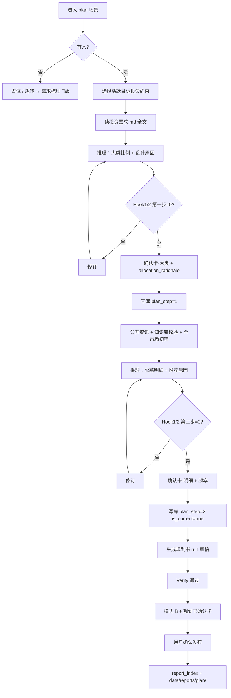

> [← PRD 索引](../PRD.md) · **7. 资产配置与规划书**

## 7. 模块三：资产配置与规划书

### 模块说明

| 项 | 说明 |
|----|------|
| **做什么** | 针对 **一组目标投资约束**，联网分两步：① 大类比例 + 原因 ② 国内公募明细 + 推荐原因 → 产出 **大类资产配置方案** + **《资产配置方案》** md（**RPT-PLAN-NAME-02**） |
| **输入依据** | **分步绑定**（**PL-PLAN-STEP-INPUT-01** · 见 §7.1.3）：**第一步** 投资需求 md + **宏观/股债配置联网**（≤3）→ **大类资产配置**；**第二步** **公开资讯 + 全市场初筛 + 知识库核验**（+ 已确认大类 · md 约束对齐）→ **明细 + 规划书**。**不含** 持仓 |
| **不做什么** | **不读、不考虑** 用户持仓（§8）；**不** 做持仓偏离诊断、调仓建议；**第一步不** 选基、**不出** `fund_code`；**不推荐** 商品类基金；**知识库内基金无优先推荐权**（**PL-PLAN-KB-NO-PRIORITY-01**）；**不** 在需求梳理阶段采集 **行业/主题/选基偏好**（**PL-PLAN-PREF-S2-01**） |
| **与 §8 分工** | §7 **先定目标方案**（「应该怎么配」）；§8 **后对照现实**（「实际持仓 vs 目标方案」）— 见 [§8 模块说明](./08-portfolio.md#8-模块四持仓分析) |
| **入口** | Tab **资产配置** |
| **完成标志** | 用户 **确认发布** →《资产配置方案》进「我的报告」（PL-03 · §4.1.0 · **RPT-PLAN-NAME-02**）；结构化方案入 `allocation_plans` |
| **依赖** | 至少 1 份 **完善** 投资需求（§6.0.1 · **PL-PROFILE-PLAN-A**：**无**「用旧版已发布报告继续做资产配置」） |
| **编码锚点** | `allocation_plans`；审视 PL-01；`is_current` 每约束一条（PL-02） |
| **交互预期** | **第一步（大类）**：讨论 **偏少**，对齐投资需求即可；**第二步（明细）**：讨论 **为主**（换基、行业、分批、再平衡 · **PL-PLAN-DIALOG-01**） |

### 7.1 两个层次与绑定关系

| 层次 | 存储 | 说明 |
|------|------|------|
| **资产配置方案** | `allocation_plans` | 联网两步确认后入库（§7.2）；**必含** `goal_constraint_id`；推理范围 **仅公募基金** |
| **资产配置方案（规划书）** | 本地 md 快照 | 第二步写库后 **模板填槽** 生成 run 草稿 → 用户 **确认发布** 后 `report_index`（PL-03 · §4.1.0） |

#### 7.1.1 `allocation_plans` 字段（P0）

> 权威七列 → [§7.10 `allocation_plans`](./07-allocation-plan.md#710-字段规格supabase)。以下为 `detailed_plan` 结构补充；对客采集见 §7.2 流程与确认卡。

**`detailed_plan` 结构（jsonb · 第二步）**

| 中文含义 | 字段名称 | 字段类型 | 字段说明 |
|----------|----------|----------|----------|
| 大类名称 | `categories[].category` | string | 与 `target_allocation` 对齐 |
| 类内占比 | `categories[].allocation_pct` | number? | 百分比 |
| 类内金额 | `categories[].amount` | number? | 元 |
| 基金代码 | `categories[].items[].fund_code` | string | **必填** · 国内公募 |
| 基金简称 | `categories[].items[].fund_name` | string | |
| 类内权重 | `categories[].items[].weight_in_category` | number | 权重或金额 |
| 推荐原因 | `categories[].items[].recommendation_reason` | string | **必填** |

| 前置数据 | 规则 |
|----------|------|
| `profile_versions.is_current` | **必须存在**（层1·人） |
| `investment_goal_constraints` | **必须选定**一组 **完善** 约束（§6.0.1 · §6.6 停用者不可选）；无完善组则回 **需求梳理** Tab |
| 约束内 Hook | 录约束时已过 §6.2.3；方案审视 **再次校验** 草案 vs 该组 **主表**（结构化） |
| **投资需求 md** | **PH-PROFILE-ENC-01 对齐** 的已发布《投资需求报告》全文（`report_index.file_path` · **PL-PLAN-PROFILE-MD-01**） |

#### 7.1.2 投资需求输入 · 全文 md（P0 · PL-PLAN-PROFILE-MD-01）

> **原则**：两步推理 **直接注入** 用户已确认发布的《投资需求报告》**md 全文**；**禁止** Agent 先抽字段摘要、再删节后客户信息层 11 项后送大模型。

| 项 | 规则 |
|----|------|
| **取哪一份** | 选定 `goal_constraint_id` 上，满足 [§6.0.1 PH-PROFILE-ENC-01](./06-profile.md#601-完善的投资需求n-的定义--p0) 的 **唯一** 已发布行 → 读盘 `file_path`（[§4.1.0e RPT-PROFILE-02](./04-my-reports.md#410e-投资需求--当前版本rpt-profile-0103--p0)） |
| **Gather 用法** | **第一步** 仅 md 全文；**第二步** md **仅** 约束对齐（金额/分批/禁投），选品靠公开资讯 + KB |
| **与 Hook 分工** | **大模型** 读 md；**Hook1/2** 仍对 `investment_goal_constraints` + 客户信息层主表做结构化校验 · **禁止** 用摘要代替 Hook |
| **禁止** | 自行压缩成 JSON/表格摘要；读 **非对齐** 旧版 md；读持仓 md |

**读侧 Command**：`plan_read_profile_report`（内部）· 用户 `/` 侧仍用 `plan_read` 读 **方案** 时与 **投资需求 md** 区分（见 §7.7）。

#### 7.1.3 分步输入与产出（P0 · PL-PLAN-STEP-INPUT-01）

> **原则**：输入 **按步绑定**；**禁止** 将知识库 vault 当作「优先推荐池」；**禁止** 第一步输出 `fund_code` 或选基。  
> **蓝图（定稿）** → [`plan-allocation-report-blueprint.md`](../docs/samples/plan-allocation-report-blueprint.md)

| 步骤 | 主输入 | 产出 | 禁止 |
|------|--------|------|------|
| **第一步 · 大类资产配置** | 《投资需求报告》**md 全文** + **`web_search`**（宏观/股债配置语境 · **≤3** · **PL-PLAN-S1-NET-01**）+ 结构化约束 | `target_allocation` + `allocation_rationale` + **`allocation_citations`** → Hook（step=1 · **重试 ≤3**）→ **大类确认卡** | 基金知识库 · **基金代码** · 读持仓 · 商品类 |
| **第二步 · 明细 + 规划书** | **公开资讯**（`web_search` · ≤5）+ **`plan_screen_funds` 全市场 Top40×3**（**PL-PLAN-L0-FULL-01**）+ **基金知识库**（KB-03 · **核验**）+ 已确认 `target_allocation` + md（**仅** 金额/分批/禁投/QDII 等对齐） | `detailed_plan` + 执行/再平衡 + `web_citations` → **明细确认卡** → **《资产配置方案》** 草稿 | 仅从 vault 列表选基；库内基金 **优先** 于全市场；商品类 |

**第一步 / 第二步 联网分工（P0）**

| 用途 | 第一步 citation | 第二步 citation | 规划书正文 |
|------|-----------------|-----------------|------------|
| 大类配置语境 | `allocation_citations`（≤3） | — | **不进** §三 |
| 市场背景 / 选基 | — | `web_citations`（≤5） | §三 **LLM 归纳** + §参考来源 |
| 与您约束对齐 | `allocation_rationale` | — | §二 / §三「为什么这样配」 |

**知识库定位（PL-PLAN-KB-NO-PRIORITY-01）**：候选基金 **先** 由 **L0 全市场 + L3 公开资讯** 初筛；**入选后** 若该代码在 vault 有材料 → **L1 explore 核验** 费率/范围等（FK-CITE）。**不得** 因「库里有这只基」而优先推荐；**不得** 跳过全市场初筛。详 [§9.2.0g KB-03-SCREEN · B](./09-fund-knowledge.md#920g-知识来源优先级kb-03--瀑布检索)。

#### 7.1.5 编码前决项（PL-PLAN-READY · P0 · 已确认）

| ID | 决项 | 规则 |
|----|------|------|
| **PL-PLAN-S1-NET-01** | 第一步 **须联网** | **`web_search` 失败 → 阻断** 大类确认；产出 `allocation_citations`（≤3）落库 |
| **PL-PLAN-L0-FULL-01** | 第二步 **真·全市场初筛** | **`plan_screen_funds`** · Tushare `fund_basic` → 硬/软过滤 → **Top40/类**；样例 6 只 **仅** Mock |
| **PL-PLAN-NET-BLOCK-01** | 联网失败 **不降级** | **第一、二步** 均无 `web_search` → **阻断**；**不** 允许「仅 KB + md」出明细 |
| **PL-PLAN-RISK-INDEX-01** | §六 **代理指数粗估** | 沪深300 / 中证全债（AK：`sh000012`）/ 货指 · **3Y+5Y 区间** · 瀑布缺数则不写 · 详 blueprint §6 |
| **PL-PLAN-QDII-01** | QDII **默认允许** | 中国公募 QDII 可入池；md/用户禁 QDII → 剔除；**不含** 海外直投/私募 |
| **PL-PLAN-NO-COMMODITY-01** | **不推荐商品类** | 初筛剔除商品类；Hook 草案含商品 → 失败 |
| **PL-PLAN-PICK-GOAL-01** | **N≥2** 选场景 | **须** 提供 **场景选择器**（完善组列表 · 点选 `goal_constraint_id`）；聊天指名 **可** 作补充，**不** 替代选择器 |
| **PL-PLAN-REBAL-JSON-01** | 再平衡 **结构化** | `rebalance_rule` JSON 含 **阈值 + 调整方式**（默认 ±5%）；用户 **可** 在第二步对话修订后出新明细卡 |
| **PL-PLAN-DEPLOY-BOND-01** | 债基分批 **不写死** | **已确认**：货币 **固定** 首期 100% 不进定投；债基按 **类型+利率/利差+期限** 定案 + **`note`**（Hook D4）；用户可对话改 → 新明细卡 |
| **PL-PLAN-OVERLAY-01** | 报告 overlay **§7 MVP** | **已确认**：存 + merge + 发布进正文 + **`report_draft` 重生 re-merge** · **含** 长文摘要（RPT-OVERLAY-LEN · >800 字 → `summary` ≤220 字）· 详 §7.1.5a |

##### 7.1.5a `report_overlay` 与 §7 MVP 范围

| 问 | 答 |
|----|-----|
| **是什么** | 用户在 **`plan.rpt.wait`**（规划书确认卡前）**临时加的非模板段落**（如「综合分析」）· 存 **`report_overlay`** · **不写** `allocation_plans` |
| **为什么和 §7 有关** | §7 完成标志 = **确认发布规划书**；此阶段 chat 已设计 **报告-only 分流**（RPT-CHAT-ROUTE-01）· **无 overlay** 则用户只能 **放弃草稿 / 改库重跑** 才能加段 |
| **MVP 必做（已确认）** | **§7 MVP** · 与 `report_draft` / `report_publish` **同期**：① `report_overlay` 写入 ② **`merge_report_overlay`**（含 **`report_draft` 重生 re-merge**）③ 发布进定稿 md 后清除 ④ **长文自动摘要**（**RPT-OVERLAY-LEN**：`content` >800 字 → 保留全文 + 生成 `summary` ≤220 字 · **合并只用 `content`**） |
| **不做时的缺口** | 确认前 **无法** 保留用户加的分析段；**重生报告** 会冲掉非模板内容 |
| **不做什么** | overlay **不能** 偷偷改基金/比例；矛盾数字 **须** 回明细卡 |

#### 7.1.4 行业 / 选基偏好 · 仅第二轮（PL-PLAN-PREF-S2-01 · P0）

> **产品决项（与用户对齐）**：**行业、主题、具体基金、类内风格** 等偏好 **不做需求梳理前置**；用户在 **第二步明细** 阶段 **自由发挥**（多轮聊天修订 · §7.8）。  
> **需求梳理只提供边界**（期限、回撤、收益预期、流动性、金额、分批、场景目标等 · §6）；**不提供**「我要配多少科技/消费/某基金公司」类字段。

| 项 | 规则 |
|----|------|
| **需求梳理（§6）** | `category_preference` · `forbidden_categories` → **本期不采**（§6.12.4）；投资需求报告 **不写** 行业/选基偏好章节 |
| **第二步明细** | **唯一** 采集渠道：用户 **自发** 或 Agent **邀请**（「有没有偏好的行业/想避开的基金？」）→ 写入 `detailed_plan` + `recommendation_reason` |
| **Agent 默认** | 无用户 **行业表述** 时 → **§7.4.2 卫星默认选法**（行情/资讯选卫星，或无看好则分散）；**不等于** 用户已声明行业偏好 |
| **第一步** | **禁止** 因「猜到的行业偏好」调整大类；**禁止** 在第一步确认卡前讨论具体基金 |
| **后续增强** | 若未来要在 §6 采集品类偏好 → **另开决项** · 须改问卷 + 报告模板 + §7 Gather 绑定；**非** 本期 MVP |

与 **PL-PLAN-SECTOR-01** · **PL-PLAN-DIALOG-01** 一致：偏好 **在聊明细时生长**，不在需求报告里预埋。

**`allocation_rationale`（第一步）**：须 **对齐投资需求 md** 中的期限、回撤、收益预期、流动性、场景目标；**可** 结合第一步 `allocation_citations` 的 **配置语境**（**非** 逐步预测后市）；confirm 前 **LLM 润色一次**（**PL-PLAN-RATIONALE-REFINE-01**）；规划书 **纯填槽**。**与 §三 分工**：rationale = **与您约束对齐**；§三 = **外部环境**（第二步 `web_citations` · LLM 归纳）。**阶段条** 须覆盖 ① 对齐需求 ② 市场语境 ③ 比例权衡（§7.11.2 · `plan.s1.allocation.*`）。

### 7.2 端到端流程（联网 · 两步确认 · 审视闸门）

> **PL-03 / PL-06**：**第一步 Gather = 投资需求 md 全文 → 大类推理**；**第二步 Gather = 公开资讯 + 基金知识库（核验）+ 已确认大类 + md 约束对齐 → 明细与规划书**（§7.1.3 · **不** 压缩摘要 · **不** 读持仓）。第一步不出基金代码；第二步须出 `fund_code` + 推荐原因。规划书 md 在 **第二步写库成功后** 写入 run 草稿 → **模式 B** → 用户 **确认发布**（§4.1.0）。



1. 校验 **完善投资需求** 条数 **N**（[§6.0.1](./06-profile.md#601-完善的投资需求n-的定义--p0) · [shared §5.3.4](./05-chat-shared.md)）；**N=0** → 占位引导至 **需求梳理** Tab，**不**进入下列步骤。  
2. **选择 `goal_constraint_id`**：**仅** 从 §6.0.1 **完善组** 列表；`N=1` 默认选中；`N≥2` 用户指定（列表 **不含** 未完善组）；新建/改约束/补发报告回 **需求梳理** Tab（§6.2 · §6.5 · §6.2.8）。  
3. **第一步·大类资产配置**（**大模型 + 联网** · PL-06 · **PL-PLAN-S1-NET-01**）：  
   - **输入**：**§7.1.2–§7.1.3** 对齐的《投资需求报告》**md 全文** + **`web_search`（≤3）** + 结构化约束。**禁止** 基金知识库、持仓、`fund_code`、md 预压缩为摘要。  
   - **输出**：`target_allocation`（**仅股/债/货**）+ **`allocation_rationale`**（对齐约束 · **不写** 单只基金）+ **`allocation_citations`**。  
   - **Hook1/2（step=1）** → 失败则 **约束 + 上轮方案 + 矛盾清单** 重试 LLM（**≤3 轮**）→ **大类确认卡** → `allocation_rationale` **润色一次** → 写库 `plan_step=1`，`is_current=false`。  
4. **第二步·明细 + 投资规划书**（**用户确认大类后** · **联网 + 大模型 + KB-03** [knowledge §9.2.0g](./09-fund-knowledge.md)）：  
   - **输入**：已确认 `target_allocation` + **公开资讯**（`web_search` · 品类/候选基金 · 引用 ≤5）+ **基金知识库**（**PL-PLAN-KB-NO-PRIORITY-01**：L0+L3 **全市场初筛** → 入选后 **L1 核验**）+ 同份 md（**仅** 金额/分批/禁投等约束对齐）。  
   - **输出**：`detailed_plan` + `execution_schedule`（**规则算表** + LLM `note`）+ `rebalance_rule` + `web_citations`（≤5）+ **`recommendation_reason` 润色** → **明细确认卡** → 写库 `plan_step=2` → **《资产配置方案》** 模板草稿。  
   - **方案 Hook1/2（step=2）** → 写库 `plan_step=2`，`is_current=true`（该 `goal_constraint_id` 唯一 · PL-02）。  
5. **规划书 md 草稿** → `data/runs/…/draft-report.md` → Verify → **模式 B** + 聊天列 **规划书确认卡** → 用户 **确认发布** → `{APP_ROOT}/data/reports/plan/` + `report_index`（§4.1.0）。  
6. **联网未配置/检测失败** → **阻断第一步与第二步**（**PL-PLAN-S1-NET-01** · **PL-PLAN-NET-BLOCK-01**）；阶段条展示「正在检索公开信息…」（§5.3.10）。

### 7.3 方案审视双 Hook（P0 · 必过 · 已定）

> 与 §6.2.3 同哲学：**Hook1 冲突** → **Hook2 漏洞**。  
> **第一步**仅跑「大类阶段」规则；**第二步**跑全部规则（含频率必填）。  
> 实现：`plan_check_conflicts`、`plan_check_completeness`；`skills/plan/plan_verify.yaml`。

#### 方案 Hook1 · 冲突（须=0）

| # | 阶段 | 冲突 | 澄清 / 处理 |
|---|------|------|-------------|
| 1 | 一、二 | 大类比例之和 ≠ 100%（±0.5% 容差） | 归一化或用户确认取整 |
| 2 | 一、二 | 权益合计 vs 约束·`max_drawdown` / `risk_tolerance` 明显不匹配 | 降权益或改约束（须确认） |
| 3 | 一、二 | 隐含收益 vs 约束·`expected_return` 偏差过大 | 调比例或下调预期 |
| 4 | 一、二 | 约束·`investment_horizon` 短 + 高权益/长锁品类 | 增货基/短债或改约束期限 |
| 5 | 一、二 | `liquidity_need` 与低流动性品类矛盾 | 调高流动性仓位 |
| 6 | 一、二 | `forbidden_categories` 与草案品类冲突 | 移除禁投类 |
| 7 | 一、二 | 非 **中国公募基金**（§0.8） | 剔除 |
| 8 | 一、二 | 活跃约束组金额合计超客户信息层上限（**容差 0** · PL-04） | 调金额或停用某组 |
| 9 | 一 | 养老约束长期但大类偏短债-only（无说明） | 补 `allocation_rationale` |
| 10 | 一 | 缺少 **`allocation_rationale`**（整体设计原因） | 必填 |
| 11 | 二 | 约束·`deploy_mode`=分批 但 `deploy_frequency` 缺失 | 用户明确频率 |
| 12 | 二 | `rebalance_rule` 缺 **`rebalance_frequency`** / **`drift_threshold_pct`** / **`adjust_method`** | 补齐结构化再平衡（§7.4.3 · PL-PLAN-REBAL-JSON-01） |
| 13 | 二 | `detailed_plan` 与 `target_allocation` 大类比例不一致 | 对齐两步 |
| 14 | 二 | `detailed_plan` 含非公募或无效 `fund_code` | 剔除/换标的 |
| 15 | 二 | 某大类有明细但 **无** `recommendation_reason` | 逐项补原因 |
| 16 | 二 | 第一步已禁投品类出现在 `detailed_plan` | 移除 |

有冲突 → **「方案矛盾清单」** → 修订 → 重跑 Hook1。

#### 方案 Hook2 · 漏洞与缺项（须=0）

| # | 阶段 | 漏洞 | 必须补齐 |
|---|------|------|----------|
| 1 | 一 | 缺少 **`allocation_rationale`** | ≥1 段整体设计原因 |
| 2 | 一 | 大类无 **流动性/回撤粗估** | 区间说明（依据投资需求 · **非** 联网） |
| 3 | 二 | 未体现 **公开资讯** 检索要点（已检索但推荐原因空泛） | 引用品类/基金公开信息 |
| 4 | 二 | 推荐基金 **仅** 来自 vault 列表、未见全市场初筛 | 按 KB-03-SCREEN · B 重选 |
| 5 | 二 | 教育/买房约束未体现 **到期前流动性** | 流动性安排 |
| 6 | 二 | 大类下 **无具体 `fund_code`** | 每类至少 1 只公募 |
| 7 | 二 | 某只基金 **无 `recommendation_reason`** | 逐项补推荐原因 |
| 8 | 二 | 缺分批/再平衡频率 | `execution_schedule` / `rebalance_rule` |
| 9 | 二 | 规划书必填章节无法生成（§7.4） | checklist |

### 7.4 两步确认卡与规划书（P0）

> **Propose payload** → **`propose_artifacts`** + 瘦 `confirm_card`（[shared §5.3.10b](./05-chat-shared.md)）。  
> **对客通则 + Mock** → `skills/shared/confirm_card.mock.zh.md` §三、§四。

#### 第一步确认卡 · 大类资产配置（`plan_allocation`）

**标题**：请确认：{场景对客名} · 大类配置

| 对客展示 | 说明 |
|----------|------|
| **针对目标** | 场景对客名（只读） |
| **大类 · 占比表** | 列：**大类** · **占比** |
| **配置思路** | `allocation_rationale` 的白话正文（**对齐投资需求** · **禁止**用英文字段名作列头） |
| **参考来源** | **第一步通常无**；若误触发联网则 **不展示** |
| **合规** | 卡片底 §0.7 短版一句 |

**不含**：基金代码、明细表、分批/再平衡字段。

**按钮**：**确认这一步** / **放弃**

**对客提示（卡片正文或助手一句 · 第一步）**：大类比例若 **大致符合** 您的预期，可直接点 **确认这一步**；若想 **微调股/债/货比例**，请在聊天里说明，我会 **只改大类** 后出新卡（**不** 在此步讨论具体基金或行业）。

#### 第二步确认卡 · 明细推荐方案（`plan_detail`）

**标题**：请确认：{场景对客名} · 基金明细

| 对客展示 | 说明 |
|----------|------|
| **上一步大类** | 只读摘要（大类 + 占比） |
| **基金明细表** | 列（**B1 · 须展示代码**）：**基金代码** · **基金名称** · **所属大类** · **类内占比** · **推荐理由** |
| **分批建仓** | `deploy_mode` / 期数 + **首期·定投分基金摘要**（§7.4.3） |
| **再平衡** | `rebalance_frequency` → 白话（如「每半年检视一次」） |
| **参考来源** | **必含**（公开资讯 · ≤5 条可展开） |
| **合规** | 卡片底 §0.7 短版一句 |

**禁止作列头**：`fund_code`（作列头时用「基金代码」）、`recommendation_reason`、`Hook` 编号。

**对客提示（卡片正文或助手一句 · 第二步 · 必含）**：**明细阶段是主要讨论环节**——您可继续说明：**换哪几只基金、行业/风格偏好、类内占比、分批与再平衡**；我会多轮更新方案后再请您点 **确认这一步**。**不要** 催促用户「一次确认」。

用户确认后写库 `plan_step=2` → **生成规划书 run 草稿** → Verify → **模式 B** + **报告确认发布卡**（§4.1.0a）→ 用户 **确认发布** 后 `report_index`（PL-03）。

> **两步分离**：① **`allocation_plans` 结构化确认写库**（仍用本确认卡）② **规划书 md 快照**须 **再次确认发布**（§4.1.0 · RPT-PUB-01）。合规：文案为「信息参考与教育性分析」；须重复 §0.7 短句。

**`execution_schedule` / `rebalance_rule` 示例（须在 **确认前** 由 Agent 写入 propose；用户不对则 **聊天修订** 后出新卡）**：

| 中文含义 | 字段名称 | 示例 / 取值 |
|----------|----------|-------------|
| 投入方式 | `deploy_mode` | `lump_sum`（一次性）/ `phased`（分批） |
| 分批频率 | `deploy_frequency` | `每月` / `每季` 等 |
| 分批期数 | `deploy_periods` | `12` / `24`（期） |
| 每期新增资金（元） | `period_new_cash_cny` | `3000` |
| 已有资金总额（元） | `existing_lump_cny` | `120000`（首期部署主要来源） |
| 逐基金建仓分工 | `fund_deploy[]` | 见 §7.4.3 下表 |
| 首期分基金摘要 | `initial_tranche` | 各基金 **建议买入金额** 或 **占该基金目标 %** |
| 后续每期分基金摘要 | `periodic_tranche` | 定投池内各基金 **每期大致金额** |
| 再平衡频率 | `rebalance_frequency` | `每半年` 等（属 `rebalance_rule`） |
| 偏离阈值（%） | `drift_threshold_pct` | `5`（默认 · 可对话改） |
| 调整方式 | `adjust_method` | `prefer_dca` / `use_cash_buffer` / `sell_buy` |

#### 7.4.1 投资规划书 md（RPT-PLAN-TPL · P0）

> **Agent 模板 + Verify 对照** → `skills/plan/report.template.zh.md`（**含 ECharts 解析契约 · PL-REPORT-EC**）  
> **完整对客 Mock（退休养老 · 含图表）** → [`plan-allocation-report-sample.md`](../docs/samples/plan-allocation-report-sample.md)  
> **章节映射 / 数据绑定 / Verify 详文** → [`plan-allocation-report-spec.md`](../docs/samples/plan-allocation-report-spec.md) · [§1.3.4 Preview 组件](./01-global-design.md)

**与投资需求报告差异**：规划书 md **必须** 含 **` ```echarts `** 围栏（全报告 **≥3** 块 · 二章 ≥1、四章 ≥2）；Preview 对每块 **JSON.parse** 后渲染，**不能**用外链图或纯表格代替。

> **文档层级（不替代已验收链路）**：章节与图表 **详文** 仍以 [`plan-allocation-report-spec.md`](../docs/samples/plan-allocation-report-spec.md) · [`plan-allocation-report-sample.md`](../docs/samples/plan-allocation-report-sample.md) · [§1.3.4 Preview](./01-global-design.md) 为准；`skills/plan/report.template.zh.md` 为 Agent **索引入口**。  
> **对客正文（RPT-PLAN-CLEAN-01）**：草稿/发布 md **从 `#` 标题直接开始**；**禁止** 文首开发说明、Spec 链接、`goal_type` 等内部信息。

| # | 对客章节 | MVP 必含 | 备注 |
|---|----------|----------|------|
| — | 三句话读懂本方案 | ✅ | 目标 · 大类 · 执行各一句 |
| — | 方案速览 | ✅ | 摘要表 |
| 一 | 本方案针对的目标 | ✅ | 约束摘要 + **[投资需求报告深链](/reports?tab=profile&id=…)**（已发布 · 可点） |
| 二 | 大类资产配置 | ✅ + **≥1** ECharts | `target_allocation` + `allocation_rationale` |
| 三 | 配置思路与市场背景 | ✅ | rationale 展开 + `web_citations` ≤5 |
| 四 | 公募基金明细推荐 | ✅ + **≥2** ECharts | `detailed_plan` · 代码 + 推荐原因 |
| 五 | 执行与再平衡 | ✅ | `execution_schedule` + `rebalance_rule` · **首期/定投分基金表**（§7.4.3） |
| 六 | 风险与流动性说明 | ✅ | 粗估回撤 · 到期流动性 |
| — | 温馨提示 | ✅ | §0.7 短版 |
| — | 参考来源 | 有联网时 | 无则说明依据投资需求整理 |

第二步写库后 **生成草稿** → Verify → 模式 B → 用户 **确认发布** 后落盘（§4.1.0）。

#### 7.4.2 类内行业 / 风格偏好（PL-PLAN-SECTOR-01 · P0）

> **场景**：用户 **已确认大类**（如股票 25% · 债券 55% · 货币 20%）后，在 **第二步明细** 或 **明细确认卡前**，提出「某行业高一点 / 某主题少一点 / 不要集中消费」等。  
> **边界**：行业/选基偏好 **仅** 在第二步对话中采集（**PL-PLAN-PREF-S2-01** · §7.1.4）；**不** 在第一步改 `target_allocation`；**不** 从投资需求 md 推断用户行业偏好。

| 项 | 规则 |
|----|------|
| **何时处理** | **第二步** `plan_propose_detail` · 明细确认卡 **`plan.s2.wait` 之前**；用户 **确认明细后** 再改 → 按 §7.5 **仅调详细** 重跑第二步 |
| **不改什么** | 已确认 **大类比例**（除非用户明确要求改大类 → §7.5 从第一步重来） |
| **改什么** | 各大类 **内** 的基金清单、类内权重、**行业/风格暴露**（换基或调 `weight_in_category`） |
| **对话示例** | 「股票里 **科技** 想多配一点」「**消费** 占比太高了，换成宽基」「债券别全信用，加一点利率债」 |
| **Agent 行为** | 全市场初筛 + KB 核验 **重选** → 更新 `detailed_plan` + **逐项 `recommendation_reason`**（须写清 **为何选该行业/为何控制集中度**）→ Hook1/2 → **新** 明细确认卡 |
| **规划书 §四** | 股票类（及含权益的混合类）**须** 有 **「行业与风格说明」** 小段：类内 **宽基 / 行业主题 / 全市场主动** 各占多少、是否单一行业 **> 类内 50%** 须解释 |

**Hook2 补充（第二步 · 建议=0）**

| # | 条件 | 须补齐 |
|---|------|--------|
| S1 | 股票类 **仅 1 只** 行业主题基且 **类内 > 50%** | 说明集中度理由，或 **增配宽基/全市场** 分散 |
| S2 | 用户 **已明确** 行业偏好，但明细 **未体现** | 按偏好重选或 **聊天澄清** 无法满足的原因 |
| S3 | §四 **无** 行业/风格结构说明（股票类非空时） | 补对客段落 + 更新类内结构图 |
| S4 | 用户 **未** 指定行业，但配置了 **行业主题卫星** | `recommendation_reason` **须** 写清 **第二步公开资讯/市场依据**；**无** 可引用依据 → **去掉卫星** 或 **改宽基/全市场** 分散 |
| S5 | 用户 **未** 指定行业，且 **无** 相对看好的行业方向 | **不得** 硬塞行业主题；股票类 **宽基 + 全市场** 分散即可（卫星 **0** 或 **不设** 行业主题行） |

**卫星行业 · 默认选法（PL-PLAN-SECTOR-DEFAULT · P0）**

> **前提**：用户 **未** 在第二步对话中 **明确** 倾向某行业/主题（如「多配科技」「不要消费」）。**已明确** → 按用户偏好配置（Hook S2）。

| 分支 | Agent 怎么做 | 规划书 §四 |
|------|--------------|------------|
| **A · 有相对看好的方向** | 第二步 **联网公开资讯**（`web_citations`）+ 全市场初筛后，可选 **≤1 个** **卫星** 行业/主题基（类内通常 **≤30%** · 稳健场景 **≤20%** 为宜）；`recommendation_reason` **须** 写清 **为何此时选该行业**（景气、政策、资金关注度等 · **须可追溯到引用**） | 「行业与风格说明」表 **须** 单列卫星行，并 **一句** 点明 **非用户指定、依据当时资讯** |
| **B · 无明确看好** | **不加** 行业主题卫星；股票类以 **宽基 + 全市场主动** **分散** 为主 | 表内 **无** 行业主题行，或卫星占比 **0%**；说明「未指定行业偏好，且当前无单一行业配置把握，故以分散为主」 |

**结构底线（与风险边界一致）**

| 项 | 规则 |
|----|------|
| **核心 vs 卫星** | **宽基 + 全市场** = 核心；行业主题 = **卫星**（非核心） |
| **稳健 / 养老等** | 即使用卫星，也 **不得** 单行业 **> 类内 50%**（Hook S1）；默认 **宽基占比 > 卫星** |
| **合规表述** | 可写「相对景气 / 配置逻辑 / 资讯支持的方向」；**禁止** 对客承诺收益或「一定赚钱」 |
| **用户事后修订** | 「换行业 / 去掉卫星 / 指定科技」→ 仍走 §7.4.2 对话修订 → 新明细确认卡 |

**与投资需求的关系**：需求 md 只提供 **风险与期限边界**（如稳健 + 长期 → 卫星 **更小或不用**）；**不** 从需求 md **推断** 用户行业偏好；**不** 固定写死某一行业（如样例中的消费 **仅为 Mock 展示格式** · 运行时按上表 A/B 动态选）。

#### 7.4.3 分批建仓 · 首期 vs 定投分工（PL-PLAN-DEPLOY-01 · P0）

> **用户预期**：§五「分批建仓计划」不能 **只写总金额/期数**；须写清 **第一次买什么、后面每期买什么** —— **按基金列清单**，不只按大类。  
> **产品原则**：**定投（分批）** 针对 **有净值波动、择时风险** 的资产；**货币类** **不参与** 按期定投补仓。

**定投适用谁（PL-PLAN-DEPLOY-DCA · P0 · 货币规则已确认）**

> **债有没有波动？** **有**，但 **通常低于股票**。  
> **已确认规则**：**货币** → **首期 100% · 不进定投**（写死）。**债基** → Agent 按 **产品类型 + 利率/利差环境 + 用户期限** 定 `fund_deploy[]`，**`note` 须写原因**（Hook **D4**）；用户说「债分批 / 债一次买满」→ **新明细确认卡**。

| 类型 | 波动从哪来 | 默认倾向（可对话改） | Agent **须** 写清的理由 |
|------|------------|----------------------|-------------------------|
| **货币类** | 净值几乎不动 | **首期 100%** · **不进** 定投池 | 无择时意义 |
| **纯债 / 利率债** | 利率上行、久期 | 多数 **首期 60%～80%** · 剩余 **可** 定投补 | 波动低于股，但 **非零**；底仓优先 vs 担心利率时点 |
| **信用债** | 信用利差、违约预期 | **首期 40%～70%** · 剩余 **常** 进定投池 | 波动高于利率债 |
| **二级债 / 混债偏债** | 含权 + 信用 | 接近 **股票**：首期 **少** · **定投** 为主 | 权益暴露带来 **类似股票的净值波动** |
| **股票 / 行业主题** | 市场涨跌 | 首期 **0%～30%** · **定投** 补齐 | 分批核心 · 降低择时 |

**修订**：用户说「债也一次买满 / 债也要分批」→ 更新 `fund_deploy[]` + **`note` 说明原因** → 新明细确认卡。

**`execution_schedule` 须含（写库 · 确认卡 · 规划书 §五 同源）**

| 中文含义 | 字段名称 | 说明 |
|----------|----------|------|
| 投入方式 | `deploy_mode` | 与需求 md 一致 · `phased` = 分批 |
| 分批频率 | `deploy_frequency` | 如 `每月` · `每季` |
| 分批期数 | `deploy_periods` | 如 `24` 期 |
| 每期新增资金 | `period_new_cash_cny` | 元 · 如 `3000` |
| 已有资金总额 | `existing_lump_cny` | 元 · 首期部署来源 |
| 逐基金建仓分工 | `fund_deploy[]` | **须** 逐只基金 · 见下表 |
| 首期分基金摘要 | `initial_tranche` | 对应规划书 **「首期怎么买」** |
| 后续每期分基金摘要 | `periodic_tranche` | 对应规划书 **「后续每期怎么买」** |

**`fund_deploy[]` 单基金**

| 中文含义 | 字段名称 | 说明 / 取值 |
|----------|----------|-------------|
| 基金代码 | `fund_code` | 与 `detailed_plan` 一致 |
| 建仓模式 | `deploy_pattern` | `initial_full` = **首期配满**（不参与定投）· `initial_majority` = **首期建大部分** · `phased_dca` = **以定投补齐为主** |
| 首期完成比例 | `initial_pct_of_fund_target` | 占 **该基金目标仓位** 的 %（0～100） |
| 是否进入定投池 | `dca_in_periodic` | 布尔 · 货币类 **须 false** |
| 对客说明 | `note` | 一句 · 如「波动大，分期买」 |

**规划书 §五 · 对客必含（三张表/段）**

| # | 对客块 | 内容 |
|---|--------|------|
| 1 | **首期怎么买** | 已有资金 **第 1 次** 下单：基金代码 · 名称 · **建议金额** · 占该基金目标 **%** |
| 2 | **后续每期怎么买** | 第 2～N 期：**仅列定投池** 基金 · 每期 **大致金额**（可与 `period_new_cash_cny` 对照） |
| 3 | **不参与定投** | 单独说明（典型：**货币已首期配满**；首期已配满的纯债可注明「后续不再按期买」） |

**明细确认卡**：在「分批建仓」行下增加 **一行摘要**（如「首期：货币+大部分债券；定投：股票+剩余债券 · 货币不参与定投」）。

**Hook2 补充（第二步 · 建议=0）**

| # | 条件 | 须补齐 |
|---|------|--------|
| D1 | `deploy_mode=phased` 但 **无** `fund_deploy[]` / 首期·定投表 | 按上表补全 **逐基金** 分工 |
| D2 | 货币类基金 `dca_in_periodic=true` | 改为 **`initial_full` + `dca_in_periodic=false`** |
| D3 | §五 **仅有** 总金额/期数，**无** 首期/定投 **分基金** 表 | 补 §五 三张表/段 |
| D4 | 债/混债类 `fund_deploy[]` **无** `note` 或 **无法** 解释首期 vs 定投 | 补 **波动来源 + 为何这样分批**（PL-PLAN-DEPLOY-BOND-01） |

**`rebalance_rule` 结构（PL-PLAN-REBAL-JSON-01 · 写库 · 可对话改）**

| 中文含义 | 字段名称 | 说明 / 默认 |
|----------|----------|-------------|
| 检视频率 | `rebalance_frequency` | `每半年` / `每季度` / `每年` 等 |
| 偏离阈值（%） | `drift_threshold_pct` | 默认 **5** · 任一大类 \|实际−目标\| **>** 此值触发检视 |
| 调整方式 | `adjust_method` | `prefer_dca` = 优先用 **定投池** 新增资金微调 · `use_cash_buffer` = 优先 **货币/缓冲** · `sell_buy` = 允许少量反向买卖（须对客说明） |
| 对客说明 | `note` | 白话 · 如「每半年看一次，偏离 5% 就用下个月定投往低配大类偏」 |

用户说「改成 8% 才动」「不要卖出只加仓」→ 改 JSON → **新明细确认卡**。

**与再平衡**：再平衡章节 **「优先用新增定投」** 指 **定投池内** 基金微调偏离；**不是** 给货币再加「定投补仓」。

---

### 7.5 变更与反写顺序

| 变更类型 | 处理 |
|----------|------|
| 仅调大类比例 | **从第一步重来** → 新 `allocation_plans` 行；旧 `is_current` 置 false |
| 仅调详细/频率 | 在 `plan_step=1` 有效前提下走 **第二步**；或新建版本整条两步 |
| 修改约束 | 更新约束组 → 受影响方案标「待重审」→ 建议两步重做 |
| 修改客户信息层 `basic_info` | 新 `profile_versions` → **活跃约束 `profile_version_id` 批量对齐**（PH-PROFILE-PV-01）→ 跨约束 Hook → 受影响方案待重审 |
| 约束 `is_active=false` | 该组方案/规划书 **只读**（§6.6）；不可新建或覆盖 |

### 7.6 预置资产（编码前写好）

| 资产 | 路径 | 状态 |
|------|------|------|
| 方案 Skill | `skills/plan/allocation_skill.md` | ✅ |
| **规划书 Agent 模板** | `skills/plan/report.template.zh.md` | ✅ |
| **五场景填空蓝图** | `requirement/docs/samples/plan-allocation-report-blueprint.md` | ✅ |
| **规划书实现说明** | `requirement/docs/samples/plan-allocation-report-spec.md` | ✅ |
| **规划书对客 Mock** | `requirement/docs/samples/plan-allocation-report-sample.md` | ✅ |
| **Propose JSON 样例** | `requirement/docs/samples/plan-propose-payload.examples.json` | ✅ |
| 审视规则 | `skills/plan/plan_verify.yaml` | ✅ |
| **任务图清单** | `skills/plan/plan_workflow_tasks.zh.yaml` | ✅ |
| **库表迁移** | `seed/migrations/004_allocation_plans.sql` | ✅ |
| 校验实现 | `{APP_ROOT}/src/harness/verify/plan.ts` | ⏳ 编码仓 |

> `skills/plan/questionnaire.*` 为 §6 问卷 **误放副本** · 运行时 **忽略**（见 `allocation_skill.md`）。

### 7.7 Skill / Command

| 类型 | 命名 | 说明 |
|------|------|------|
| Skill | `plan_allocation` | 选约束 → **第一步**（仅 md）→ Hook → 确认 → **第二步**（公开资讯+KB）→ Hook → 确认 |
| Skill | `plan_report` | 第二步写库后 **生成**规划书 run 草稿；**不**直接写 `report_index` |
| Command | `plan_read_profile_report` | 读选定组 **PH-PROFILE-ENC-01 对齐** 的《投资需求报告》md 全文（`report_index.file_path`） |
| Command | `plan_read_constraint` | 读 `goal_constraint_id` **主表** + 客户信息层（**供 Hook/写库**；**不**替代 md 送大模型） |
| Command | `plan_propose_allocation` | 第一步：**仅** 读投资需求 md → 大类 + `allocation_rationale`（不写库 · **不** `web_search`） |
| Command | `plan_propose_detail` | 第二步：公开资讯 + KB-03（**无 vault 优先**）→ `detailed_plan` 公募明细 + 原因（不写库） |
| Command | `plan_web_search` | 方案场景检索（**仅第二步** · 品类 / 基金公开信息）；封装 `web_search` |
| Command | `plan_check_conflicts` | 方案 Hook1；参数 `step: 1 \| 2` |
| Command | `plan_check_completeness` | 方案 Hook2；参数 `step: 1 \| 2` |
| Command | `plan_confirm_allocation` | 写 `plan_step=1`，`is_current=false` |
| Command | `plan_confirm_detail` | 写 `plan_step=2`，`is_current=true`（该 `goal_constraint_id` 唯一）→ 触发 `plan_report` **草稿** |

#### 7.7.1 聊天 `/` Command（资产配置 Tab · P0）

> **共有** `/` 机制 → [shared §5.3.9a](./05-chat-shared.md) · `usage_pages.plan`。

| Command | 对客说明 | 类型 | `/` 补全 |
|---------|----------|------|----------|
| `web_search` | 检索公开资讯 | 读 | ✅ |
| `vision_parse` | 解析图片内容 | 读 | ✅ |
| `plan_read` | 读取当前资产配置 | 读 | ✅ |
| `plan_propose` | 提议资产配置（大类或明细） | 提议 | ✅ |
| `plan_confirm` | 确认并保存资产配置 | 写 | ✅ |
| `report_draft` | 撰写规划书报告草稿 | 提议 | ✅ |
| `report_publish` | 发布至「我的报告」 | 写 | ✅ |

> §7.7 中 `plan_propose_allocation` / `plan_propose_detail` 等为 Skill **分步**内部 Command；用户 `/` 侧统一为 `plan_propose` / `plan_confirm`（与 registry 一致）。

### 7.8 对话编排（PL-PLAN-DIALOG-01 · P0）

> 遵守 [shared §5.6.2](./05-chat-shared.md)：**短问**本对话答；缺约束等 **主任务** 走 propose 流程；跨方案/持仓/基金 → 跳转卡。  
> **修订机制**：[shared §5.3.10b](./05-chat-shared.md) — 不对 → **聊天说明** → 新 propose → 旧确认卡 `superseded`（**无**卡上 inline 编辑）。

#### 两步讨论量（产品预期）

| 阶段 | 讨论量 | 用户常问什么 | 系统怎么做 |
|------|--------|--------------|------------|
| **第一步 · 大类** | **偏少**（通常 **0～2 轮** 修订） | 「股票能不能再低一点」「债券是不是太多了」 | 只改 `target_allocation` + `allocation_rationale` → 重跑 step=1 Hook → **新大类确认卡** |
| **第二步 · 明细** | **为主**（**多轮** 修订 **正常**） | 具体 **基金**、**行业/风格**、类内占比、费率、分批期数、再平衡频率、参考资讯是否信服 | 只改 `detailed_plan` / 执行字段 → 重跑 step=2 Hook → **新明细确认卡**；**大类只读**（除非用户明确要求改大类 → §7.5 从第一步重来） |
| **规划书草稿** | **中等** | 表述、**额外段落**（overlay）、数字与明细是否一致 | **已确认明细写库后** 才生成；**报告-only** 走 overlay；实质改基金/比例 → **第二步**（§7.8.2） |

#### Agent 话术边界

| 阶段 | 应做 | 不应做 |
|------|------|--------|
| **大类确认卡前/后** | 解释 **股债货** 与回撤/期限如何对齐 | **展开** 具体基金、行业主题、单基费率（留到第二步） |
| **明细确认卡前/后** | **主动留讨论空间**（「您可以指定行业偏好或指定不想买的基金」）；每轮修订 **摘要改了什么** | 第一步已确认的大类 **静默改动**；未过 Hook **推确认卡** |
| **`plan.s2.wait` 阻塞期间** | 任意用户消息视为 **明细修订意图**（含短句「消费少一点」）→ `plan_propose_detail` | 误判为 `simple_qa` 只解释概念 **而不** 出新方案（除非用户 **明确** 只要科普、不改方案） |
| **`plan.rpt.wait` 阻塞期间** | **报告-only**（加段/改标题/通俗化）→ `report_overlay`（§4.1.0h）；**轻量表述** 不改库 | 改 **基金/比例/金额** → **回第二步** `plan.s2` · 改 **大类** → **回第一步** `plan.s1`（§7.8.2） |

#### 7.8.2 规划 · chat 分流索引（PL-PLAN-ROUTE · P0）

> 通则 → [§4.1.0g RPT-CHAT-ROUTE-01](./04-my-reports.md#410g-报告确认前--场景-chat-分流rpt-chat-route-01--p0) · overlay → [§4.1.0h](./04-my-reports.md#410h-报告-only-增量--report_overlayrpt-overlay-01--p0)。  
> **两段 chat 不混入口**：`plan.s2.wait` 与 `plan.rpt.wait` **各自 blocked**；Planner **按当前 `task_key`** 选候选确认卡，**同一套** 三分流规则。

| 当前 wait | 主讨论对象 | 报告-only | 改库 · 本 Tab | 改库 · 跨 Tab |
|-----------|------------|-----------|---------------|---------------|
| **`plan.s1.wait`** | `target_allocation` · `allocation_rationale` | —（本阶段无 overlay） | 大类比例 / 理由 → **新大类确认卡** | 改投资需求 → profile Tab；改持仓 → portfolio |
| **`plan.s2.wait`** | `detailed_plan` · 执行字段 · 行业/风格（§7.4.2） | —（overlay **尚未** 启用） | 基金代码 / 类内占比 / 分批 / 再平衡 → **新明细确认卡** | 同上 |
| **`plan.rpt.wait`** | 规划书 **表述** · **额外分析段** | `report_overlay` → merge Preview | 基金 / 大类数字 / 约束 → **须回** `plan.s2` 或 `plan.s1` · **禁止** overlay 偷偷改数 | 改需求 / 持仓 / 单基解读 → 跳转卡 |

**Verify（`plan.rpt.wait`）**：模板项（§7.4.1 · spec §8）**仍须过**；overlay 块 **不要求** 进模板骨架；overlay 或正文 **不得** 与已写库 `allocation_plans` **数字/代码矛盾** — 矛盾 → 按 **改库** 走明细卡，**不得** 仅 overlay 过关。

**重生报告**：改库后 `report_draft` 自模板重写 → **必须 re-merge** `report_overlay`（RPT-OVERLAY-01）。

#### 与阶段条

| `task_key` | `blocked` 时对客含义 |
|------------|---------------------|
| `plan.s1.wait` | 等待您 **确认大类**（或说明要改的比例） |
| `plan.s2.wait` | 等待您 **确认明细**，或 **继续讨论** 基金与执行安排（**主讨论窗口**） |
| `plan.rpt.wait` | 等待您 **确认发布** 规划书（Preview 只读）；**加分析/改表述** → overlay；**改基金/比例** → 回第二步（§7.8.2） |

---

### 7.9 场景空状态（P0 · EMPTY-UI-01）

> **展示**：无消息 · `effectiveTab=plan`。**N** = 完善投资需求条数（**PH-PROFILE-ENC-01** · [§6.0.1](./06-profile.md#601-完善的投资需求n-的定义--p0)）；placeholder 机制 [shared §5.3.4](./05-chat-shared.md)。**{场景名}** / **{场景名列表}** 排版规则同 §5.3.4。

| 条件 | 标题 | 正文 |
|------|------|------|
| **N = 0** | 生成资产配置 | 资产配置需要至少 **1 份**完善的投资需求（约束已保存但报告未确认发布 **不算** 完善 · **不能** 用旧版报告顶替）。<br><br>请先切换到上方 **「需求梳理」** Tab，完成报告 **确认发布**；完成后回到这里，我会联网检索并分两步给出大类配置与公募明细，生成 **《投资规划书》** 草稿供你确认发布。 |
| **N = 1** | 为「{场景名}」生成方案 | 我会先根据您的 **《投资需求报告》** 给出**大类资产配置**与理由，请您 **确认大类**（这一步讨论通常不多）。<br><br>大类确认后，进入 **基金明细与执行安排**——这里会是 **主要讨论环节**：具体买哪几只、行业/风格偏好、分批与再平衡等，您可以 **多轮** 说明想法，满意后再确认；最后生成 **《投资规划书》** 草稿供您核对发布（§7.8 · §7.4.2）。 |
| **N ≥ 2** | 选择场景，生成资产配置 | 你已为 **{场景名列表}** 梳理了投资需求。<br><br>请 **先点选** 要生成方案的场景（**场景选择器** · PL-PLAN-PICK-GOAL-01）；选定后我再给出大类配置与规划书草稿。也可在聊天 **补充说明** 偏好。 |

**场景选择器（PL-PLAN-PICK-GOAL-01 · P0）**

| 项 | 规则 |
|----|------|
| **何时出现** | `N≥2` · 进入 plan 主任务 **之前** 或 `plan.prep.pick_goal` **blocked** 时 |
| **展示** | **完善组** 列表（场景对客名 · 可选最近更新时间）；**不含** 未完善组 |
| **交互** | 点选一行 → 写入 run `goal_constraint_id` → `plan.prep.pick_goal` **done** → 进入读 md / 第一步 |
| **与聊天** | 聊天指名场景 **可** 预选/改选；**须** 与选择器选中 **一致** 后才继续 |

**场景选择器 · UI 线框（PL-PLAN-PICK-GOAL-01 · P0）**

> 全局布局语境 → [§1.2.4 五种模式](./01-global-design.md#124-五种模式同级共用聊天壳) · plan Tab 空状态主区。

```text
┌─ 资产配置 Tab · 主区空状态（N≥2 · effectiveTab=plan）──────────────┐
│  [标题]  选择场景，生成资产配置                                        │
│  [正文]  你已为「退休养老 · 子女教育」梳理了投资需求…                  │
│                                                                        │
│  ┌─ 场景选择器（可点击列表 · 单选）──────────────────────────────┐  │
│  │  ○  退休养老          最近更新 2026-06-10                        │  │
│  │  ●  子女教育          最近更新 2026-06-08   ← 选中高亮           │  │
│  └──────────────────────────────────────────────────────────────────┘  │
│  [主按钮]  为「子女教育」生成方案   （选中后 enabled）                  │
│  [脚注 12px] 方案中的基金产品仅覆盖中国公募基金                        │
│                                                                        │
│  ── 底部聊天输入（placeholder 随选中场景更新）──────────────────────  │
└────────────────────────────────────────────────────────────────────────┘
```

| 交互 | 规则 |
|------|------|
| 列表数据 | 仅 §6.0.1 **完善组**（`goal_constraint_id` + 对客场景名 + 可选 `updated_at`） |
| 点选一行 | 高亮 · 写入 run / `metadata.selected_goal_constraint_id` · **不** 自动开跑 |
| 主按钮 | 文案含 `{场景对客名}` · 点击 → `plan.prep.pick_goal` **done** → 进入读 md / 第一步 |
| N=1 | **不展示** 列表 · 自动绑定唯一完善组 · `pick_goal` **auto-done** |
| 聊天指名 | 「给退休养老做方案」→ 预选列表行 · **须与 UI 选中一致** 后才 `plan_propose` |

**范围脚注**（三行正文下方，12px · `#A39E98`）：方案中的基金产品仅覆盖**中国公募基金**。

### 7.11 任务图与阶段条（P0 · PL-STAGE-PLAN-01）

> **用途**：`workflow_tasks` 落盘 + SSE `stage` 驱动 **进度条 / 阶段条 UI**（[shared §5.3.10](./05-chat-shared.md) · §5.11.4）。  
> **编码清单** → `{APP_ROOT}/skills/plan/plan_workflow_tasks.zh.yaml`（与下表 **同源**）。

#### 7.11.1 规则

| 项 | 说明 |
|----|------|
| **层级** | **全部一级**（`node_depth=1`）；原二级 LLM 子步（大类 ①②③ · 明细 web/screen/kb 等 · 规划书 compose/verify）**提升为独立步骤** |
| **排序** | 同 run 内 `sort_order` **全局递增**；**禁止** 嵌套缩进展示 |
| **高亮** | UI **当前行** = 状态 `running` 的节点；同级多个 `done` 后折叠为 ✓；`blocked` = 「等待您确认…」 |
| **修订** | Hook 未过 → 将对应 **verify** 及上游 LLM 子节点置 `pending` 重跑；**不** 新增 task_key |
| **讨论量** | **第一步** 修订 **0～2 轮** 为常态；**第二步** **多轮** 修订 **预期内**（PL-PLAN-DIALOG-01）· `plan.s2.wait` **可长期 blocked** |
| **跳过** | `plan.prep.pick_goal`：N=1 时 **auto-done**；用户聊天修订大类/明细 → 从对应 **wait** 之后重入，不整 run 重来 |
| **SSE** | `stage` payload 须含 `task_key` · `label` · `node_depth` · `parent_task_key?` · `status` |

#### 7.11.2 完整节点表（一级平铺）

**A · 准备**

| sort | `task_key` | 对客 `label` | 触发 / 说明 |
|------|------------|--------------|-------------|
| 10 | `plan.prep.check` | 校验投资需求是否完善 | N=0 → 跳转卡，**不** 进入后续 |
| 20 | `plan.prep.pick_goal` | 准备：选定目标场景 | N≥2 须用户指名；N=1 **跳过** |
| 30 | `plan.prep.read_profile` | 准备：读取投资需求报告 | `plan_read_profile_report` |

**B · 第一步 · 大类资产配置**

| sort | `task_key` | 对客 `label` | 触发 / 说明 |
|------|------------|--------------|-------------|
| 110 | `plan.s1.allocation.align` | 对齐您的投资需求 | 读 md：期限/回撤/收益/流动性/场景 |
| 120 | `plan.s1.allocation.interpret` | 明确需求在当前市场语境下的含义 | **不联网**；资产大类常识解读 |
| 130 | `plan.s1.allocation.ratio` | 思考大类比例如何同时满足回撤与收益预期 | 产出 `target_allocation` 草案 |
| 140 | `plan.s1.verify` | 审视大类方案 | Hook1/2 · step=1 |
| 150 | `plan.s1.card` | 生成大类确认卡 | `plan_allocation` |
| 160 | `plan.s1.wait` | 等待您确认大类配置 | `status=blocked` |
| 170 | `plan.s1.confirm` | 保存大类配置 | 用户确认 → `plan_step=1` |

**C · 第二步 · 明细 + 执行**

| sort | `task_key` | 对客 `label` | 触发 / 说明 |
|------|------------|--------------|-------------|
| 210 | `plan.s2.detail.web` | 检索公开资讯 | `plan_web_search` · ≤5 |
| 220 | `plan.s2.detail.screen` | 全市场初筛候选基金 | L0+L3 · **vault 无优先权** |
| 230 | `plan.s2.detail.kb` | 知识库核验入选基金 | L1 · 仅核验 |
| 240 | `plan.s2.detail.pick` | 编排各大类基金明细与推荐理由 | `detailed_plan` |
| 250 | `plan.s2.detail.exec` | 拟定分批建仓与再平衡 | `execution_schedule` / `rebalance_rule` |
| 260 | `plan.s2.verify` | 审视明细方案 | Hook1/2 · step=2 |
| 270 | `plan.s2.card` | 生成明细确认卡 | `plan_detail` |
| 280 | `plan.s2.wait` | 等待您确认或继续讨论基金明细 | `status=blocked` |
| 290 | `plan.s2.confirm` | 保存明细方案 | `plan_step=2` · 触发规划书 |

**D · 投资规划书**

| sort | `task_key` | 对客 `label` | 触发 / 说明 |
|------|------------|--------------|-------------|
| 300 | `plan.rpt.draft` | 撰写投资规划书 | `plan_report` / `report_draft` |
| 330 | `plan.rpt.preview` | 打开规划书预览 | 模式 B |
| 340 | `plan.rpt.wait` | 等待您确认发布 | `status=blocked` |
| 350 | `plan.rpt.publish` | 保存至我的报告 | `report_publish` |

#### 7.11.3 UI 示意（一级平铺）

```text
✓ 准备：读取投资需求报告
✓ 对齐您的投资需求
▶ 明确需求在当前市场语境下的含义
○ 思考大类比例如何同时满足回撤与收益预期
○ 审视大类方案
○ 等待您确认大类配置
…
```

> **对客文案**：各节点 **必须** 使用上表 `label` 原文；**禁止** 暴露 `task_key`、Hook 编号、L0/L1/L3。

### 7.10 字段规格（Supabase）

#### 7.10.1 `allocation_plans`

| 中文含义 | 字段名称 | 字段类型 | 字段长度 | 是否必填 | 字段校验 | 值的相关说明 |
|----------|----------|----------|----------|----------|----------|--------------|
| 主键 | `id` | uuid PK | uuid | 系统 | — | `report_index.allocation_plan_id` |
| 目标约束 | `goal_constraint_id` | uuid FK | — | 是 | 须为 §6.0.1 **完善** 且 `is_active=true` | §6.0.1 · §6.2 |
| 客户信息层版本 | `profile_version_id` | uuid FK | — | 是 | 写库时客户信息层快照 | 冗余 FK |
| 方案步骤 | `plan_step` | int | 1 或 2 | 是 | 第二步才可有 `is_current` | 两步流程 §7.2 |
| 是否当前方案 | `is_current` | boolean | — | 是 | 每约束至多一条 step=2 且 true PL-02 | **下游** §8 对照用；§7 **设计时** 不读持仓 |
| 大类配置 | `target_allocation` | jsonb | — | 条件（step≥1） | 比例和 100%；**无** `fund_code` | 第一步 |
| 大类设计原因 | `allocation_rationale` | text | ≤2000 字 | 条件（step≥1） | 非空 | 规划书章节 |
| 明细推荐 | `detailed_plan` | jsonb | — | 条件（step=2） | 含 `fund_code`+原因 | §7.1.1 / Hook §7.3 |
| 执行节奏 | `execution_schedule` | jsonb | — | 条件（step=2） | 分批必填 · **含 `fund_deploy[]`**（§7.4.3） | 确认卡 · §五 |
| 再平衡规则 | `rebalance_rule` | jsonb | — | 条件（step=2） | **须** 含 `rebalance_frequency` · `drift_threshold_pct` · `adjust_method`（§7.4.3 · PL-PLAN-REBAL-JSON-01） | 规划书 §五 · 可对话改 |
| 第一步联网引用 | `allocation_citations` | jsonb? | ≤3 | 条件（step≥1） | CH-18 · **不进** §三 | 第一步 / 审计 |
| 第二步联网引用 | `web_citations` | jsonb? | ≤5 | 否 | CH-18 | 第二步 / §三 / 参考来源 |
| 大类确认时间 | `allocation_confirmed_at` | timestamptz? | — | 条件（step≥1） | — | — |
| 确认时间 | `confirmed_at` | timestamptz? | — | 条件（step=2） | — | 触发规划书草稿 |
| 创建时间 | `created_at` | timestamptz | — | 系统 | — | — |

#### 7.10.2 `target_allocation` 结构（jsonb · 第一步）

| 中文含义 | 字段名称 | 字段类型 | 是否必填 | 说明 |
|----------|----------|----------|----------|------|
| 组合总规模（元） | `total_amount_cny` | number | 建议 | 与需求 md 金额对齐 · Hook 校验用 |
| 大类列表 | `categories` | array | 是 | **须** ≥1 项 |
| 大类名称 | `categories[].category` | string | 是 | 如 股票类 / 债券类 / 货币类 |
| 大类占比 | `categories[].allocation_pct` | number | 是 | 百分比 · **和 = 100**（±0.5%） |
| 大类金额 | `categories[].amount_cny` | number | 建议 | 元 · 与占比一致 |

**约束**：**禁止** 含 `fund_code`；仅第一步写库字段。完整 propose 样例 → [`plan-propose-payload.examples.json`](../docs/samples/plan-propose-payload.examples.json) · `plan_allocation` 节。

> **Verify 细则**：见 [`plan-allocation-report-spec.md`](../docs/samples/plan-allocation-report-spec.md) §8 · `plan_report_verify` 须校验 echarts 块数与 `JSON.parse`。

---

