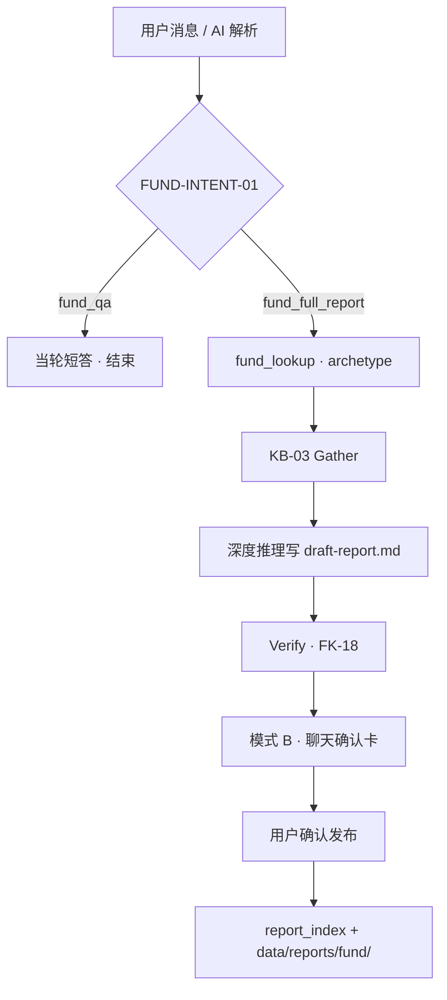

> [← 基金域总览](./09-fund.md) · **9.1 基金解析**

## 9.1 基金解析（单只基金解读）

### 模块说明

| 项 | 说明 |
|----|------|
| **做什么** | 基金 Tab 内 **简答** 或 **完整解读报告**（KB-03 瀑布 → 草稿 → 发布） |
| **入口** | Tab **基金**；自选 **AI 解析** → [watchlist §9.3.2](./09-fund-watchlist.md) |
| **完成标志** | 完整报告 **确认发布** → 我的报告 · 基金解读（§4.1.1） |
| **不做** | 自选 UI、PDF 上传（→ §9.3 / §9.2） |
| **依赖** | 三支柱对照 → [Hub §9.0](./09-fund.md)；检索 [knowledge §9.2.0g](./09-fund-knowledge.md) |
| **编码锚点** | `fund_qa` / `fund_full_report` · FUND-INTENT-01 · FK-18-* · **PL-STAGE-FUND-01** |

### 9.1.0 意图分流（FUND-INTENT-01）

| 意图 | 标识 | 用户怎么说 | 系统行为 | 草稿 |
|------|------|-----------|----------|------|
| **单点简答** | `fund_qa` | 「019305 管理费多少」「近一年收益怎样」 | 当轮气泡短答；可 FK-CITE | ❌ |
| **完整解读** | `fund_full_report` | 「出具基金解析/报告」「完整分析」；**AI 解析** | KB-03 → 草稿 → Verify → 模式 B → 确认发布 | ✅ |

**强触发完整解读**：自选 **AI 解析**；话术含 **报告 / 解析 / 深度解读**。  
**歧义**：仅输入代码 → 澄清「简短介绍还是完整报告？」；已有草稿再生成 → **覆盖前二次确认**（RPT-DRAFT-01）。

| Harness 路径 | Gather | 禁止 |
|--------------|--------|------|
| `fund_qa` | L0 / L1（± L2）；可选 L3 ≤5 | 写草稿、模式 B、`report_index` |
| `fund_full_report` | KB-03 全瀑布 | 用简答模板代替 §9.1.1 骨架 |

#### 9.1.0c 场景空状态（P0 · EMPTY-UI-01）

> **展示**：无消息 · `effectiveTab=fund` · **模式 A**（无报告草稿）。placeholder 见 [shared §5.3.4](./05-chat-shared.md) · `fund`。**我的自选** Tab 与列表空态见 [watchlist §9.3.1](./09-fund-watchlist.md)（WL-01 默认 3 只，**非**聊天主区空态）。

| 条件 | 标题 | 正文 |
|------|------|------|
| **默认** | 深度解读单只基金 | 输入**基金代码或名称**即可提问费率、业绩等问题。<br><br>若要 **完整解读报告**，请说明「出具基金解读报告」；或切换到主区 **「我的自选」** Tab，对列表中的基金点 **AI 解析**。<br><br>确认发布后，报告会保存到侧栏 **「我的报告 · 基金解读」**。 |

**范围脚注**：仅支持**中国公募基金**。

### 9.1.1 报告章节骨架（FK-18 · RPT-FUND-TPL）

> **唯一口径（2026-06-22）** → [`fund-report-blueprints-A-F.md`](../docs/samples/fund-report-blueprints-A-F.md)  
> **Agent 模板 + Verify** → `skills/fund/report.template.zh.md`  
> **ECharts / Preview** → [§1.3.4 Preview 组件](./01-global-design.md) · `ReportMarkdownPreview`

**与投资需求报告差异**：基金解读 md **须** 含 **` ```echarts `** 围栏（**有数据才出**）；Preview 对每块 **JSON.parse** 后渲染，**不能**用外链图代替。

| # | 对客章节 | MVP 必含 | 备注 |
|---|----------|----------|------|
| — | 阅读指引 | ✅ | **四问**导航 |
| — | 三句话读懂 | ✅ | **LLM compose**（40～90 字/句 · ≤240）；① 含投资目标 |
| 一 | **产品介绍** | ✅ + 条件 ECharts | 产品表 · 经理 · **投向与重仓**（大类资产饼 / 前十横条 **有则出**） |
| 二 | **这只基金赚不赚钱** | ✅ | LLM **开篇段** + **l0_summary**（live L0） |
| 三 | **是否适合长期持有** | ✅ | LLM **开篇段** + 风险揭示；**不写业绩 %** |
| 四 | **这只基金适合我吗** | ✅ + 条件 ECharts | 决策参考清单 + **费率柱**（有费率则出） |
| — | 温馨提示 | ✅ | §0.7 短版 |
| — | **引用说明** | ✅ | FK-CITE（六只 DEMO 均有 vault） |
| — | **延伸阅读** | 若有 L3 | 联网 ≤5 |

**图表（本期）**：仅 **大类资产饼 / 前十横条 / 费率柱**；**不限制**全报告总块数。  
**本期不做**：雷达、业绩对比图、回撤走势、持有人结构、分红表、行业配置进报告。

**L0**：进度条 **`fund.prep.l0_sync`** → Tushare → AKShare；**宁可缺数，不凑 REG 假数**。

> 历史 spec（≥6 图 · 雷达 · FK-18-SUPP）已 superseded，见 spec 文首说明。

**Gather 反模式**：**禁止**链式读整份招募书 / vault grep；须 `fund_knowledge_explore`（[knowledge §9.2.0d](./09-fund-knowledge.md)）。

#### 9.1.1b 报告 Archetype（FK-18-ARCH）

> **一套四段骨架** + L0 路由 **A～F** 变体（主要影响 **第一章前十标题** 与风险/费用话术）；回退 **D**。

| ID | 类型 | 第一章 · 投哪里侧重 |
|----|------|------------|
| **A** | QDII / 海外 | 资产/地区 + **前十**（**股票或债券**，依 L0） |
| **B** | 固收 / 存单 / 货币 | 资产饼 + **前十存单/债券** 或券种/久期结构 |
| **C** | 被动指数（非 QDII） | 跟踪标的；**L0 有则**前十股；**无 L0 前十 → 省略投向与重仓** |
| **D** | 主动偏股 / 混合 | **前十大 A 股重仓** |
| **E** | 主动偏债 / 二级债 | **前十大债券/转债** |
| **F** | FOF | **前十大子基金**（季报必有，除非 L0 缺失） |

> 前十明细路由 → [spec §4.1 / §7](../docs/samples/fund-analysis-report-spec.md)（**FK-18-HOLD**）。

演示三只与 archetype 对照 → [Hub §9.0.1](./09-fund.md)；**勿**在本文重复 A/B/C 表。

### 9.1.2 完整解读流程（`fund_full_report` · 唯一详文）

> 发布规则 → [§4.1.0](./04-my-reports.md)；KB-03 → [knowledge §9.2.0g](./09-fund-knowledge.md)。



| 步 | 说明 |
|----|------|
| 1 | 解析 `fund_code`；`as_of_trade_date` 来自 L0 |
| 2 | **L0 ∥ L1 并行**；低置信 → L2 → **须再 L1 核验** |
| 3 | 写对客 md + echarts + FK-CITE → `draft-report.md`（骨架 **RPT-FUND-TPL** · `skills/fund/report.template.zh.md`） |
| 4 | Verify 通过 → `pending_report_draft` · **模式 B**（§1.2.5） |
| 5 | 用户 **确认发布** → `report_publish`；清草稿 · 恢复模式 A |
| 6 | **修订**：同一 `run_id` 全量 re-Verify（RPT-REV-01） |

**阶段条**：由 **`workflow_tasks` 预置节点** 驱动（**PL-STAGE-FUND-01** · §9.1.10）；对客主阶段：理解解读需求 → 确认基金档案 → 检索基金资料 → 撰写报告 → 确认发布。

**不做**：Verify 通过 **不**自动发布；**无**聊天内联全文摘要（仅确认卡 + 主区 Preview）。

### 9.1.3 L2 语义检索（索引）

> 详文 → [knowledge §9.2.0f](./09-fund-knowledge.md) · [knowledge §9.2.10](./09-fund-knowledge.md) · **L2-SEED-01**。

运行时 **只读** `fund_knowledge_semantic_search`；**禁止** Agent 运行时 UPSERT L2。

### 9.4 聊天 `/` Command（基金 Tab · P0）

> **共有** `/` 机制 → [shared §5.3.9a](./05-chat-shared.md)。自选 Command → [watchlist §9.3.3](./09-fund-watchlist.md)。

#### 9.4.1 解析域

| Command | 对客说明 | 类型 | `/` 补全 |
|---------|----------|------|----------|
| `web_search` | 检索公开资讯 | 读 | ✅ |
| `vision_parse` | 解析截图 | 读 | ✅ |
| `fund_lookup` | 查询基金档案与行情 | 读 | ✅ |
| `fund_knowledge_explore` | 检索披露文件 | 读 | ✅ |
| `fund_knowledge_semantic_search` | 检索 FAQ/观点 | 读 | ✅ |
| `fund_report_verify` | 校验报告内容 | 读 | ✅ |
| `report_draft` | 撰写基金解读草稿 | 提议 | ✅ |
| `report_publish` | 发布至「我的报告」 | 写 | ✅ |

#### 9.4.2 注册表

与 `agents/registry.yaml` **`fund_domain: analysis`** 条目 **同源**；改 Command 须同步 registry、使用说明、`/` 补全（CH-CMD-01）。

### 9.5 边界行为

| 场景 | 行为 |
|------|------|
| 已有草稿再生成 | **覆盖前二次确认**（RPT-DRAFT-01） |
| 删对话 | 删 run 草稿；**不删**已发布报告 |
| 无 vault · enrich 失败（FK-ENRICH-01） | L0 为主 + L3 补硬事实；**参考来源说明**（非 FK-CITE 深链）；延伸阅读 ≤5 |
| enrich 成功 | 走 L1 + FK-CITE；**不** 再写 novault 免责声明 |
| L0 降级 | 联网补；不阻断（L0-FALLBACK-01） |

### 9.1.5 引用与来源 · 有/无知识库（FK-CITE-NOVAULT-01 · FK-ENRICH-01 · P0）

> **场景**：完整解读（`fund_full_report`）启动后，Harness **优先**尝试 **知识库预热**（§9.1.6）；预热成功则按 **有 vault** 走 L1 + FK-CITE。  
> **仍不做**：聊天内 PDF 上传、完整 PDF 解析流水线自动入库（FK-PDF-01 管理页路径不变）。

| 状态 | 硬事实（费率、范围、风险条款） | 报告文末 |
|------|--------------------------------|----------|
| **`fund.prep.enrich` 成功** · `has_vault=true` | L1 explore + FK-CITE 脚注 | **引用说明 · 可查看招募书原文**（深链 `/fund-knowledge?…`） |
| **enrich 跳过**（已有近 12 个月披露 + 索引同步） | 同上 | 同上 |
| **enrich 失败或未触发** · `has_vault=false` | L0 + **L3 联网** 公开页 | **参考来源说明** + **延伸阅读**（外链 ≤5 · CH-18） |

**无 vault 且 enrich 失败时对客（必含）**

- 正文 **1 句**（建议放在 **费用/风险** 章或参考来源节首）：「本基 **暂未纳入** App 本地基金知识库；下列条款类信息来自 **公开联网检索**，请以基金公司最新法律文件为准。」  
- **禁止**：无 chunk 仍写「查看原文」；伪造 FK-CITE 行；把 L3 链接伪装成库内深链。  
- **引用说明** 节：FK-CITE 表 **可为 0 行**；保留节标题 **或** 改用 **「参考来源说明」**（Verify 二选一通过即可）。  
- **延伸阅读**：列出实际使用的 **外网 URL** + 一句「不代表推荐」。

**知识库补库（MVP · FK-ENRICH-01）**

| 路径 | 做法 |
|------|------|
| **完整报告 · 自动** | `fund.prep.lookup` 后：无 vault 或披露 **未覆盖近 12 个月** → `fund.prep.enrich`（seed 同步 ∥ 联网摘要落 md）→ **FTS 索引** → 再 `fund.gather` |
| **演示 seed / 运维** | `seed/fund-knowledge/` 预置 md；`data/` 缺目录时可从 seed **单基金同步** |
| **L2 FAQ** | **仍只** seed / CLI；enrich **不得** UPSERT pgvector（L2-SEED-01 不变） |

与 KB-03 不变：L1 硬事实以 vault chunk 为准；L3 仅 enrich 失败时的兜底，**不得** 自动入 L2。

### 9.1.6 知识库预热（FK-ENRICH-01 · P0 · MVP）

> **插入点**：`fund.prep.lookup` **done** 之后、`fund.gather` **running** 之前。  
> **实现**：`src/harness/infra/fund_knowledge/enrich.ts` · 阶段条 §9.1.10.3 A′。

| 项 | 规格 |
|----|------|
| **触发** | `has_vault=false` **或** vault 缺少 **产品资料概要/招募书摘要**（`prospectus`）**或** 最近 12 个月无 `quarterly_report`/`semiannual_report`/`annual_report` 任一 md |
| **跳过** | 已有 vault 且 **最低披露集** 齐全（概要 + 近 12 个月 ≥1 份定期报告 md）且索引 hash 与磁盘一致 |
| **步骤 1 · fetch** | 优先 **seed 单基金同步**；仍缺则 **联网检索**（产品资料概要、费率、投资范围、风险、近 4 期季报要点）→ 写入 `{vault}/{doc_type}/*.md`（**简易 md**，非 PDF 流水线） |
| **步骤 2 · index** | 调用与 CLI 同源的 `rebuildIndex(scope=fund)` · 仅 **L1 FTS** |
| **失败** | **不阻断**完整报告：对客阶段条 `fund.prep.enrich` → `failed`；继续 KB-03，走 FK-CITE-NOVAULT-01 兜底 |
| **成功** | 刷新 `fund_lookup.has_vault`；后续 gather **优先 L1**，L3 仅在 KB-03 规则仍要求时触发 |
| **近 12 个月 · 最低文件集** | `prospectus` ≥1 · `quarterly_report`/`semiannual_report`/`annual_report` 合计 ≥1（演示三只见 [Hub §9.0.1](./09-fund.md)） |


> **是什么**：一次 Tool 调用返回 **基金档案 + 行情摘要**；服务端算 `report_archetype`（§9.1.1b）。**不是什么**：整份报告、招募书全文。

| 项 | 说明 |
|----|------|
| Command | `fund_lookup` |
| 入参 | `query` 或 `fund_code` |
| 数据源 | Tushare → AKShare 自动切换；均不可用 → L3 联网（L0-FALLBACK-01） |

**出参（成功 · JSON）**

| 中文含义 | 字段名称 | 字段类型 | 是否必填 | 值的相关说明 |
|----------|----------|----------|----------|--------------|
| 基金代码 | `fund_code` | string | 是 | 6 位等 |
| 基金简称 | `fund_name` | string | 是 | 标题、自选 |
| 基金类型 | `fund_type` | string | 是 | 源系统原文 |
| 是否 QDII | `is_qdii` | boolean | 是 | — |
| 是否指数型 | `is_index` | boolean | 是 | — |
| 权益仓位 | `equity_ratio` | number? | 否 | 0–100 % |
| 风险等级 | `risk_level` | string? | 否 | R1–R5 |
| 数据截止日 | `as_of_trade_date` | date | 是 | 最近交易日 |
| 单位净值 | `nav` | number? | 否 | — |
| 累计净值 | `nav_acc` | number? | 否 | — |
| 区间收益 | `return_1y` 等 | object? | 否 | ECharts |
| 重仓明细 | `top_holdings` | array? | 否 | **L0 live** 前十（Tushare/AKShare）；每项含 `asset_type` · 依 archetype 写入第一章 |
| 持仓类型 | `holdings_kind` | string? | 否 | `stock` · `bond` · `fund` · `cd` · `mixed` · `none` — 驱动 §四 标题（FK-18-HOLD） |
| 前十集中度 | `top_holdings_concentration` | number? | 否 | 前十占净值合计 % |
| 第三方评级 | `fund_ratings` | array? | 否 | **预留 · 不对客** · FK-18-SUPP-NORATING-01 |
| 历史分红 | `dividend_history` | array? | 否 | `{ ex_date, amount_per_share }` · FK-18-SUPP |
| 换手率 | `turnover_rate` | object? | 否 | `{ period, value_pct, as_of }` · 半年/年报 |
| 持有人结构 | `holder_structure` | object? | 否 | `{ individual_pct, institution_pct, … }` · FK-18-SUPP |
| 资产配置 | `asset_allocation` | object? | 否 | 股债货比例 |
| 基金经理 | `manager_name` | string? | 否 | — |
| 是否有知识库 | `has_vault` | boolean | 是 | vault 目录是否存在 |
| 报告 archetype | `report_archetype` | string | 是 | A–F · §9.1.1b |
| 查询来源 | `lookup_source` | string | 是 | `tushare` / `akshare` / `web_fallback` |
| L0 降级标记 | `l0_degraded` | boolean? | 否 | 部分数字来自联网 |

**失败**：`not_found` → 对客「未找到该基金」；`upstream_unavailable` → 可识别字段 + 加强 L3，L1 数字仍以 vault 为准。

**写入**：`draft-meta.json` 须存 `fund_code`、`as_of_trade_date`、`report_archetype`（§4.1.0b）。

### 9.1.9 Skill / 预置资产

| 资产 | 路径 | 说明 |
|------|------|------|
| **编排 Skill** | `skills/fund/fund_skill.md` | `fund_qa` · `fund_full_report` 流程 |
| **报告模板** | `skills/fund/report.template.zh.md` | **RPT-FUND-TPL** · 章节骨架 · archetype · **ECharts 解析（FK-18-EC）** · Verify |
| 对客 Mock | `requirement/docs/samples/fund-analysis-report-sample.md` | 019305 全文（**3× echarts** · 无雷达 · **无「本章回答」** · 非预挂载正文） |
| ECharts 冒烟 | `requirement/docs/samples/echarts-smoke-test.md` | 单图 Preview 自检 |
| 实现 Spec | `requirement/docs/samples/fund-analysis-report-spec.md` | 瀑布、metadata、**§6 ECharts 契约**、L0/C 型规则 |
| Preview 组件 | `ReportMarkdownPreview` · §1.3.4 | 正则拆 `echarts` 块 → `JSON.parse` → `echarts.init` |
| Verify | `fund_report_verify` Command + spec §10 | FK-18 清单（含禁止「本章回答」· 每块 JSON 合法）
| **任务图清单** | `skills/fund/fund_workflow_tasks.zh.yaml` | **PL-STAGE-FUND-01** · §9.1.10 |

### 9.1.10 任务图与阶段条（P0 · PL-STAGE-FUND-01）

> **用途**：`workflow_tasks` 落盘 + SSE `stage` 驱动 **进度条 / 阶段条 UI**（[shared §5.3.10](./05-chat-shared.md) · §5.11.4）。  
> **编码清单** → `{APP_ROOT}/skills/fund/fund_workflow_tasks.zh.yaml`（与下表 **同源**）。

#### 9.1.10.1 规则

| 项 | 说明 |
|----|------|
| **两条路径** | **`fund_qa`**：仅 §9.1.10.2 两节点；**`fund_full_report`**：§9.1.10.3 完整图 |
| **层级** | **全部一级**（`node_depth=1`）；原二级子步（enrich / gather / 报告 compose·verify）**提升为独立步骤** |
| **术语** | 阶段条 **禁止**「投资画像」「客户画像」「客户信息层」「约束」等内部词；读 §6 数据时对客写 **「投资需求」**、**「客户信息」** |
| **L2 / L3** | **不**单独占节点；Harness 在 `fund.gather.l1` 内触发；口语补充走 `reasoning_summary` |
| **`label`** | **预置固定**；Harness 按 `task_key` 推进 `status` · **禁止** LLM 改写 |
| **`reasoning_summary`** | 可选口语化补充（如「正在查招募书里费率…」）· **不** 替代 `label` · 见 [shared §5.3.10](./05-chat-shared.md) |
| **blocked** | `fund.prep.clarify` · `fund.rpt.overwrite` · `fund.rpt.wait` |
| **SSE** | `stage` payload 须含 `task_key` · `label` · `node_depth` · `parent_task_key?` · `status` |

#### 9.1.10.2 简答节点（`fund_qa` · `simple_qa`）

| sort | `task_key` | 对客 `label` | 触发 / 说明 |
|------|------------|--------------|-------------|
| 10 | `fund.qa.understand` | 理解您的问题 | Planner 判 `fund_qa` 或跨 Tab `simple_qa` |
| 20 | `fund.qa.answer` | 检索并整理回答 | 按需 L0/L1/联网；**无**草稿 · **无**写库 |

#### 9.1.10.3 完整解读节点（`fund_full_report`）

**A · 准备**

| sort | `task_key` | 对客 `label` | 触发 / 说明 |
|------|------------|--------------|-------------|
| 10 | `fund.prep.intent` | 理解您的解读需求 | FUND-INTENT-01；自选 **AI 解析** → **auto-done** |
| 20 | `fund.prep.lookup` | 确认基金档案与类型 | `fund_lookup` · `report_archetype` |
| 25 | `fund.prep.enrich.fetch` | 拉取近一年公开资料 | FK-ENRICH-01 · 无 vault / 披露过期时 **running** |
| 26 | `fund.prep.enrich.index` | 更新搜索索引 | FTS · `rebuildIndex(fund)` |
| 30 | `fund.prep.clarify` | 等待您确认解读方式 | 仅代码无「报告」话术 · **blocked** |

**B · 资料检索（KB-03）**

| sort | `task_key` | 对客 `label` | 触发 / 说明 |
|------|------------|--------------|-------------|
| 110 | `fund.gather.l0` | 拉取行情与持仓 | L0 · 与 L1 **并行** |
| 120 | `fund.gather.l1` | 检索披露文件 | L1 · `fund_knowledge_explore` |
| 125 | `fund.gather.l3` | 联网检索公开资料 | L3 · 按需插入 |
| 130 | `fund.gather.profile` | （进度占位） | **本期 auto-done** · 不调用 `profile_read` |

**C · 报告与发布**

| sort | `task_key` | 对客 `label` | 触发 / 说明 |
|------|------------|--------------|-------------|
| 210 | `fund.rpt.draft.compose` | 撰写基金解读报告 | `report_draft` · RPT-FUND-TPL |
| 220 | `fund.rpt.draft.verify` | 核对报告结构与引用 | `fund_report_verify` |
| 230 | `fund.rpt.preview` | 打开报告预览 | 模式 B |
| 240 | `fund.rpt.overwrite` | 等待确认覆盖旧草稿 | 已有草稿 · RPT-DRAFT-01 · **blocked** |
| 250 | `fund.rpt.wait` | 等待您确认发布 | RPT-CARD-01 · **blocked** |
| 260 | `fund.rpt.publish` | 保存至我的报告 | `report_publish` |

#### 9.1.10.4 分支 → 重入点

| 分支 | 重入 `task_key` | auto-done / 说明 |
|------|-----------------|------------------|
| **RPT-REV-01 修订报告** | `fund.rpt.draft.compose` | `fund.prep.*` · `fund.gather.*` 至上一轮完成态 |
| **RPT-DRAFT-01 覆盖草稿** | `fund.rpt.overwrite` → 通过后从 `fund.gather.l0` 或 `fund.rpt.draft.compose` | 用户选「只改某章」→ `fund.rpt.draft.compose` |
| **仅代码需澄清** | `fund.prep.clarify` **blocked** | 选「完整报告」后展开 §9.1.10.3 |
| **自选 AI 解析** | `fund.prep.lookup` | `fund.prep.intent` **auto-done** |
| **需 enrich** | `fund.prep.enrich.fetch` | lookup 后判定；齐全则 **skip** fetch+index |
| **enrich 失败** | 从 `fund.gather.l0` 继续 | `fund.prep.enrich.index` **failed**；FK-CITE-NOVAULT-01 兜底 |
| **L0 降级联网** | 不新增节点 | `fund.gather.l0` 的 `reasoning_summary` 补充 |

#### 9.1.10.5 UI 示意（一级平铺）

```text
✓ 确认基金档案与类型
✓ 拉取近一年公开资料
✓ 更新搜索索引
✓ 拉取行情与持仓
▶ 检索披露文件
○ 撰写基金解读报告
○ 核对报告结构与引用
○ 等待您确认发布
```

**工作过程（`reasoning_summary` · 可选 · 不改 label）**

| 当前 `task_key` | 示例 `reasoning_summary` |
|-----------------|---------------------------|
| `fund.prep.enrich.fetch` | 正在拉取产品资料概要与近一年季报摘要… |
| `fund.prep.enrich.index` | 正在更新该基金搜索索引… |
| `fund.gather.l1` | 正在查招募书里费率与投资范围… |
| `fund.gather.l1` | 口径不确定，正在用 FAQ 再搜一轮… |
| `fund.gather.profile` | （跳过 · 本期不做 profile 联动） |
| `fund.prep.l0_sync` | 正在同步行情、费率与持仓… |
| `fund.rpt.draft.compose` | 正在撰写解读报告与图表… |
| `fund.rpt.draft.verify` | 正在核对章节结构与图表 JSON… |

---

[← 返回基金域总览](./09-fund.md)
